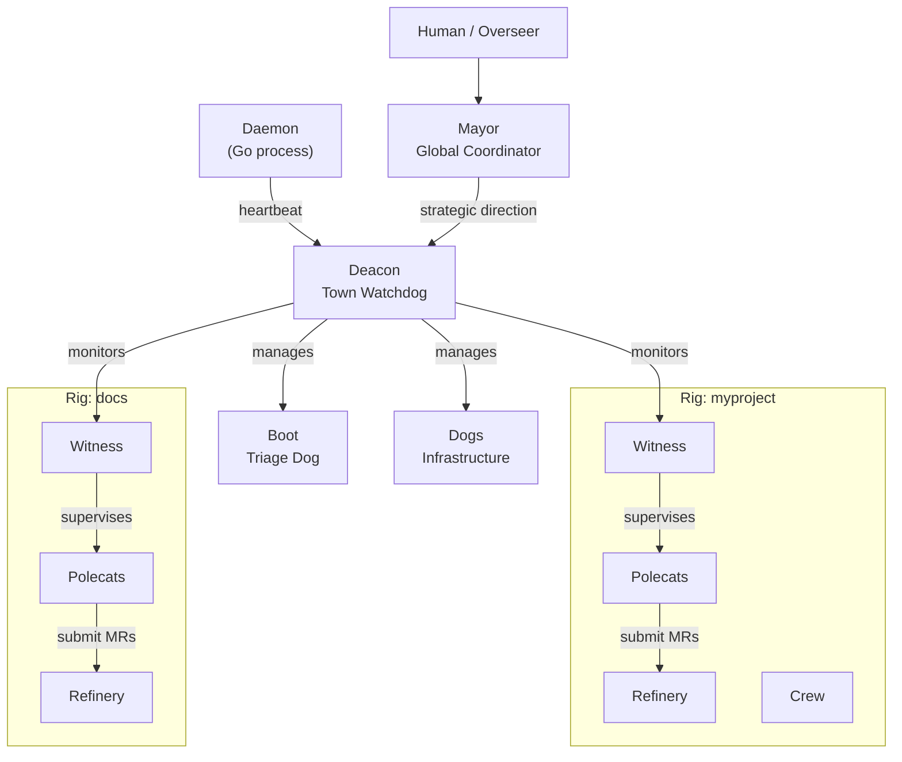

# Agents

Gas Town's agent hierarchy is a supervisor tree inspired by Erlang/OTP. Each role has a well-defined scope, lifecycle, and set of responsibilities -- ensuring reliable, self-healing operation from a single worker to 30 concurrent agents.

---

## The Agent Roster

| Agent | Tagline | Scope | Lifecycle | Count |
|-------|---------|-------|-----------|-------|
| [Mayor](mayor.md) | Global Coordinator | Town | Persistent | 1 |
| [Deacon](deacon.md) | Town-Level Watchdog | Town | Persistent | 1 |
| [Witness](witness.md) | Per-Rig Health Monitor | Rig | Persistent | 1 per rig |
| [Refinery](refinery.md) | Merge Queue Processor | Rig | Persistent | 1 per rig |
| [Polecats](polecats.md) | Ephemeral Workers | Rig | Ephemeral | Many per rig |
| [Dogs](dogs.md) | Infrastructure Workers | Town | Reusable | As needed |
| [Crew](crew.md) | Human Workspaces | Rig | Persistent | Named members |
| [Boot](boot.md) | Daemon Watchdog Dog | Town | Per-tick | 1 |

## Hierarchy



## Comparison Table

### Lifecycle and Persistence

| Property | Mayor | Deacon | Witness | Refinery | Polecats | Dogs | Crew | Boot |
|----------|-------|--------|---------|----------|----------|------|------|------|
| **Lifecycle** | Persistent | Persistent | Persistent | Persistent | Ephemeral | Reusable | Persistent | Per-tick |
| **Session type** | Long-running | Long-running | Long-running | Long-running | Single-task | Multi-task | User-managed | Fresh each run |
| **Survives restart** | Yes | Yes | Yes | Yes | No | Yes | Yes | N/A |
| **Patrol cycle** | On-demand | 5 min | 5 min | 5 min | None | None | None | Each daemon tick |

### Scope and Multiplicity

| Property | Mayor | Deacon | Witness | Refinery | Polecats | Dogs | Crew | Boot |
|----------|-------|--------|---------|----------|----------|------|------|------|
| **Scope** | Town | Town | Per-rig | Per-rig | Per-rig | Cross-rig | Per-rig | Town |
| **Instance count** | 1 | 1 | 1 per rig | 1 per rig | Many | As needed | Named | 1 |
| **Works on code** | Read-only | No | No | Merge only | Yes | Infra only | Yes | No |
| **Has git identity** | Yes | No | No | Yes | Yes | No | Yes | No |

### Communication

| Property | Mayor | Deacon | Witness | Refinery | Polecats | Dogs | Crew | Boot |
|----------|-------|--------|---------|----------|----------|------|------|------|
| **Receives mail** | Yes | Yes | Yes | Yes | Yes | No | Yes | No |
| **Receives nudges** | Yes | Yes | Yes | Yes | Yes | No | Yes | No |
| **Sends escalations** | To human | To Mayor | To Deacon | To Witness | To Witness | To Deacon | N/A | To Deacon |
| **Has mailbox** | Yes | Yes | Yes | Yes | Yes | No | Yes | No |

## Supervision Chain

The monitoring chain ensures no agent runs unsupervised:

```
Daemon --[heartbeat]--> Deacon
Deacon --[monitors]---> Witnesses (all rigs)
Witness --[watches]---> Polecats (in its rig)
Witness --[watches]---> Refinery (in its rig)
Mayor  --[strategy]---> Deacon
```

When something goes wrong, escalations flow upward:

```
Polecat (stuck)
  --> Witness detects stall
    --> Witness nudges polecat
      --> If still stuck: Witness escalates to Deacon
        --> Deacon escalates to Mayor
          --> Mayor escalates to Human/Overseer
```

## Role Separation

Each role has clear, non-overlapping responsibilities:

| Role | Does | Does NOT |
|------|------|----------|
| **Mayor** | Coordinate strategy, assign work | Monitor health |
| **Deacon** | Monitor health, manage lifecycle | Assign features |
| **Witness** | Watch polecats in its rig | Process merges |
| **Refinery** | Merge code to main | Write features |
| **Polecat** | Implement features | Monitor others |
| **Dog** | Infrastructure and cleanup tasks | Feature work |
| **Crew** | Human development workspace | Automated tasks |
| **Boot** | Triage system state | Direct action |

:::tip[Choosing the Right Agent]

- Need to **build a feature**? That is a [Polecat](polecats.md).
- Need to **merge code**? That is the [Refinery](refinery.md).
- Need to **clean up infrastructure**? That is a [Dog](dogs.md).
- Need to **monitor health**? That is the [Witness](witness.md) (per-rig) or [Deacon](deacon.md) (town-wide).
- Need to **coordinate work**? That is the [Mayor](mayor.md).
- Need a **human workspace**? That is [Crew](crew.md).

:::

## Key Concepts

The agent hierarchy depends on several core Gas Town concepts:

- **[GUPP](/docs/concepts/gupp.md)** (Gas Town Universal Propulsion Principle) -- Work on a hook is an immediate assignment. No confirmation needed. This is what makes polecats fire instantly when spawned.
- **[Hooks](/docs/concepts/hooks.md)** -- The mechanism for attaching work to an agent. Every polecat checks its hook on startup.
- **[Molecules](/docs/concepts/molecules.md)** -- Workflow templates that define step-by-step execution plans. Every agent role has a formula (e.g., `mol-polecat-work`, `mol-witness-patrol`).
- **[Beads](/docs/concepts/beads.md)** -- The issue tracking system all agents use to create, update, and close work items.

## Common Patterns

### Checking Agent Health Across the System

```bash
gt doctor                    # Full system health check
gt rig status <rig>          # Per-rig agent status
gt polecat list              # All polecats in current rig
gt deacon status             # Deacon health
```

### Tracing the Escalation Chain

When something goes wrong, follow the escalation path:

1. Check the polecat: `gt polecat status <name>`
2. Check the Witness: Did it detect the problem?
3. Check the Deacon: `gt deacon status` -- Did the Witness escalate?
4. Check Mayor mail: `gt mail inbox` (from Mayor session)

### Verifying the Supervision Chain

```bash
# Is the Daemon running? (sends heartbeats)
gt daemon status

# Is Boot triaging? (wakes the Deacon)
# Check the log at ~/gt/deacon/dogs/boot/triage-log.jsonl

# Is the Deacon awake? (monitors Witnesses)
gt deacon status

# Are Witnesses patrolling? (monitor polecats)
gt rig status <rig>
```

## Troubleshooting

### No Agents Are Running

```bash
gt up                        # Bring up all services
gt doctor --fix              # Auto-fix common issues
```

### Agent Is Stuck or Unresponsive

```bash
gt nudge <agent> "status?"   # Send a nudge
gt polecat nuke <name>       # Last resort: destroy polecat
```

### Escalation Chain Is Broken

If agents are not escalating properly, verify the chain from the bottom up: Daemon -> Boot -> Deacon -> Witnesses. A broken link anywhere stops escalations from flowing.