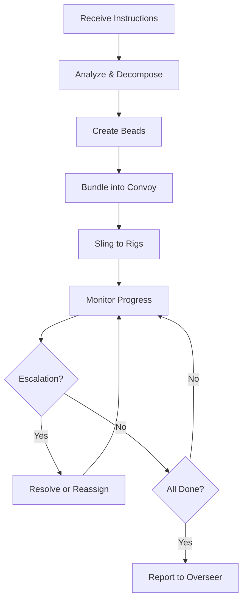
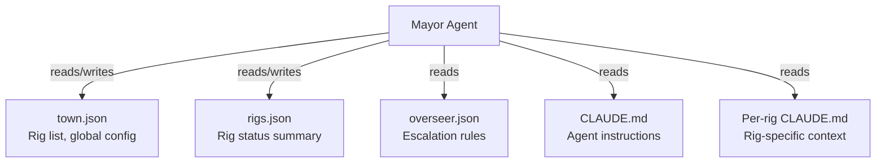
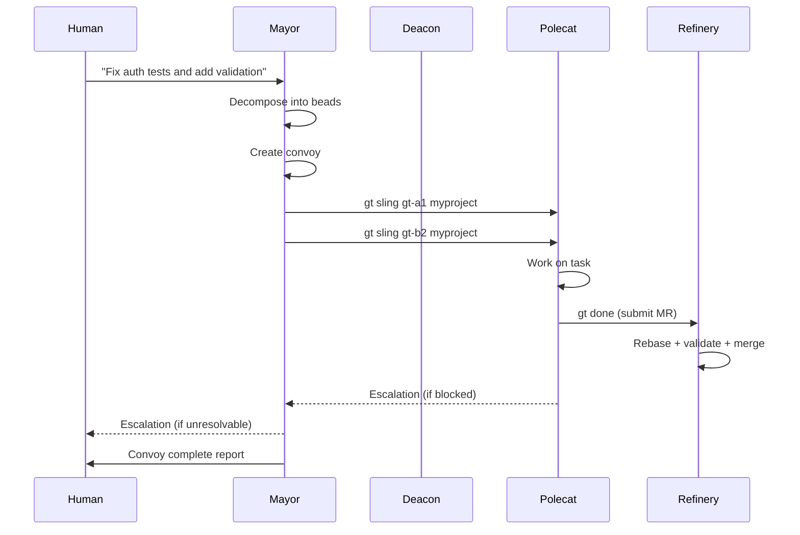
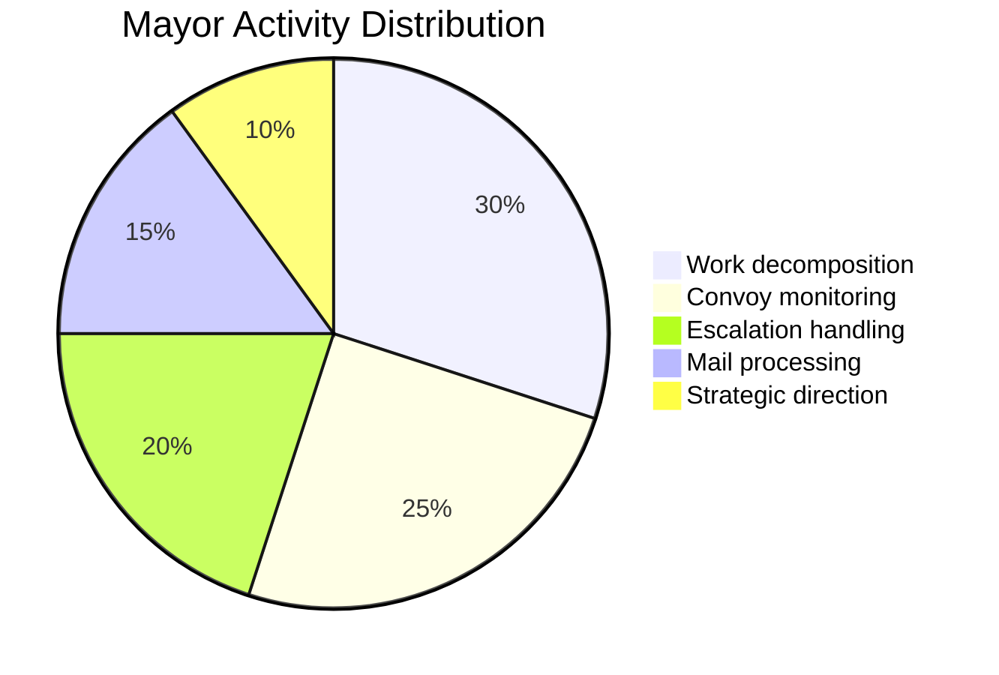

# Mayor -- Global Coordinator

> The Mayor is the brain of Gas Town. It receives instructions from the human overseer, decomposes them into actionable work, and orchestrates the entire agent hierarchy to deliver results.

---

## Overview

The Mayor is the primary human-facing agent in Gas Town. When you run `gt mayor attach`, you are talking directly to the Mayor. It understands your goals, creates issues (beads), bundles them into convoys, assigns work to rigs, and tracks progress through completion. The Mayor is the only agent that bridges the gap between natural language instructions and the structured work system. For an in-depth look at the orchestration workflow, see [Work Distribution Patterns](/blog/work-distribution-patterns).

## Key Characteristics

| Property | Value |
|----------|-------|
| **Scope** | Town-level (all rigs) |
| **Lifecycle** | Persistent |
| **Instance count** | 1 per town |
| **Session type** | Long-running Claude Code session |
| **Patrol cycle** | On-demand (not periodic) |
| **Location** | `~/gt/mayor/` and `~/gt/<rig>/mayor/rig/` |
| **Git identity** | Yes |
| **Mailbox** | Yes |

## Responsibilities

### 1. Receive Human Instructions

The Mayor is your interface to Gas Town. You describe what you want built, fixed, or changed in natural language:

```text
> Fix the 5 failing tests in auth and add input validation to registration.
```

The Mayor parses this into discrete work items.

### 2. Create Issues and Convoys

For each piece of work, the Mayor creates a bead (issue) in the tracking system, then bundles related beads into a convoy for batch tracking:

```bash
# The Mayor does this internally:
bd create --title "Fix auth test: login_expired" --type bug --priority 1
bd create --title "Add email validation to registration" --type feature --priority 2
gt convoy create "Auth Improvements" gt-a1b2c gt-d3e4f
```

### 3. Assign Work to Rigs

The Mayor uses `gt sling` to assign beads to rigs, which triggers polecat spawning:

```bash
gt sling gt-a1b2c myproject    # Assigns issue to rig, spawns polecat
gt sling gt-d3e4f myproject    # Another issue, another polecat
```

### 4. Route Escalations

When agents encounter problems they cannot solve, escalations flow upward to the Mayor. The Mayor either resolves them, reassigns the work, or escalates to the human overseer.

### 5. Track Convoy Progress

The Mayor monitors convoy completion, ensuring all assigned work reaches the finish line:

```bash
gt convoy list
gt convoy show hq-cv-001
```

### 6. Strategic Direction to Deacon

The Mayor provides high-level direction to the Deacon for health monitoring priorities and lifecycle decisions.

## Mayor Workflow (MEOW)

The Mayor Execution and Orchestration Workflow (MEOW) is the standard operating procedure for the Mayor agent:



**MEOW Steps:**

1. **Receive** -- Accept instructions from human or mail
2. **Analyze** -- Break down into discrete, parallelizable tasks
3. **Create** -- Generate beads with clear descriptions and acceptance criteria
4. **Bundle** -- Group related beads into a convoy
5. **Assign** -- Sling beads to target rigs
6. **Monitor** -- Track convoy progress, handle escalations
7. **Report** -- Summarize results to overseer

## Commands

### Primary Commands

| Command | Description |
|---------|-------------|
| `gt mayor attach` | Open an interactive session with the Mayor |
| `gt mayor start` | Start the Mayor session in the background |
| `gt mayor stop` | Stop the Mayor session |
| `gt mayor status` | Check if the Mayor is running and view session info |

### Commands the Mayor Uses

| Command | Purpose |
|---------|---------|
| `gt sling <bead> <rig>` | Assign work to a rig |
| `gt convoy create` | Bundle beads into a convoy |
| `gt convoy list` | View convoy status |
| `gt mail inbox` | Check incoming messages |
| `gt mail send` | Send messages to agents |
| `gt escalate` | Escalate issues to overseer |
| `gt rig list` | View all rigs and their status |
| `gt feed` | View the activity feed |
| `gt broadcast` | Send message to all agents |

:::info

The Mayor's decomposition quality directly affects downstream performance. Vague or overly broad beads lead to polecats that spend excessive time on clarification or produce partial work that requires re-sling. Invest time in clear, specific bead descriptions with acceptance criteria.

:::

## Context Files



The Mayor maintains state through several context files:

| File | Purpose |
|------|---------|
| `~/gt/mayor/town.json` | Town metadata -- rig list, global config |
| `~/gt/mayor/rigs.json` | Rig status and configuration summary |
| `~/gt/mayor/overseer.json` | Overseer preferences and escalation rules |
| `~/gt/mayor/CLAUDE.md` | Mayor agent context and instructions |
| `~/gt/<rig>/mayor/rig/CLAUDE.md` | Per-rig Mayor context |

## Interaction Diagram



## Tips and Best Practices

:::tip[Be Specific with Instructions]

The more specific your instructions, the better the Mayor decomposes them. Include acceptance criteria, edge cases, and constraints when possible.

:::

:::tip[Check Convoy Progress]

Use `gt convoy list` and `gt convoy show` regularly to track batch progress. The Mayor monitors automatically, but you can intervene at any time.

:::

:::tip[Use Escalations]

If you see something the Mayor should know about, use `gt mail send mayor "..."` to communicate directly. The Mayor checks its inbox as part of its workflow.

:::

:::warning[One Mayor Per Town]

Gas Town supports exactly one Mayor per town. Running multiple Mayor sessions will cause coordination conflicts.

:::

:::warning[Vague Instructions Lead to Vague Beads]

The Mayor's decomposition quality directly depends on the clarity of your instructions. If you say "fix the login stuff", the Mayor will create vague beads that confuse polecats. Be specific: "Fix the login timeout issue on the auth endpoint when sessions exceed 24 hours."

:::

## Typical Mayor Time Allocation

The Mayor distributes its processing time across several core activities during normal operation.



## Common Patterns

### Assigning a Batch of Related Work

The Mayor frequently needs to assign multiple related tasks. The pattern is: create beads, bundle into a convoy, sling to rigs.

```bash
# Create individual issues
bd create --title "Fix auth token expiry" --type bug --priority 1
bd create --title "Add rate limiting to API" --type feature --priority 2

# Bundle into a convoy for tracking
gt convoy create gt-abc gt-def

# Sling to target rig (auto-spawns polecats)
gt sling gt-abc myproject
gt sling gt-def myproject

# Monitor batch progress
gt convoy list
```

### Handling an Escalation

When a polecat escalates, the Mayor receives mail. The typical flow:

```bash
gt mail inbox                            # Check for escalations
gt mail read <id>                        # Read the details
# Decide: reassign, provide guidance, or escalate to human
gt mail send <rig>/witness -s "RE: ..." -m "Guidance: ..."
```

### Dispatching Cross-Rig Work

When work spans multiple rigs, the Mayor coordinates:

```bash
gt sling gt-frontend frontend-rig
gt sling gt-backend backend-rig
gt convoy create gt-frontend gt-backend  # Track together
```

## Troubleshooting

### Mayor Session Is Unresponsive

```bash
gt mayor status              # Check if session is alive
gt nudge mayor "status?"     # Send a nudge
gt mayor stop && gt mayor start  # Restart if needed
```

### Convoy Shows Incomplete But Work Is Done

Check if all beads in the convoy are closed. A convoy auto-closes only when every tracked bead reaches a terminal state:

```bash
gt convoy show <convoy-id>   # See which beads are still open
bd show <open-bead-id>       # Check why it is still open
```

### Polecats Not Being Spawned After Sling

Verify the rig is started and the Witness is running:

```bash
gt rig status <rig>          # Check rig health
gt rig start <rig>           # Start rig agents if needed
```

## Related

- [MEOW Stack](../concepts/meow-stack.md) -- The Mayor's orchestration workflow
- [Convoys](../concepts/convoys.md) -- Batch tracking for related work
- [Beads](../concepts/beads.md) -- Issue tracking system the Mayor uses
- [Deacon](deacon.md) -- Receives strategic direction from the Mayor
- [Polecats](polecats.md) -- Workers the Mayor assigns tasks to

### Blog Posts

- [The Mayor Workflow](/blog/mayor-workflow) -- End-to-end walkthrough of the Mayor's dispatch and coordination cycle
- [Your First Convoy](/blog/first-convoy) -- How the Mayor creates and tracks convoys
- [Work Distribution Patterns](/blog/work-distribution-patterns) -- Strategies for how the Mayor distributes work across rigs and agents
- [Mastering gt sling](/blog/mastering-gt-sling) -- How the Mayor uses gt sling to dispatch work to rigs and spawn polecats