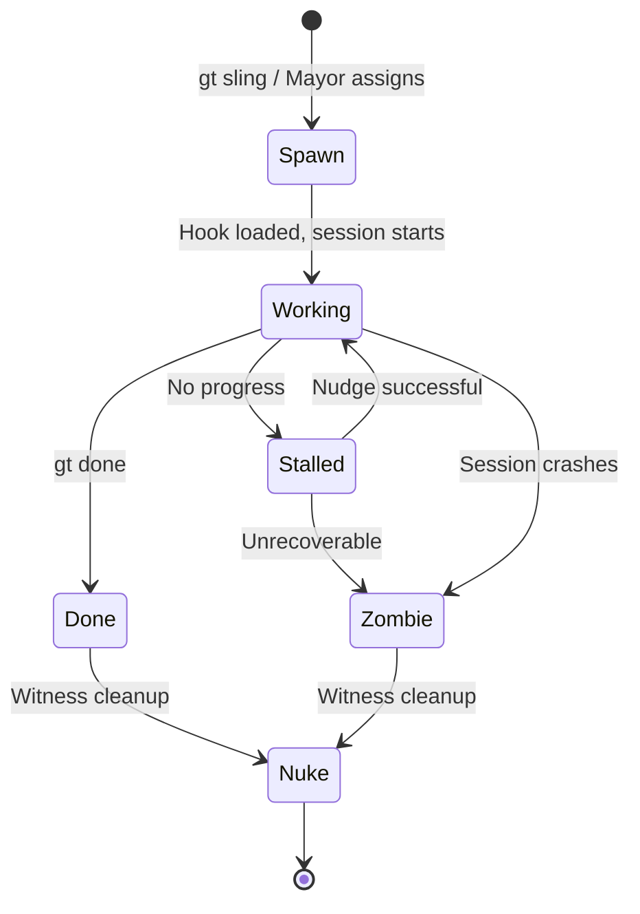
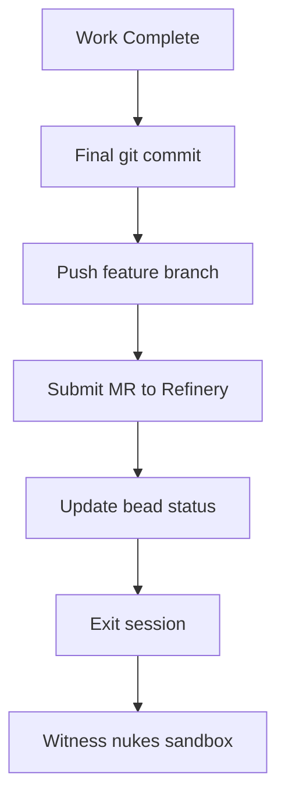

# Polecats -- Ephemeral Workers

> Polecats are the hands of Gas Town. They spawn, do their job, submit their work, and disappear. No idle time. No wasted resources.

---

## Overview

Polecats are ephemeral worker agents -- the primary units that write code, fix bugs, and implement features. Each polecat is spawned for a single task, works until completion, then self-destructs. They follow the "spawn, work, done, nuke" lifecycle with zero idle time. A polecat is always in one of three states: working, stalled, or zombie. There is no "idle" state.

The name comes from the character Slit's car in Mad Max: Fury Road -- fast, aggressive, single-purpose machines.

## Key Characteristics

| Property | Value |
|----------|-------|
| **Scope** | Per-rig |
| **Lifecycle** | Ephemeral (single-task) |
| **Instance count** | Many per rig |
| **Session type** | Short-lived Claude Code session |
| **Patrol cycle** | None (monitored by Witness) |
| **Location** | `~/gt/<rig>/polecats/<name>/` |
| **Git identity** | Yes (unique per polecat) |
| **Mailbox** | Yes (while alive) |

## Lifecycle



### Spawn

A polecat is spawned when work is slung to a rig:

```bash
gt sling gt-a1b2c myproject    # Spawns a polecat in myproject
```

The system:

1. Allocates a name from the name pool (or generates an anonymous name)
2. Creates a git worktree in `~/gt/<rig>/polecats/<name>/`
3. Sets up the polecat's CLAUDE.md context
4. Attaches the bead to the polecat's hook
5. Starts a Claude Code session

### Work

The polecat reads its hook, finds the assigned bead, and begins work. It has full access to the codebase within its worktree and can:

- Read and write files
- Run tests
- Create git commits
- Ask for clarification via escalation

### Done

When work is complete, the polecat runs `gt done`:

```bash
gt done
```

This command:

1. Pushes the feature branch to the remote
2. Submits a merge request to the Refinery
3. Updates the bead status
4. Exits the session cleanly

### Nuke

After the polecat exits, the Witness cleans up:

1. Removes the git worktree
2. Deletes the polecat directory
3. Reclaims the name for the pool

## Polecat States

A polecat is never idle. It exists in exactly one of three states:

| State | Description | Detected By | Action |
|-------|-------------|-------------|--------|
| **Working** | Actively making progress | Activity in session | None -- healthy |
| **Stalled** | No progress for threshold period | Witness patrol | Nudge, then escalate |
| **Zombie** | Session crashed or exited abnormally | Witness patrol | Recover work, nuke sandbox |

## Session vs Sandbox

It is important to distinguish between a polecat's **session** and its **sandbox**:

| Concept | Description |
|---------|-------------|
| **Session** | The Claude Code process running the polecat's AI agent |
| **Sandbox** | The git worktree directory containing the polecat's code |

A session can die while the sandbox persists (zombie state). The sandbox contains all the polecat's uncommitted work. The Witness checks for recoverable work before nuking a zombie's sandbox.

## Naming

Polecats are drawn from a name pool with memorable, distinct names:

- **Named pool**: Toast, Alpha, Bravo, Charlie, Delta, Echo, Foxtrot, etc.
- **Anonymous**: Auto-generated names when the pool is exhausted

Each name is unique within a rig at any given time. Names are recycled after a polecat is nuked.

### Git Identity

Every polecat gets its own git identity:

```text
Author: Toast <toast@myproject.gt>
Author: Alpha <alpha@myproject.gt>
```

This makes it easy to trace which polecat made which commits in the git log.

### Beads Actor

Each polecat is registered as a beads actor, allowing it to update issue status, add comments, and log activity against its assigned bead.

## Self-Cleaning Behavior

The `gt done` workflow ensures polecats clean up after themselves:



If a polecat crashes before running `gt done`, the work persists in the sandbox. The Witness detects the zombie, recovers any unsaved work by pushing the branch, and then nukes the sandbox.

## Exit States

When a polecat finishes, it exits in one of four states:

| Exit State | Meaning | What Happens Next |
|------------|---------|-------------------|
| `COMPLETED` | Work done, MR submitted | Refinery processes the merge |
| `ESCALATED` | Hit a blocker, needs help | Escalation routes to Mayor/Overseer |
| `DEFERRED` | Paused, work still open | Another agent can pick it up later |
| `PHASE_COMPLETE` | Phase done, waiting on gate | Gate opens, next phase begins |

## Commands

| Command | Description |
|---------|-------------|
| `gt polecat list` | List all polecats in the current rig |
| `gt polecat status <name>` | Check a specific polecat's status |
| `gt polecat nuke <name>` | Manually destroy a polecat sandbox |
| `gt polecat gc` | Garbage collect completed polecat directories |
| `gt polecat stale` | List polecats that appear stalled |

## Configuration

Polecat behavior is configured per-rig:

| Setting | Default | Description |
|---------|---------|-------------|
| Max polecats | 10 | Maximum concurrent polecats per rig |
| Name pool | NATO phonetic | Pool of names to assign |
| Stall threshold | 15 min | Idle time before considered stalled |
| Auto-push on crash | `true` | Push branch before zombie cleanup |

## Directory Structure

```text
~/gt/<rig>/polecats/
├── toast/                # Polecat sandbox (git worktree)
│   ├── .git              # Worktree link
│   ├── CLAUDE.md         # Polecat agent context
│   └── <project files>   # Full working copy
├── alpha/
│   ├── .git
│   ├── CLAUDE.md
│   └── <project files>
└── ...
```

## Tips and Best Practices

:::tip[Let Polecats Self-Clean]

Trust the `gt done` workflow. Polecats are designed to be disposable -- do not try to keep them alive or reuse them for multiple tasks.

:::

:::tip[Monitor with gt polecat list]

Use `gt polecat list` to see the current state of all workers. This shows you what the Witness sees, including any stalled or zombie polecats.

:::

:::tip[Name Pool Matters]

Named polecats are easier to track in logs and git history than anonymous ones. If you are running many concurrent workers, consider expanding the name pool.

:::

:::warning[Do Not Edit Polecat Sandboxes Directly]

Polecat worktrees are managed by the system. Editing files directly in a polecat's sandbox while it is running will cause conflicts and confusion.

:::

:::info[Polecats vs Dogs]

Polecats build features within a single rig and are ephemeral. Dogs handle infrastructure tasks across rigs and are reusable. If you need cross-rig work, use a Dog, not a Polecat.

:::

## The Polecat Work Formula

Every polecat follows the `mol-polecat-work` formula, which defines these steps:

| Step | Purpose |
|------|---------|
| **load-context** | Prime environment, check hook, understand assignment |
| **branch-setup** | Create clean feature branch, sync with main |
| **preflight-tests** | Verify tests pass on main before starting (Scotty Principle) |
| **implement** | Do the actual work, make atomic commits |
| **self-review** | Review changes for bugs, security, completeness |
| **run-tests** | Run full test suite, verify coverage |
| **cleanup-workspace** | Ensure workspace is pristine |
| **prepare-for-review** | Update issue notes, sync beads |
| **submit-and-exit** | Run `gt done` to submit to merge queue and self-destruct |

Use `bd ready` to see your current step and `bd close <step-id>` to advance.

## Common Patterns

### The GUPP Startup

When a polecat is spawned with work on its hook, it executes immediately per the [GUPP](../concepts/gupp.md) principle:

```bash
gt hook                      # Check assigned work
bd ready                     # See workflow steps
bd show <issue-id>           # Understand the assignment
bd update <id> --status=in_progress  # Claim the work
# Begin implementation immediately -- no confirmation needed
```

### The Handoff Protocol

When a polecat's context fills up mid-task, it hands off to a fresh session:

```bash
gt handoff -s "Implementing feature X" -m "Issue: gt-abc
Progress: Tests passing, 2 of 5 endpoints done
Next: Continue with endpoints 3-5
Branch: feature/add-endpoints"
```

The next session picks up context from the handoff mail.

### Branch Naming

Polecat branches follow the convention:

```text
polecat/<name>/<issue-id>@<molecule-id>
```

For example: `polecat/quartz/ga-h6g@ml4pgdku`

### The Pre-Submission Checklist

Before running `gt done`, every polecat verifies:

```bash
git status                   # Must be clean
git log --oneline -3         # Verify commits are present
# Then:
gt done                      # Submit and exit
```

## Troubleshooting

### Polecat Cannot Find Its Hook

If `gt hook` shows empty but you know work was assigned:

```bash
bd ready                     # Check beads for assigned work
bd list --status=open        # See all open issues
gt mail inbox                # Check for hooked mail
```

If the hook is truly empty and you are a polecat, [escalate](../operations/escalations.md) to the Witness -- polecats should always have work.

### gt done Fails

Common `gt done` failure causes:

| Cause | Fix |
|-------|-----|
| Uncommitted changes | `git add <files> && git commit -m "..."` |
| Unpushed commits | `git push` |
| Beads not synced | `bd sync --flush-only` |
| Branch behind main | `git pull --rebase origin main` |

### Polecat Is Stuck on a Step

If you cannot complete a molecule step:

```bash
# Check what step you are on
bd ready

# If blocked by external dependency
gt escalate "Blocked on <description>" -s HIGH -m "Details..."

# If truly stuck, exit cleanly
gt done --status=ESCALATED
```

### Session Context Is Filling Up

Long implementations can exhaust session context. Use `gt handoff` to cycle to a fresh session with preserved context (see [Session Cycling](../concepts/session-cycling.md)):

```bash
gt handoff -s "Context full, continuing work" -m "Issue: <id>
Branch: <branch>
Progress: <what is done>
Next: <what remains>"
```

## Related

- [GUPP](../concepts/gupp.md) -- The propulsion principle that drives polecat execution
- [Hooks](../concepts/hooks.md) -- How work is attached to polecats
- [Molecules](../concepts/molecules.md) -- The `mol-polecat-work` formula defines polecat workflow steps
- [Witness](witness.md) -- Monitors polecats for health
- [Refinery](refinery.md) -- Processes MRs submitted by polecats via `gt done`
- [Beads](../concepts/beads.md) -- Issue tracking system polecats use for task management