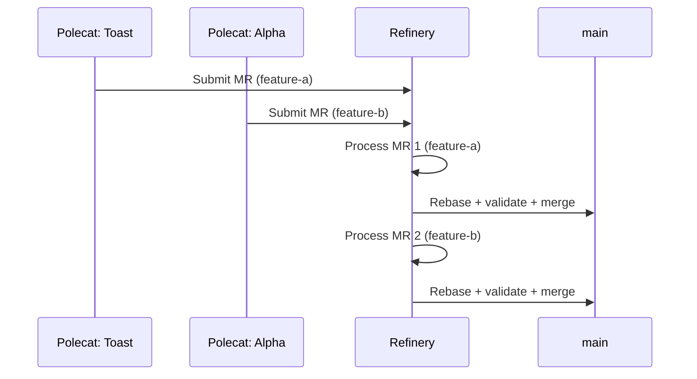
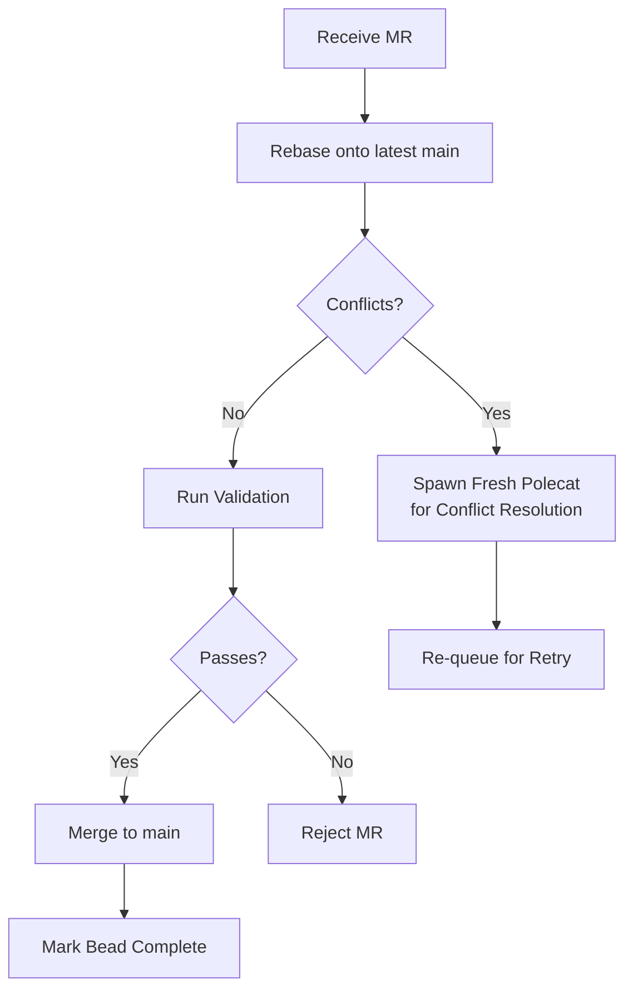
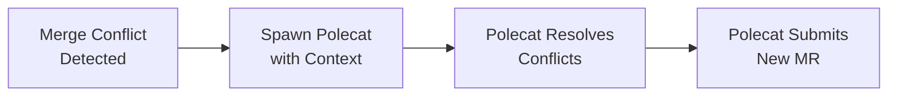
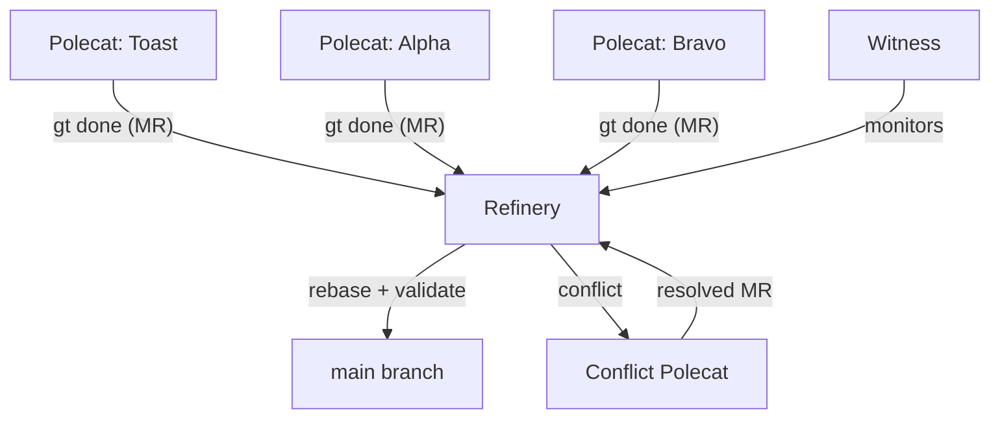

# Refinery -- Merge Queue Processor

> The Refinery is the gatekeeper of `main`. It serializes merges from concurrent polecats, ensuring every change is rebased, validated, and cleanly integrated.

---

## Overview

Every rig has a Refinery -- a persistent agent that manages the merge queue (MQ). When polecats finish their work and run `gt done`, they submit a merge request (MR) to the Refinery. The Refinery processes MRs one at a time: rebasing onto the latest `main`, running validation, and merging if everything passes. This serialization prevents the chaos that would result from multiple agents pushing to `main` simultaneously.

The name comes from the Mad Max universe -- Gas Town's refinery is where raw fuel becomes usable. Here, raw feature branches become clean commits on `main`.

## Key Characteristics

| Property | Value |
|----------|-------|
| **Scope** | Per-rig |
| **Lifecycle** | Persistent |
| **Instance count** | 1 per rig |
| **Session type** | Long-running Claude Code session |
| **Patrol cycle** | 5 minutes |
| **Location** | `~/gt/<rig>/refinery/rig/` |
| **Git identity** | Yes (canonical clone) |
| **Mailbox** | Yes |

## Responsibilities

### 1. Receive Merge Requests

When a polecat runs `gt done`, it:

1. Pushes its feature branch
2. Submits an MR to the rig's Refinery
3. Exits (sandbox later nuked by Witness)

The MR enters the merge queue for processing.

### 2. Serialize Merges

The Refinery processes MRs strictly one at a time. This prevents race conditions and ensures each merge sees the latest state of `main`:



### 3. Rebase, Validate, Merge Workflow

For each MR, the Refinery follows a strict workflow:



**Steps:**

1. **Rebase** -- Rebase the feature branch onto the latest `main`
2. **Conflict check** -- If conflicts exist, spawn a fresh polecat to resolve them
3. **Validate** -- Run tests, linting, build checks (configurable per rig)
4. **Merge** -- Fast-forward merge to `main`
5. **Mark complete** -- Update the bead status to done

### 4. Conflict Resolution

When a rebase produces conflicts, the Refinery does not attempt to resolve them itself. Instead, it spawns a fresh polecat with the conflict context:



This separation of concerns keeps the Refinery focused on queue management while leveraging polecats for creative problem-solving.

### 5. Queue Management

The merge queue maintains ordering and handles retries:

| MR State | Description |
|----------|-------------|
| `queued` | Waiting to be processed |
| `processing` | Currently being rebased/validated |
| `merged` | Successfully merged to main |
| `rejected` | Failed validation, removed from queue |
| `conflict` | Conflicts detected, polecat spawned |
| `retry` | Re-queued after conflict resolution |

## Commands

| Command | Description |
|---------|-------------|
| `gt mq list` | List all MRs in the merge queue |
| `gt mq next` | Show the next MR to be processed |
| `gt mq submit` | Manually submit an MR to the queue |
| `gt mq status` | View merge queue status and metrics |
| `gt mq reject <id>` | Manually reject an MR |
| `gt mq retry <id>` | Re-queue a failed MR for retry |
| `gt mq integration` | Run integration validation across recent merges |

## Configuration

Refinery behavior is configured per-rig:

| Setting | Default | Description |
|---------|---------|-------------|
| Patrol interval | 5 min | Time between queue processing cycles |
| Validation command | `make test` | Command to validate before merge |
| Max retries | 2 | Maximum retry attempts for failed MRs |
| Conflict strategy | `spawn-polecat` | How to handle merge conflicts |
| Auto-merge | `true` | Whether to auto-merge passing MRs |
| Branch cleanup | `true` | Delete feature branches after merge |

## Refinery Location

The Refinery holds the **canonical clone** of the repository -- the authoritative copy from which merges to `main` happen:

```text
~/gt/<rig>/refinery/rig/     # Canonical git clone
~/gt/<rig>/refinery/CLAUDE.md # Refinery agent context
```

All other clones (mayor, polecats, crew) are worktrees or separate clones that ultimately merge through the Refinery.

## Interaction Diagram



## Tips and Best Practices

:::tip[Monitor the Merge Queue]

Use `gt mq list` and `gt mq status` to keep an eye on merge throughput. A growing queue may indicate validation failures or frequent conflicts.

:::

:::tip[Tune Validation]

Configure the validation command to run only the most critical checks. Full test suites can slow the queue significantly when many polecats are submitting simultaneously.

:::

:::tip[Use Integration Checks]

Run `gt mq integration` periodically to validate that recent merges interact correctly. This catches integration issues that per-MR validation might miss.

:::

:::warning[Do Not Push Directly to Main]

All changes should flow through the Refinery. Pushing directly to `main` bypasses validation and can cause rebase failures for queued MRs.

:::

:::info[One Refinery Per Rig]

Each rig has exactly one Refinery. Cross-rig merges are coordinated by Dogs and the Deacon, not by Refineries.

:::

## Common Patterns

### The MERGED Mail Contract

After merging a branch to `main`, the Refinery **must immediately** send a `MERGED` mail to the Witness. This is the critical signal that triggers polecat sandbox cleanup:

```text
Merge to main → Push → Send MERGED mail → Close MR bead → Archive mail → Cleanup branches
```

If the `MERGED` mail is delayed or lost, polecat worktrees accumulate indefinitely. This is why the formula enforces immediate send before any cleanup steps.

### The Scotty Principle

Named after the Star Trek engineer who would never walk past a warp core leak: the Refinery does not proceed past failures. If tests fail, the Refinery stops and diagnoses whether the failure is:

- **Branch-caused**: The polecat's changes broke something. Abort merge, notify the polecat to fix.
- **Pre-existing**: Tests were already broken on `main`. Fix it directly or file a bead.

The Refinery never merges code that fails validation.

### Processing Multiple MRs

The Refinery processes one MR at a time, strictly serialized. After each successful merge, it loops back to check for more:

```text
Process MR 1 → merge → Process MR 2 → merge → ... → Queue empty → Wait for next patrol
```

This serialization ensures each merge sees the latest state of `main`, preventing cascading conflicts.

### Conflict Resolution via Fresh Polecat

When rebase conflicts occur, the Refinery does not attempt manual resolution. Instead, it:

1. Aborts the rebase
2. Creates a conflict-resolution task
3. Spawns a fresh polecat with conflict context
4. The polecat re-implements the changes against current `main`
5. The polecat submits a new MR

This keeps the Refinery focused on queue management, not creative problem-solving.

## Troubleshooting

### Merge Queue Is Backed Up

```bash
gt mq list                   # See all queued MRs
gt mq status                 # Queue metrics
gt rig status <rig>          # Is the Refinery session alive?
```

Common causes:
- Refinery session is dead or stuck
- Tests are failing on every branch
- Repeated rebase conflicts

### Tests Are Failing on Merge

The Refinery distinguishes between branch-caused and pre-existing failures. If all branches are failing:

```bash
# Check if main itself has broken tests
git checkout main && make test
```

If `main` is broken, the Refinery should file a bead or fix it directly.

### Branches Are Not Being Merged

Verify the Refinery is processing its queue:

```bash
gt mq list                   # Are MRs queued?
gt rig status <rig>          # Is the Refinery alive?
```

If MRs are queued but not processing, the Refinery may need a nudge:

```bash
gt nudge <rig>/refinery "process queue"
```

### Polecat Worktrees Accumulating

If polecat directories are not being cleaned up after merge, the `MERGED` mail signal may be failing. Check:

1. Is the Refinery sending `MERGED` mail after each merge?
2. Is the Witness receiving and processing the mail?
3. Check `gt polecat list` for polecats stuck in `done` state.

## Related

- [Polecats](polecats.md) -- Submit MRs that the Refinery processes
- [Witness](witness.md) -- Monitors the Refinery and receives `MERGED` signals
- [Molecules](../concepts/molecules.md) -- The `mol-refinery-patrol` formula defines the merge workflow
- [Beads](../concepts/beads.md) -- MR beads track each merge request through the queue

### Blog Posts

- [Refinery Deep Dive](/blog/refinery-deep-dive) -- How the merge queue processes branches, handles conflicts, and maintains main
- [Scaling Beyond 30 Agents](/blog/scaling-beyond-30) -- Scaling Refinery throughput for high-volume rigs
- [Git Workflows for Multi-Agent Development](/blog/git-workflows-multi-agent) -- How the Refinery's merge queue fits into Gas Town's overall git strategy