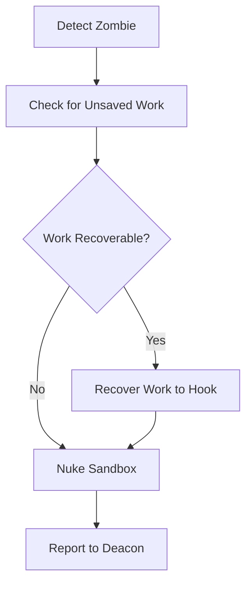
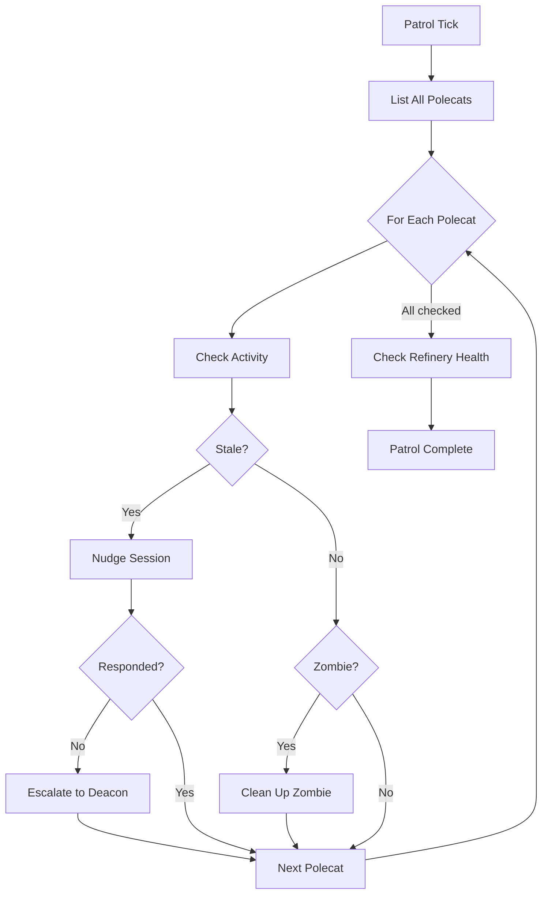
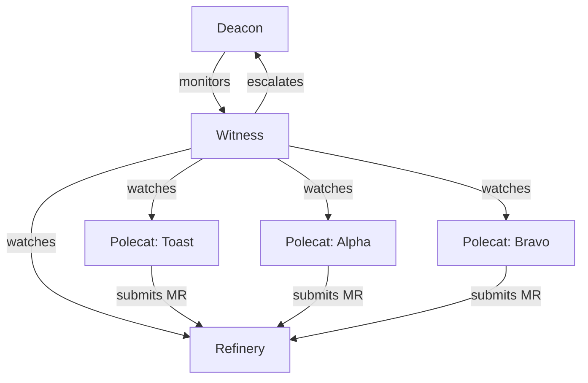

# Witness -- Per-Rig Health Monitor

> The Witness is the local guardian of a rig. It watches every polecat in its domain, detects problems before they spread, and keeps the workspace clean.

---

## Overview

Each rig in Gas Town has exactly one Witness -- a persistent agent whose sole job is to supervise the polecats working in that rig. The Witness detects stalled workers, nudges unresponsive sessions, cleans up zombies, and nukes sandboxes when polecats complete their work. It is the first line of defense against runaway or stuck agents.

## Key Characteristics

| Property | Value |
|----------|-------|
| **Scope** | Per-rig |
| **Lifecycle** | Persistent |
| **Instance count** | 1 per rig |
| **Session type** | Long-running Claude Code session |
| **Patrol cycle** | 5 minutes |
| **Location** | `~/gt/<rig>/witness/` |
| **Git identity** | No |
| **Mailbox** | Yes |

## Responsibilities

### 1. Supervise Polecats

The Witness monitors all polecats in its rig, tracking their state and activity:

| Polecat State | Witness Action |
|---------------|----------------|
| **Working** | No action -- healthy |
| **Stalled** | Nudge to resume |
| **Unresponsive** | Escalate, then nuke |
| **Zombie** | Clean up immediately |
| **Completed** | Nuke sandbox |

### 2. Detect Stalled Polecats

A polecat is considered stalled when it has not produced output or made progress within a threshold period. The Witness detects stalls through:

- Session activity monitoring (last output timestamp)
- Git activity monitoring (last commit timestamp)
- Process state checks (CPU/memory usage)

### 3. Nudge Unresponsive Sessions

When a polecat appears stalled, the Witness sends a nudge -- a synchronous message injected into the agent's session:

```bash
gt nudge <polecat-name> "Are you stuck? Check your current task and report status."
```

If the polecat responds and resumes work, no further action is needed. If it remains unresponsive after nudging, the Witness escalates.

### 4. Clean Up Zombies

Zombie polecats are sessions that have crashed or exited without completing the `gt done` workflow. The Witness detects and cleans these up:



### 5. Nuke Sandboxes on Completion

When a polecat finishes its work and runs `gt done`, the Witness cleans up the polecat's sandbox (worktree directory). This prevents disk space accumulation from completed workers.

### 6. Patrol Cycle

Every 5 minutes, the Witness runs a patrol:



## Commands

There are no direct `gt witness` subcommands exposed to the user. The Witness is managed by the Deacon. However, the following commands interact with Witness-monitored resources:

| Command | Description |
|---------|-------------|
| `gt polecat list` | List polecats in the current rig (Witness-tracked) |
| `gt polecat status <name>` | Check a specific polecat's status |
| `gt polecat nuke <name>` | Manually destroy a polecat sandbox |
| `gt polecat gc` | Garbage collect completed polecat directories |
| `gt polecat stale` | List polecats that appear stalled |

## Configuration

Witness behavior is configured per-rig:

| Setting | Default | Description |
|---------|---------|-------------|
| Patrol interval | 5 min | Time between patrol cycles |
| Stall threshold | 15 min | Idle time before a polecat is considered stalled |
| Nudge timeout | 5 min | Time to wait for nudge response |
| Max nudges | 2 | Nudges before escalating |
| Zombie threshold | 30 min | Time before a dead session is classified as zombie |

## Interaction Diagram



## Tips and Best Practices

:::tip[Check Stale Polecats]

Run `gt polecat stale` to see what the Witness considers stalled. This is useful for diagnosing slow progress before the Witness takes automatic action.

:::

:::tip[Manual Nuke for Stuck Workers]

If you know a polecat is hopelessly stuck, use `gt polecat nuke <name>` to clean it up immediately rather than waiting for the Witness patrol cycle.

:::

:::info[One Witness Per Rig]

Each rig has exactly one Witness. The Witness only monitors polecats within its own rig -- it has no visibility into other rigs. Cross-rig monitoring is the Deacon's job.

:::

:::warning[Do Not Kill the Witness]

Stopping a Witness leaves polecats in that rig unsupervised. If you must stop a Witness, ensure no polecats are running, or the Deacon will detect the missing Witness and restart it.


:::