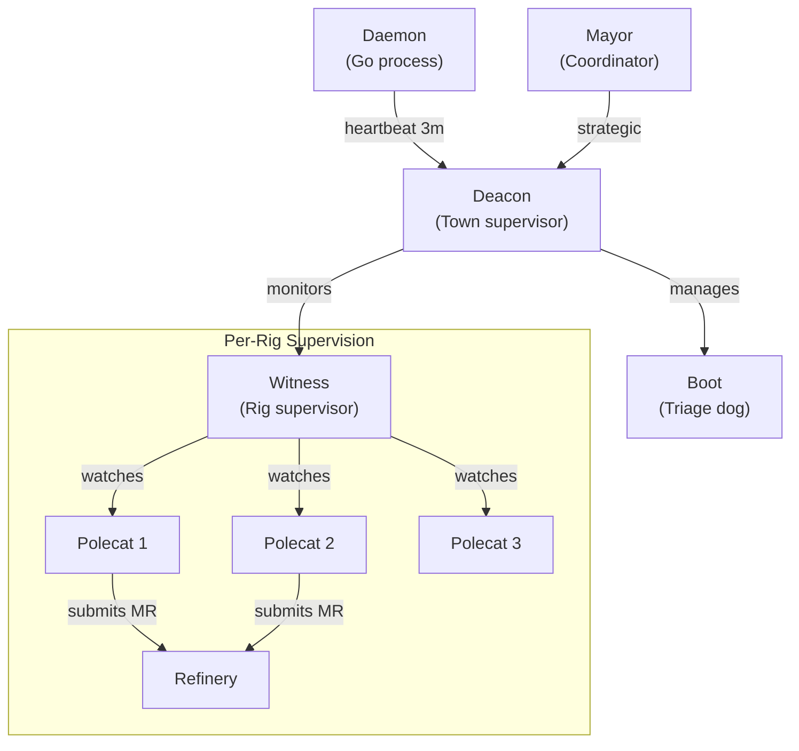

# Agent Hierarchy

Gas Town uses a supervisor tree pattern inspired by Erlang/OTP. Each agent level monitors the level below it, providing fault tolerance and automatic recovery.

## Supervision Tree



## Monitoring Chain

| Monitor | Watches | Detects | Action |
|---------|---------|---------|--------|
| Daemon | Deacon | Unresponsive | Restart Deacon session |
| Deacon | All Witnesses | Stuck/dead Witness | Restart Witness |
| Deacon | Boot dog | Triage needed | Spawn Boot for assessment |
| Witness | Polecats in rig | Stalled/crashed | Nudge, then nuke zombie |
| Witness | Refinery | Merge failures | Escalate to Mayor |

## Patrol Cycles

Persistent agents run patrol cycles — periodic health checks:

| Agent | Interval | Actions |
|-------|----------|---------|
| **Deacon** | 5 min | Check Witnesses, process lifecycle requests, run Boot triage |
| **Witness** | 5 min | Check polecats, detect stalls, clean zombies |
| **Refinery** | 5 min | Process merge queue, rebase and validate |
| **Daemon** | 3 min | Send heartbeat to Deacon |

## Escalation Path

When an agent encounters a problem it cannot resolve:

```
Polecat (stuck)
  → Witness detects stall
    → Witness nudges polecat
      → If still stuck: Witness escalates to Deacon
        → Deacon escalates to Mayor
          → Mayor escalates to Human/Overseer
```

Severity levels control routing:

| Level | Code | Route |
|-------|------|-------|
| Critical | P0 | Bead → Mail:Mayor → Email:Human → SMS:Human |
| High | P1 | Bead → Mail:Mayor → Email:Human |
| Medium | P2 | Bead → Mail:Mayor |
| Low | P3 | Bead only |
