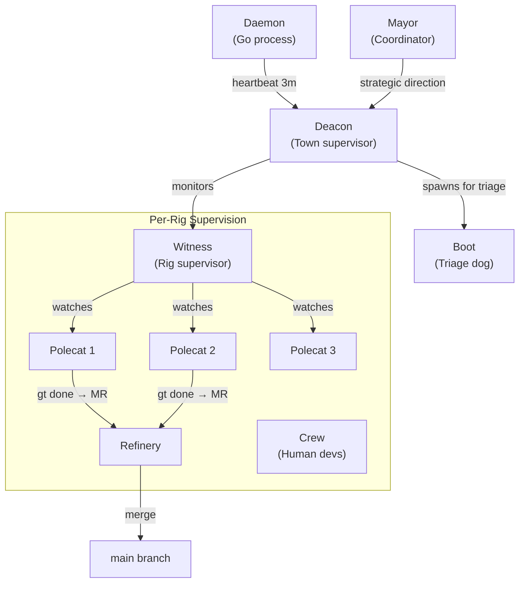
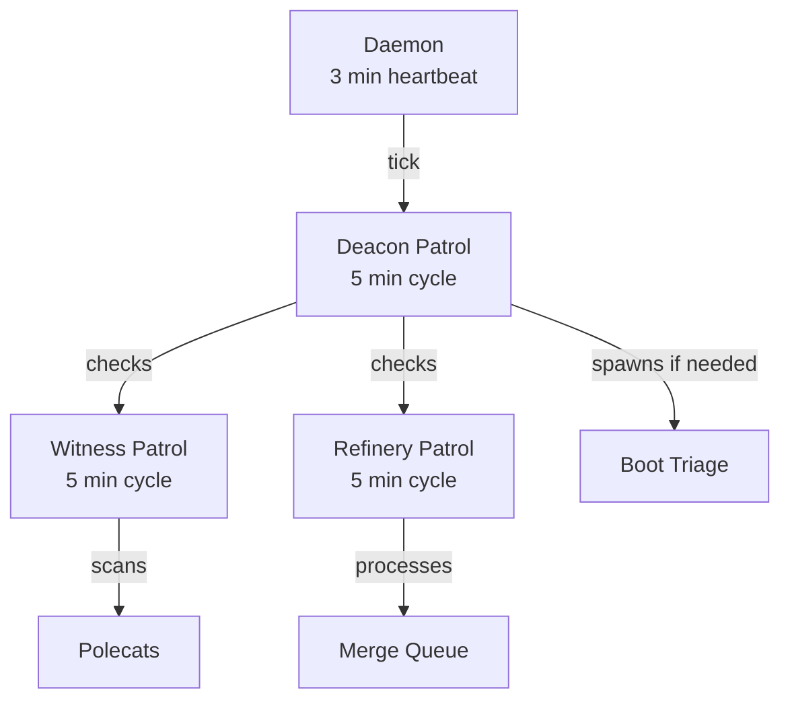
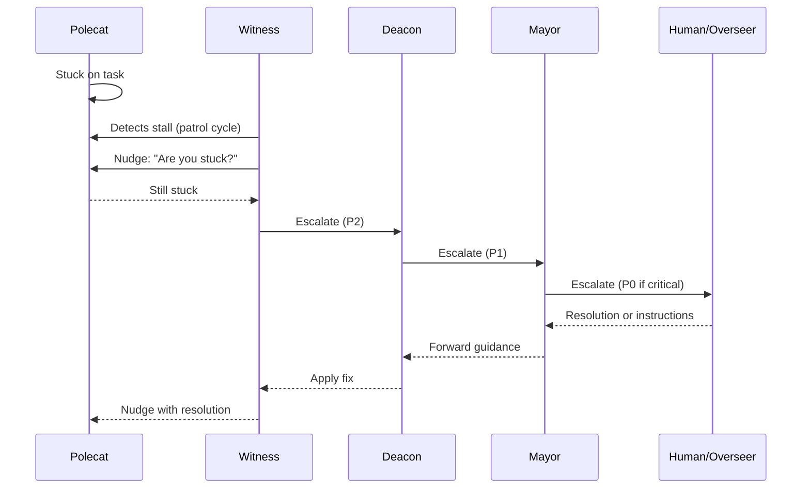

# Agent Hierarchy

Gas Town uses a supervisor tree pattern inspired by Erlang/OTP. Each agent level monitors the level below it, providing fault tolerance and automatic recovery.

## Supervision Tree



:::info
The supervision tree is designed so that no single agent failure can bring down the entire system. Even if the Deacon crashes, Boot will detect the failure on the next daemon tick and restart it automatically.
:::

## Monitoring Chain

| Monitor | Watches | Detects | Action |
|---------|---------|---------|--------|
| Daemon | Deacon | Unresponsive | Restart Deacon session |
| Deacon | All Witnesses | Stuck/dead Witness | Restart Witness |
| Deacon | Boot dog | Triage needed | Spawn Boot for assessment |
| Witness | Polecats in rig | Stalled/crashed | Nudge, then nuke zombie |
| Witness | Refinery | Merge failures | Escalate to Mayor |

## Patrol Cycles



:::tip
Patrol intervals are tuned for balance: frequent enough to catch problems quickly, but not so frequent that agents spend all their time monitoring instead of working.
:::

Persistent agents run patrol cycles — periodic health checks:

| Agent | Interval | Actions |
|-------|----------|---------|
| **Deacon** | 5 min | Check Witnesses, process lifecycle requests, run Boot triage |
| **Witness** | 5 min | Check polecats, detect stalls, clean zombies |
| **Refinery** | 5 min | Process merge queue, rebase and validate |
| **Daemon** | 3 min | Send heartbeat to Deacon |

## Boot Dog: The Triage Agent

:::note
Boot is deliberately short-lived. It assesses a situation and exits — it never takes action itself. This keeps triage cheap and prevents Boot from becoming a bottleneck.
:::

The Boot dog is a special agent spawned by the Deacon to assess situations that need triage — new work arriving, health check failures, or ambiguous states. Boot performs a quick assessment and reports back to the Deacon, which then takes action (spawn polecats, escalate, etc.).

## Escalation Path

When an agent encounters a problem it cannot resolve, the escalation flows upward through the supervision tree until it reaches an agent (or human) with enough authority to resolve it.



```text
Polecat (stuck)
  → Witness detects stall (patrol cycle)
    → Witness nudges polecat
      → If still stuck: Witness escalates to Deacon
        → Deacon escalates to Mayor
          → Mayor escalates to Human/Overseer
```

Agents can also self-escalate using `gt escalate`:

```bash
gt escalate "Brief description" -s HIGH -m "Details"
```

:::warning
P0 escalations route all the way to SMS. Reserve them for genuine emergencies — a broken main branch, data loss, or security issues. Overuse of P0 causes alert fatigue.
:::

Severity levels control routing:

| Level | Code | Route |
|-------|------|-------|
| Critical | P0 | Bead → Mail:Mayor → Email:Human → SMS:Human |
| High | P1 | Bead → Mail:Mayor → Email:Human |
| Medium | P2 | Bead → Mail:Mayor |
| Low | P3 | Bead only |

:::caution
Avoid manually restarting agents outside the supervision tree. The Deacon and Witness handle restarts with proper state recovery — bypassing them can leave orphaned worktrees, duplicate work, or hooks that never get picked up.
:::

## Related

- [System Overview](overview.md) -- Five-layer architecture including agents, rigs, and communication
- [Escalation System](../operations/escalations.md) -- Full escalation routing, severity levels, and auto re-escalation
- [Design Principles](design-principles.md) -- Erlang-inspired supervision and the let-it-crash philosophy
- [Monitoring & Health](../operations/monitoring.md) -- Patrol digests, health checks, and real-time activity feeds

### Blog Posts

- [The Witness: Gas Town's Self-Healing Watchdog](/blog/witness-explained) -- How the Witness agent monitors polecat health, detects stalls, and triggers recovery
- [The Deacon: Gas Town's Background Coordinator](/blog/deacon-patrol) -- How the Deacon patrols the town, evaluates gates, and manages agent lifecycles
- [Scaling Gas Town Beyond 30 Agents](/blog/scaling-beyond-30) -- Architectural patterns and operational strategies for running Gas Town at scale
- [The Escalation System](/blog/escalation-system) -- How escalations flow through the supervision tree from polecats to the human overseer
