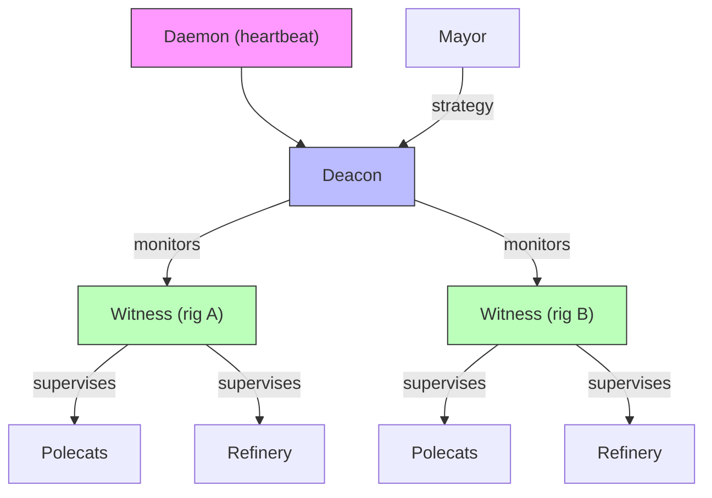
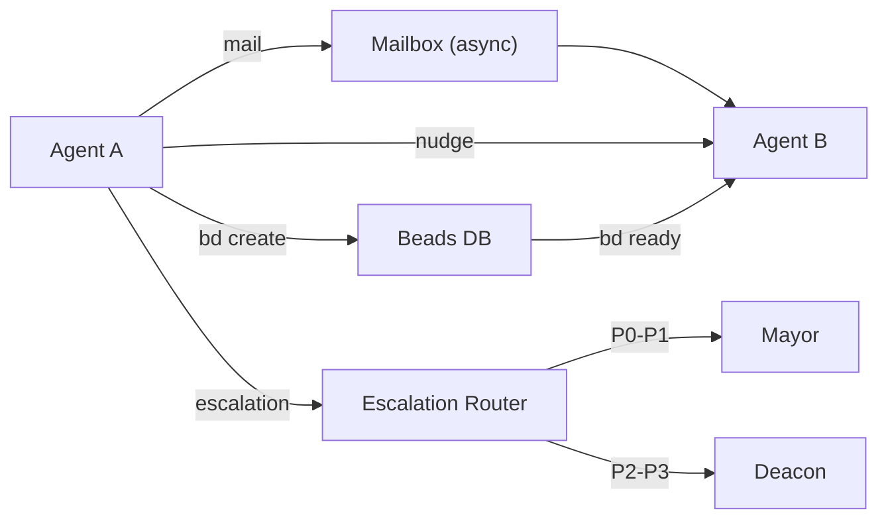
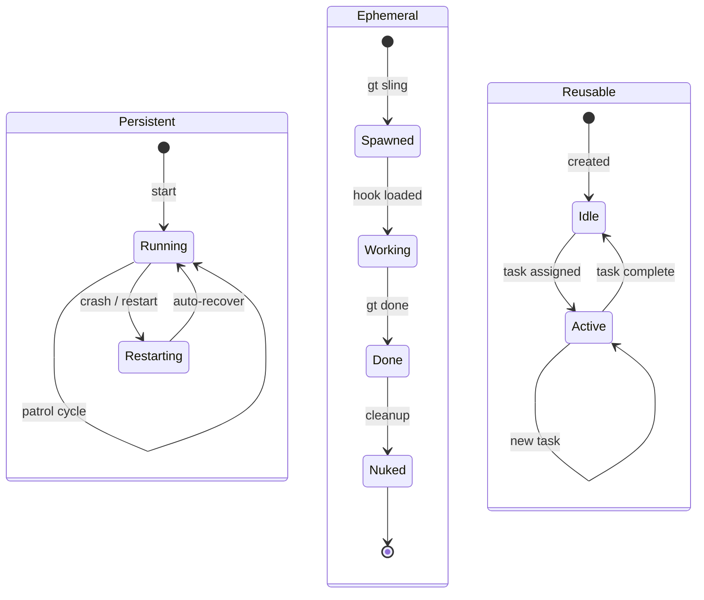
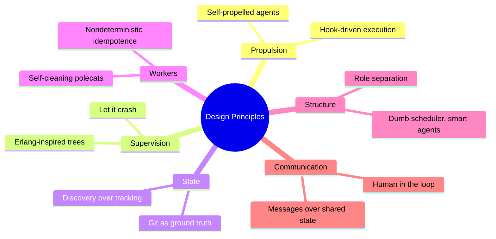
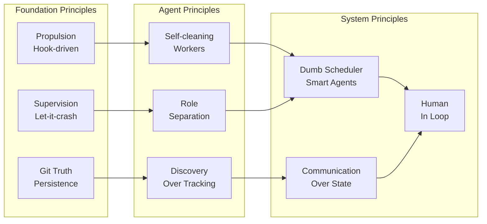
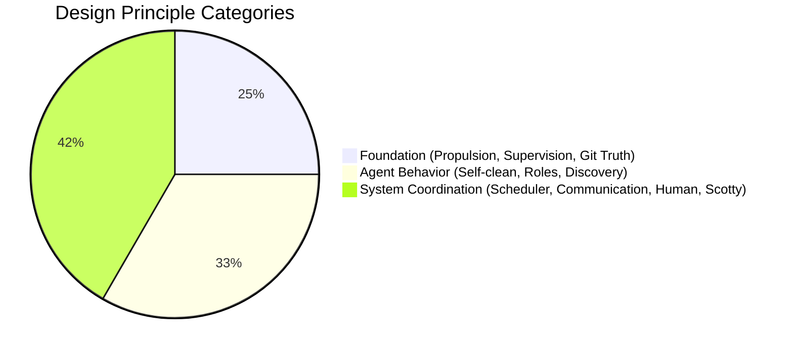

# Design Principles

Gas Town is built on several core design principles that guide its architecture and behavior.

## 1. The Propulsion Principle

:::tip
This is Gas Town's most fundamental design choice. Every other principle builds on the idea that agents are self-propelled by their hooks.
:::

> "If it's on your hook, YOU RUN IT."

Work attached to an agent's hook drives that agent's behavior. The hook is the primary scheduling mechanism — no central scheduler decides what agents do. Each agent is self-propelled by its hook.

## 2. Erlang-Inspired Supervision

Gas Town borrows heavily from Erlang/OTP patterns:



- **Supervisor trees** — Each level monitors the level below
- **Mailboxes** — Agents communicate via async messages
- **Let it crash** — Agents can crash; supervisors handle recovery
- **Process isolation** — Each agent runs in its own session

## 3. Git as Ground Truth

:::info
This design means you can reconstruct Gas Town state from a filesystem backup alone. No external services, no cloud dependencies, no network required.
:::

All persistent state lives in git or git-adjacent storage:

- Beads (issues) stored in SQLite with JSONL export for portability
- Hooks implemented as git worktrees
- Agent context in CLAUDE.md files (committed)
- Configuration in tracked JSON/YAML files
- Rig-level `.beads/` is gitignored (local runtime state), but issue data persists via export

This means state survives anything — crashes, restarts, even machine failures.

## 4. Dumb Scheduler, Smart Agents

The daemon is intentionally simple — it just sends heartbeats and processes lifecycle requests. All intelligence lives in the agents themselves:

- The **Mayor** decides strategy
- The **Deacon** decides health actions
- **Witnesses** decide polecat management
- **Polecats** decide how to implement features

## 5. Self-Cleaning Workers

:::note
Self-cleaning means zero human intervention for normal polecat lifecycle. If a polecat finishes or crashes, the system handles cleanup automatically.
:::

Polecats follow a strict lifecycle:

```text
Spawn → Work → Done → Nuke
```

They are never idle. A polecat is either:

- **Working** — Actively executing a task
- **Stalled** — Stuck (Witness will detect)
- **Zombie** — Crashed (Witness will clean up)

When a polecat finishes, it runs `gt done` to submit its MR and exit. The Witness nukes the sandbox.

## 6. Nondeterministic Idempotence

:::caution
When a polecat crashes and another picks up the same bead, the new polecat starts fresh on a new branch. Any uncommitted work from the crashed polecat is lost. This is by design -- partial work that was never committed is considered unreliable and is not carried forward.
:::

Work can be safely retried:

- If a polecat crashes, another can pick up the same bead
- `gt release` recovers stuck in_progress issues
- The Refinery handles merge conflicts by spawning fresh workers
- Convoys track completion regardless of which agent did the work

## 7. Role Separation

Each agent role has clear, non-overlapping responsibilities:

| Role | Does | Does NOT |
|------|------|----------|
| Mayor | Coordinate strategy | Monitor health |
| Deacon | Monitor health | Assign features |
| Witness | Watch polecats | Process merges |
| Refinery | Merge code | Write features |
| Polecat | Implement features | Monitor others |
| Crew | Human dev work | Agent coordination |
| Dog | Infrastructure tasks | Feature work |
| Boot | Triage assessments | Long-running work |

## 8. Communication Over Shared State

Agents communicate explicitly through:

- **Mail** for async messages
- **Nudge** for sync messages
- **Escalations** for priority alerts
- **Beads** for work state

Rather than reading shared state and inferring what to do.



## 9. Persistent vs Ephemeral

Gas Town distinguishes between:

- **Persistent agents** (Mayor, Deacon, Witness, Refinery) — Long-running, survive restarts
- **Ephemeral agents** (Polecats) — Single-task, self-destructing
- **Reusable agents** (Dogs, Crew) — Multiple tasks, managed lifecycle



This three-tier model optimizes resource usage while maintaining reliability. For more on managing lifecycle states at scale, see [Lifecycle Management](/blog/lifecycle-management).

## 10. Human in the Loop

The Overseer (human) sits at the top of the escalation chain:

- Can intervene at any level
- Receives escalations for critical issues
- Approves human gates
- Can manually sling, release, or reassign work

Gas Town automates everything it can, but keeps humans in control.

## 11. The Scotty Principle

:::warning
Ignoring a failing test to "deal with later" is the single most expensive mistake in Gas Town. One broken test can cascade into dozens of wasted polecat sessions.
:::

> "Never walk past a warp core leak."

Named after the Star Trek engineer: Gas Town agents never proceed past failures. The [Refinery](../agents/refinery.md) does not merge code that fails validation. Polecats run [preflight tests](../agents/polecats.md) before starting implementation to ensure `main` is clean. If something is broken, you fix it or file it -- you don't skip past it.

:::info[Why "Erlang-Inspired" Not "Erlang-Based"]

Gas Town borrows supervision patterns and mailboxes from Erlang/OTP, but it runs on Claude Code sessions and Go processes, not the Erlang VM. The principles transfer beautifully -- let-it-crash, supervision trees, message passing -- but the implementation is pure filesystem and git.

:::

:::tip[The Scotty Principle Prevents Cascading Failures]

By never proceeding past failures, Gas Town avoids the common trap where one broken test causes dozens of polecats to waste time implementing features on a broken base. The upfront cost of fixing the test immediately is far lower than the cascading cost of broken polecats discovering the issue later in their workflow.

:::

## Design Principle Relationships

The twelve design principles form an interconnected system where each principle reinforces the others.



## 12. Discovery Over Tracking

Gas Town favors agents discovering what needs to happen over centralized tracking that tells them. The [Witness](../agents/witness.md) discovers stale polecats by inspecting them, not by reading a checklist. The [Deacon](../agents/deacon.md) discovers zombies by scanning processes, not by maintaining a process table.

This makes the system resilient to state corruption: even if tracking data is lost, agents can recover by rediscovering the current state.

## Principle Application Flow

How the twelve design principles apply across the agent hierarchy.




### Principle Categories

The twelve design principles fall into three broad categories: foundation, agent behavior, and system coordination.



## Related

- [Agent Hierarchy](agent-hierarchy.md) -- How the Erlang-inspired supervision tree implements these principles
- [GUPP](../concepts/gupp.md) -- The Gas Town Universal Propulsion Principle in detail
- [Background & Philosophy](../guides/philosophy.md) -- Why Gas Town exists and the intellectual foundations behind its design
- [System Overview](overview.md) -- The five-layer architecture these principles shaped

### Blog Posts

- [Understanding GUPP: Why Crashes Don't Lose Work](/blog/understanding-gupp) -- How the Gas Town Universal Propulsion Principle makes multi-agent development crash-safe by design
- [Hook-Driven Architecture: How Gas Town Agents Never Lose Work](/blog/hook-driven-architecture) -- A deep dive into the hook system and the persistence primitive behind self-propelling agent workflows
- [Why Beads?](/blog/why-beads) -- The design rationale behind Gas Town's issue tracking primitive and how it fits the broader architecture
- [Gas Town vs CI/CD](/blog/gas-town-vs-cicd) -- How Gas Town's design principles differ from traditional CI/CD pipelines
- [Session Cycling: How Gas Town Agents Handle Context Limits](/blog/session-cycling) -- How session cycling embodies the design principle of crash-safe operation
