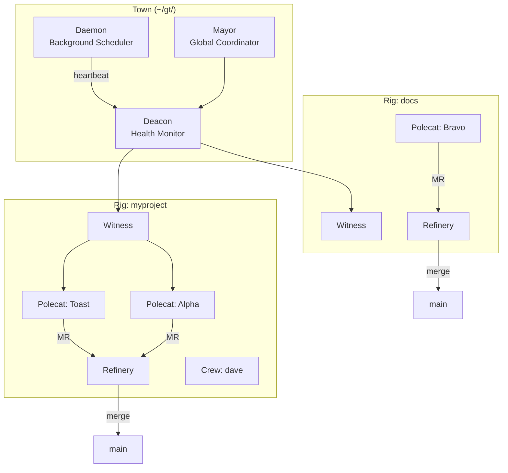

# Architecture

Gas Town's architecture draws from Erlang's supervisor trees and mailbox patterns — battle-tested approaches to building reliable distributed systems.

## Sections

- [System Overview](overview.md) — High-level architecture and components
- [Agent Hierarchy](agent-hierarchy.md) — How agents supervise each other
- [Work Distribution](work-distribution.md) — How tasks flow through the system
- [Design Principles](design-principles.md) — Core patterns and philosophy

## At a Glance

Gas Town is a hierarchical supervisor system where each level monitors the level below it, ensuring work progresses reliably even when individual agents crash or stall.
