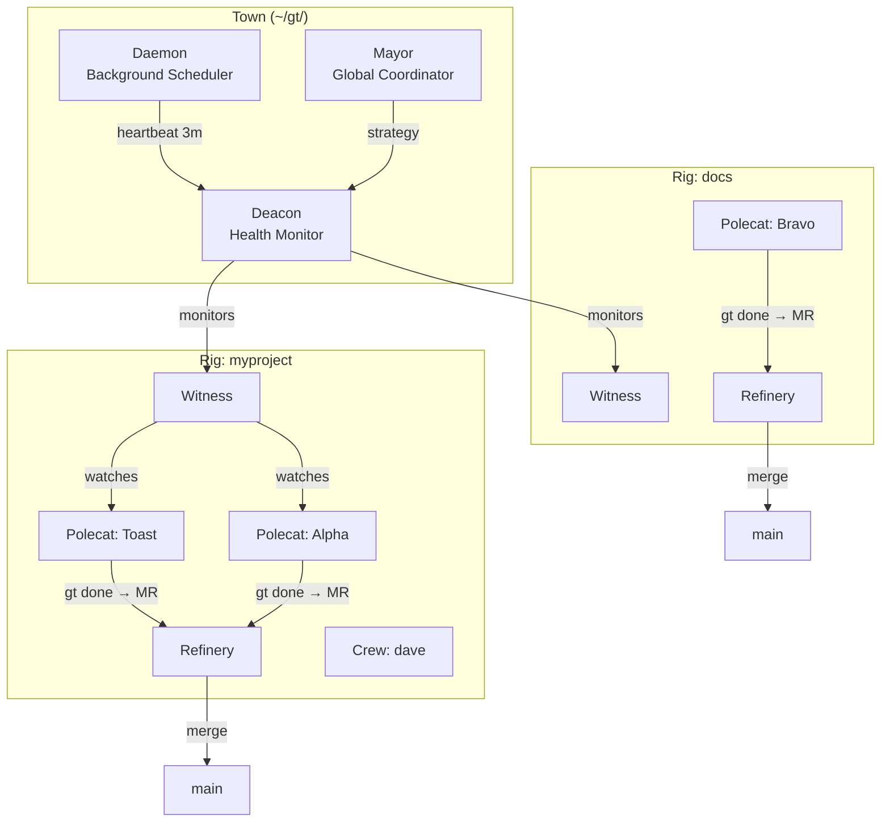

# Architecture

Gas Town's architecture draws from Erlang's supervisor trees and mailbox patterns — battle-tested approaches to building reliable distributed systems.

## Sections

- [System Overview](overview.md) — High-level architecture and components
- [Agent Hierarchy](agent-hierarchy.md) — How agents supervise each other
- [Work Distribution](work-distribution.md) — How tasks flow through the system
- [Design Principles](design-principles.md) — Core patterns and philosophy

## At a Glance



## How It Fits Together

Gas Town is a hierarchical supervisor system with three layers:

- **Town level** — The Mayor sets strategy, the Deacon runs health checks, and the Daemon provides heartbeats. These are singleton agents shared across all projects.
- **Rig level** — Each project (rig) has its own Witness watching polecat health and a Refinery serializing merges to main. These agents are rig-scoped.
- **Worker level** — Polecats are ephemeral workers spawned for one task and nuked when done. Crew members are persistent human-managed workspaces. Both do the actual coding work.

Each level monitors the level below it, ensuring work progresses reliably even when individual agents crash or stall.

## When Things Go Wrong

Failures are handled through an upward escalation chain:

```text
Polecat (stuck) → Witness detects → nudges polecat
  → still stuck → Witness escalates to Deacon
    → Deacon files warrant or triggers recovery
      → Deacon escalates to Mayor if unresolved
        → Mayor escalates to Human/Overseer
```

At each level, the system tries to self-heal before escalating. Most issues resolve at the Witness level — a nudge is often enough to unblock a stalled polecat. See [Escalation System](../operations/escalations.md) for the full escalation model.

## Next Steps

- **[System Overview](overview.md)** — Detailed view of all components and data flows
- **[Agent Hierarchy](agent-hierarchy.md)** — Deep dive into supervision and role separation
- **[Work Distribution](work-distribution.md)** — How tasks flow from intent to merged code
- **[Design Principles](design-principles.md)** — The patterns behind Gas Town's reliability
