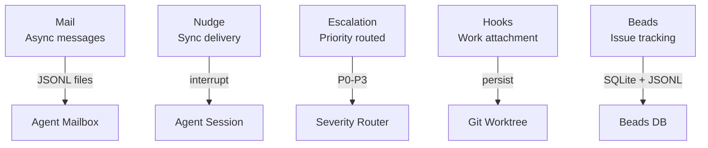
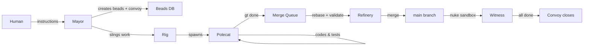
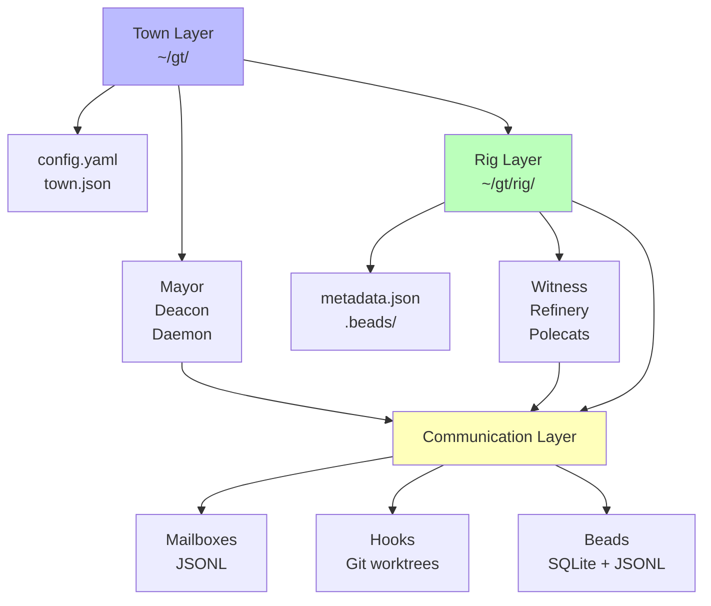
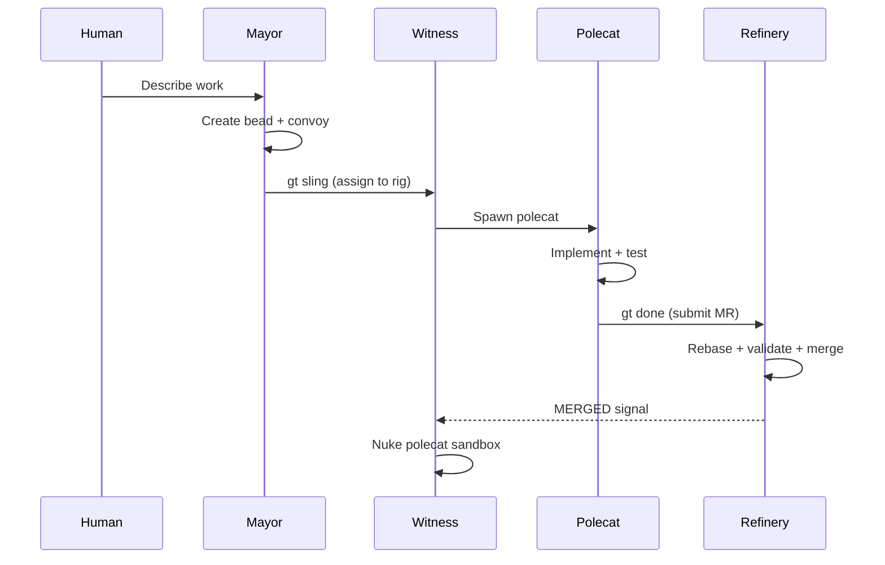
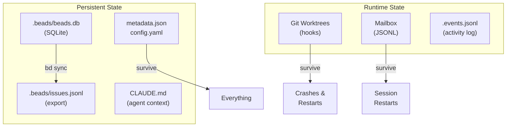

# System Overview

## Components

Gas Town consists of five layers:

### 1. The Town (Workspace)

The town is the root directory (typically `~/gt/`) containing all projects and coordination state. It holds:

- Town-level beads database for cross-project tracking
- Configuration and settings
- Mayor and Deacon agent contexts
- Daemon process state

### 2. Rigs (Project Containers)

:::info
A rig is more than just a repository — it's a self-contained project environment with its own agents, issue tracking, and merge queue.
:::

Each rig wraps a git repository with the full agent infrastructure:

```text
myproject/
├── .beads/           # Rig-level issue tracking (SQLite + JSONL export)
├── metadata.json     # Rig configuration and identity
├── AGENTS.md         # Agent role descriptions
├── refinery/         # Refinery merge queue processing
├── mayor/            # Mayor's coordination workspace
├── crew/             # Human developer workspaces
│   ├── dave/
│   └── emma/
├── witness/          # Rig-level health monitor
├── polecats/         # Ephemeral worker directories (git worktrees)
│   ├── toast/
│   └── alpha/
└── plugins/          # Rig-level plugins
```

:::danger
Never delete or move the `~/gt/` directory while agents are running. The entire supervision tree, all hooks, mailboxes, and beads databases depend on this directory structure. Stopping all agents first with `gt daemon stop` is required before any structural changes.
:::

### 3. Agents (Workers)

Seven agent roles form the hierarchy:

| Agent | Scope | Lifecycle | Purpose |
|-------|-------|-----------|---------|
| **Mayor** | Town | Persistent | Global coordination and strategy |
| **Deacon** | Town | Persistent | Health monitoring and lifecycle |
| **Witness** | Per-rig | Persistent | Polecat supervision |
| **Refinery** | Per-rig | Persistent | Merge queue processing |
| **Polecats** | Per-rig | Ephemeral | Feature work (self-cleaning) |
| **Crew** | Per-rig | Managed | Human developer workspaces |
| **Dogs** | Town | Reusable | Infrastructure tasks |

Additionally, the **Boot** dog is a special triage agent spawned by the Deacon to assess new work or problems. For more on Boot's triage cycle, see [Boot Dogs](/blog/boot-dogs).

### 4. Daemon (Scheduler)

A simple Go process that:

- Sends periodic heartbeats to the Deacon
- Processes lifecycle requests (start/stop agents)
- Restarts sessions when requested
- Polls external services (Discord, etc.)

The daemon is intentionally "dumb" — all intelligence lives in the agents.

:::note
This is a deliberate design choice. By keeping the scheduler simple, the system avoids single-point-of-failure complexity. If the daemon crashes, restarting it is trivial — all state lives in the agents and their hooks.
:::

### 5. Communication Layer



Agents communicate through:

- **Mail** — Async message passing between agents
- **Nudge** — Synchronous message delivery
- **Escalations** — Priority-routed alerts
- **Hooks** — Persistent work state attachment
- **Beads** — Shared issue tracking state

:::warning
Never modify the `.beads/beads.db` SQLite database directly. All state mutations should go through `bd` commands or the agent APIs — direct edits can corrupt the JSONL export sync and cause agents to act on stale or inconsistent data.
:::

## Data Flow



:::warning[Filesystem Dependencies]

Gas Town's five-layer architecture depends on the `~/gt/` directory structure. Moving or deleting this directory while agents are running breaks the supervision tree, mailboxes, hooks, and beads databases. Always stop the daemon with `gt daemon stop` before any structural changes.

:::

:::note[Each Layer Has Independent Failure Domains]

The five-layer architecture isolates failures. A corrupted rig-level beads database doesn't affect other rigs. A crashed polecat doesn't bring down the Witness. A failed Witness doesn't crash the Deacon. This isolation means you can recover from most failures by restarting a single component rather than the entire system.

:::

## Layer Dependency Map

The five architectural layers and their critical dependencies.



## End-to-End Work Flow

The following sequence shows how a single unit of work flows through all five architectural layers from human instruction to merged code.



## State Management

:::tip
All Gas Town state is crash-safe. If any component fails, the data it needs to recover is already on disk — no external databases or cloud services required.
:::

All state is persisted in git or the filesystem. Each layer has its own persistence model, but all data ultimately resides on the local disk.



| State | Storage | Survives |
|-------|---------|----------|
| Issues | `.beads/beads.db` (SQLite) | Everything |
| Issue export | `.beads/issues.jsonl` | Everything |
| Work hooks | Git worktrees | Crashes, restarts |
| Mail | Filesystem JSONL | Session restarts |
| Config | `metadata.json`, `.beads/config.yaml` | Everything |
| Agent context | CLAUDE.md files | Everything |
| Activity log | `.events.jsonl` | Everything |

## Related

- [Agent Hierarchy](agent-hierarchy.md) -- Supervision tree, monitoring chain, and escalation paths between agents
- [Design Principles](design-principles.md) -- The twelve core principles that guide Gas Town's architecture
- [Architecture Guide](../guides/architecture.md) -- Narrative walkthrough of how all the pieces fit together
- [Rigs](../concepts/rigs.md) -- Project containers that wrap git repositories with full agent infrastructure

### Blog Posts

- [The Daemon: Gas Town's Go Heartbeat Engine](/blog/daemon-process) -- Inside the deliberately simple Go scheduler that powers the heartbeat loop
- [Gas Town's Security Model](/blog/security-model) -- Trust boundaries and workspace isolation in the architecture
- [Scaling Beyond 30 Agents](/blog/scaling-beyond-30) -- Architectural patterns for large-scale deployments
- [Hook-Driven Architecture](/blog/hook-driven-architecture) -- How hooks serve as the persistence primitive connecting all five architectural layers
- [Understanding Rigs: Gas Town's Project Containers](/blog/understanding-rigs) -- How rigs organize the architectural components of a Gas Town deployment
