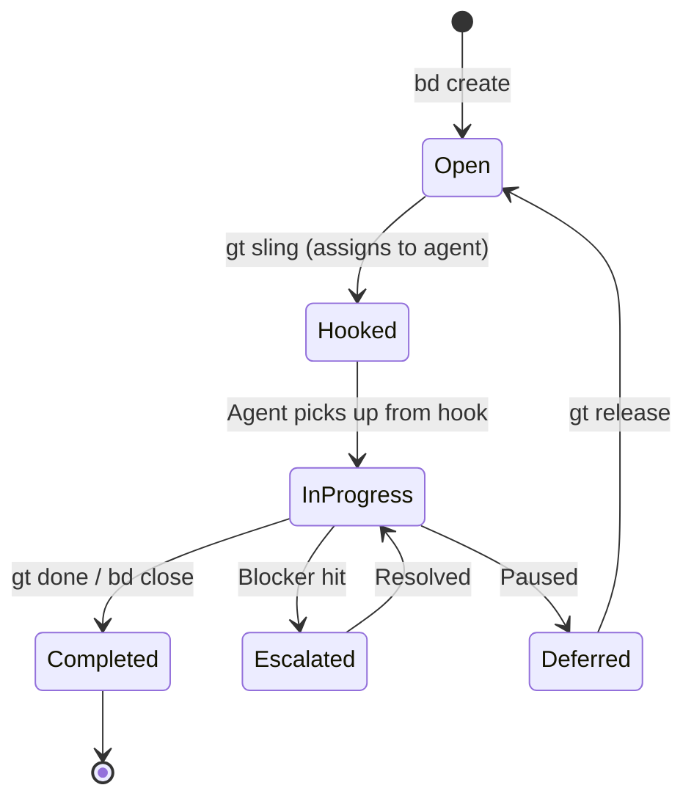
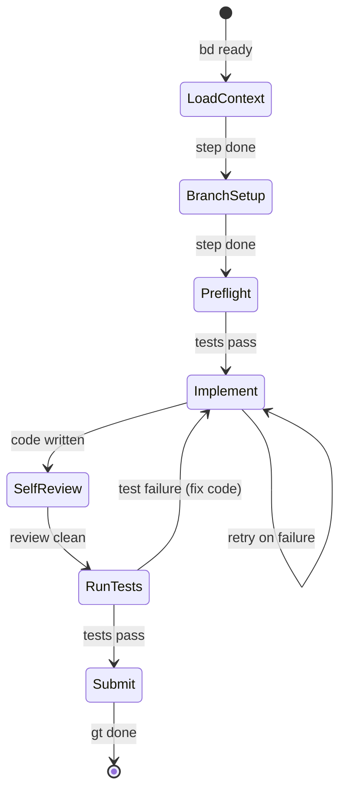

# Work Distribution

## The Work Lifecycle

Every piece of work in Gas Town follows a defined lifecycle from creation to completion.

### Work States



### Exit States (Polecat Completion)

:::info
Every polecat must exit through one of these states. There is no "just stop" — the exit state tells the system what happens next.
:::

When a polecat finishes work, it exits in one of four states:

| State | Meaning | Next Action |
|-------|---------|-------------|
| `COMPLETED` | Work done, MR submitted | Refinery processes merge |
| `ESCALATED` | Hit blocker, needs human | Escalation routes to Mayor/Overseer |
| `DEFERRED` | Paused, still open | Another agent can pick up later |
| `PHASE_COMPLETE` | Phase done, waiting | Gate opens, next phase begins |

## Work Assignment

### The Sling Command

`gt sling` is the primary command for assigning work:

```bash
# Assign to a rig (auto-spawns polecat)
gt sling gt-abc12 myproject

# Assign to a specific agent
gt sling gt-abc12 myproject --agent cursor

# Assign multiple items
gt sling gt-abc12 gt-def34 myproject
```

What happens:

1. Bead status changes to `hooked`
2. Work attaches to target's hook
3. Polecat spawns in the rig
4. Polecat's startup hook finds the work
5. Polecat begins execution

### Hook Persistence

:::note
Hooks are the reason Gas Town is crash-safe. Unlike in-memory job queues, a hook persists on the filesystem — so even if an agent's session is killed, restarting it picks up right where it left off.
:::

The **hook** is Gas Town's durability primitive. Work on a hook survives:

- Session restarts
- Context compaction
- Handoffs between sessions
- Agent crashes

```bash
# Check what's on your hook
gt hook

# Manually attach work
gt hook gt-abc12

# Remove from hook
gt unsling gt-abc12
```

## The Propulsion Principle

:::tip
This is the single most important concept in Gas Town. If you understand nothing else, understand the hook: work on your hook means you execute immediately, no questions asked.
:::

> "If it's on your hook, YOU RUN IT."

This is Gas Town's core work scheduling rule. When an agent starts a session:

1. Check hook for attached work
2. If work found → execute it immediately
3. If no work → check inbox → wait for instructions

This creates automatic momentum — agents always know what to do.

## Convoy Tracking

Convoys bundle related work for tracking:

```bash
# Create convoy from issues
gt convoy create "Feature X" gt-a1 gt-b2 gt-c3

# Check progress
gt convoy list
gt convoy show hq-cv-001

# Add more issues
gt convoy add hq-cv-001 gt-d4

# Find stranded convoys with ready work
gt convoy stranded
```

Convoys auto-close when all tracked issues complete.

## Molecules: Structured Workflows

Molecules define multi-step workflows for agents. A molecule is an epic bead with child step beads that guide execution:

```bash
# Agents check their current steps
bd ready                    # Shows steps with no blockers

# Work through steps sequentially
bd update <step> --status=in_progress
# ... do the work ...
bd close <step>
bd ready                    # Next step appears
```



The standard polecat workflow molecule (`mol-polecat-work`) includes steps like:

1. Load context and verify assignment
2. Set up working branch
3. Verify tests pass on main
4. Implement the solution
5. Self-review changes
6. Run tests and verify coverage
7. Clean up workspace
8. Prepare work for review
9. Submit work and self-clean

Molecules provide crash recovery — if an agent restarts, `bd ready` shows the next incomplete step, so work resumes from where it left off.

## Cross-Rig Work

For work spanning multiple projects:

- **Dogs** handle infrastructure tasks across rigs
- **Convoys** track issues across multiple rigs
- **Mayor** coordinates cross-rig strategy

```bash
# Dogs handle infrastructure
gt dog list

# Prefix-based routing lets you reference any rig's beads
bd show gt-abc12            # Routes to gastown rig
bd show hq-abc              # Routes to town-level beads
```

## Related

- [Beads](../concepts/beads.md) -- The atomic unit of tracked work that flows through the distribution pipeline
- [Hooks](../concepts/hooks.md) -- Persistent work attachment that makes Gas Town crash-safe
- [Convoys](../concepts/convoys.md) -- Batch tracking for related beads across rigs
- [Molecules](../concepts/molecules.md) -- Multi-step structured workflows that guide agent execution

### Blog Posts

- [The Mayor Workflow](/blog/mayor-workflow) -- How the Mayor distributes work across rigs
- [Scaling Beyond 30 Agents](/blog/scaling-beyond-30) -- Distribution strategies for large deployments
- [Hook-Driven Architecture](/blog/hook-driven-architecture) -- How hooks drive the distribution cycle
- [Work Distribution Patterns](/blog/work-distribution-patterns) -- Decision framework for choosing manual convoy vs. Mayor vs. formula workflows
