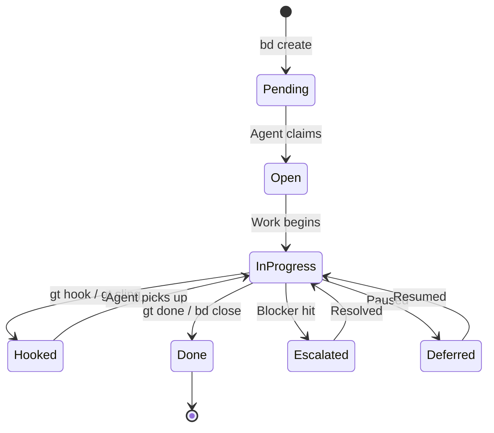

# Work Distribution

## The Work Lifecycle

Every piece of work in Gas Town follows a defined lifecycle from creation to completion.

### Work States



### Exit States (Polecat Completion)

When a polecat finishes work, it exits in one of four states:

| State | Meaning | Next Action |
|-------|---------|-------------|
| `COMPLETED` | Work done, MR submitted | Refinery processes merge |
| `ESCALATED` | Hit blocker, needs human | Escalation routes to Mayor/Overseer |
| `DEFERRED` | Paused, still open | Another agent can pick up later |
| `PHASE_COMPLETE` | Phase done, waiting | Gate opens, next phase begins |

## Work Assignment

### The Sling Command

`gt sling` is the primary command for assigning work:

```bash
# Assign to a rig (auto-spawns polecat)
gt sling gt-abc12 myproject

# Assign to a specific agent
gt sling gt-abc12 myproject --agent cursor

# Assign multiple items
gt sling gt-abc12 gt-def34 myproject
```

What happens:

1. Bead status changes to `hooked`
2. Work attaches to target's hook
3. Polecat spawns in the rig
4. Polecat's startup hook finds the work
5. Polecat begins execution

### Hook Persistence

The **hook** is Gas Town's durability primitive. Work on a hook survives:

- Session restarts
- Context compaction
- Handoffs between sessions
- Agent crashes

```bash
# Check what's on your hook
gt hook

# Manually attach work
gt hook gt-abc12

# Remove from hook
gt unsling gt-abc12
```

## The Propulsion Principle

> "If it's on your hook, YOU RUN IT."

This is Gas Town's core work scheduling rule. When an agent starts a session:

1. Check hook for attached work
2. If work found → execute it immediately
3. If no work → check inbox → wait for instructions

This creates automatic momentum — agents always know what to do.

## Convoy Tracking

Convoys bundle related work for tracking:

```bash
# Create convoy from issues
gt convoy create "Feature X" gt-a1 gt-b2 gt-c3

# Check progress
gt convoy list
gt convoy show hq-cv-001

# Add more issues
gt convoy add hq-cv-001 gt-d4

# Find stranded convoys with ready work
gt convoy stranded
```

Convoys auto-close when all tracked issues complete.

## Cross-Rig Work

For work spanning multiple projects:

- **Dogs** handle infrastructure tasks across rigs
- **Convoys** track issues across multiple rigs
- **Worktrees** provide cross-rig file access

```bash
# Create cross-rig worktree
gt worktree myproject /path/to/other-repo

# Dogs work from ~/gt/deacon/dogs/
gt dog list
```
