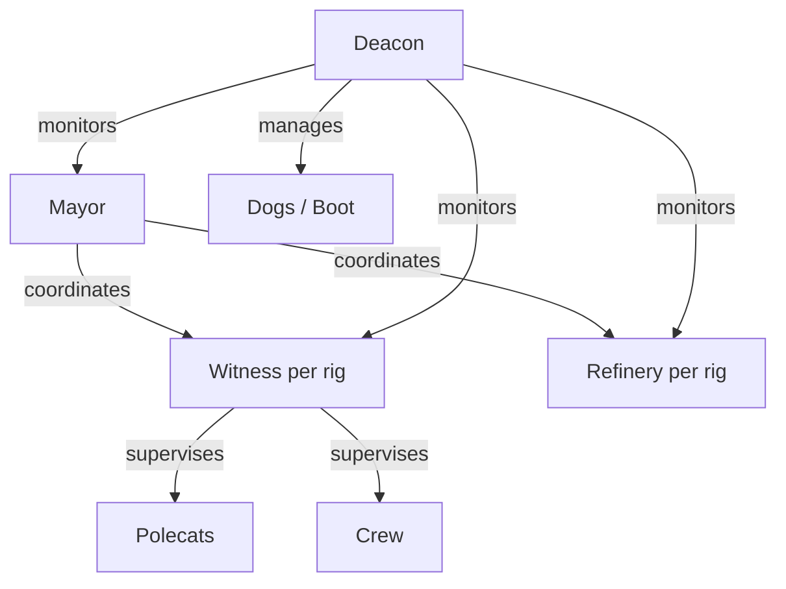
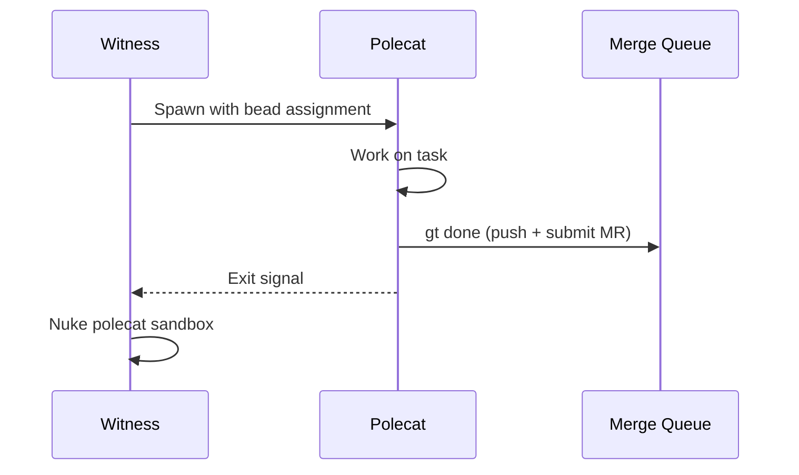

# Agent Operations

Commands for starting, stopping, monitoring, and managing the Gas Town agent hierarchy. Each agent role has dedicated lifecycle commands, plus there are cross-cutting commands for role management.



---

## General Agent Commands

### `gt agents`

List all agents and their current status.

```bash
gt agents [options]
```

**Description:** Displays all agents across the town, organized by role. Shows running status, current activity, and resource usage.

**Options:**

| Flag | Description |
|------|-------------|
| `--rig <name>` | Filter to agents in a specific rig |
| `--role <role>` | Filter to a specific role (mayor, deacon, witness, etc.) |
| `--running` | Show only running agents |
| `--json` | Output in JSON format |

**Example:**

```bash
# List all agents
gt agents

# Show only running agents
gt agents --running

# Show agents for a specific rig
gt agents --rig myproject
```

**Sample output:**

```text
ROLE        RIG          STATUS     PID    AGE
mayor       (town)       running    1234   2h
deacon      (town)       running    1235   2h
witness     myproject    running    1240   1h
witness     docs         running    1241   1h
refinery    myproject    running    1250   1h
polecat     myproject    running    1260   15m   [toast] gt-abc12
polecat     myproject    running    1261   10m   [alpha] gt-def34
dog         (town)       idle       -      -     [boot]
```

---

### `gt role`

Display or set the current agent role context.

```bash
gt role [role-name]
```

**Description:** Without arguments, displays the current role set by `GT_ROLE`. With an argument, sets the role for the current session. The role determines which identity and capabilities the current agent session operates under.

**Valid roles:** `mayor`, `deacon`, `witness`, `refinery`, `polecat`, `dog`, `crew`, `overseer`

**Example:**

```bash
# Show current role
gt role

# Set role
gt role witness
```

:::warning

Changing roles mid-session can cause unexpected behavior. This is primarily used during `gt prime` initialization.

:::

---

## Mayor

The Mayor is the top-level coordinator for the entire town. It receives instructions from the human overseer, creates work plans, and delegates to other agents.

### `gt mayor start`

Start the Mayor agent.

```bash
gt mayor start [options]
```

**Options:**

| Flag | Description |
|------|-------------|
| `--attach` | Start and immediately attach to the session |
| `--agent <runtime>` | Agent runtime to use (default: configured default) |
| `--resume` | Resume from a previous session checkpoint |

**Example:**

```bash
gt mayor start
gt mayor start --attach
gt mayor start --agent claude
```

---

### `gt mayor stop`

Stop the Mayor agent.

```bash
gt mayor stop [options]
```

**Options:**

| Flag | Description |
|------|-------------|
| `--force` | Force stop without graceful shutdown |
| `--checkpoint` | Save a checkpoint before stopping |

**Example:**

```bash
gt mayor stop
gt mayor stop --checkpoint
```

---

### `gt mayor status`

Show Mayor status and current activity.

```bash
gt mayor status [options]
```

**Options:**

| Flag | Description |
|------|-------------|
| `--json` | Output in JSON format |
| `--verbose` | Show extended status including mail queue and hook |

**Example:**

```bash
gt mayor status
```

**Sample output:**

```text
Mayor: running (PID 1234)
Session: sess-abc123
Uptime: 2h 15m
Hook: empty
Inbox: 3 unread
Active convoys: 2
```

---

## Deacon

The Deacon is the health monitoring supervisor for the town. It runs patrol cycles, monitors all Witnesses, and handles lifecycle requests.

### `gt deacon start`

Start the Deacon agent.

```bash
gt deacon start [options]
```

**Options:**

| Flag | Description |
|------|-------------|
| `--attach` | Start and attach to the session |
| `--agent <runtime>` | Agent runtime to use |

**Example:**

```bash
gt deacon start
```

---

### `gt deacon stop`

Stop the Deacon agent.

```bash
gt deacon stop [options]
```

**Options:**

| Flag | Description |
|------|-------------|
| `--force` | Force stop without graceful shutdown |

---

### `gt deacon status`

Show Deacon status.

```bash
gt deacon status [options]
```

**Options:**

| Flag | Description |
|------|-------------|
| `--json` | Output in JSON format |

**Example:**

```bash
gt deacon status
```

---

## Witness

Witnesses are per-rig supervisors that monitor polecats, detect stalls, and manage worker lifecycle within a single rig.

### `gt witness start`

Start a Witness agent for a rig.

```bash
gt witness start <rig> [options]
```

**Options:**

| Flag | Description |
|------|-------------|
| `--attach` | Start and attach to the session |
| `--agent <runtime>` | Agent runtime to use |

**Example:**

```bash
gt witness start myproject
```

---

### `gt witness stop`

Stop a Witness agent.

```bash
gt witness stop <rig> [options]
```

**Options:**

| Flag | Description |
|------|-------------|
| `--force` | Force stop without graceful shutdown |

**Example:**

```bash
gt witness stop myproject
```

---

### `gt witness status`

Show Witness status for a rig.

```bash
gt witness status [rig] [options]
```

**Options:**

| Flag | Description |
|------|-------------|
| `--all` | Show all Witnesses across all rigs |
| `--json` | Output in JSON format |

**Example:**

```bash
gt witness status myproject
gt witness status --all
```

---

## Refinery

The Refinery processes the merge queue for a rig, rebasing, validating, and merging pull requests onto the main branch.

### `gt refinery start`

Start the Refinery agent for a rig.

```bash
gt refinery start <rig> [options]
```

**Options:**

| Flag | Description |
|------|-------------|
| `--attach` | Start and attach to the session |
| `--agent <runtime>` | Agent runtime to use |

**Example:**

```bash
gt refinery start myproject
```

---

### `gt refinery stop`

Stop the Refinery agent.

```bash
gt refinery stop <rig> [options]
```

**Options:**

| Flag | Description |
|------|-------------|
| `--force` | Force stop without graceful shutdown |

---

### `gt refinery status`

Show Refinery status for a rig.

```bash
gt refinery status [rig] [options]
```

**Options:**

| Flag | Description |
|------|-------------|
| `--all` | Show all Refineries across all rigs |
| `--json` | Output in JSON format |

---

## Polecats

Polecats are ephemeral worker agents. They spawn, execute a single task, submit their work, and exit. Managed by the Witness.



### `gt polecat list`

List all polecats.

```bash
gt polecat list [options]
```

**Options:**

| Flag | Description |
|------|-------------|
| `--rig <name>` | Filter to a specific rig |
| `--status <state>` | Filter by status: `running`, `stalled`, `zombie`, `completed` |
| `--json` | Output in JSON format |

**Example:**

```bash
# List all polecats
gt polecat list

# List running polecats in a rig
gt polecat list --rig myproject --status running
```

**Sample output:**

```text
NAME     RIG          STATUS    BEAD       AGE     BRANCH
toast    myproject    running   gt-abc12   15m     fix/login-bug
alpha    myproject    running   gt-def34   10m     feat/email-validation
bravo    docs         running   gt-ghi56   5m      docs/update-readme
```

---

### `gt polecat status`

Show detailed status of a specific polecat.

```bash
gt polecat status <name> [options]
```

**Options:**

| Flag | Description |
|------|-------------|
| `--json` | Output in JSON format |

**Example:**

```bash
gt polecat status toast
```

---

### `gt polecat nuke`

Destroy a polecat and clean up its resources.

```bash
gt polecat nuke <name> [options]
```

**Description:** Terminates the polecat process, removes its worktree, and cleans up all associated state. Used for zombie polecats or when a task needs to be reassigned.

**Options:**

| Flag | Description |
|------|-------------|
| `--force` | Skip confirmation |
| `--keep-branch` | Preserve the git branch |

**Example:**

```bash
gt polecat nuke toast
gt polecat nuke toast --force
```

:::warning

Nuking a polecat destroys all uncommitted work in its worktree. Ensure the polecat has committed or pushed its changes before nuking.

:::

---

### `gt polecat gc`

Garbage collect finished polecat directories.

```bash
gt polecat gc [options]
```

**Description:** Cleans up directories and branches from polecats that have completed their work or have been abandoned.

**Options:**

| Flag | Description |
|------|-------------|
| `--rig <name>` | Garbage collect for a specific rig |
| `--all` | Garbage collect across all rigs |
| `--dry-run` | Show what would be cleaned without doing it |
| `--age <duration>` | Only clean up polecats older than this (default: `1h`) |

**Example:**

```bash
gt polecat gc --all
gt polecat gc --rig myproject --dry-run
```

---

### `gt polecat stale`

List polecats that appear to be stalled or unresponsive.

```bash
gt polecat stale [options]
```

**Options:**

| Flag | Description |
|------|-------------|
| `--rig <name>` | Check a specific rig |
| `--age <duration>` | Stale threshold (default: `30m`) |
| `--json` | Output in JSON format |

**Example:**

```bash
gt polecat stale
gt polecat stale --age 15m
```

---

## Dogs

Dogs are reusable agents that handle infrastructure and cross-rig tasks. They persist between tasks, unlike ephemeral polecats.

### `gt dog list`

List all dogs and their current status.

```bash
gt dog list [options]
```

**Options:**

| Flag | Description |
|------|-------------|
| `--json` | Output in JSON format |

**Example:**

```bash
gt dog list
```

**Sample output:**

```text
NAME     STATUS    CURRENT TASK     SINCE
boot     idle      -                -
fetch    running   sync-upstream    5m
lint     idle      -                -
```

---

### `gt dog status`

Show detailed status of a specific dog.

```bash
gt dog status <name> [options]
```

**Options:**

| Flag | Description |
|------|-------------|
| `--json` | Output in JSON format |

**Example:**

```bash
gt dog status boot
```

---

### `gt dog add`

Register a new dog agent.

```bash
gt dog add <name> [options]
```

**Description:** Creates a new dog with a specific name and optional configuration. Dogs persist in the `deacon/dogs/` directory.

**Options:**

| Flag | Description |
|------|-------------|
| `--agent <runtime>` | Agent runtime for this dog |
| `--role <purpose>` | Dog's specialization (e.g., `triage`, `infrastructure`) |

**Example:**

```bash
gt dog add fetch --role infrastructure
gt dog add lint --agent claude
```

---

## Boot

The Boot agent is a special triage dog that spawns to assess and route incoming work.

### `gt boot spawn`

Spawn the Boot triage agent.

```bash
gt boot spawn [options]
```

**Description:** Starts the Boot dog to perform triage on pending work items, assess complexity, and recommend assignment strategies.

**Options:**

| Flag | Description |
|------|-------------|
| `--attach` | Attach to the Boot session |

**Example:**

```bash
gt boot spawn
```

---

### `gt boot status`

Show Boot agent status.

```bash
gt boot status [options]
```

**Options:**

| Flag | Description |
|------|-------------|
| `--json` | Output in JSON format |

---

## Callbacks

### `gt callbacks`

Handle callbacks from agents during Deacon patrol.

```bash
gt callbacks <subcommand>
```

**Description:** Processes messages sent to the Mayor from Witnesses, Refineries, polecats, and external triggers. Routes messages to other agents or updates state as needed.

**Subcommands:**

| Subcommand | Description |
|------------|-------------|
| `gt callbacks process` | Process pending callbacks |

**Example:**

```bash
gt callbacks process
```

:::note

Callbacks are typically processed automatically during Deacon patrol cycles. Manual invocation is for debugging or manual intervention.

:::

:::info

Dogs persist between tasks and can be reused for multiple assignments, unlike polecats which are destroyed after completing a single task. If your workload involves recurring infrastructure operations such as syncing upstream repos or running periodic lints, prefer dogs over polecats.

:::

---

## Crew

Crew members are persistent workspaces for human developers. They get their own git clone within a rig and can run agent sessions.

### `gt crew start`

Start an agent session in a crew workspace.

```bash
gt crew start <rig> <member> [options]
```

**Options:**

| Flag | Description |
|------|-------------|
| `--attach` | Start and attach to the session |
| `--agent <runtime>` | Agent runtime to use |

**Example:**

```bash
gt crew start myproject dave --attach
```

---

### `gt crew stop`

Stop a crew agent session.

```bash
gt crew stop <rig> <member> [options]
```

**Options:**

| Flag | Description |
|------|-------------|
| `--force` | Force stop |

---

### `gt crew add`

Add a new crew member workspace to a rig.

```bash
gt crew add <rig> <name> [options]
```

**Description:** Creates a new persistent git clone for a human developer within the specified rig.

**Options:**

| Flag | Description |
|------|-------------|
| `--branch <name>` | Check out a specific branch |
| `--agent <runtime>` | Default agent runtime for this crew member |

**Example:**

```bash
gt crew add myproject dave
gt crew add myproject emma --branch develop
```

---

### `gt crew list`

List crew members.

```bash
gt crew list [rig] [options]
```

**Options:**

| Flag | Description |
|------|-------------|
| `--all` | List crew across all rigs |
| `--json` | Output in JSON format |

**Example:**

```bash
gt crew list myproject
gt crew list --all
```

---

### `gt crew at`

Show what a crew member is currently working on.

```bash
gt crew at <rig> <member>
```

**Example:**

```bash
gt crew at myproject dave
```

---

### `gt crew remove`

Remove a crew member workspace.

```bash
gt crew remove <rig> <name> [options]
```

**Options:**

| Flag | Description |
|------|-------------|
| `--force` | Skip confirmation and force removal |
| `--keep-branch` | Preserve the git branch |

**Example:**

```bash
gt crew remove myproject dave
```

---

### `gt crew refresh`

Refresh a crew workspace by pulling latest changes.

```bash
gt crew refresh <rig> <member> [options]
```

**Options:**

| Flag | Description |
|------|-------------|
| `--rebase` | Rebase local changes onto latest main |
| `--all` | Refresh all crew workspaces in the rig |

**Example:**

```bash
gt crew refresh myproject dave --rebase
```

---

### `gt crew restart`

Restart a crew agent session.

```bash
gt crew restart <rig> <member> [options]
```

**Description:** Stops and restarts the agent session for a crew member, preserving hook state and context.

**Options:**

| Flag | Description |
|------|-------------|
| `--agent <runtime>` | Switch to a different agent runtime |

**Example:**

```bash
gt crew restart myproject dave
```

## Related

- [Agent Hierarchy](../architecture/agent-hierarchy.md) -- Supervision tree and monitoring chain
- [Polecats](../agents/polecats.md) -- Ephemeral worker lifecycle details
- [Crew](../agents/crew.md) -- Persistent crew worker details

### Blog Posts

- [The Witness: Gas Town's Self-Healing Watchdog](/blog/witness-explained) -- How the Witness monitors polecat health and triggers recovery
- [The Deacon: Gas Town's Background Coordinator](/blog/deacon-patrol) -- How the Deacon patrols the town and manages agent lifecycles
- [Scaling Gas Town Beyond 30 Agents](/blog/scaling-beyond-30) -- Architectural patterns for managing agents at scale
