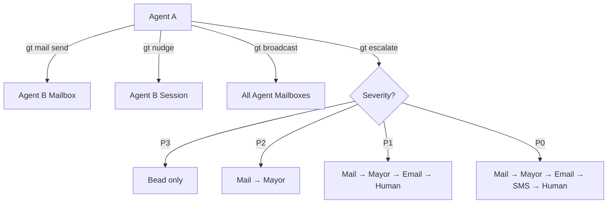
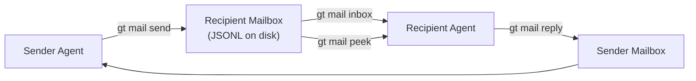
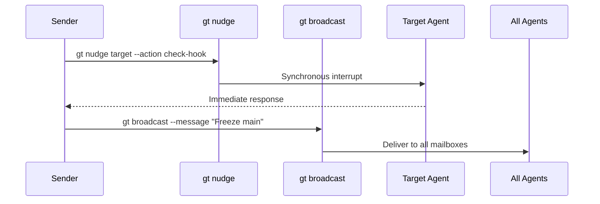
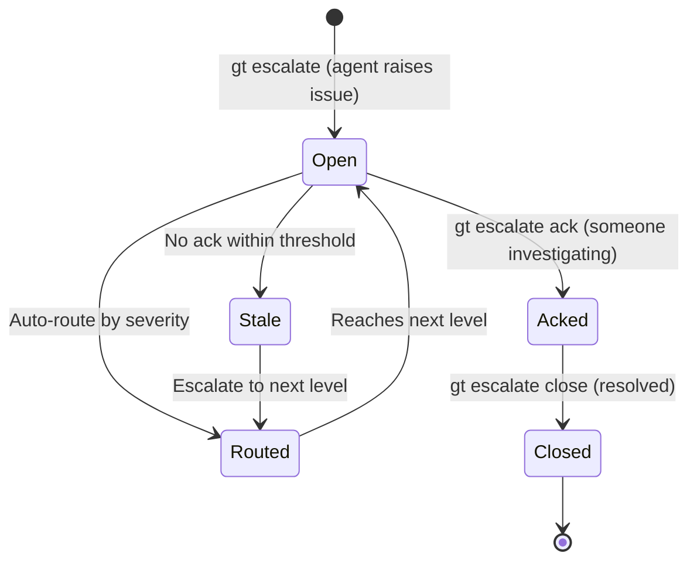

# Communication

Commands for inter-agent messaging, notifications, escalations, and broadcasts. Gas Town's communication layer is built on Erlang-inspired mailbox patterns with asynchronous message passing as the default.



---

## Mail

The mail system provides asynchronous message passing between agents. Each agent has a mailbox that persists across session restarts.

### `gt mail inbox`

View incoming messages.

```bash
gt mail inbox [options]
```

**Description:** Lists messages in the current agent's inbox. Messages are stored as JSONL files and persist across restarts.

**Options:**

| Flag | Description |
|------|-------------|
| `--unread` | Show only unread messages |
| `--from <agent>` | Filter by sender |
| `--limit <n>` | Maximum number of messages to show |
| `--since <duration>` | Show messages from the last N hours/minutes |
| `--json` | Output in JSON format |

**Example:**

```bash
# View all inbox
gt mail inbox

# View unread only
gt mail inbox --unread

# Messages from the Mayor in the last hour
gt mail inbox --from mayor --since 1h
```

**Sample output:**

```text
ID     FROM        TIME     READ   SUBJECT
m-001  deacon      5m ago   *      Witness myproject unresponsive
m-002  polecat     15m ago  .      gt-abc12 completed
m-003  mayor       30m ago  .      New convoy assigned: hq-cv-002
```

---

### `gt mail send`

Send a message to another agent.

```bash
gt mail send <recipient> [options]
```

**Description:** Sends an asynchronous message to another agent's mailbox. The recipient will see it on their next inbox check.

**Options:**

| Flag | Description |
|------|-------------|
| `--subject <text>` | Message subject |
| `--body <text>` | Message body |
| `--priority <level>` | Message priority: `high`, `normal`, `low` |
| `--channel <name>` | Send to a named channel instead of an agent |
| `--attach <file>` | Attach a file to the message |

**Example:**

```bash
gt mail send mayor --subject "Need guidance" --body "Blocked on API design decision for auth module"
gt mail send deacon --subject "Health alert" --body "Refinery queue backing up" --priority high
```

---

### `gt mail read`

Read a specific message.

```bash
gt mail read <message-id>
```

**Description:** Displays the full content of a message and marks it as read.

**Example:**

```bash
gt mail read m-001
```

---

### `gt mail mark-read`

Mark messages as read without archiving.

```bash
gt mail mark-read <message-id>...
```

**Example:**

```bash
gt mail mark-read m-001 m-002
```

---

### `gt mail mark-unread`

Mark messages as unread.

```bash
gt mail mark-unread <message-id>...
```

**Example:**

```bash
gt mail mark-unread m-003
```

---

### `gt mail peek`

Preview messages without marking them as read.

```bash
gt mail peek [message-id] [options]
```

**Description:** Shows message content without changing its read status. Without an ID, peeks at the most recent unread message.

**Options:**

| Flag | Description |
|------|-------------|
| `--count <n>` | Number of messages to peek at |

**Example:**

```bash
gt mail peek
gt mail peek m-001
gt mail peek --count 5
```

---

### `gt mail reply`

Reply to a message.

```bash
gt mail reply <message-id> [options]
```

**Description:** Sends a reply to the sender of a message, preserving the conversation thread.

**Options:**

| Flag | Description |
|------|-------------|
| `--body <text>` | Reply body |
| `--all` | Reply to all recipients in the thread |

**Example:**

```bash
gt mail reply m-001 --body "Acknowledged, restarting the witness now"
```

---

### `gt mail search`

Search messages.

```bash
gt mail search <query> [options]
```

**Description:** Full-text search across all messages in the mailbox.

**Options:**

| Flag | Description |
|------|-------------|
| `--from <agent>` | Filter by sender |
| `--since <duration>` | Search within time window |
| `--limit <n>` | Maximum results |
| `--json` | Output in JSON format |

**Example:**

```bash
gt mail search "merge conflict"
gt mail search "blocked" --from polecat --since 24h
```

---

### `gt mail thread`

View a conversation thread.

```bash
gt mail thread <message-id> [options]
```

**Description:** Shows all messages in a conversation thread, from the original message through all replies.

**Options:**

| Flag | Description |
|------|-------------|
| `--json` | Output in JSON format |

**Example:**

```bash
gt mail thread m-001
```

---

### `gt mail channel`

Manage or view named channels.

```bash
gt mail channel [name] [options]
```

**Description:** Without arguments, lists available channels. With a channel name, shows messages in that channel. Channels are named mailboxes for topic-based communication.

**Options:**

| Flag | Description |
|------|-------------|
| `--create <name>` | Create a new channel |
| `--subscribe` | Subscribe to a channel |
| `--unsubscribe` | Unsubscribe from a channel |
| `--limit <n>` | Message limit |

**Example:**

```bash
# List channels
gt mail channel

# View channel messages
gt mail channel alerts

# Create a channel
gt mail channel --create deployments
```

:::tip
Use channels for topic-based communication that spans multiple agents. Instead of sending individual messages to each agent interested in a topic (e.g., deployments, alerts), create a channel and let agents subscribe. This keeps conversations organized and avoids duplicate messages.
:::

---

### `gt mail queue`

View the outgoing message queue.

```bash
gt mail queue [options]
```

**Description:** Shows messages that are queued for delivery but have not yet been picked up by their recipients.

**Options:**

| Flag | Description |
|------|-------------|
| `--json` | Output in JSON format |

**Example:**

```bash
gt mail queue
```

---

### `gt mail announces`

View or manage announcement messages.

```bash
gt mail announces [options]
```

**Description:** Shows broadcast announcements that have been sent to all agents. Announcements are high-visibility messages from the Mayor or Overseer.

**Options:**

| Flag | Description |
|------|-------------|
| `--since <duration>` | Filter by time |
| `--json` | Output in JSON format |

**Example:**

```bash
gt mail announces
gt mail announces --since 24h
```

---

:::info

Mail is delivered by writing to the recipient's mailbox directory on the filesystem, not through a network protocol. This means mail delivery is instant and zero-latency for agents on the same machine, but does not work across different hosts.

:::

:::tip[Mail Survives Session Restarts]

All mail is stored as JSONL files on disk, not in memory. If an agent crashes or cycles its session, unread mail persists and will be available when the next session starts. This makes mail the preferred method for async communication that needs to survive failures.

:::

### `gt mail archive`

Archive messages.

```bash
gt mail archive <message-id>...
```

**Description:** Moves messages to the archive. Archived messages are no longer shown in the inbox but are preserved for future reference.

**Example:**

```bash
gt mail archive m-001 m-002
```

---

### `gt mail delete`

Delete messages.

```bash
gt mail delete <message-id>...
```

**Description:** Permanently delete messages from the mailbox.

**Example:**

```bash
gt mail delete m-001
```

---

### `gt mail clear`

Clear all messages from an inbox.

```bash
gt mail clear
```

**Description:** Removes all messages from the current agent's inbox.

**Example:**

```bash
gt mail clear
```

---

:::note

Messages persist across session restarts because they are stored as JSONL files on disk, not in memory. If an agent crashes or cycles its session, all unread mail will still be available when the next session starts.

:::

The following diagram shows how a mail message travels from sender to recipient through the filesystem-based delivery system.



### `gt mail hook`

Attach a mail message to your hook.

```bash
gt mail hook <message-id>
```

**Description:** Attaches a mail message to your hook as an ad-hoc work assignment. Alias for `gt hook attach`.

**Example:**

```bash
gt mail hook m-001
```

---

### `gt mail check`

Check for new mail (for hooks).

```bash
gt mail check
```

**Description:** Non-interactive check for new mail, intended for use in hooks and automation.

**Example:**

```bash
gt mail check
```

---

### `gt mail claim`

Claim a message from a queue.

```bash
gt mail claim <queue-name>
```

**Description:** Claims the next available message from a named queue, removing it from the queue for processing.

**Example:**

```bash
gt mail claim work-queue
```

---

### `gt mail release`

Release a claimed queue message.

```bash
gt mail release <message-id>
```

**Description:** Releases a previously claimed queue message back to the queue for another agent to claim.

**Example:**

```bash
gt mail release m-001
```

---

### `gt mail group`

Manage mail groups.

```bash
gt mail group [subcommand]
```

**Description:** Create and manage mail groups (distribution lists) for sending messages to multiple agents at once.

**Example:**

```bash
gt mail group
```

---

## Notifications & Broadcasts



### `gt nudge`

Send a synchronous notification to an agent.

```bash
gt nudge <target> [options]
```

**Description:** Unlike mail (async), a nudge is a synchronous message delivery that interrupts the target agent immediately. Used by supervisors to wake up or redirect agents.

**Options:**

| Flag | Description |
|------|-------------|
| `--message <text>` | Nudge message |
| `--action <action>` | Requested action: `check-hook`, `patrol`, `restart`, `status` |

**Example:**

```bash
# Nudge a polecat to check its hook
gt nudge polecat/toast --action check-hook

# Nudge with a message
gt nudge witness --message "Check polecat alpha, appears stalled" --rig myproject
```

:::warning

Use nudges sparingly. They interrupt the target agent's current activity. For non-urgent messages, use `gt mail send` instead.

:::

---

### `gt broadcast`

Send a message to all agents.

```bash
gt broadcast [options]
```

**Description:** Sends a message to all agents in the town or all agents in a specific rig. Used for system-wide announcements.

**Options:**

| Flag | Description |
|------|-------------|
| `--message <text>` | Broadcast message |
| `--rig <name>` | Broadcast to a specific rig only |
| `--priority <level>` | Priority level |

**Example:**

```bash
# Town-wide broadcast
gt broadcast --message "Maintenance window in 30 minutes, save your work"

# Rig-specific broadcast
gt broadcast --rig myproject --message "Main branch frozen for release"
```

---

### `gt dnd`

Toggle do-not-disturb mode.

```bash
gt dnd [on|off] [options]
```

**Description:** When enabled, suppresses non-critical notifications and nudges. Critical escalations still come through. Useful during focused work or maintenance.

**Options:**

| Flag | Description |
|------|-------------|
| `--duration <time>` | Auto-disable after duration |
| `--allow <agent>` | Allow messages from specific agent even in DND |

**Example:**

```bash
# Enable DND
gt dnd on

# Enable for 2 hours
gt dnd on --duration 2h

# Disable
gt dnd off
```

---

### `gt notify`

Manage notification preferences.

```bash
gt notify [options]
```

**Description:** Configure how and when you receive notifications from Gas Town agents.

**Options:**

| Flag | Description |
|------|-------------|
| `--email <address>` | Set email notification address |
| `--discord <webhook>` | Set Discord webhook URL |
| `--level <level>` | Minimum notification level: `all`, `high`, `critical` |
| `--show` | Show current notification settings |

**Example:**

```bash
# Show current settings
gt notify --show

# Set email notifications for critical alerts
gt notify --email you@example.com --level critical

# Set Discord webhook
gt notify --discord https://discord.com/api/webhooks/...
```

---

## Escalations

Escalations are priority-routed alerts for issues that need human intervention or higher-authority decisions.



### `gt escalate`

Create a new escalation.

```bash
gt escalate [options]
```

**Description:** Creates a priority-routed escalation that travels up the supervisor chain until it reaches an agent authorized to handle it. Severity levels control routing depth.

**Options:**

| Flag | Description |
|------|-------------|
| `--severity <level>` | Severity: `P0` (critical), `P1` (high), `P2` (medium), `P3` (low) |
| `--message <text>` | Escalation description |
| `--bead <id>` | Associated bead |
| `--rig <name>` | Associated rig |
| `--to <agent>` | Direct escalation to a specific agent |

**Routing by severity:**

| Severity | Route |
|----------|-------|
| P0 (Critical) | Bead -> Mail:Mayor -> Email:Human -> SMS:Human |
| P1 (High) | Bead -> Mail:Mayor -> Email:Human |
| P2 (Medium) | Bead -> Mail:Mayor |
| P3 (Low) | Bead only |

**Example:**

```bash
# Critical escalation
gt escalate --severity P0 --message "Production database migration failed" --rig myproject

# Standard escalation with associated bead
gt escalate --severity P2 --message "Need design decision for API schema" --bead gt-abc12

# Direct escalation to Mayor
gt escalate --to mayor --message "Merge conflicts accumulating faster than resolution"
```

---

### `gt escalate list`

List all active escalations.

```bash
gt escalate list [options]
```

**Options:**

| Flag | Description |
|------|-------------|
| `--severity <level>` | Filter by severity |
| `--status <status>` | Filter: `open`, `acked`, `closed` |
| `--rig <name>` | Filter by rig |
| `--json` | Output in JSON format |

**Example:**

```bash
gt escalate list
gt escalate list --severity P0 --status open
```

**Sample output:**

```text
ID       SEVERITY   STATUS   FROM      AGE    MESSAGE
esc-001  P0         open     witness   5m     Production DB migration failed
esc-002  P2         acked    polecat   1h     Need API schema decision
esc-003  P3         open     refinery  30m    Flaky test in auth module
```

---

### `gt escalate ack`

Acknowledge an escalation.

```bash
gt escalate ack <escalation-id> [options]
```

**Description:** Marks an escalation as acknowledged, indicating someone is looking at it. This stops further routing up the chain.

**Options:**

| Flag | Description |
|------|-------------|
| `--message <text>` | Acknowledgment message |

**Example:**

```bash
gt escalate ack esc-001 --message "Investigating, will have fix in 15 minutes"
```

---

### `gt escalate close`

Close a resolved escalation.

```bash
gt escalate close <escalation-id> [options]
```

**Options:**

| Flag | Description |
|------|-------------|
| `--resolution <text>` | How the escalation was resolved |

**Example:**

```bash
gt escalate close esc-001 --resolution "Rolled back migration, applied fix, re-ran successfully"
```

---

### `gt escalate stale`

Find escalations that have not been acknowledged.

```bash
gt escalate stale [options]
```

**Description:** Lists escalations that have been open without acknowledgment for longer than expected, based on their severity level.

**Options:**

| Flag | Description |
|------|-------------|
| `--age <duration>` | Override stale threshold |
| `--json` | Output in JSON format |

**Example:**

```bash
gt escalate stale
gt escalate stale --age 30m
```

:::warning

Stale P0/P1 escalations indicate that critical issues are going unaddressed. These should be triaged immediately.


:::
## Related

- [gt nudge](./nudge.md) -- Synchronous message delivery to running sessions
- [Architecture Overview](../architecture/overview.md) -- How the communication layer fits into Gas Town
- [Crew Collaboration](../workflows/crew-collaboration.md) -- Communication patterns for crew workers

### Blog Posts

- [The Escalation System: How Gas Town Surfaces Problems Before They Snowball](/blog/escalation-system) -- Practical guide to priority-routed escalations, severity levels, and incident handling
- [Gas Town's Mail System](/blog/mail-system) -- Async communication patterns between agents
- [Session Cycling](/blog/session-cycling) -- How handoff mail preserves context across sessions
- [Agent Communication Patterns](/blog/agent-communication-patterns) -- Patterns for mail, nudge, and broadcast in multi-agent workflows
