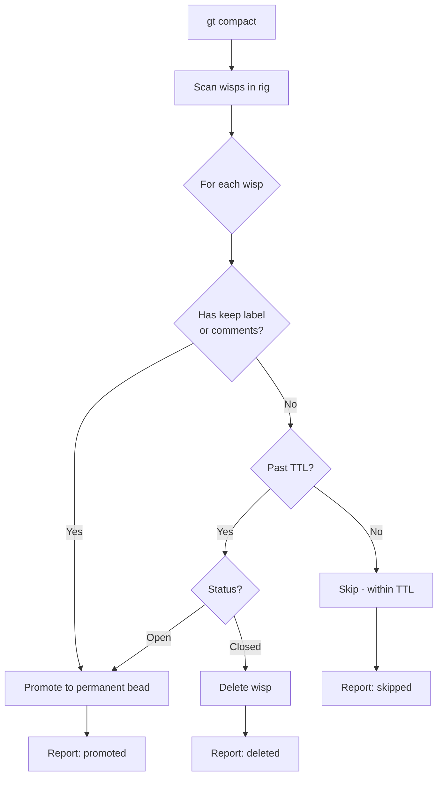
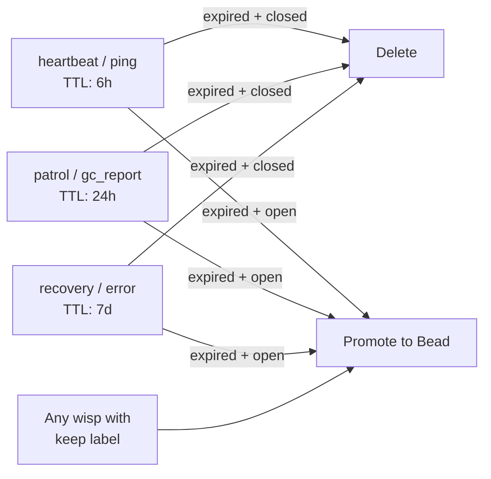
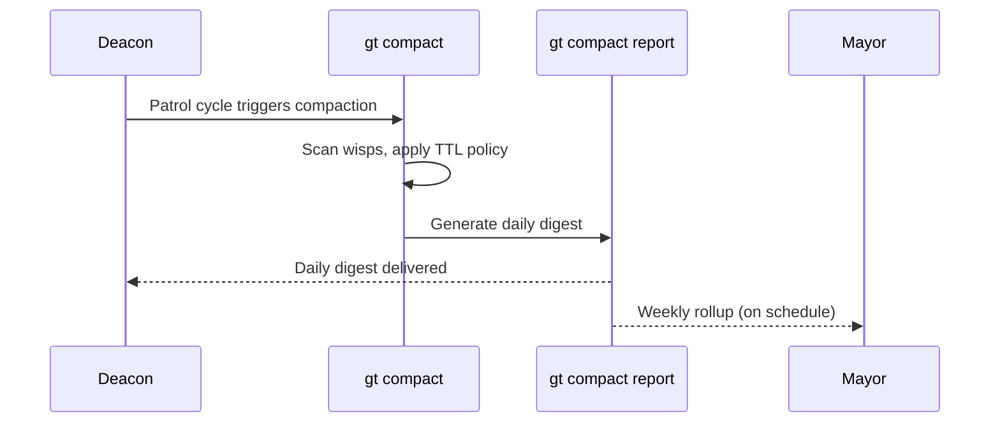
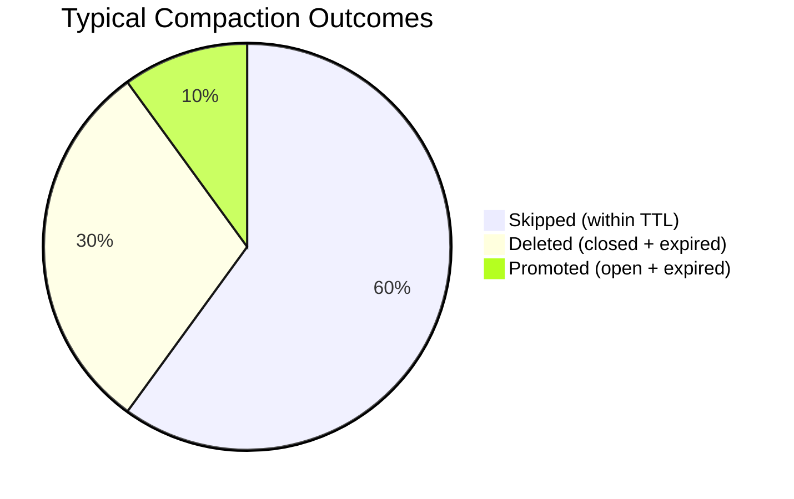
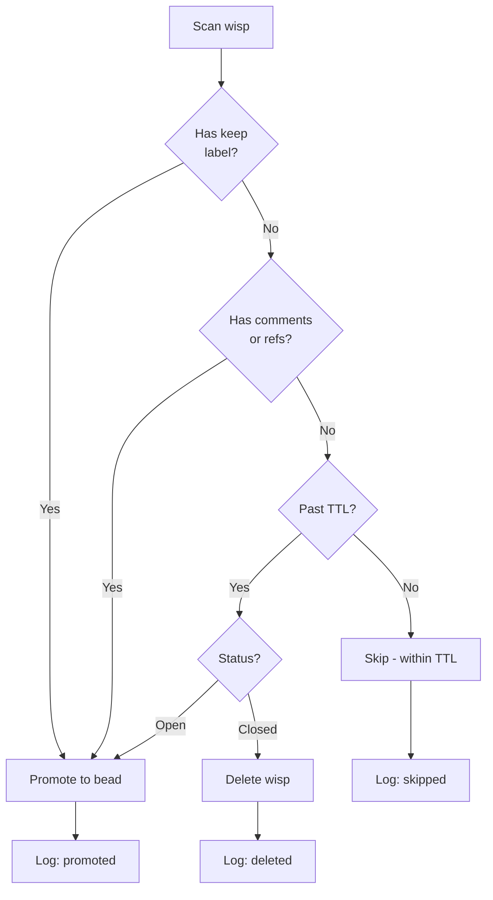

# gt compact

Apply TTL-based compaction policy to ephemeral wisps.

```bash
gt compact [flags]
gt compact [command]
```

## Description



[Wisps](../concepts/wisps.md) are lightweight, ephemeral beads (heartbeats, pings, patrol reports). Over time they accumulate and need cleanup. Compaction applies TTL (time-to-live) policies:

- **Non-closed wisps past TTL** are promoted to permanent beads (something is stuck)
- **Closed wisps past TTL** are deleted (Dolt `AS OF` preserves history)
- **Wisps with comments, references, or `keep` labels** are always promoted

:::note

Compaction only processes wisps -- lightweight ephemeral beads. Regular beads (bugs, features, tasks) are never deleted by compaction, even if they have been closed for a long time. For more on ephemeral vs. persistent tracking, see [Why Beads?](/blog/why-beads)

:::

### TTLs by Wisp Type



| Type | TTL |
|------|-----|
| `heartbeat`, `ping` | 6 hours |
| `patrol`, `gc_report` | 24 hours |
| `recovery`, `error`, `escalation` | 7 days |
| Default (untyped) | 24 hours |

## Subcommands

| Command | Description |
|---------|-------------|
| [`report`](#gt-compact-report) | Generate and send compaction digest report |

## Flags

| Flag | Short | Description |
|------|-------|-------------|
| `--dry-run` | | Preview compaction without making changes |
| `--rig <name>` | | Compact a specific rig (default: current rig) |
| `--verbose` | `-v` | Show each wisp decision |
| `--json` | | Output results as JSON |

## Examples

```bash
gt compact               # Run compaction
gt compact --dry-run     # Preview what would happen
gt compact --verbose     # Show each wisp decision
gt compact --json        # Machine-readable output
gt compact --rig gastown # Compact a specific rig
```

---

## gt compact report

Generate a compaction digest and send it to deacon/ (cc mayor/).

```bash
gt compact report [flags]
```

The daily digest shows per-category breakdown of deleted, promoted, and active wisps, plus any promotions with reasons and detected anomalies.

The weekly rollup (`--weekly`) aggregates the past 7 days of compaction event beads and sends trend data to mayor/.

**Flags:**

| Flag | Short | Description |
|------|-------|-------------|
| `--dry-run` | | Preview report without sending |
| `--date <YYYY-MM-DD>` | | Report for specific date (default: today) |
| `--weekly` | | Generate weekly rollup instead of daily digest |
| `--verbose` | `-v` | Verbose output |
| `--json` | | Output report as JSON |

**Examples:**

```bash
gt compact report              # Run compaction + send daily digest
gt compact report --dry-run    # Preview the report without sending
gt compact report --weekly     # Send weekly rollup to mayor/
```

:::warning[Promoted Wisps Indicate Stuck Work]

When compaction promotes wisps instead of deleting them, it means something expected to complete quickly did not. Check the promoted bead for context -- common causes are stalled heartbeats, unresolved patrol findings, or zombie processes that were never cleaned up.

:::

## When to Run Compaction

:::tip
For most deployments, you never need to run compaction manually. The Deacon handles it automatically as part of its patrol cycle.
:::

### Automated (Recommended)



The Deacon runs compaction automatically as part of its patrol cycle. The daily digest goes to the Deacon, and the weekly rollup goes to the Mayor. No manual intervention is needed for normal operations.

```text
Daemon heartbeat (3m) → Deacon patrol → gt compact → gt compact report
```

### Manual

Run compaction manually when:

- Investigating wisp accumulation after a long outage
- Cleaning up after a large convoy with many patrol wisps
- Verifying compaction behavior before changing TTL configuration

```bash
# Always preview first
gt compact --dry-run --verbose

# Then compact
gt compact --verbose
```

:::info
Promoted wisps are worth investigating — they indicate something that was expected to complete quickly but didn't. Check the bead for stuck work or failed processes.
:::

:::caution

If compaction promotes a large number of wisps in a single run, it may indicate a systemic issue such as a stalled Witness or a rig with zombie polecats. Investigate the root cause rather than simply re-running compaction, as the underlying problem will continue generating stuck wisps.

:::

:::tip[Compaction Runs Are Idempotent]

Running `gt compact` multiple times on the same data is safe. Already-deleted wisps stay deleted, already-promoted wisps stay promoted, and wisps within TTL remain unchanged. This makes compaction safe to run as part of automated scripts or when you're unsure if it already ran today.

:::

## Wisp Outcome Distribution

In a typical compaction run, the majority of wisps are either skipped (still within TTL) or deleted (closed and expired). Promotions are the exception.



## Compaction Decision Logic

The full decision tree applied during compaction processing.



## Understanding the Output

A typical compaction run produces output like:

```text
Compacting gastowndocs...
  Scanned: 47 wisps
  Deleted: 12 (closed, past TTL)
  Promoted: 2 (open, past TTL — possible stuck work)
  Skipped: 33 (within TTL or has keep label)
```

- **Deleted**: Closed wisps whose TTL has expired. These were successfully completed work steps.
- **Promoted**: Open wisps past their TTL. This usually indicates something is stuck — check the promoted bead for context.
- **Skipped**: Wisps that are either still within their TTL or have the `keep` label.

## Troubleshooting

### Wisps Not Being Compacted

If `gt compact --dry-run` shows no wisps to process, check that:

1. The rig has wisps: `bd list --type wisp`
2. The wisps have exceeded their TTL (see table above)
3. You're targeting the correct rig: `gt compact --rig <name>`

### Unexpected Promotions

Wisps are promoted (instead of deleted) when they're still open past their TTL — this usually means something is stuck. Check the promoted bead for context:

```bash
# After compaction reports a promotion
bd show <promoted-bead-id>

# Common causes: stalled heartbeats, unresolved patrol findings
```

:::warning
Compaction is irreversible for deletions. Use `--dry-run` first to verify what will be removed. Dolt's `AS OF` feature preserves historical data, but direct recovery is not straightforward.
:::

## Related

- [Wisps](../concepts/wisps.md) -- The ephemeral beads that compaction manages
- [Diagnostics](./diagnostics.md) -- Other maintenance and diagnostic commands

### Blog Posts

- [Session Cycling: How Gas Town Agents Handle Context Limits](/blog/session-cycling) -- How Gas Town agents automatically hand off work when their context window fills up
- [The Deacon: Gas Town's Background Coordinator](/blog/deacon-patrol) -- How the Deacon runs compaction as part of its automated patrol cycle
- [Lifecycle Management](/blog/lifecycle-management) -- Managing agent and resource lifecycles including wisp TTLs and compaction policies
- [Cost Optimization](/blog/cost-optimization) -- How compaction and wisp cleanup contribute to reducing resource usage and costs
