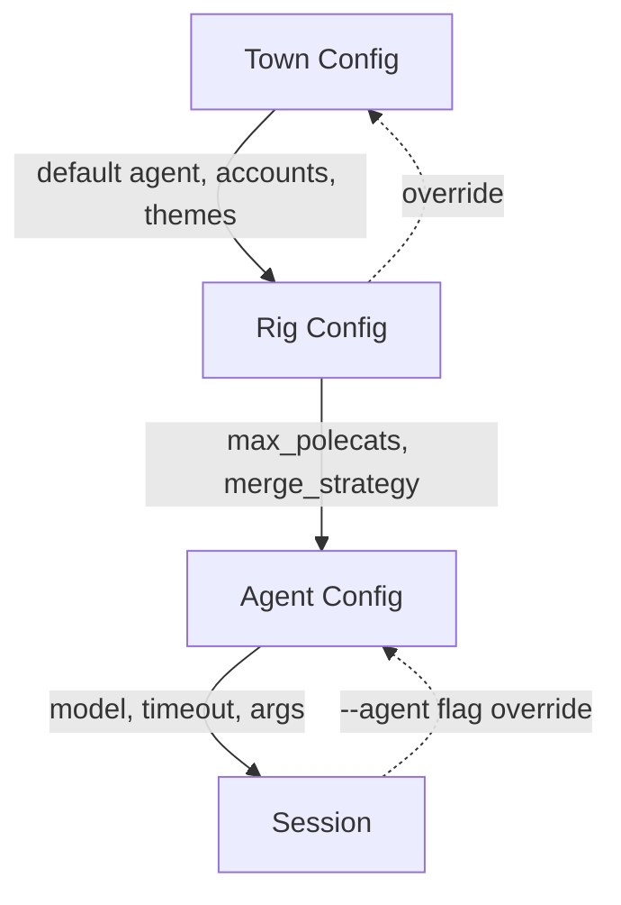
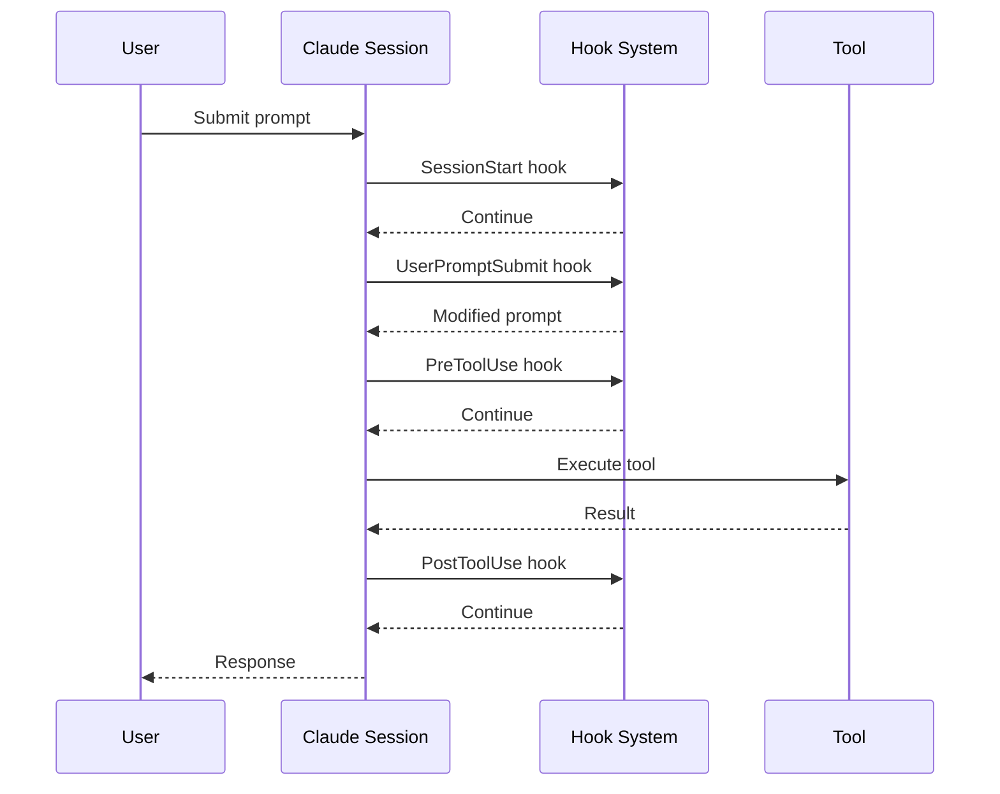
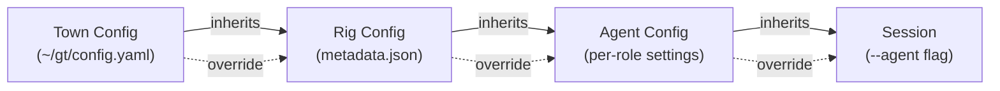
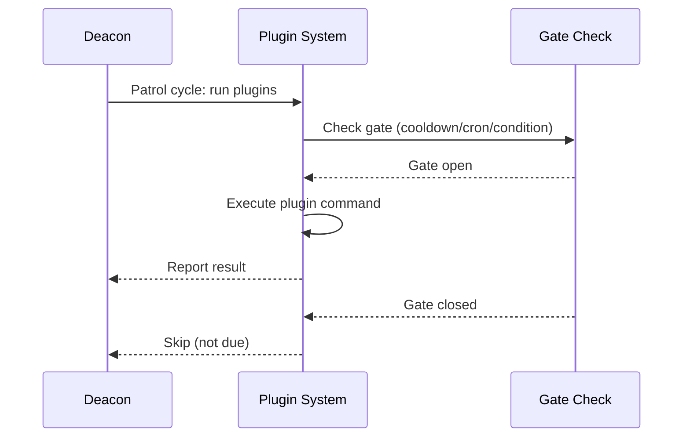

# Configuration

Commands for configuring agent runtimes, account settings, themes, hooks, and issue integration. These settings control how Gas Town operates at the town and rig levels.



---

## Agent Configuration

### `gt config agent list`

List configured agent runtimes.

```bash
gt config agent list [options]
```

**Description:** Shows all configured agent runtimes and their command mappings. Gas Town supports multiple AI coding agent runtimes.

**Options:**

| Flag | Description |
|------|-------------|
| `--json` | Output in JSON format |

**Example:**

```bash
gt config agent list
```

**Sample output:**

```text
AGENT      COMMAND     STATUS      DEFAULT
claude     claude      available   *
gemini     gemini      available
codex      codex       not found
cursor     cursor      available
auggie     auggie      not found
amp        amp         not found
```

---

### `gt config agent get`

Get a specific agent runtime configuration value.

```bash
gt config agent get <agent> [key]
```

**Description:** Without a key, shows all configuration for the specified agent runtime. With a key, shows that specific setting.

**Example:**

```bash
# Show all config for claude
gt config agent get claude

# Get a specific setting
gt config agent get claude model
```

---

### `gt config agent set`

Set an agent runtime configuration value.

```bash
gt config agent set <agent> <key> <value>
```

**Description:** Configures a specific setting for an agent runtime. Use this to set command paths, model preferences, and other runtime-specific options.

**Common keys:**

| Key | Description | Example |
|-----|-------------|---------|
| `command` | Command to invoke the agent | `claude` |
| `model` | Preferred model | `claude-opus-4-5-20251101` |
| `args` | Additional arguments | `--verbose` |
| `timeout` | Session timeout | `3600` |
| `max_tokens` | Maximum token limit | `200000` |

**Example:**

```bash
# Set command for gemini
gt config agent set gemini command "gemini"

# Set model preference
gt config agent set claude model "claude-opus-4-5-20251101"

# Set custom args
gt config agent set cursor args "--no-telemetry"
```

---

### `gt config default-agent`

Get or set the default agent runtime.

```bash
gt config default-agent [agent]
```

**Description:** Without an argument, shows the current default agent. With an argument, sets the default agent runtime used when no `--agent` flag is specified.

**Example:**

```bash
# Show default
gt config default-agent
# Output: claude

# Set default to gemini
gt config default-agent gemini
```

:::tip

The default agent can be overridden at the rig level with `gt rig config <rig> agent <runtime>` or per-command with the `--agent` flag.

:::

---

## Account Management

```mermaid
stateDiagram-v2
    [*] --> Listed: gt account list
    [*] --> Added: gt account add
    Added --> Default: gt account default
    Default --> Active: sessions use this account
    Active --> Switched: gt account switch
    Switched --> Active: new account in use
```

### `gt account`

Manage multiple Claude Code accounts for Gas Town.

```bash
gt account <subcommand>
```

**Description:** Enables switching between Claude Code accounts (e.g., personal vs work) with easy account selection per spawn or globally.

**Subcommands:**

| Subcommand | Description |
|------------|-------------|
| `gt account list` | List registered accounts |
| `gt account add <handle>` | Add a new account |
| `gt account default <handle>` | Set the default account |
| `gt account status` | Show current account info |
| `gt account switch <handle>` | Switch to a different account |

**Example:**

```bash
# List accounts
gt account list

# Add a new account
gt account add work

# Set default
gt account default work

# Show current status
gt account status

# Switch accounts
gt account switch personal
```

:::warning
Account credentials are stored locally. Never share your Claude Code account handles or tokens. Each team member should use their own account.
:::

---

:::danger

Switching accounts with `gt account switch` while agents are running can cause active sessions to lose API access or hit rate limits under the wrong account. Stop all agents before switching accounts.

:::

## Appearance

### `gt theme`

Manage tmux status bar themes for Gas Town sessions.

```bash
gt theme [name] [options]
```

**Description:** Without arguments, shows the current theme assignment for the rig. With a name, sets the active tmux status bar theme.

**Options:**

| Flag | Description |
|------|-------------|
| `--list`, `-l` | List available themes |

**Subcommands:**

| Subcommand | Description |
|------------|-------------|
| `gt theme apply` | Apply theme to all running sessions in this rig |
| `gt theme cli` | View or set CLI color scheme (`dark`/`light`/`auto`) |

**Example:**

```bash
# Show current theme
gt theme

# List available themes
gt theme --list

# Set theme
gt theme forest

# Apply to running sessions
gt theme apply

# Set CLI color scheme
gt theme cli dark
```

---

## Claude Code Hooks

### `gt hooks`

List all Claude Code hooks configured in the workspace.

```bash
gt hooks [options]
```

**Description:** Scans for `.claude/settings.json` files across the workspace and displays all configured Claude Code hooks, organized by type.

**Options:**

| Flag | Description |
|------|-------------|
| `--verbose`, `-v` | Show hook commands |
| `--json` | Output as JSON |

**Subcommands:**

| Subcommand | Description |
|------------|-------------|
| `gt hooks install` | Install a hook from the registry |
| `gt hooks list` | List available hooks from the registry |

**Hook types:**

| Type | Description |
|------|-------------|
| `SessionStart` | Runs when Claude session starts |
| `PreCompact` | Runs before context compaction |
| `UserPromptSubmit` | Runs before user prompt is submitted |
| `PreToolUse` | Runs before tool execution |
| `PostToolUse` | Runs after tool execution |
| `Stop` | Runs when Claude session stops |

**Example:**

```bash
# List all hooks
gt hooks

# Show with commands
gt hooks --verbose

# JSON output
gt hooks --json

# Install from registry
gt hooks install
```

:::info
Hooks run in the same process as Claude Code. Long-running hook commands can delay tool execution. Keep hooks lightweight — under 1 second per invocation. For more on hook design patterns, see [Hook-Driven Architecture](/blog/hook-driven-architecture).
:::

---

:::note

Claude Code hooks run synchronously in the tool execution pipeline, so avoid placing expensive operations in PreToolUse hooks. If a hook takes more than 1 second, it will noticeably slow down every tool call the agent makes throughout its session.

:::

:::caution[Hook Execution Performance]

Claude Code hooks run synchronously in the tool execution pipeline. If a PreToolUse hook takes more than 1 second, it will noticeably slow down every tool call throughout the agent's session. Keep hooks lightweight and move expensive operations to background processes.

:::

:::info[Agent Runtime Settings Override Per-Session]

The `--agent` flag on start commands overrides both town-level and rig-level defaults. This means you can test a new agent runtime on a single polecat without changing global configuration. The override applies only to that session and doesn't persist.

:::

## Hook Execution Pipeline

Claude Code hooks integrate into the tool execution flow at specific trigger points.



## Configuration Inheritance

Settings cascade from town level down to individual sessions, with each level able to override its parent.



## Status Line

### `gt issue`

Manage current issue displayed in the tmux status line.

```bash
gt issue <subcommand>
```

**Description:** Controls which issue/bead ID is shown in the tmux status bar for the current session. Useful for quick visual identification of what you are working on.

**Subcommands:**

| Subcommand | Description |
|------------|-------------|
| `gt issue set <bead-id>` | Set the current issue (shown in tmux status line) |
| `gt issue show` | Show the current issue |
| `gt issue clear` | Clear the current issue from status line |

**Example:**

```bash
# Set the current issue
gt issue set gt-abc12

# Show current issue
gt issue show

# Clear the status line
gt issue clear
```

---

## Plugin Management



### `gt plugin`

Manage plugins that run during Deacon patrol cycles.

```bash
gt plugin <subcommand> [options]
```

**Description:** Plugins are periodic automation tasks defined by `plugin.md` files with TOML frontmatter. They can be installed at town level (`~/gt/plugins/`) or rig level (`<rig>/plugins/`).

**Subcommands:**

| Subcommand | Description |
|------------|-------------|
| `gt plugin list` | List all discovered plugins |
| `gt plugin show <name>` | Show plugin details |
| `gt plugin run <name>` | Manually trigger plugin execution |
| `gt plugin history <name>` | Show plugin execution history |

**Gate types:**

| Type | Description |
|------|-------------|
| `cooldown` | Run if enough time has passed (e.g., `1h`) |
| `cron` | Run on a schedule (e.g., `"0 9 * * *"`) |
| `condition` | Run if a check command returns exit 0 |
| `event` | Run on events (e.g., `startup`) |
| `manual` | Never auto-run, trigger explicitly |

**Example:**

```bash
# List all plugins
gt plugin list

# Show plugin details
gt plugin show my-plugin

# Manually run a plugin
gt plugin run my-plugin

# List as JSON
gt plugin list --json
```

## Related

- [Multi-Runtime Guide](../guides/multi-runtime.md) -- Using multiple AI coding agents with Gas Town
- [Hooks](../concepts/hooks.md) -- How Claude Code hooks integrate with Gas Town
- [Plugins](../operations/plugins.md) -- Plugin system for periodic automation
- [Architecture Overview](../architecture/overview.md) -- How configuration fits into the overall system

### Blog Posts

- [5 Common Pitfalls When Starting with Gas Town](/blog/common-pitfalls) -- Avoid the most frequent mistakes new Gas Town users make, from vague beads to ignoring the Refinery queue
- [Scaling Gas Town Beyond 30 Agents](/blog/scaling-beyond-30) -- Configuration patterns for running Gas Town at scale with dozens of concurrent agents
- [Multi-Runtime Workflows](/blog/multi-runtime-workflows) -- How to configure and run multiple AI agent runtimes side by side in Gas Town
- [Hook Persistence](/blog/hook-persistence) -- How Claude Code hooks and Gas Town hooks interact with agent configuration