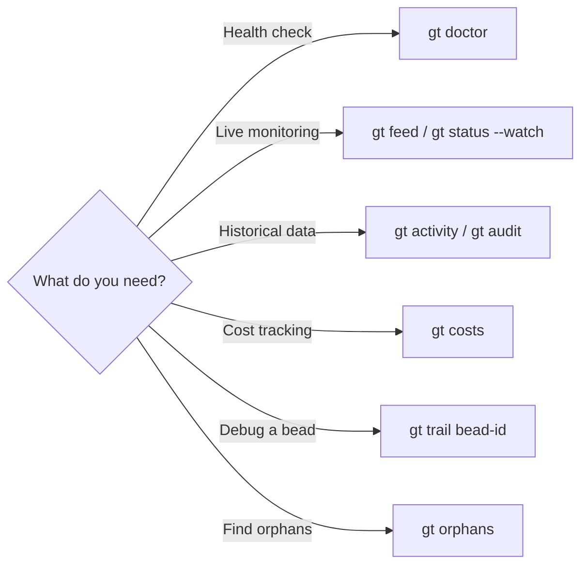

# Diagnostics

Commands for monitoring, auditing, and troubleshooting Gas Town. These tools provide visibility into system health, agent activity, resource usage, and operational state.



---

## Town Status

### `gt status`

Display overall town status.

```bash
gt status [options]
```

**Description:** Shows the current state of the Gas Town workspace including registered rigs, active polecats, and agent status.

**Options:**

| Flag | Description |
|------|-------------|
| `--fast` | Skip mail lookups for faster execution |
| `--json` | Output as JSON |
| `--verbose`, `-v` | Show detailed multi-line output per agent |
| `--watch`, `-w` | Watch mode: refresh status continuously |
| `--interval`, `-n` | Refresh interval in seconds (default: `2`) |

**Aliases:** `stat`

**Example:**

```bash
# Quick status
gt status

# Watch mode with custom interval
gt status --watch --interval 5

# Fast mode (skip mail lookups)
gt status --fast
```

---

### `gt whoami`

Show the identity used for mail commands.

```bash
gt whoami
```

**Description:** Displays the identity determined by the `GT_ROLE` environment variable. If set, you are an agent session. If not, you are the overseer (human). Use the `--identity` flag with mail commands to override.

**Example:**

```bash
gt whoami
```

---

## Activity & Monitoring

### `gt activity`

Show recent system activity.

```bash
gt activity [options]
```

**Description:** Displays a chronological log of significant events across the town, including agent starts/stops, work assignments, completions, escalations, and merges.

**Options:**

| Flag | Description |
|------|-------------|
| `--rig <name>` | Filter to a specific rig |
| `--agent <name>` | Filter to a specific agent |
| `--type <type>` | Filter by event type: `work`, `agent`, `merge`, `escalation`, `mail` |
| `--since <duration>` | Show events since (e.g., `1h`, `30m`, `1d`) |
| `--limit <n>` | Maximum events to show |
| `--json` | Output in JSON format |

**Example:**

```bash
# Recent activity
gt activity

# Last hour of work events
gt activity --type work --since 1h

# Activity for a specific rig
gt activity --rig myproject --limit 50
```

**Sample output:**

```text
TIME       TYPE        AGENT           EVENT
14:30      work        polecat/toast   Completed gt-abc12 (fix/login-bug)
14:28      merge       refinery        Merged mr-001 to main
14:25      agent       witness         Started patrol cycle
14:20      work        polecat/alpha   Started gt-def34 (feat/email-validation)
14:15      escalation  polecat/bravo   Escalated gt-ghi56 (P2: need design input)
```

---

### `gt audit`

Generate an audit report.

```bash
gt audit [options]
```

**Description:** Produces a comprehensive audit of system state, including agent uptime, work throughput, error rates, and resource usage. Useful for periodic reviews and compliance.

**Options:**

| Flag | Description |
|------|-------------|
| `--since <duration>` | Audit period (default: `24h`) |
| `--rig <name>` | Audit a specific rig |
| `--format <fmt>` | Output format: `text`, `json`, `csv` |
| `--output <file>` | Write report to a file |

**Example:**

```bash
# Daily audit
gt audit

# Weekly audit for a specific rig
gt audit --since 7d --rig myproject --format json

# Export to file
gt audit --output audit-report.json --format json
```

---

### `gt feed`

Watch the live activity feed.

```bash
gt feed [options]
```

**Description:** Displays a real-time stream of system events. Similar to `gt activity` but shows events as they happen. Press `Ctrl+C` to exit.

**Options:**

| Flag | Description |
|------|-------------|
| `--rig <name>` | Filter to a specific rig |
| `--type <type>` | Filter by event type |
| `--quiet` | Show only significant events |

**Example:**

```bash
# Watch all events
gt feed

# Watch a specific rig
gt feed --rig myproject

# Watch only work and merge events
gt feed --type work,merge
```

---

### `gt trail`

Show the execution trail for a specific bead or agent.

```bash
gt trail <target> [options]
```

**Description:** Traces the full lifecycle of a bead or agent, showing every state change, assignment, message, and action in chronological order.

**Options:**

| Flag | Description |
|------|-------------|
| `--json` | Output in JSON format |
| `--verbose` | Include full message content |

**Example:**

```bash
# Trail a bead
gt trail gt-abc12

# Trail an agent
gt trail polecat/toast
```

**Sample output (bead trail):**

```text
gt-abc12: Fix login redirect loop
  14:00  created     by mayor          priority=high type=bug
  14:05  assigned    to myproject      via gt sling
  14:05  hooked      on polecat/toast  branch=fix/login-bug
  14:10  started     by polecat/toast
  14:25  committed   4 files changed
  14:28  done        by polecat/toast  exit=COMPLETED
  14:28  submitted   mr-001            to merge queue
  14:30  merged      to main           by refinery
  14:30  closed      auto
```

---

### `gt log`

View system logs.

```bash
gt log [options]
```

**Description:** Accesses the raw event log (`.events.jsonl`) with filtering and formatting options. More detailed than `gt activity` -- includes internal system events.

**Options:**

| Flag | Description |
|------|-------------|
| `--level <level>` | Filter: `debug`, `info`, `warn`, `error` |
| `--since <duration>` | Time filter |
| `--limit <n>` | Maximum entries |
| `--follow`, `-f` | Follow the log in real time |
| `--json` | Raw JSON output |

**Example:**

```bash
# Recent errors
gt log --level error

# Follow log in real time
gt log -f

# Debug output for the last 30 minutes
gt log --level debug --since 30m
```

---

### `gt doctor`

Diagnose system health issues.

```bash
gt doctor [options]
```

**Description:** Runs a comprehensive health check of the Gas Town installation, verifying dependencies, configuration, agent state, database integrity, and common issues.

**Options:**

| Flag | Description |
|------|-------------|
| `--fix` | Attempt to fix detected issues |
| `--verbose` | Show detailed check results |
| `--json` | Output in JSON format |

**Example:**

```bash
# Run health check
gt doctor

# Run and attempt fixes
gt doctor --fix
```

**Sample output:**

```text
Gas Town Doctor
===============

[OK]  Go version: 1.23.4
[OK]  Git version: 2.43.0
[OK]  Beads (bd) version: 0.44.2
[OK]  SQLite3 available
[OK]  Tmux version: 3.4
[OK]  Claude Code available
[OK]  Workspace structure valid
[OK]  Beads database integrity
[WARN] Stale polecat worktree: myproject/polecats/toast (2d old)
[OK]  Daemon running (PID 1200)
[OK]  Mayor session active
[OK]  Deacon session active

11 checks passed, 1 warning, 0 errors
```

:::tip

Run `gt doctor` after installation, after upgrading Gas Town, or whenever something seems wrong. It catches most common configuration issues.

:::

---

### `gt dashboard`

Start the convoy tracking web dashboard.

```bash
gt dashboard [options]
```

**Description:** Starts a web server that displays a convoy tracking dashboard with real-time status indicators, progress tracking, and last activity indicators. Auto-refreshes every 30 seconds via htmx.

**Options:**

| Flag | Description |
|------|-------------|
| `--port <number>` | HTTP port to listen on (default: `8080`) |
| `--open` | Open browser automatically |

**Example:**

```bash
# Start on default port
gt dashboard

# Start on custom port
gt dashboard --port 3000

# Start and open browser
gt dashboard --open
```

---

### `gt costs`

Show resource usage and cost metrics.

```bash
gt costs [options]
```

**Description:** Displays token usage, API costs, agent session time, and other resource metrics. Helps track spending across agents and rigs.

**Options:**

| Flag | Description |
|------|-------------|
| `--since <duration>` | Time period (default: `24h`) |
| `--rig <name>` | Filter by rig |
| `--agent <name>` | Filter by agent |
| `--format <fmt>` | Output format: `text`, `json`, `csv` |
| `--group-by <field>` | Group by: `rig`, `agent`, `role`, `hour` |

**Example:**

```bash
# Daily costs
gt costs

# Weekly costs by rig
gt costs --since 7d --group-by rig

# Costs for a specific agent
gt costs --agent polecat/toast
```

**Sample output:**

```text
Gas Town Costs (last 24h)
=========================

Total tokens: 2,450,000 (input: 1,800,000 / output: 650,000)
Estimated cost: $12.35

By rig:
  myproject    $8.20    (66%)
  docs         $2.15    (17%)
  backend      $2.00    (16%)

By role:
  polecats     $9.50    (77%)
  refinery     $1.85    (15%)
  mayor        $0.60    (5%)
  other        $0.40    (3%)
```

---

### `gt cleanup`

Clean up temporary files and stale resources.

```bash
gt cleanup [options]
```

**Description:** Removes temporary files, stale worktrees, dead session artifacts, and other accumulated debris. A more action-oriented companion to `gt stale`.

**Options:**

| Flag | Description |
|------|-------------|
| `--rig <name>` | Clean up a specific rig |
| `--all` | Clean up across all rigs |
| `--dry-run` | Show what would be cleaned without doing it |
| `--force` | Skip confirmation |
| `--age <duration>` | Only clean items older than this (default: `24h`) |

**Example:**

```bash
# Preview cleanup
gt cleanup --dry-run

# Clean up everything
gt cleanup --all --force

# Clean up a specific rig
gt cleanup --rig myproject --age 12h
```

---

### `gt patrol digest`

Generate a patrol cycle digest.

```bash
gt patrol digest [options]
```

**Description:** Summarizes the results of recent patrol cycles run by persistent agents (Deacon, Witnesses, Refinery). Shows what was detected and what actions were taken.

**Options:**

| Flag | Description |
|------|-------------|
| `--since <duration>` | Time period (default: `1h`) |
| `--agent <name>` | Filter to a specific agent's patrols |
| `--json` | Output in JSON format |

**Example:**

```bash
gt patrol digest
gt patrol digest --since 6h --agent witness
```

---

## Orphan Management

### `gt orphans`

Find orphaned resources.

```bash
gt orphans [options]
```

**Description:** Identifies orphaned resources across the town -- processes without parent agents, worktrees without polecats, branches without beads, and other disconnected artifacts.

**Options:**

| Flag | Description |
|------|-------------|
| `--json` | Output in JSON format |
| `--verbose` | Show detailed information about each orphan |

**Example:**

```bash
gt orphans
```

**Sample output:**

```text
Orphaned Resources
==================

Processes (2):
  PID 4521  claude session (no parent agent)
  PID 4789  claude session (no parent agent)

Worktrees (1):
  myproject/polecats/ghost/  (no active polecat)

Branches (3):
  fix/old-bug         (no associated bead)
  feat/abandoned       (no associated bead)
  tmp/experiment       (no associated bead)
```

---

### `gt orphans procs`

List orphaned processes specifically.

```bash
gt orphans procs [options]
```

**Options:**

| Flag | Description |
|------|-------------|
| `--json` | Output in JSON format |

**Example:**

```bash
gt orphans procs
```

---

### `gt orphans kill`

Terminate orphaned processes.

```bash
gt orphans kill [options]
```

**Description:** Kills orphaned processes that have no parent agent managing them. These are typically leftover sessions from crashed agents.

**Options:**

| Flag | Description |
|------|-------------|
| `--force` | Kill without confirmation |
| `--dry-run` | Show what would be killed |

**Example:**

```bash
gt orphans kill --dry-run
gt orphans kill --force
```

:::warning

Verify orphans are truly orphaned before killing. Use `gt orphans procs` first to review, then `gt orphans kill --dry-run` to preview the action.

:::

---

## Peek & Sessions

:::tip

For session handoffs, molecules, and formulas, see the [Session & Handoff](sessions.md) page.

:::

### `gt peek`

Peek at an agent's current state without interrupting it.

```bash
gt peek <agent> [options]
```

**Description:** Non-invasively inspects what an agent is currently doing, including its hook state, recent activity, and resource usage. Does not send any messages to the agent.

**Options:**

| Flag | Description |
|------|-------------|
| `--json` | Output in JSON format |

**Example:**

```bash
gt peek polecat/toast
gt peek witness --rig myproject
gt peek mayor
```

**Sample output:**

```text
Peek: polecat/toast (myproject)
  Status: running
  Hook: gt-abc12 "Fix login redirect loop"
  Last activity: 2m ago (editing src/auth/callback.ts)
  Session: sess-xyz789
  Commits: 3 (uncommitted changes: 2 files)
  Branch: fix/login-bug
```

---

### `gt session`

Manage tmux sessions for polecats.

```bash
gt session <subcommand> [options]
```

**Aliases:** `sess`

**Subcommands:**

| Subcommand | Description |
|------------|-------------|
| `gt session list` | List all sessions |
| `gt session status <name>` | Show session status details |
| `gt session start <name>` | Start a polecat session |
| `gt session stop <name>` | Stop a polecat session |
| `gt session restart <name>` | Restart a polecat session |
| `gt session at <name>` | Attach to a running session |
| `gt session capture <name>` | Capture recent session output |
| `gt session check <name>` | Check session health |
| `gt session inject <name>` | Send message to session (prefer `gt nudge`) |

**Example:**

```bash
# List all sessions
gt session list

# Check session health
gt session check toast

# Capture recent output
gt session capture toast

# Restart a session
gt session restart toast
```

:::tip

To send messages to a running session, use `gt nudge` instead of `gt session inject`. The nudge command uses reliable delivery that works correctly with Claude Code.

:::

---

## Data Lifecycle

### `gt krc`

Key Record Chronicle — manages TTL-based lifecycle for Level 0 ephemeral data.

```bash
gt krc [command]
```

**Description:** Manages patrol heartbeats, status checks, and other operational data ([wisps](../concepts/wisps.md)) that decays in forensic value over days. Provides configurable TTLs, auto-pruning, and statistics. See also [`gt compact`](compact.md) for wisp compaction.

**Subcommands:**

| Subcommand | Description |
|------------|-------------|
| `gt krc stats` | Show event statistics |
| `gt krc prune` | Remove expired events |
| `gt krc config` | View or modify TTL configuration |
| `gt krc decay` | Show forensic value decay report |
| `gt krc auto-prune-status` | Show auto-prune scheduling state |

**Examples:**

```bash
gt krc stats                          # Show event statistics
gt krc prune                          # Remove expired events
gt krc prune --dry-run                # Preview what would be pruned
gt krc config                         # Show TTL configuration
gt krc config set patrol_* 12h        # Set TTL for patrol events
```

---

### `gt prune-branches`

Remove local branches that were created when tracking remote polecat branches.

```bash
gt prune-branches [flags]
```

**Description:** When polecats push branches to origin, other clones create local tracking branches. After the remote branch is deleted (post-merge), `git fetch --prune` removes the remote tracking ref but the local branch persists. This command finds and removes those stale local branches.

**Safety:** Uses `git branch -d` (not `-D`) so only fully-merged branches are deleted. Never deletes the current branch or the default branch.

**Options:**

| Flag | Description |
|------|-------------|
| `--dry-run` | Show what would be deleted without deleting |
| `--pattern <glob>` | Branch name pattern to match (default: `polecat/*`) |

**Examples:**

```bash
gt prune-branches                     # Clean up stale polecat branches
gt prune-branches --dry-run           # Show what would be deleted
gt prune-branches --pattern "feature/*"  # Custom pattern
```

---

## Miscellaneous

### `gt thanks`

Display acknowledgments to contributors.

```bash
gt thanks
```

**Description:** Shows the humans who have contributed to the Gas Town project.

## Related

- [Troubleshooting](../operations/troubleshooting.md) -- Common issues and solutions
- [Monitoring](../operations/monitoring.md) -- Health monitoring and observability
- [gt compact](./compact.md) -- TTL-based compaction for ephemeral wisps

### Blog Posts

- [Monitoring Your Gas Town Fleet](/blog/monitoring-fleet) -- Practical guide to monitoring agent health and catching problems early
- [Incident Response with Gas Town: When Things Go Wrong](/blog/incident-response) -- Diagnosing and recovering from common failures
