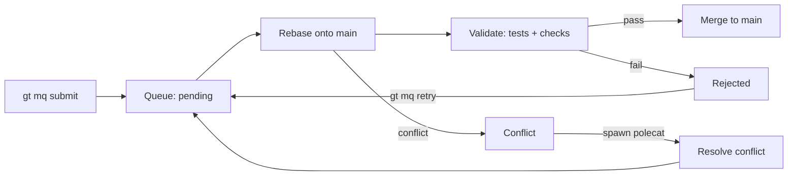
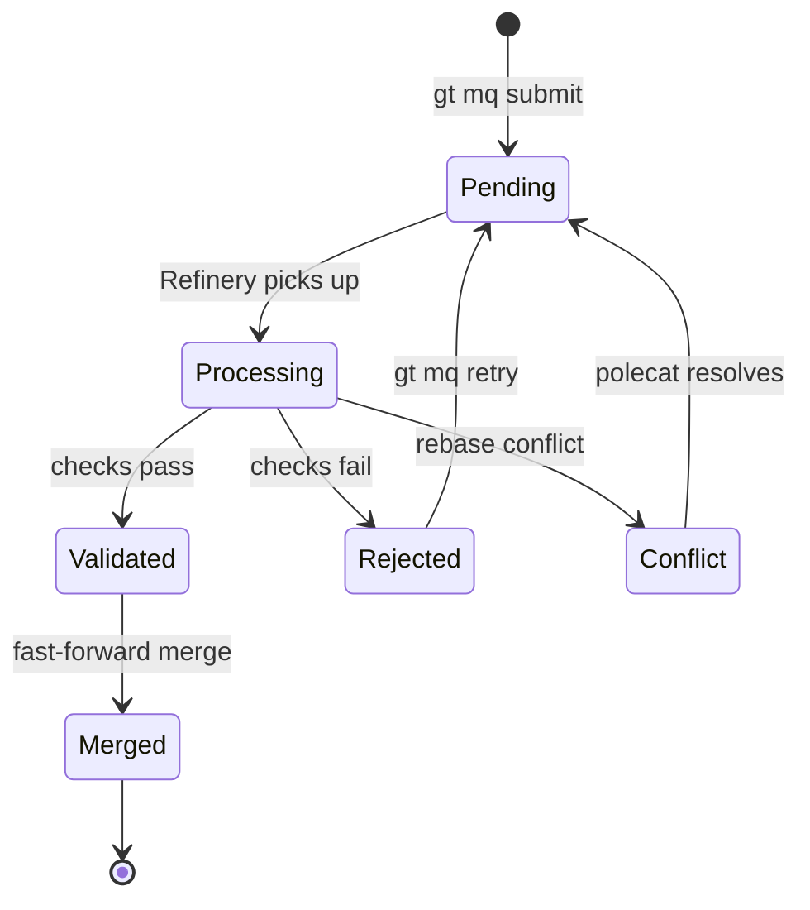
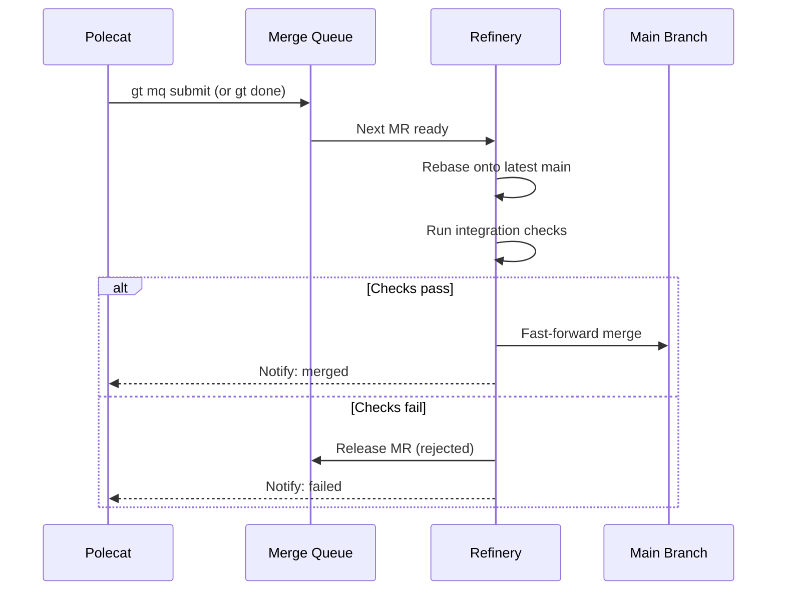
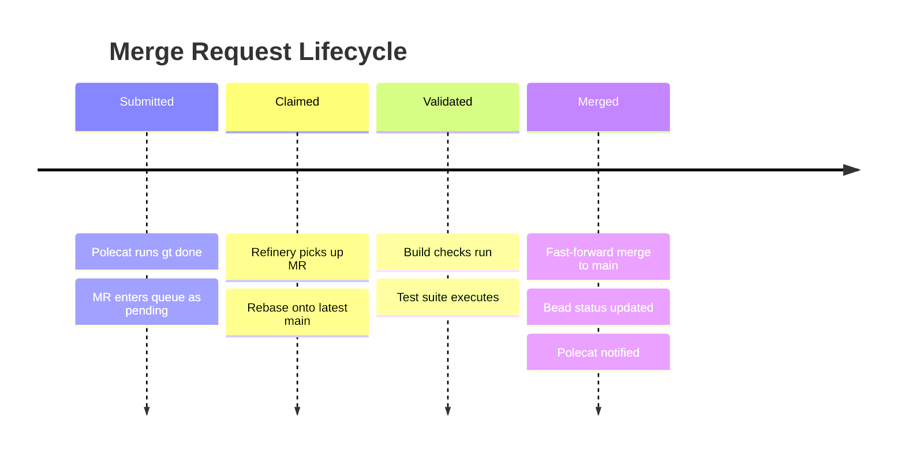
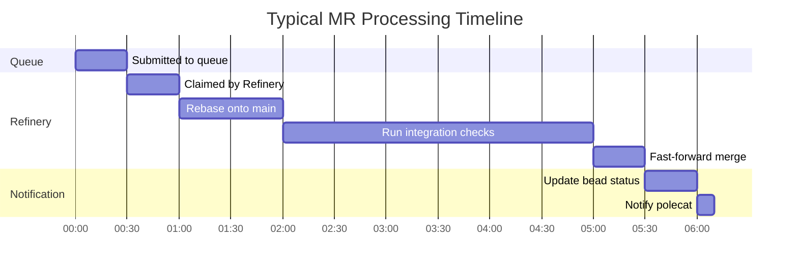

# Merge Queue

Commands for managing the Refinery's merge queue. The Refinery processes merge requests (MRs) submitted by polecats, rebasing them onto the latest main branch, running validation, and merging clean code.



---

## `gt mq list`

List items in the merge queue.

```bash
gt mq list [options]
```

**Description:** Shows all merge requests currently in the queue, including their position, status, and associated bead.

**Options:**

| Flag | Description |
|------|-------------|
| `--rig <name>` | Filter to a specific rig |
| `--status <status>` | Filter: `pending`, `processing`, `validated`, `merged`, `rejected`, `conflict` |
| `--all` | Show across all rigs |
| `--json` | Output in JSON format |

**Example:**

```bash
# List queue for current rig
gt mq list

# List across all rigs
gt mq list --all

# Show only pending items
gt mq list --status pending
```

**Sample output:**

```text
POS  ID       BEAD       BRANCH                  STATUS       RIG          AGE
1    mr-001   gt-abc12   fix/login-bug           processing   myproject    5m
2    mr-002   gt-def34   feat/email-validation   pending      myproject    2m
3    mr-003   gt-ghi56   docs/update-readme      pending      docs         1m
```

---

## `gt mq next`

Show or process the next item in the merge queue.

```bash
gt mq next [options]
```

**Description:** Without options, shows what the Refinery will process next. The Refinery typically calls this automatically during its patrol cycle.

**Options:**

| Flag | Description |
|------|-------------|
| `--rig <name>` | Target a specific rig |
| `--process` | Immediately process the next item |
| `--json` | Output in JSON format |

**Example:**

```bash
# Show next item
gt mq next

# Process next item now
gt mq next --process
```

---

## `gt mq submit`

Submit a merge request to the queue.

```bash
gt mq submit [options]
```

**Description:** Adds the current branch to the merge queue for processing by the Refinery. This is typically called by `gt done` automatically, but can be used manually for crew workspaces or special cases.

**Options:**

| Flag | Description |
|------|-------------|
| `--branch <name>` | Branch to submit (default: current branch) |
| `--bead <id>` | Associated bead |
| `--message <text>` | MR description |
| `--priority` | Mark as priority merge (processed before others) |
| `--rig <name>` | Target rig |
| `--no-validate` | Skip pre-submission validation |

**Example:**

```bash
# Submit current branch
gt mq submit --bead gt-abc12 --message "Fixed OAuth callback URL handling"

# Submit a specific branch with priority
gt mq submit --branch fix/critical-bug --bead gt-xyz99 --priority

# Submit from a crew workspace
gt mq submit --branch feat/new-feature --rig myproject --message "Add user profile page"
```

:::warning
Priority merges jump ahead of other items in the queue. If you have dependent beads queued in a specific order (e.g., bead B depends on bead A), submitting bead B with `--priority` can cause it to merge before bead A, leading to broken builds or missing dependencies. Only use `--priority` for truly independent hotfixes.
:::

:::tip

The standard polecat workflow uses `gt done` which handles `gt mq submit` automatically. Use `gt mq submit` directly for crew (human developer) workflows or manual submissions.

:::

---

## `gt mq status`

Show overall merge queue status.

```bash
gt mq status [options]
```

**Description:** Displays a summary of the merge queue including queue depth, processing rate, and any current issues.

**Options:**

| Flag | Description |
|------|-------------|
| `--rig <name>` | Status for a specific rig |
| `--all` | Status across all rigs |
| `--json` | Output in JSON format |

**Example:**

```bash
gt mq status
gt mq status --all
```

**Sample output:**

```text
Merge Queue Status: myproject
  Queue depth: 3
  Currently processing: mr-001 (fix/login-bug)
  Merged today: 7
  Rejected today: 1
  Avg merge time: 3m 20s
  Refinery: running (PID 1250)
```

---

:::info

The merge queue processes items sequentially to maintain a clean linear history on main. If the queue depth grows beyond 5-10 items, consider whether your rig's `max_polecats` setting is too high relative to the Refinery's processing speed, as a backlog indicates polecats are producing work faster than the Refinery can merge it.

:::

:::tip

If you notice the merge queue depth climbing beyond 10 items, consider pausing new work assignments with `gt rig park` temporarily on lower-priority rigs. This allows the Refinery to drain the queue before new work arrives, preventing a backlog that slows down overall throughput. For strategies on managing heavy queue loads at scale, see [Scaling Beyond 30 Agents](/blog/scaling-beyond-30).

:::

## `gt mq reject`



Reject a merge request.

```bash
gt mq reject <mr-id> [options]
```

**Description:** Removes a merge request from the queue and marks it as rejected. The associated bead is updated and the submitting agent is notified.

**Options:**

| Flag | Description |
|------|-------------|
| `--reason <text>` | Rejection reason |
| `--reassign` | Release the bead for reassignment |

**Example:**

```bash
gt mq reject mr-002 --reason "Fails integration tests, needs rework"
gt mq reject mr-003 --reason "Superseded by mr-005" --reassign
```

:::caution

Rejecting a merge request does not automatically clean up its associated branch or worktree. If the polecat has already been nuked, the branch remains until the next `gt polecat gc` cycle. Run `gt polecat gc <rig>` periodically to prune stale branches left by rejected MRs.

:::

---

## `gt mq retry`

Retry a failed or rejected merge request.

```bash
gt mq retry <mr-id> [options]
```

**Description:** Re-queues a previously failed or rejected merge request for another processing attempt. Useful after the underlying issue has been resolved (e.g., flaky test fixed, conflict resolved).

**Options:**

| Flag | Description |
|------|-------------|
| `--priority` | Retry with priority processing |
| `--rebase` | Force a fresh rebase before retrying |

**Example:**

```bash
gt mq retry mr-002
gt mq retry mr-002 --rebase --priority
```

---

## `gt mq integration`

Manage integration validation for the merge queue.

```bash
gt mq integration [options]
```

**Description:** Controls what validation the Refinery runs before merging. This includes test suites, build checks, linting, and custom validation scripts.

**Options:**

| Flag | Description |
|------|-------------|
| `--show` | Show current integration configuration |
| `--add <check>` | Add a validation check |
| `--remove <check>` | Remove a validation check |
| `--enable <check>` | Enable a disabled check |
| `--disable <check>` | Disable a check without removing it |
| `--rig <name>` | Configure for a specific rig |

**Example:**

```bash
# Show current checks
gt mq integration --show

# Add a test check
gt mq integration --add "npm test" --rig myproject

# Disable linting temporarily
gt mq integration --disable lint --rig myproject
```

**Sample configuration output:**

```text
Integration Checks: myproject
  [enabled]   build     npm run build
  [enabled]   test      npm test
  [disabled]  lint      npm run lint
  [enabled]   typecheck npx tsc --noEmit
```



:::danger

Never manually delete MR beads from the merge queue database while the Refinery is actively processing them. If you need to remove a stale MR, use `gt mq reject <mr-id>` to safely update both the queue state and the associated bead status, preventing the Refinery from attempting to process a half-deleted request.

:::

The following timeline shows the typical lifecycle of a merge request as it moves through the queue.



:::note[Merge Process]

The Refinery processes each MR through these steps:

1. **Rebase** -- Rebase the branch onto latest main
2. **Validate** -- Run all enabled integration checks
3. **Merge** -- Fast-forward merge to main if all checks pass
4. **Notify** -- Update bead status and notify the submitting agent

If a merge conflict occurs during rebase, the Refinery can spawn a fresh polecat to resolve the conflict before retrying.


:::


## Related

- [Refinery](../agents/refinery.md) -- The agent that processes the merge queue
- [Git Workflow](../guides/git-workflow.md) -- How merges fit into Gas Town's git model
- [Code Review](../workflows/code-review.md) -- Review workflow before merge

### Blog Posts

- [The Refinery: How Merges Actually Work in Gas Town](/blog/refinery-deep-dive) -- Deep dive into how the Refinery serializes parallel agent work into a clean linear history on main
- [Git Workflows for Multi-Agent Development](/blog/git-workflows-multi-agent) -- How the merge queue fits into Gas Town's overall git workflow strategy
- [Code Review Workflow](/blog/code-review-workflow) -- How code review integrates with the merge queue before changes land on main
- [Work Distribution Patterns in Gas Town](/blog/work-distribution-patterns) -- How work flows through the system from assignment to merge, including queue management strategies
