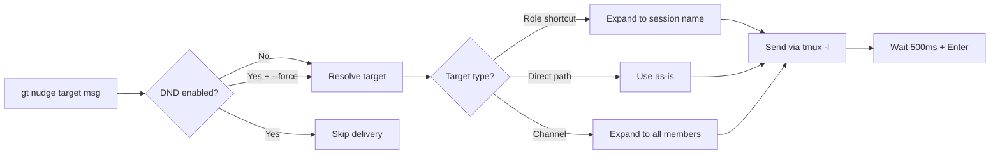
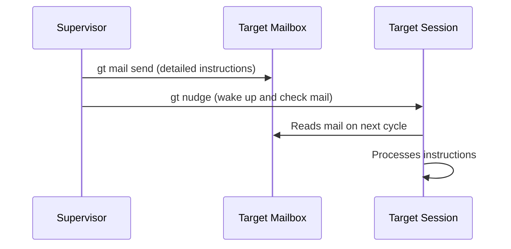
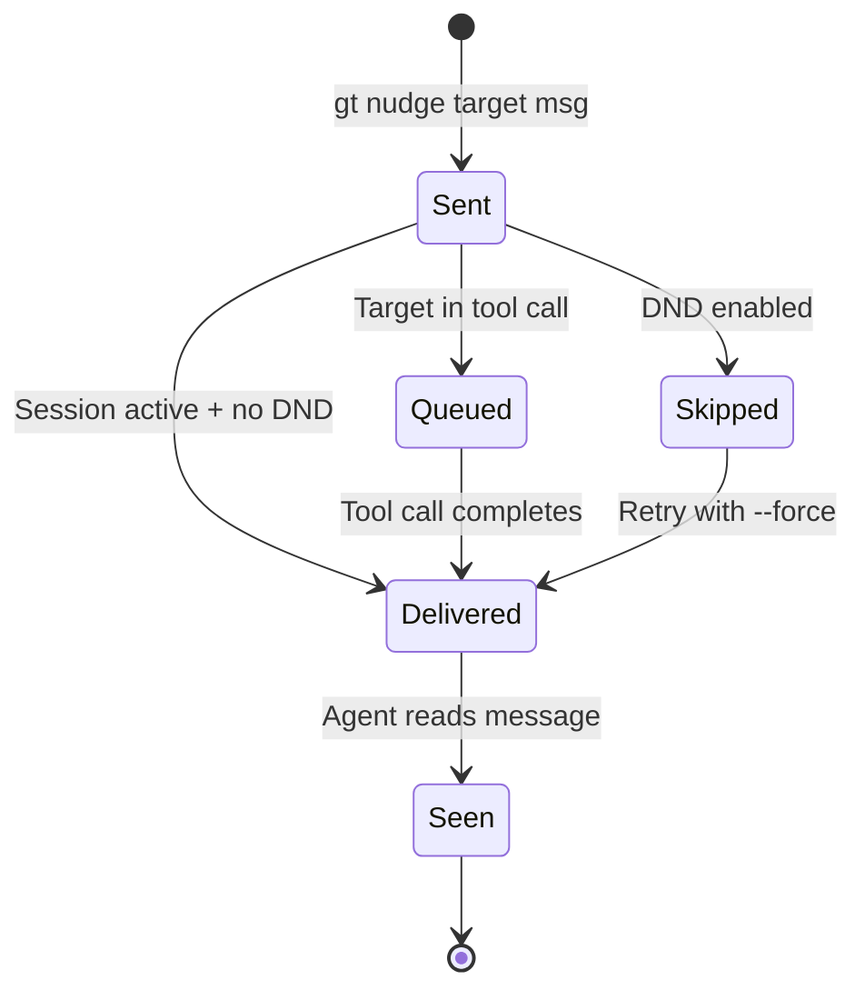

# gt nudge

Send a synchronous message to any Gas Town worker's Claude Code session.

```bash
gt nudge <target> [message] [flags]
```

## Description



`gt nudge` delivers a message directly to a running Claude Code session: polecats, crew, witness, refinery, mayor, or deacon. Unlike `gt mail` (async mailbox), nudges interrupt the target immediately for real-time coordination.

Uses a reliable delivery pattern:

1. Sends text in literal mode (`-l` flag)
2. Waits 500ms for paste to complete
3. Sends Enter as a separate command

This is the **only** recommended way to send messages to Claude sessions. Do not use raw `tmux send-keys` elsewhere.

## Flags

| Flag | Short | Description |
|------|-------|-------------|
| `--force` | `-f` | Send even if target has DND enabled |
| `--message <text>` | `-m` | Message to send (alternative to positional argument) |

## Target Resolution

### Role Shortcuts

Role shortcuts expand to the appropriate session name:

| Shortcut | Expands to |
|----------|-----------|
| `mayor` | `gt-mayor` |
| `deacon` | `gt-deacon` |
| `witness` | `gt-<rig>-witness` (uses current rig) |
| `refinery` | `gt-<rig>-refinery` (uses current rig) |

### Direct Targets

Specify polecats and other agents by their full path:

```bash
gt nudge myproject/toast "Check your mail"
gt nudge myproject/alpha "What's your status?"
```

### Channel Syntax

Nudge all members of a named channel defined in `~/gt/config/messaging.json`:

```bash
gt nudge channel:workers "New priority work available"
```

Patterns like `myproject/polecats/*` in the channel definition are expanded to all matching agents.

## DND (Do Not Disturb)

If the target has DND enabled (`gt dnd on`), the nudge is skipped. Use `--force` to override DND and send anyway.

```bash
gt nudge myproject/toast "Urgent: check your mail" --force
```

:::warning
Do not use raw `tmux send-keys` as a substitute for `gt nudge`. The nudge command handles literal mode (`-l`), paste timing (500ms delay), and sends Enter separately to ensure reliable delivery. Raw `tmux send-keys` can mangle multi-line messages, trigger premature execution, or silently fail on special characters.
:::

## Examples

```bash
# Nudge a polecat
gt nudge myproject/furiosa "Check your mail and start working"

# Nudge with -m flag
gt nudge myproject/alpha -m "What's your status?"

# Nudge the mayor
gt nudge mayor "Status update requested"

# Nudge the current rig's witness
gt nudge witness "Check polecat health"

# Nudge the deacon
gt nudge deacon session-started

# Nudge a channel
gt nudge channel:workers "New priority work available"

# Force nudge past DND
gt nudge myproject/toast "Urgent fix needed" --force
```

## Nudge vs Mail

| Characteristic | `gt nudge` | `gt mail send` |
|----------------|-----------|----------------|
| **Delivery** | Synchronous (immediate) | Async (queued) |
| **Interrupts target** | Yes | No |
| **Persists** | No (ephemeral) | Yes (in mailbox) |
| **DND respected** | Yes (unless `--force`) | Always delivered |
| **Best for** | Wake-ups, status checks | Task assignments, handoff context |

### When to Use Each

Use **nudge** when:
- You need an immediate response ("What's your status?")
- Waking a sleeping agent ("Check your mail")
- Time-sensitive coordination ("Merge queue conflict, pause work")

Use **mail** when:
- Assigning work that can wait for the agent's next check
- Sending handoff context between sessions
- Communicating across time zones or offline periods

### Combining Both



The most common pattern is sending mail first, then nudging:

```bash
# Send detailed instructions via mail
gt mail send myproject/polecats/alpha -s "Priority fix" -m "Fix the auth bug in login.go"

# Then wake the agent to check their mail
gt nudge myproject/alpha "Check your mail - priority fix waiting"
```

:::tip

For non-urgent communication, use `gt mail send` instead. Nudges interrupt the target's current activity and should be reserved for time-sensitive coordination.

:::

:::caution

Nudging an agent while it is in the middle of a long-running tool call (such as a large file write or test suite execution) will queue the message until the tool call completes. The agent will not see the nudge immediately in this case, so do not assume instant delivery if the target is actively executing tools.

:::

## Troubleshooting



### Nudge Not Delivered

If a nudge appears to have no effect:

1. **Check the target session exists**: `gt session list | grep <target>`
2. **Check DND status**: The target may have DND enabled. Use `--force` to override.
3. **Check session name**: Role shortcuts depend on the current rig. Use `--rig` if needed.
4. **Check tmux**: Ensure tmux is running and the session is active.

### Target Not Responding

A delivered nudge may not get a response if:

- The agent is in the middle of a long tool call (it will see the nudge when the call completes)
- The agent's context is compacted and it lost the nudge context
- The session has crashed but tmux still shows it as alive

```bash
# Check if the session is actually alive
gt session list --rig myproject

# Check recent output from the target
gt session capture <target> --tail 20
```

:::note

`gt nudge` is the preferred way to send messages to running sessions. The lower-level `gt session inject` exists but lacks the reliable delivery guarantees that `gt nudge` provides.

:::

## Related

- [Communication](./communication.md) -- Full communication command reference (mail, escalations, broadcasts)
- [Agent Hierarchy](../architecture/agent-hierarchy.md) -- The escalation path that nudge supports

### Blog Posts

- [Gas Town's Mail System: Async Agent Communication](/blog/mail-system) -- How Gas Town agents communicate through async mail, from simple notifications to handoff context that spans session boundaries
- [The Witness Explained](/blog/witness-explained) -- How the Witness uses nudges to wake stalled polecats during patrol cycles
- [Agent Communication Patterns](/blog/agent-communication-patterns) -- Patterns for combining nudges, mail, and escalations for effective inter-agent coordination
- [Session Cycling: How Gas Town Agents Handle Context Limits](/blog/session-cycling) -- How session cycling interacts with nudge delivery when agents restart mid-conversation
