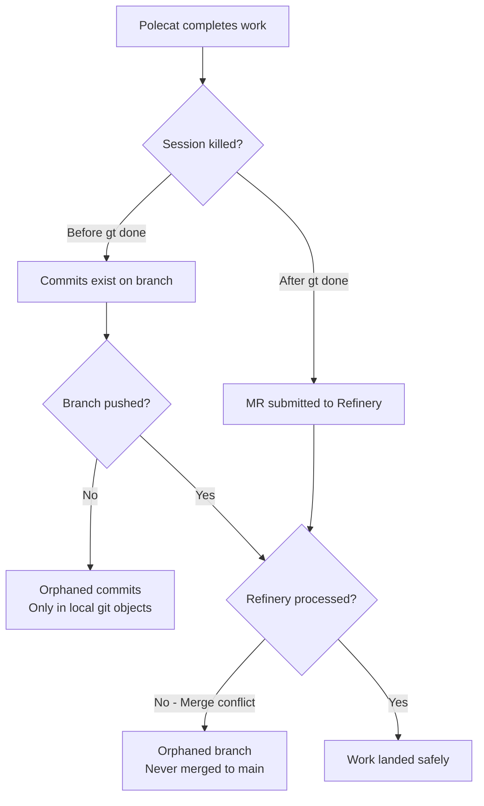
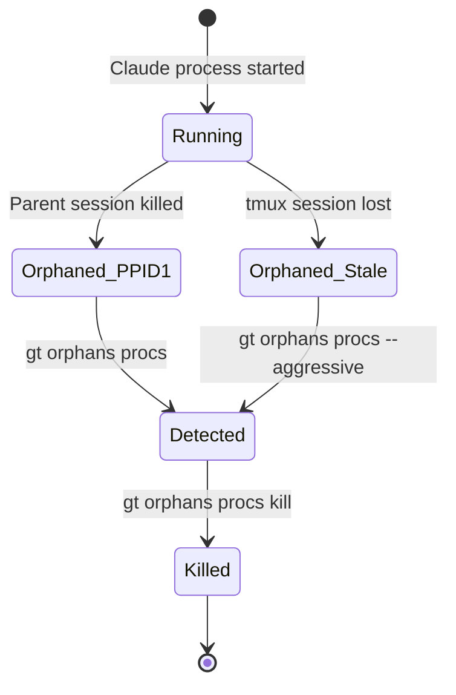
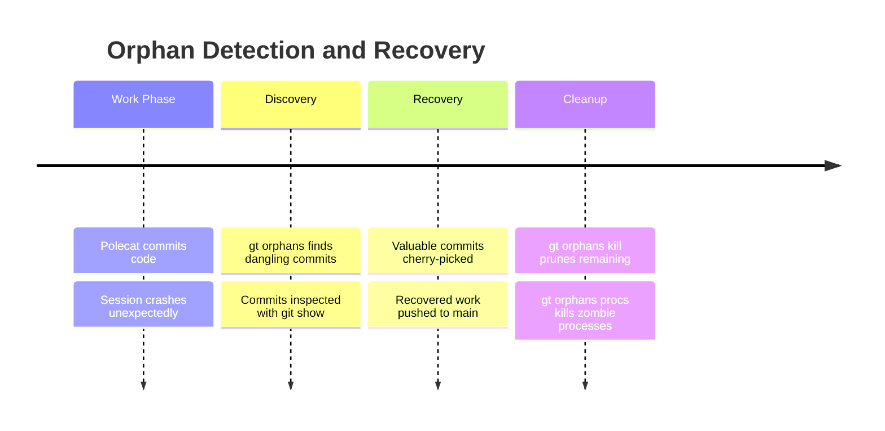
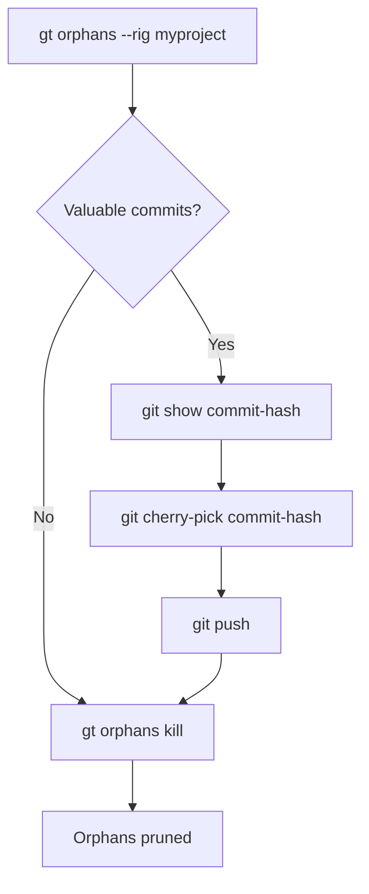
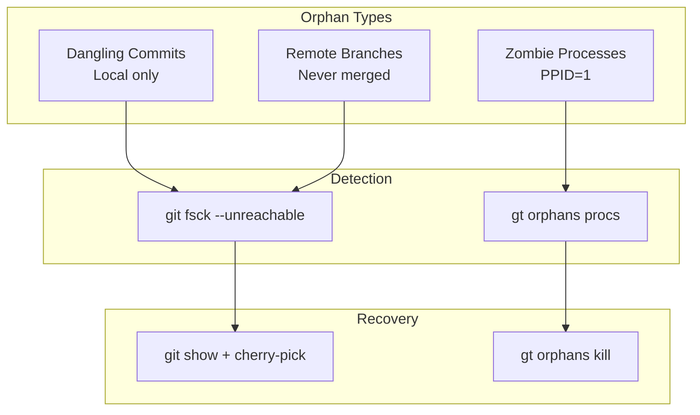

# gt orphans

Find orphaned commits that were never merged to main.

```bash
gt orphans [flags]
gt orphans [command]
```

## Description

Polecat work can get lost when:

- Session killed before merge
- Refinery fails to process
- Network issues during push

This command uses `git fsck --unreachable` to find dangling commits, filters to recent ones, and shows details to help recovery.

### How Orphans Occur



Common scenarios that create orphans:

| Scenario | What's orphaned | Recovery |
|----------|-----------------|----------|
| Session killed mid-work | Uncommitted changes | Lost (not in git) |
| Session killed after commit, before push | Local commits | `gt orphans` finds them |
| Push succeeded, Refinery failed | Remote branch | `gt orphans` + manual merge |
| Process crashed, tmux still running | Claude process consuming resources | `gt orphans procs kill` |

:::note
Orphan recovery only works for committed but unpushed work. If a session is killed before the polecat commits its changes, those uncommitted modifications are lost entirely and cannot be recovered by `gt orphans` or any other tool. This is why Gas Town encourages frequent commits during work.
:::

## Subcommands

| Command | Description |
|---------|-------------|
| [`kill`](#gt-orphans-kill) | Remove all orphans (commits and processes) |
| [`procs`](#gt-orphans-procs) | Manage orphaned Claude processes |

## Flags

| Flag | Description |
|------|-------------|
| `--days <n>` | Show orphans from last N days (default: 7) |
| `--all` | Show all orphans (no date filter) |
| `--rig <name>` | Target rig name (required when not in a rig directory) |

## Examples

```bash
gt orphans                    # Last 7 days, infers rig from cwd
gt orphans --rig=gastown      # Target a specific rig
gt orphans --days=14          # Last 2 weeks
gt orphans --all              # Show all orphans (no date filter)
```

---

## gt orphans kill

Remove orphaned commits and kill orphaned Claude processes.

```bash
gt orphans kill [flags]
```

Performs a complete orphan cleanup:

1. Finds orphaned commits (same as `gt orphans`)
2. Finds orphaned Claude processes (same as `gt orphans procs`)
3. Shows what will be removed/killed
4. Asks for confirmation (unless `--force`)
5. Runs `git gc` and kills processes

:::warning

This operation is irreversible. Once commits are pruned, they cannot be recovered. Use `--dry-run` first to preview.

:::

**Flags:**

| Flag | Description |
|------|-------------|
| `--days <n>` | Kill orphans from last N days (default: 7) |
| `--all` | Kill all orphans (no date filter) |
| `--dry-run` | Preview without deleting |
| `--force` | Skip confirmation prompt |

**Examples:**

```bash
gt orphans kill               # Kill orphans from last 7 days
gt orphans kill --days=14     # Kill orphans from last 2 weeks
gt orphans kill --dry-run     # Preview without deleting
gt orphans kill --force       # Skip confirmation prompt
```

---

## gt orphans procs



Find and kill Claude processes that have become orphaned (PPID=1).

```bash
gt orphans procs [flags]
gt orphans procs [command]
```

Orphaned processes are those that survived session termination and are now parented to init/launchd. They consume resources and should be killed.

**Subcommands:**

| Command | Description |
|---------|-------------|
| `list` | List orphaned Claude processes |
| `kill` | Kill orphaned Claude processes |

**Flags:**

| Flag | Description |
|------|-------------|
| `--aggressive` | Use tmux session verification to find ALL orphans, not just PPID=1 |

Use `--aggressive` to detect all orphaned Claude processes by cross-referencing against active tmux sessions. Any Claude process NOT in a `gt-*` or `hq-*` session is considered an orphan.

**Examples:**

```bash
gt orphans procs              # List orphaned processes (PPID=1 only)
gt orphans procs --aggressive # List ALL orphaned processes
gt orphans procs kill         # Kill orphaned processes
```

:::info

The `--aggressive` flag on `gt orphans procs` cross-references all running Claude processes against active tmux sessions. This catches orphaned processes that were reparented to a non-init PID, which the default PPID=1 check would miss. Use it when you suspect resource consumption from processes not visible in the standard output.

:::

:::caution

Running `gt orphans procs kill` without `--aggressive` may leave behind processes that were reparented to a non-init PID. If you notice elevated resource consumption after cleanup, re-run with `--aggressive` to catch processes missed by the default PPID=1 check.

:::

The following timeline shows the typical sequence of events leading to orphan creation and recovery.



## Recovery Workflow



When `gt orphans` finds valuable commits, recover them before they're garbage collected:

```bash
# Step 1: Find orphaned commits
gt orphans --rig myproject

# Step 2: Inspect a specific orphan
git show <commit-hash>

# Step 3: Cherry-pick the valuable commit to main
git cherry-pick <commit-hash>

# Step 4: Push the recovered work
git push

# Step 5: Clean up remaining orphans
gt orphans kill --rig myproject
```

:::tip

Run `gt orphans` as part of your weekly maintenance routine. Orphaned commits are only recoverable until `git gc` prunes them (typically 2 weeks for unreachable objects). For comprehensive lifecycle management strategies, see [Lifecycle Management](/blog/lifecycle-management).

:::

:::danger

Never use `git gc --aggressive --prune=now` manually on a rig's repository without first running `gt orphans` to check for valuable unreachable commits. Aggressive pruning can permanently delete orphaned work that could have been recovered, especially work from recent session crashes.

:::



## Related

- [gt polecat](./polecat-commands.md) -- Polecat lifecycle management (nuke, stale, gc)
- [Witness](../agents/witness.md) -- Agent that detects stuck polecats and triggers recovery
- [Lifecycle Management](../operations/lifecycle.md) -- Agent lifecycle and cleanup operations
- [Git Workflow](../guides/git-workflow.md) -- How branches and merges work in Gas Town

### Blog Posts

- [Monitoring Your Gas Town Fleet](/blog/monitoring-fleet) -- Practical guide to monitoring agent health, tracking work progress, and catching problems early
- [The Deacon: Gas Town's Background Coordinator](/blog/deacon-patrol) -- How the Deacon detects and recovers orphaned work during patrol cycles
- [Death Warrants](/blog/death-warrants) -- How Gas Town identifies and terminates zombie processes and orphaned sessions
- [Git Workflows for Multi-Agent Development](/blog/git-workflows-multi-agent) -- How orphaned branches and commits arise in multi-agent git workflows and strategies for prevention
