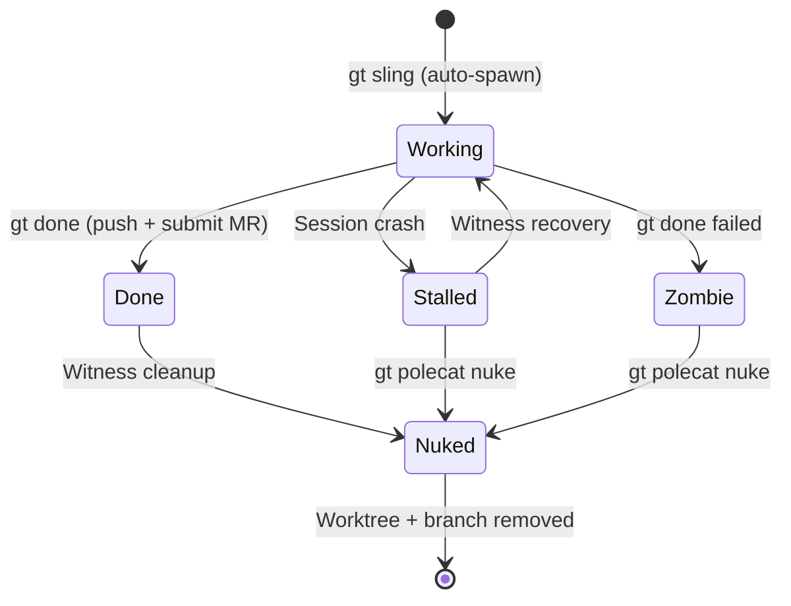
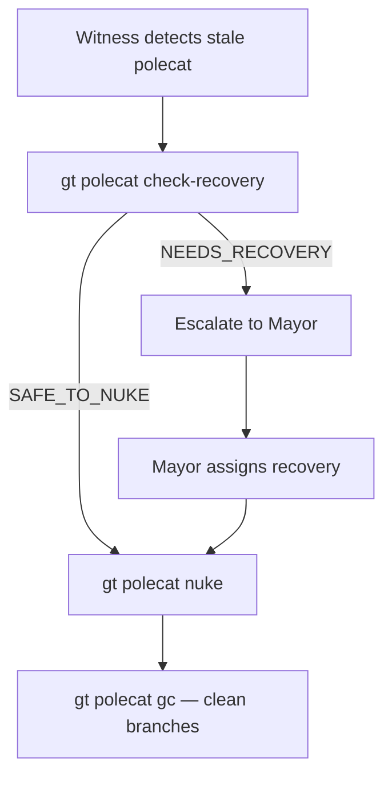
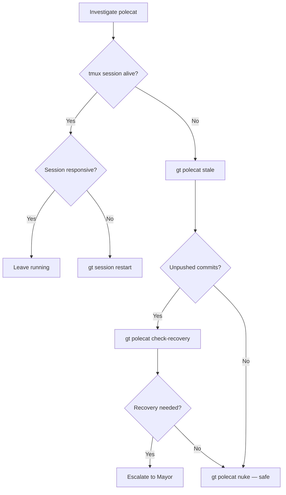
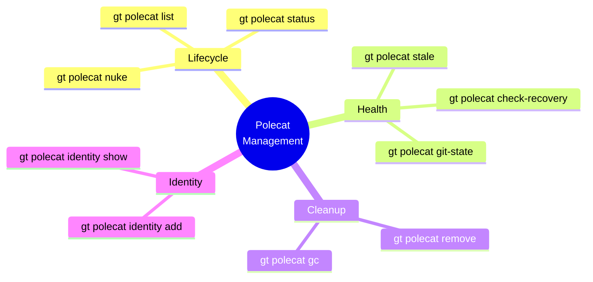
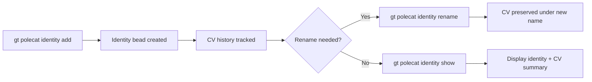
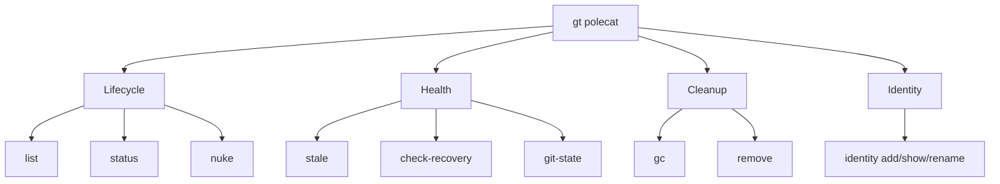

# gt polecat

Manage polecat lifecycle in rigs.

```bash
gt polecat [command] [flags]
```

**Alias:** `gt polecats`

## Description



Polecats are **ephemeral workers**: spawned for one task, nuked when done. There is no idle state. A polecat is either:

- **Working** -- actively doing assigned work
- **Stalled** -- session crashed mid-work (needs Witness intervention)
- **Zombie** -- finished but `gt done` failed (needs cleanup)

**Self-cleaning model:** When work completes, the polecat runs `gt done`, which pushes the branch, submits to the merge queue, and exits. The Witness then nukes the sandbox. Polecats don't wait for more work.

:::tip
Use `--dry-run` with `nuke` and `stale` commands to preview what will be affected before taking action. For example, `gt polecat nuke myproject --all --dry-run` shows which polecats would be destroyed, and `gt polecat stale myproject --cleanup --dry-run` shows which stale polecats would be cleaned up. For best practices on managing polecat cleanup, see [Witness Explained](/blog/witness-explained).
:::

**Session vs sandbox:** The Claude session cycles frequently (handoffs, compaction). The git worktree (sandbox) persists until nuke. Work survives session restarts.

## Subcommands

| Command | Description |
|---------|-------------|
| [`list`](#gt-polecat-list) | List polecats in a rig |
| [`status`](#gt-polecat-status) | Show detailed polecat status |
| [`nuke`](#gt-polecat-nuke) | Completely destroy a polecat |
| [`remove`](#gt-polecat-remove) | Remove polecats from a rig |
| [`stale`](#gt-polecat-stale) | Detect stale polecats |
| [`gc`](#gt-polecat-gc) | Garbage collect stale branches |
| [`check-recovery`](#gt-polecat-check-recovery) | Check if polecat needs recovery vs safe to nuke |
| [`git-state`](#gt-polecat-git-state) | Show git state for pre-kill verification |
| [`identity`](#gt-polecat-identity) | Manage polecat identities |
| [`sync`](#gt-polecat-sync) | Sync beads for a polecat (**deprecated**) |

---

## gt polecat list

List polecats in a rig or all rigs.

```bash
gt polecat list [rig] [flags]
```

Shows all currently active polecats with their states: `working`, `done`, or `stuck`.

**Flags:**

| Flag | Description |
|------|-------------|
| `--all` | List polecats in all rigs |
| `--json` | Output as JSON |

**Examples:**

```bash
gt polecat list myproject
gt polecat list --all
gt polecat list myproject --json
```

---

## gt polecat status

Show detailed status for a polecat.

```bash
gt polecat status <rig>/<polecat> [flags]
```

Displays comprehensive information including:

- Current lifecycle state (working, done, stuck, idle)
- Assigned issue (if any)
- Session status (running/stopped, attached/detached)
- Session creation time
- Last activity time

**Flags:**

| Flag | Description |
|------|-------------|
| `--json` | Output as JSON |

**Examples:**

```bash
gt polecat status myproject/toast
gt polecat status myproject/toast --json
```

---

## gt polecat nuke

Completely destroy a polecat and all its artifacts.

```bash
gt polecat nuke <rig>/<polecat>... | <rig> --all [flags]
```

This is the nuclear option for post-merge cleanup. It:

1. Kills the Claude session (if running)
2. Deletes the git worktree (bypassing all safety checks)
3. Deletes the polecat branch
4. Closes the agent bead (if exists)

**Safety checks** -- the command refuses to nuke a polecat if:

- Worktree has unpushed/uncommitted changes
- Polecat has an open merge request (MR bead)
- Polecat has work on its hook

Use `--force` to bypass safety checks. Use `--dry-run` to preview.

**Flags:**

| Flag | Short | Description |
|------|-------|-------------|
| `--all` | | Nuke all polecats in the rig |
| `--dry-run` | | Show what would be nuked without doing it |
| `--force` | `-f` | Force nuke, bypassing all safety checks (LOSES WORK) |

**Examples:**

```bash
# Nuke a specific polecat
gt polecat nuke myproject/toast

# Nuke multiple polecats
gt polecat nuke myproject/toast myproject/furiosa

# Nuke all polecats in a rig
gt polecat nuke myproject --all

# Preview what would be nuked
gt polecat nuke myproject --all --dry-run

# Force nuke (bypasses safety checks)
gt polecat nuke myproject/toast --force
```

:::warning

Nuking with `--force` bypasses all safety checks and will destroy uncommitted work. Always use `--dry-run` first to verify what will be affected.

:::

---

## gt polecat remove

Remove one or more polecats from a rig.

```bash
gt polecat remove <rig>/<polecat>... | <rig> --all [flags]
```

Fails if session is running (stop first). Warns if uncommitted changes exist.

**Flags:**

| Flag | Short | Description |
|------|-------|-------------|
| `--all` | | Remove all polecats in the rig |
| `--force` | `-f` | Force removal, bypassing checks |

**Examples:**

```bash
gt polecat remove myproject/toast
gt polecat remove myproject/toast myproject/furiosa
gt polecat remove myproject --all
gt polecat remove myproject --all --force
```

---

## gt polecat stale

Detect stale polecats that are candidates for cleanup.

```bash
gt polecat stale <rig> [flags]
```

A polecat is considered stale if:

- No active tmux session
- Way behind main (>threshold commits) OR no agent bead
- Has no uncommitted work that could be lost

The default threshold is 20 commits behind main.

**Flags:**

| Flag | Description |
|------|-------------|
| `--cleanup` | Automatically nuke stale polecats |
| `--json` | Output as JSON |
| `--threshold <n>` | Commits behind main to consider stale (default: 20) |

**Examples:**

```bash
gt polecat stale myproject
gt polecat stale myproject --threshold 50
gt polecat stale myproject --json

# Auto-cleanup stale polecats
gt polecat stale myproject --cleanup

# Preview cleanup
gt polecat stale myproject --cleanup --dry-run
```

---



:::note

The `check-recovery` command is primarily intended for the Witness agent to call programmatically during patrol cycles. If you are manually investigating a stuck polecat, start with `gt polecat git-state` to see whether unpushed commits exist, then use `gt polecat status` for the full lifecycle picture before deciding whether to nuke or recover.

:::

:::info

The `stale` command only considers polecats without active tmux sessions. If a polecat's session is alive but idle (for example, waiting on a long-running external process), it will not appear in stale detection. Use `gt polecat status` to investigate polecats that appear stuck but are not flagged as stale.

:::

The following diagram shows the decision process used when determining how to handle a polecat that may need cleanup.



:::caution

When running `gt polecat nuke --all` on a rig with active work, always check `gt mq list` first to ensure no merge requests are pending. Nuking a polecat whose MR is still in the queue will orphan the MR and prevent it from merging, requiring manual cleanup with `gt mq reject`.

:::



:::tip

When a polecat's session crashes mid-work, first check `gt polecat git-state <rig>/<polecat>` before nuking to see if unpushed commits exist. If the git state shows uncommitted or unpushed work, use `gt polecat check-recovery` to determine whether the work is salvageable or needs escalation to the Mayor before cleanup.

:::

## gt polecat gc

Garbage collect stale polecat branches in a rig.

```bash
gt polecat gc <rig> [flags]
```

Polecats use unique timestamped branches (`polecat/<name>-<timestamp>`) to prevent drift issues. Over time, these branches accumulate when stale polecats are repaired.

This command removes orphaned branches:

- Branches for polecats that no longer exist
- Old timestamped branches (keeps only the current one per polecat)

**Flags:**

| Flag | Description |
|------|-------------|
| `--dry-run` | Show what would be deleted without deleting |

**Examples:**

```bash
gt polecat gc myproject
gt polecat gc myproject --dry-run
```

---

## gt polecat check-recovery

Check recovery status of a polecat.

```bash
gt polecat check-recovery <rig>/<polecat> [flags]
```

Used by the Witness to determine appropriate cleanup action based on `cleanup_status` in the agent bead:

- **SAFE_TO_NUKE** -- `cleanup_status` is `clean`, no work at risk
- **NEEDS_RECOVERY** -- unpushed/uncommitted work detected

The Witness should escalate `NEEDS_RECOVERY` cases to the Mayor.

**Flags:**

| Flag | Description |
|------|-------------|
| `--json` | Output as JSON |

**Examples:**

```bash
gt polecat check-recovery myproject/toast
gt polecat check-recovery myproject/toast --json
```

---

## gt polecat git-state

Show git state for a polecat's worktree.

```bash
gt polecat git-state <rig>/<polecat> [flags]
```

Used by the Witness for pre-kill verification to ensure no work is lost. Returns whether the worktree is clean (safe to kill) or dirty (needs cleanup).

Checks:

- **Working tree** -- uncommitted changes
- **Unpushed commits** -- commits ahead of origin/main
- **Stashes** -- stashed changes

**Flags:**

| Flag | Description |
|------|-------------|
| `--json` | Output as JSON |

**Examples:**

```bash
gt polecat git-state myproject/toast
gt polecat git-state myproject/toast --json
```

---

## gt polecat identity



Manage polecat identity beads in rigs.

```bash
gt polecat identity [command] [flags]
```

**Alias:** `gt polecat id`

Identity beads track polecat metadata, CV history, and lifecycle state.

**Subcommands:**

| Command | Description |
|---------|-------------|
| `add` | Create an identity bead for a polecat |
| `list` | List polecat identity beads in a rig |
| `show` | Show polecat identity with CV summary |
| `rename` | Rename a polecat identity (preserves CV) |
| `remove` | Remove a polecat identity |

**Examples:**

```bash
gt polecat identity list myproject
gt polecat identity show myproject/toast
gt polecat identity rename myproject/toast myproject/alpha
```

---

## gt polecat sync

:::caution Deprecated

This command is **deprecated** with the Dolt backend. Beads are now stored in Dolt and synced automatically — no manual sync step is needed.

:::

Sync beads for a polecat.

```bash
gt polecat sync <rig>/<polecat> [flags]
```

Previously required when beads used file-based storage to ensure polecat bead state was consistent with the rig's beads directory. With the Dolt backend, all beads operations go through the database directly, making this command unnecessary.

### Polecat Command Categories



:::warning[Stale Detection Threshold]

The default stale threshold of 20 commits behind main works well for most workflows, but if your rig has frequent automated commits (like daily dependency updates), consider raising it to 50-100 to avoid false positives. Use `gt polecat stale --threshold` to experiment with different values before enabling automatic cleanup with `--cleanup`.

:::

## Related

- [Polecats](../agents/polecats.md) -- Ephemeral worker lifecycle and design philosophy
- [gt session](./session-commands.md) -- Managing tmux sessions for polecats
- [Agent Hierarchy](../architecture/agent-hierarchy.md) -- Where polecats fit in the supervision tree
- [Session Cycling](../concepts/session-cycling.md) -- How context cycling works for agents

### Blog Posts

- [The Witness: Gas Town's Self-Healing Watchdog](/blog/witness-explained) -- How the Witness agent monitors polecat health, detects stalls, and triggers recovery
- [5 Common Pitfalls When Starting with Gas Town](/blog/common-pitfalls) -- Avoid the most frequent mistakes new Gas Town users make, from vague beads to ignoring the Refinery queue
- [Lifecycle Management in Gas Town](/blog/lifecycle-management) -- Managing the full polecat lifecycle from spawn to nuke, including stale detection and garbage collection
- [Session Cycling: How Gas Town Agents Handle Context Limits](/blog/session-cycling) -- How polecat sessions cycle to maintain fresh context without losing work
- [Understanding GUPP: Why Crashes Don't Lose Work](/blog/understanding-gupp) -- How GUPP ensures polecats resume work after unexpected termination
