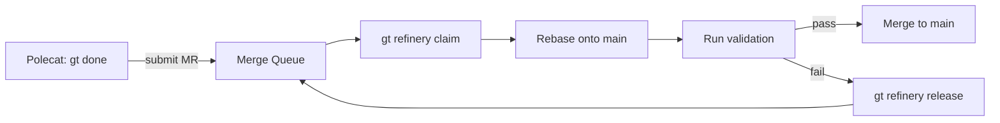
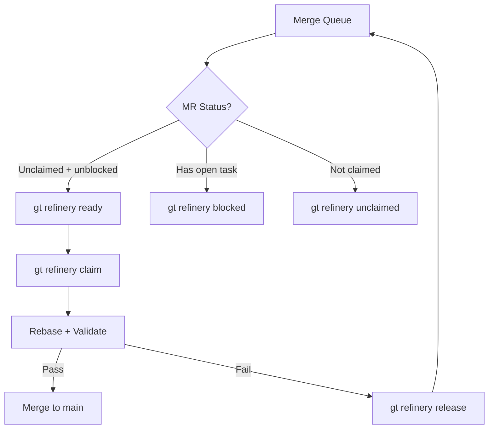
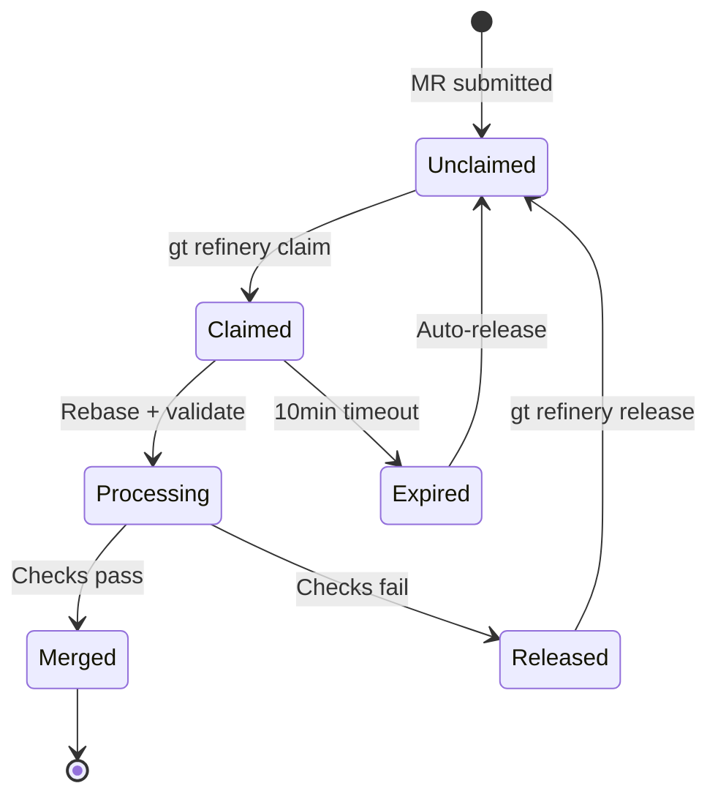
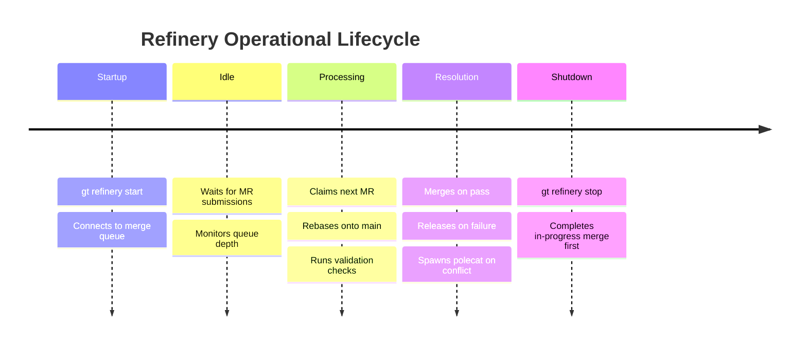
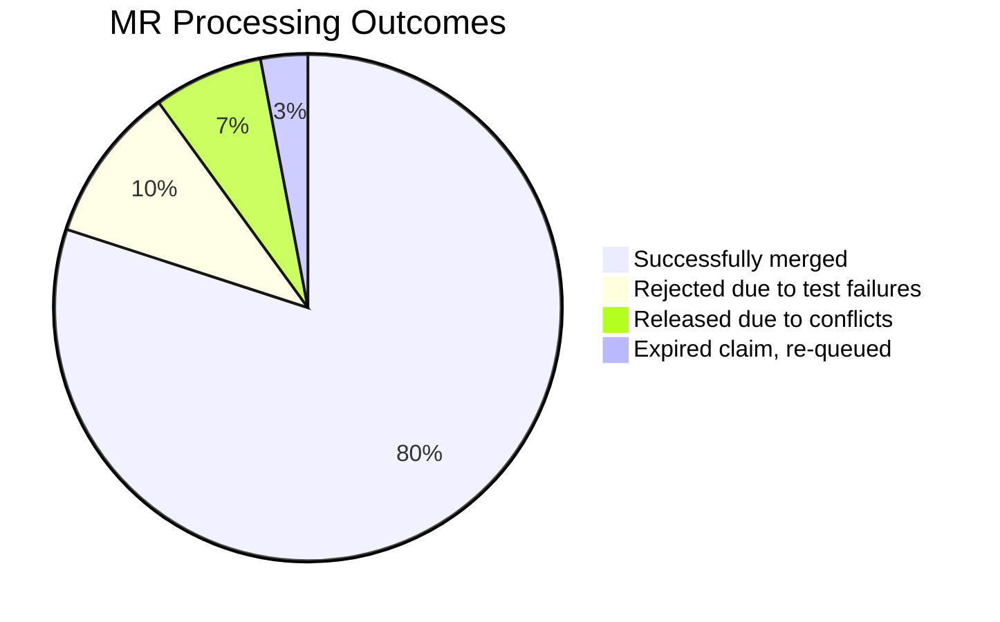
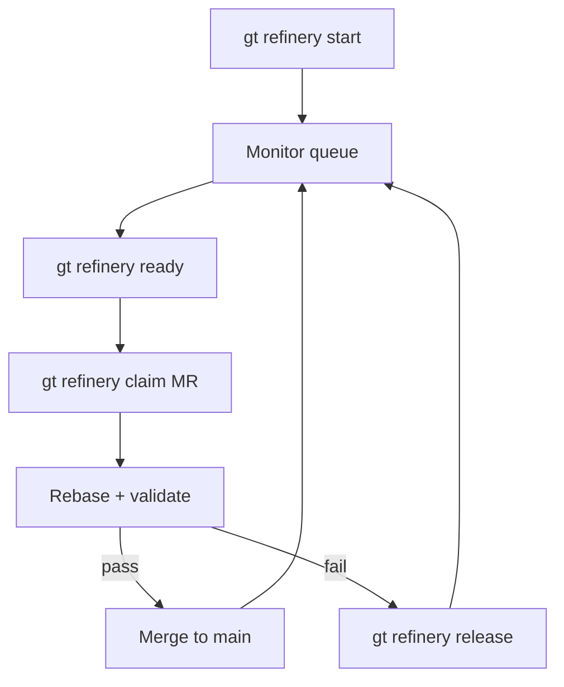

# gt refinery

Manage the Refinery -- the per-rig merge queue processor.

```bash
gt refinery [command] [flags]
```

**Alias:** `gt ref`

## Description



The Refinery serializes all merges to main for a rig:

1. Receives MRs submitted by polecats (via `gt done`)
2. Rebases work branches onto latest main
3. Runs validation (tests, builds, checks)
4. Merges to main when clear
5. If conflict: spawns a fresh polecat to re-implement (original is already gone)

One Refinery per rig. It is a persistent agent that processes work as it arrives. The polecat is already nuked by the time the Refinery processes its MR.

:::tip
The Refinery runs automatically as a persistent agent. You rarely need these commands in normal operation — they're primarily for debugging and manual intervention. For a comprehensive understanding of how the Refinery processes work, see [Refinery Deep Dive](/blog/refinery-deep-dive).
:::

**Role shortcuts:** `refinery` in mail/nudge addresses resolves to the current rig's Refinery.

## Subcommands

| Command | Description |
|---------|-------------|
| [`start`](#gt-refinery-start) | Start the Refinery |
| [`stop`](#gt-refinery-stop) | Stop the Refinery |
| [`restart`](#gt-refinery-restart) | Restart the Refinery |
| [`status`](#gt-refinery-status) | Show Refinery status |
| [`attach`](#gt-refinery-attach) | Attach to Refinery session |
| [`queue`](#gt-refinery-queue) | Show merge queue |
| [`ready`](#gt-refinery-ready) | List MRs ready for processing |
| [`blocked`](#gt-refinery-blocked) | List MRs blocked by open tasks |
| [`unclaimed`](#gt-refinery-unclaimed) | List unclaimed MRs |
| [`claim`](#gt-refinery-claim) | Claim an MR for processing |
| [`release`](#gt-refinery-release) | Release a claimed MR |

---

## gt refinery start

Start the Refinery for a rig.

```bash
gt refinery start [rig] [flags]
```

**Alias:** `gt refinery spawn`

Launches the merge queue processor which monitors for polecat work branches and merges them to the appropriate target branches. If rig is not specified, infers it from the current directory.

**Flags:**

| Flag | Description |
|------|-------------|
| `--agent <alias>` | Agent alias to run the Refinery with (overrides town default) |
| `--foreground` | Run in foreground (default: background) |

**Examples:**

```bash
gt refinery start myproject
gt refinery start myproject --foreground
gt refinery start              # infer rig from cwd
```

---

## gt refinery stop

Gracefully stop a running Refinery.

```bash
gt refinery stop [rig] [flags]
```

Completes any in-progress merge first, then stops. If rig is not specified, infers it from the current directory.

---

## gt refinery restart

Restart the Refinery for a rig.

```bash
gt refinery restart [rig] [flags]
```

Stops the current session (if running) and starts a fresh one.

**Flags:**

| Flag | Description |
|------|-------------|
| `--agent <alias>` | Agent alias to run the Refinery with (overrides town default) |

**Examples:**

```bash
gt refinery restart myproject
gt refinery restart             # infer rig from cwd
```

---

## gt refinery status

Show Refinery status for a rig.

```bash
gt refinery status [rig] [flags]
```

Displays running state, current work, queue length, and statistics.

**Flags:**

| Flag | Description |
|------|-------------|
| `--json` | Output as JSON |

**Examples:**

```bash
gt refinery status
gt refinery status myproject
gt refinery status --json
```

---

## gt refinery attach

Attach to a running Refinery's Claude session.

```bash
gt refinery attach [rig] [flags]
```

Allows interactive access to the Refinery agent for debugging or manual intervention. Detach with `Ctrl-B D`.

**Flags:**

| Flag | Description |
|------|-------------|
| `--agent <alias>` | Agent alias to run the Refinery with (overrides town default) |

**Examples:**

```bash
gt refinery attach myproject
gt refinery attach              # infer rig from cwd
```

---

## gt refinery queue

Show the merge queue for a rig.

```bash
gt refinery queue [rig] [flags]
```

Lists all pending merge requests waiting to be processed.

**Flags:**

| Flag | Description |
|------|-------------|
| `--json` | Output as JSON |

**Examples:**

```bash
gt refinery queue
gt refinery queue myproject
gt refinery queue --json
```

---

:::info

When attaching to a Refinery session for debugging, remember to detach with `Ctrl-B D` rather than closing the terminal. Closing the terminal window can kill the tmux session and stop the Refinery, leaving the merge queue unprocessed until it is restarted.

:::

:::caution

Stopping and restarting the Refinery while it has a claimed MR in progress can leave that MR in a stale-claimed state. After restarting, check `gt refinery unclaimed` to verify no MRs are stuck with expired claims that need to be manually released with `gt refinery release`.

:::

:::tip

If the Refinery appears stuck processing an MR for more than 15-20 minutes, check for long-running test suites or validation scripts. You can attach to the Refinery session with `gt refinery attach` to inspect the current state and see if the validation is progressing or genuinely stuck.

:::

## gt refinery ready



List MRs ready for processing.

```bash
gt refinery ready [rig] [flags]
```

Shows MRs that are:

- Not currently claimed by any worker (or claim is stale)
- Not blocked by an open task (e.g., conflict resolution in progress)

This is the preferred command for finding work to process.

**Flags:**

| Flag | Description |
|------|-------------|
| `--json` | Output as JSON |

**Examples:**

```bash
gt refinery ready
gt refinery ready --json
```

---

## gt refinery blocked

List MRs blocked by open tasks.

```bash
gt refinery blocked [rig] [flags]
```

Shows MRs waiting for conflict resolution or other blocking tasks to complete. When the blocking task closes, the MR will appear in `ready`.

**Flags:**

| Flag | Description |
|------|-------------|
| `--json` | Output as JSON |

**Examples:**

```bash
gt refinery blocked
gt refinery blocked --json
```

---

## gt refinery unclaimed

List MRs available for claiming.

```bash
gt refinery unclaimed [rig] [flags]
```

Shows MRs that are not currently claimed by any worker, or have stale claims (worker may have crashed). Useful for parallel refinery workers to find work.

**Flags:**

| Flag | Description |
|------|-------------|
| `--json` | Output as JSON |

**Examples:**

```bash
gt refinery unclaimed
gt refinery unclaimed --json
```

---



The following timeline shows the typical operational lifecycle of a Refinery agent within a rig.



## gt refinery claim

Claim an MR for processing.

```bash
gt refinery claim <mr-id> [flags]
```

When running multiple refinery workers in parallel, each worker must claim an MR before processing to prevent double-processing. Claims expire after 10 minutes if not processed (for crash recovery).

The worker ID is automatically determined from the `GT_REFINERY_WORKER` environment variable, or defaults to `refinery-1`.

**Examples:**

```bash
gt refinery claim gt-abc123
GT_REFINERY_WORKER=refinery-2 gt refinery claim gt-abc123
```

:::warning
Claims expire after 10 minutes. If your processing takes longer, the MR may be claimed by another worker. Monitor long-running merges closely.
:::

---

## gt refinery release

Release a claimed MR back to the queue.

```bash
gt refinery release <mr-id> [flags]
```

Called when processing fails and the MR should be retried by another worker. Clears the claim so other workers can pick up the MR.

**Examples:**

```bash
gt refinery release gt-abc123
```

:::note

All subcommands that accept `[rig]` infer the rig from the current directory when not specified.

:::



:::caution

If you notice the Refinery repeatedly rejecting MRs from the same rig due to test failures, check whether polecats in that rig are running validation locally before calling `gt done`. Missing or outdated integration check configuration in the rig's `.refinery/validation.sh` can cause polecats to submit broken MRs that the Refinery will always reject.

:::

### Refinery Command Flow



:::info[Refinery Restart Safety]

Restarting the Refinery with `gt refinery restart` while it is processing an MR is safe as long as the MR is not yet merged. The Refinery uses atomic state transitions and marks MRs as claimed before starting work, so a restarted Refinery will detect the incomplete claim, wait for the timeout to expire, and re-claim the MR to complete the merge.

:::

## Related

- [Refinery](../agents/refinery.md) -- How the Refinery agent processes merge requests
- [gt mq](./merge-queue.md) -- Merge queue commands for submitting and managing MRs
- [Git Workflow](../guides/git-workflow.md) -- Branch management and merge strategies
- [Work Distribution](../architecture/work-distribution.md) -- End-to-end work flow through Gas Town

### Blog Posts

- [The Refinery: How Merges Actually Work in Gas Town](/blog/refinery-deep-dive) -- Deep dive into how the Refinery serializes parallel agent work into a clean linear history on main
- [Code Review with Gas Town Polecats](/blog/code-review-workflow) -- How the code-review formula integrates with the Refinery's merge gate
- [Git Workflows for Multi-Agent Development](/blog/git-workflows-multi-agent) -- Branch management strategies when multiple agents push work through the Refinery
- [Scaling Gas Town Beyond 30 Agents](/blog/scaling-beyond-30) -- How the Refinery handles increased merge throughput as your fleet grows
- [Work Distribution Patterns: Manual Convoy vs. Mayor vs. Formula](/blog/work-distribution-patterns) -- How Refinery commands fit into the overall work distribution pipeline
