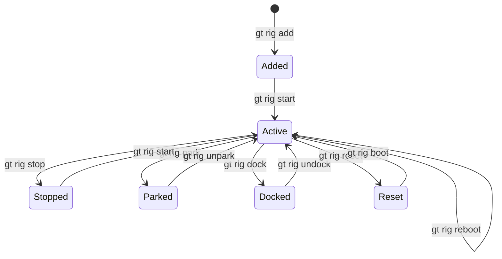
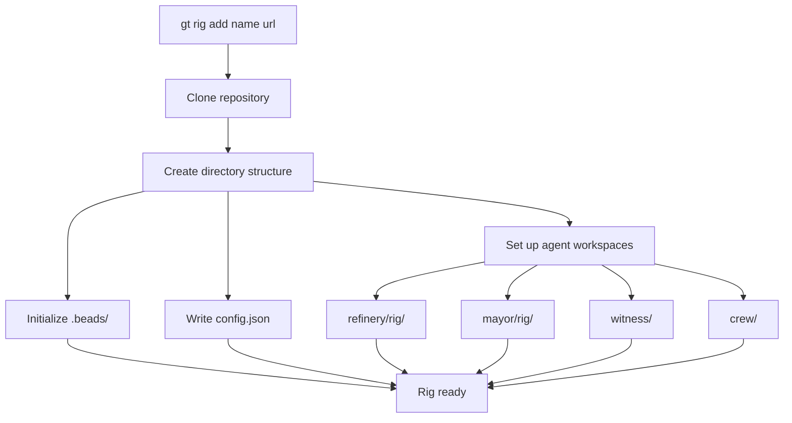
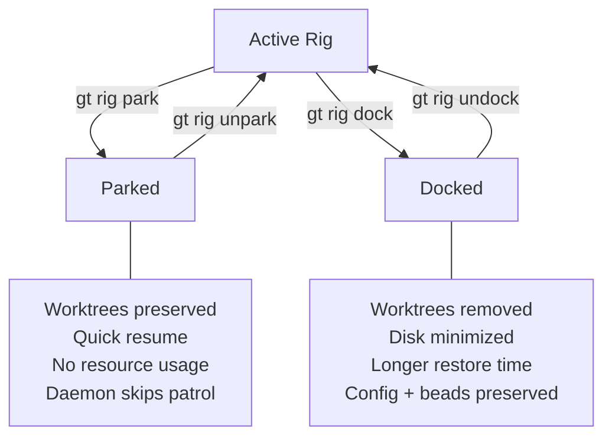
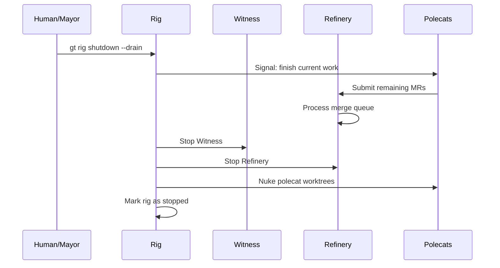
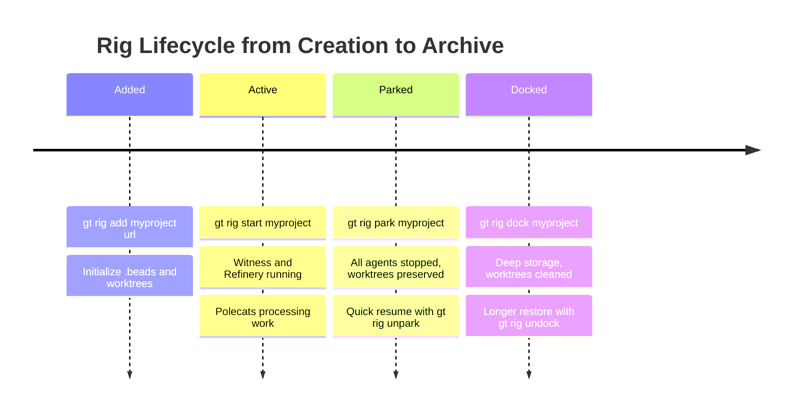

# Rig Management

Commands for adding, configuring, starting, stopping, and managing rigs. A rig is a project container that wraps a git repository with the full Gas Town agent infrastructure.



---

## `gt rig list`

List all rigs in the town.

```bash
gt rig list [options]
```

**Description:** Shows all rigs with their current status, agent counts, and activity summary.

**Options:**

| Flag | Description |
|------|-------------|
| `--status <status>` | Filter: `active`, `parked`, `docked`, `stopped` |
| `--json` | Output in JSON format |
| `--verbose` | Show extended details |

**Example:**

```bash
gt rig list
gt rig list --status active
```

**Sample output:**

```text
RIG          STATUS    POLECATS   QUEUE   OPEN BEADS   BRANCH
myproject    active    3          2       7            main
docs         active    1          0       2            main
backend      parked    0          0       4            main
```

---

## `gt rig add`

Add a new rig to the town.

```bash
gt rig add <name> <git-url> [options]
```

**Description:** Clones the repository, creates the rig directory structure, initializes beads, and sets up agent workspaces (witness, refinery, mayor, polecats).

**Options:**

| Flag | Description |
|------|-------------|
| `--branch <name>` | Check out a specific branch (default: `main`) |
| `--agent <runtime>` | Default agent runtime for this rig |
| `--no-start` | Add the rig but do not start its agents |
| `--shallow` | Shallow clone for large repositories |

**Example:**

```bash
# Add a rig
gt rig add myproject https://github.com/you/repo.git

# Add with SSH URL and specific branch
gt rig add backend git@github.com:you/backend.git --branch develop

# Add without starting agents
gt rig add docs https://github.com/you/docs.git --no-start
```



The following diagram summarizes the key differences between parking and docking a rig.



**Created structure:**

```text
~/gt/myproject/
├── .beads/          # Rig-level issue tracking
├── config.json      # Rig configuration
├── refinery/rig/    # Canonical main clone
├── mayor/rig/       # Mayor's working copy
├── crew/            # Human developer workspaces
├── witness/         # Health monitor state
├── polecats/        # Ephemeral worker directories
└── plugins/         # Rig-level plugins
```

---

## `gt rig start`

Start all agents for a rig.

```bash
gt rig start <name> [options]
```

**Description:** Starts the Witness and Refinery agents for the specified rig. If polecats have hooked work, they will also be spawned.

**Options:**

| Flag | Description |
|------|-------------|
| `--agents <list>` | Start only specific agents (comma-separated) |

**Example:**

```bash
gt rig start myproject
gt rig start myproject --agents witness,refinery
```

---

## `gt rig stop`

Stop all agents for a rig.

```bash
gt rig stop <name> [options]
```

**Description:** Gracefully stops all agents running in the rig, including the Witness, Refinery, and any active polecats.

**Options:**

| Flag | Description |
|------|-------------|
| `--force` | Force stop without graceful shutdown |
| `--keep-polecats` | Do not stop running polecats |

**Example:**

```bash
gt rig stop myproject
gt rig stop myproject --force
```

:::warning

Stopping a rig with active polecats may result in lost uncommitted work. Use `--keep-polecats` or ensure polecats have committed their changes first.

:::

---

## `gt rig shutdown`



Fully shut down a rig including cleanup.

```bash
gt rig shutdown <name> [options]
```

**Description:** Stops all agents, cleans up polecat worktrees, drains the merge queue, and puts the rig in a stopped state. More thorough than `gt rig stop`.

**Options:**

| Flag | Description |
|------|-------------|
| `--force` | Skip confirmation and force shutdown |
| `--drain` | Wait for merge queue to empty before shutting down |

**Example:**

```bash
gt rig shutdown myproject
gt rig shutdown myproject --drain
```

---

## `gt rig status`

Show detailed status for a rig.

```bash
gt rig status <name> [options]
```

**Description:** Displays comprehensive rig information including agent status, polecat activity, merge queue depth, open beads, and resource usage.

**Options:**

| Flag | Description |
|------|-------------|
| `--json` | Output in JSON format |
| `--verbose` | Show extended details |

**Example:**

```bash
gt rig status myproject
```

**Sample output:**

```text
Rig: myproject
Repository: https://github.com/you/repo.git
Branch: main
Status: active

Agents:
  Witness:  running (PID 1240)
  Refinery: running (PID 1250)

Polecats: 3 running
  toast    running   gt-abc12   fix/login-bug          15m
  alpha    running   gt-def34   feat/email-validation   10m
  bravo    running   gt-ghi56   refactor/auth-module    5m

Merge Queue: 2 pending, 1 processing
Open Beads: 7
Active Convoy: hq-cv-001 (2/3)
```

---

## `gt rig reset`

Reset a rig to a clean state.

```bash
gt rig reset <name> [options]
```

**Description:** Resets the rig by stopping all agents, removing all polecat worktrees, clearing the merge queue, and optionally resetting the beads database.

**Options:**

| Flag | Description |
|------|-------------|
| `--hard` | Also reset beads database and agent state |
| `--force` | Skip confirmation |
| `--keep-crew` | Preserve crew workspaces |

**Example:**

```bash
gt rig reset myproject
gt rig reset myproject --hard --force
```

:::danger

`gt rig reset --hard` destroys all work state including beads, hooks, and merge queue items. This cannot be undone.

:::

---

## `gt rig boot`

Boot a rig from cold state.

```bash
gt rig boot <name> [options]
```

**Description:** Initializes a rig that has been shut down or is in a cold state. Sets up worktrees, starts agents, and processes any pending hooks.

**Options:**

| Flag | Description |
|------|-------------|
| `--full` | Full boot including all optional agents |

**Example:**

```bash
gt rig boot myproject
gt rig boot myproject --full
```

---

## `gt rig reboot`

Reboot a running rig.

```bash
gt rig reboot <name> [options]
```

**Description:** Performs a stop-then-start cycle for the rig. Agents are stopped gracefully, state is preserved, and agents are restarted.

**Options:**

| Flag | Description |
|------|-------------|
| `--force` | Force reboot without waiting for graceful shutdown |

**Example:**

```bash
gt rig reboot myproject
```

---

## `gt rig park`

Park a rig (suspend without removing).

```bash
gt rig park <name> [options]
```

**Description:** Stops all agents and marks the rig as parked. Parked rigs consume no resources but retain all configuration and state. Work can be resumed later with `gt rig unpark`.

**Options:**

| Flag | Description |
|------|-------------|
| `--reason <text>` | Reason for parking |

**Example:**

```bash
gt rig park backend --reason "Waiting for API spec finalization"
```

---

## `gt rig unpark`

Resume a parked rig.

```bash
gt rig unpark <name> [options]
```

**Description:** Restarts agents and resumes work in a previously parked rig.

**Example:**

```bash
gt rig unpark backend
```

---

## `gt rig dock`

Dock a rig (deep storage mode).

```bash
gt rig dock <name> [options]
```

**Description:** Places a rig in deep storage. Docking is more aggressive than parking: it cleans up worktrees, removes polecat directories, and minimizes disk usage while preserving configuration and beads history.

**Options:**

| Flag | Description |
|------|-------------|
| `--force` | Skip confirmation |

**Example:**

```bash
gt rig dock backend
```

:::tip
Use **park** for temporary pauses — the daemon skips parked rigs during patrol cycles, but all worktrees and agent directories remain in place for a quick resume with `gt rig unpark`. Use **dock** for long-term archival — it aggressively cleans up worktrees and polecat directories to minimize disk usage, at the cost of a longer restore time with `gt rig undock`. For advanced rig management strategies at scale, see [Scaling Beyond 30 Agents](/blog/scaling-beyond-30).
:::

---

## `gt rig undock`

Restore a docked rig.

```bash
gt rig undock <name> [options]
```

**Description:** Restores a docked rig by recreating worktrees, agent directories, and starting agents.

**Example:**

```bash
gt rig undock backend
```

---

:::note

After undocking a rig, the restore process recreates worktrees and agent directories from scratch. Any local-only modifications to agent workspaces that were not committed to git will have been lost during the dock operation. Always ensure all work is committed before docking a rig.

:::

:::info

After rebooting a rig with `gt rig reboot`, agent state is preserved but all polecats will re-read their hooks and restart work from their last checkpoint. If a polecat was mid-task without a recent checkpoint, it may repeat some work. Use `gt checkpoint write` before triggering a rig reboot to minimize duplicate effort.

:::

## `gt rig config`

View or modify rig configuration.

```bash
gt rig config <name> [key] [value] [options]
```

**Description:** Without a key, shows all configuration for the rig. With a key, shows that specific setting. With a key and value, sets the configuration.

**Options:**

| Flag | Description |
|------|-------------|
| `--json` | Output in JSON format |
| `--reset` | Reset configuration to defaults |

**Common configuration keys:**

| Key | Description | Default |
|-----|-------------|---------|
| `agent` | Default agent runtime | `claude` |
| `max_polecats` | Maximum concurrent polecats | `5` |
| `merge_strategy` | Merge strategy: `rebase`, `merge`, `squash` | `rebase` |
| `auto_witness` | Auto-start witness on rig start | `true` |
| `auto_refinery` | Auto-start refinery on rig start | `true` |
| `branch` | Main branch name | `main` |

**Example:**

```bash
# Show all config
gt rig config myproject

# Get a specific setting
gt rig config myproject max_polecats

# Set a value
gt rig config myproject max_polecats 8

# Reset to defaults
gt rig config myproject --reset
```

---

:::caution

Changing the `max_polecats` setting on a rig that already has active polecats will not terminate running polecats if the new limit is lower. The new limit only applies to future polecat spawns. If you need to reduce the active count immediately, use `gt polecat list` and `gt polecat nuke` to manually remove excess polecats.

:::



:::warning

When adding a new rig with `gt rig add` to a shallow clone (`--shallow`), be aware that some git operations (like `git log --since` used by the Witness for staleness checks) may behave unexpectedly or fail if the commit history is incomplete. Reserve shallow clones for read-only rigs or archives where agents will not actively work.

:::

## `gt rig settings`

Manage advanced rig settings.

```bash
gt rig settings <name> [options]
```

**Description:** Access and modify advanced rig settings that are not part of the standard configuration. Includes validation rules, plugin settings, and integration configuration.

**Options:**

| Flag | Description |
|------|-------------|
| `--show` | Display all settings |
| `--set <key=value>` | Set a setting |
| `--unset <key>` | Remove a setting |
| `--json` | Output in JSON format |

**Example:**

```bash
# Show all settings
gt rig settings myproject --show

# Set a custom setting
gt rig settings myproject --set "validation.timeout=300"

# Remove a setting
gt rig settings myproject --unset "validation.timeout"
```

## Related

- [Rigs Concept](../concepts/rigs.md) -- What rigs are and how they work
- [Starting & Stopping](../operations/lifecycle.md) -- Rig lifecycle management
- [Workspace Management](./workspace.md) -- Town-level workspace commands

### Blog Posts

- [Understanding Rigs: Gas Town's Project Containers](/blog/understanding-rigs) -- When to create, park, or dock rigs and how they encapsulate projects
- [Scaling Gas Town Beyond 30 Agents](/blog/scaling-beyond-30) -- Architectural patterns and operational strategies for running Gas Town at scale with dozens of concurrent agents
- [Why Git Worktrees? Gas Town's Isolation Strategy](/blog/git-worktrees) -- How Gas Town uses git worktrees instead of containers to isolate parallel agent workspaces
- [Your Second Convoy](/blog/your-second-convoy) -- Practical walkthrough of managing multiple rigs and coordinating work across projects
- [Multi-Runtime Workflows with Gas Town](/blog/multi-runtime-workflows) -- Managing rigs across different runtime environments
