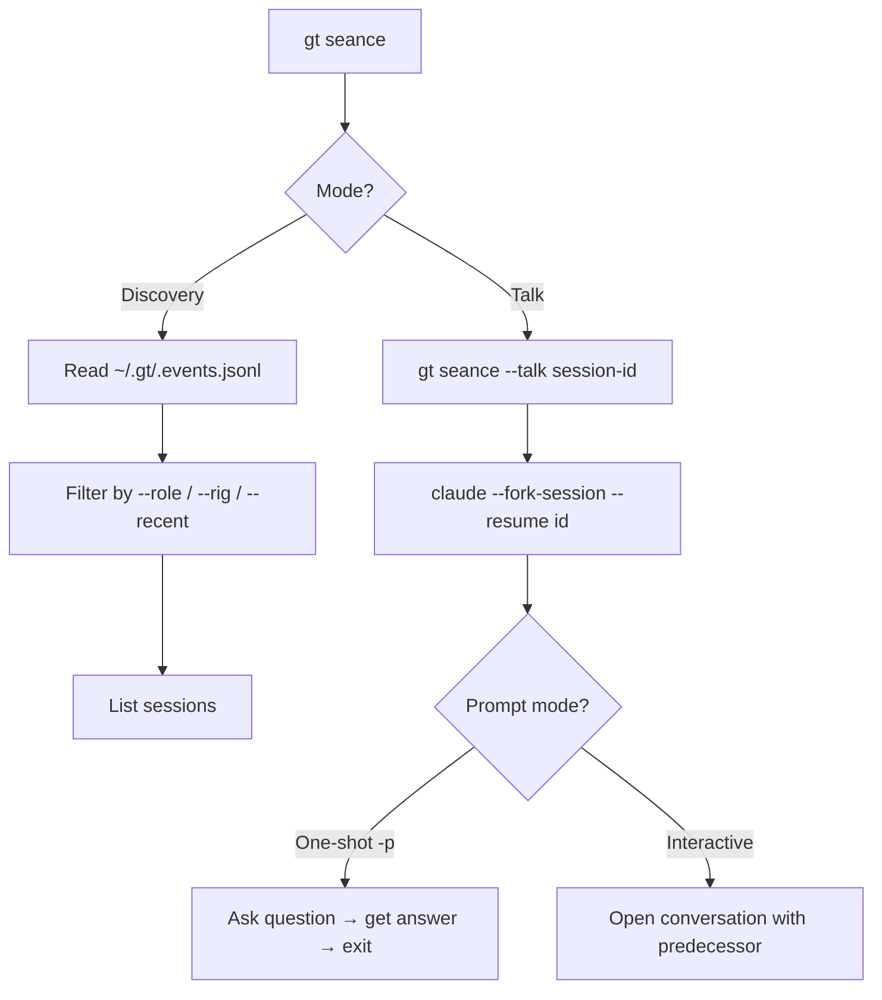
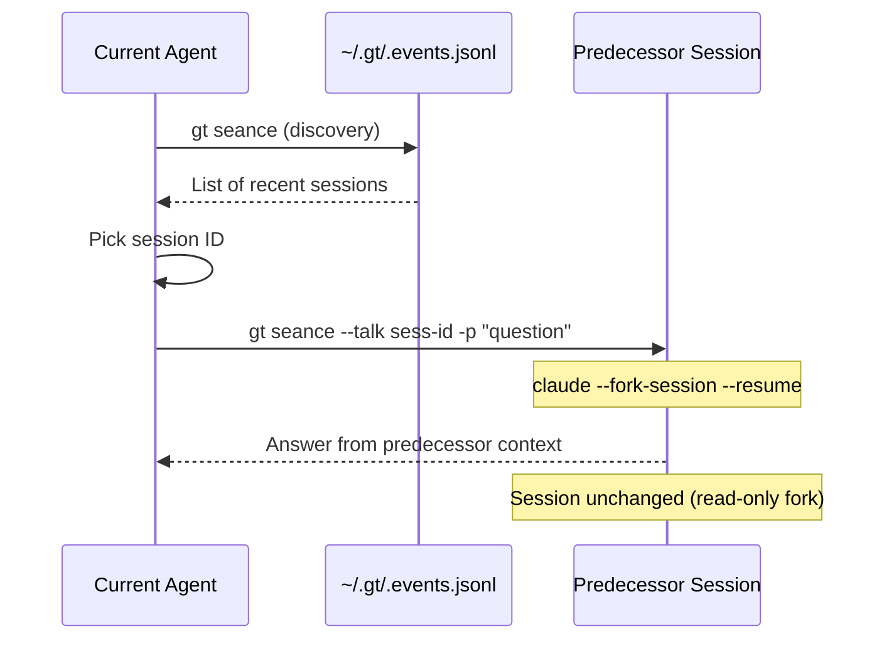
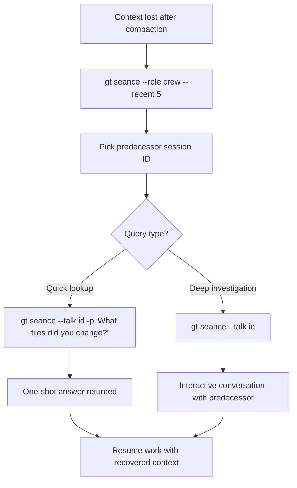
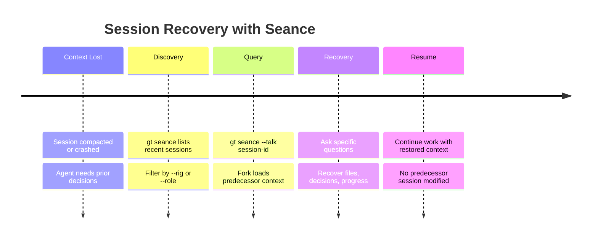

# gt seance

Talk to predecessor sessions to recover context and understand decisions.

```bash
gt seance [flags]
```

## Description



Seance lets you talk to predecessor sessions directly. Instead of parsing logs, it spawns a Claude subprocess that resumes a previous session with full context. You can ask questions like:

- "Why did you make this decision?"
- "Where were you stuck?"
- "What did you try that didn't work?"

This solves the #1 handoff question: "Where did you put the stuff you left for me?"

## Session Discovery

List recent sessions discovered from events emitted by SessionStart hooks (`~/gt/.events.jsonl`).

```bash
gt seance                     # List recent sessions
gt seance --role crew         # Filter by role type
gt seance --rig gastown       # Filter by rig
gt seance --recent 10         # Last N sessions
```

## Talking to a Predecessor

The `--talk` flag spawns `claude --fork-session --resume <id>`, loading the predecessor's full context without modifying their session.

```bash
gt seance --talk <session-id>              # Interactive conversation
gt seance --talk <session-id> -p "Where is X?"   # One-shot question
```

## Flags

| Flag | Short | Description |
|------|-------|-------------|
| `--talk <id>` | `-t` | Session ID to commune with |
| `--prompt <text>` | `-p` | One-shot prompt (requires `--talk`) |
| `--recent <n>` | `-n` | Number of recent sessions to show (default: 20) |
| `--rig <name>` | | Filter by rig name |
| `--role <type>` | | Filter by role (crew, polecat, witness, etc.) |
| `--json` | | Output as JSON |

## Examples

```bash
# Discover recent sessions
gt seance
gt seance --rig myproject --role polecat

# Ask a one-shot question to a predecessor
gt seance --talk sess-abc123 -p "What was the root cause of the auth bug?"

# Start an interactive conversation with a predecessor
gt seance --talk sess-abc123
```

:::tip
Sessions are discovered from events emitted by SessionStart hooks. The `[GAS TOWN]` beacon in each session makes them searchable via `/resume`. For more on how session context is preserved, see [Understanding GUPP](/blog/understanding-gupp).
:::

## Common Use Cases



### Recovering Lost Context After Compaction

When your context window compacts and you lose details about earlier work:

```bash
# Find your recent sessions
gt seance --role crew --recent 5

# Ask your predecessor what they were doing
gt seance --talk sess-abc123 -p "What files did you modify and why?"
```

### Debugging a Polecat's Decisions

When reviewing polecat output and you don't understand the approach:

```bash
# Find polecat sessions in the rig
gt seance --rig myproject --role polecat

# Ask why it made a particular choice
gt seance --talk sess-def456 -p "Why did you use a map instead of a slice for the cache?"
```

### Investigating Escalations

When an escalation arrives and you need to understand the original problem:

```bash
# Find the session that escalated
gt seance --recent 20

# Get the full story
gt seance --talk sess-ghi789 -p "What went wrong and what did you try?"
```



The following timeline shows how seance fits into a typical session recovery workflow.



:::danger

Do not run `gt seance --talk` on a session that is still actively running unless you understand that the fork is read-only. While the original session is unmodified, the forked subprocess may consume significant memory if the predecessor's context window is large. Avoid running multiple concurrent seance sessions against the same predecessor.

:::

## How It Works Under the Hood

Seance leverages Claude Code's `--fork-session` and `--resume` flags:

```text
gt seance --talk <session-id>
  └─> claude --fork-session --resume <session-id>
       └─> Loads predecessor's full context (read-only)
            └─> You ask questions
```

The fork creates a separate conversation branch. The predecessor's session is never modified — they won't even know you communed with them. This makes seance safe to use on active sessions.

:::info
The events file `~/gt/.events.jsonl` is required for session discovery. If SessionStart hooks are not configured in your agent's CLAUDE.md or hook files, sessions will not emit `session_start` events and will not appear in `gt seance` discovery. Verify your hooks are in place with `gt hook show` if sessions are missing.
:::

:::tip

When debugging a failed polecat session, combine `gt seance --talk <session-id>` with `gt trail <bead-id>` to get both the agent's internal reasoning (from seance) and the external lifecycle events (from trail). This dual perspective often reveals why work stalled or where decisions went wrong.

:::

### Session Events

Sessions are tracked in `~/gt/.events.jsonl`. Each Gas Town session emits a `session_start` event containing:

```json
{
  "type": "session_start",
  "session_id": "sess-abc123",
  "role": "crew",
  "rig": "gastowndocs",
  "agent": "nic",
  "timestamp": "2026-02-13T14:00:00Z"
}
```

Seance reads these events to build the session list. If events are missing, sessions won't appear in discovery.

## Best Practices

### Asking Good Questions

Predecessors respond best to specific questions:

| Good Question | Why |
|---------------|-----|
| "What files did you modify for the auth fix?" | Specific, actionable |
| "Why did you choose Redis over memcached?" | Decision-focused |
| "Where were you blocked when the session ended?" | Context recovery |

| Poor Question | Why |
|---------------|-----|
| "What happened?" | Too vague |
| "Tell me everything" | No focus, wastes tokens |

:::warning

Seance forks create a separate Claude Code subprocess, which consumes API tokens. Running many seance sessions in quick succession (especially interactive ones) can generate significant token usage. Prefer one-shot queries with `-p` for quick lookups, and reserve interactive seance sessions for in-depth investigations.

:::

### One-Shot vs Interactive

Use **one-shot** (`-p`) when you have a specific question and want a quick answer. Use **interactive** (no `-p`) when you need to explore and follow up on answers.

:::note
Seance spawns a read-only fork of the predecessor session. It cannot modify the original session's state or history.
:::

## Related

- [Session Cycling](../concepts/session-cycling.md) -- How Gas Town manages context window refreshes across agent sessions
- [Session & Handoff](./sessions.md) -- The handoff commands that create the sessions seance can query
- [gt compact](./compact.md) -- TTL-based compaction, another approach to context management

### Blog Posts

- [Session Cycling: How Gas Town Agents Handle Context Limits](/blog/session-cycling) -- How agents automatically hand off work when their context window fills up
- [Understanding GUPP: Why Crashes Don't Lose Work](/blog/understanding-gupp) -- How hooks preserve context across sessions, making seance useful for recovering lost context
- [Agent Communication Patterns in Gas Town](/blog/agent-communication-patterns) -- Communication patterns between agents, including how seance enables cross-session knowledge transfer
- [Why Beads? AI-Native Issue Tracking](/blog/why-beads) -- How bead context persists across sessions, complementing seance for recovering decisions and progress
