# gt session

Manage tmux sessions for polecats.

```bash
gt session [command] [flags]
```

**Alias:** `gt sess`

## Description

Sessions are tmux sessions running Claude for each polecat. Use the subcommands to start, stop, attach, and monitor sessions.


:::tip

To send messages to a running session, use `gt nudge` (not `gt session inject`). The nudge command uses reliable delivery that works correctly with Claude Code.

:::

## Subcommands

| Command | Description |
|---------|-------------|
| [`list`](#gt-session-list) | List all sessions |
| [`start`](#gt-session-start) | Start a polecat session |
| [`stop`](#gt-session-stop) | Stop a polecat session |
| [`restart`](#gt-session-restart) | Restart a polecat session |
| [`at`](#gt-session-at) | Attach to a running session |
| [`status`](#gt-session-status) | Show session status details |
| [`check`](#gt-session-check) | Check session health |
| [`capture`](#gt-session-capture) | Capture recent session output |
| [`inject`](#gt-session-inject) | Send message to session (prefer `gt nudge`) |

---

## gt session list

List all running polecat sessions.

```bash
gt session list [flags]
```

Shows session status, rig, and polecat name.

**Flags:**

| Flag | Description |
|------|-------------|
| `--json` | Output as JSON |
| `--rig <name>` | Filter by rig name |

**Examples:**

```bash
gt session list
gt session list --rig myproject
gt session list --json
```

---

## gt session start

Start a new tmux session for a polecat.

```bash
gt session start <rig>/<polecat> [flags]
```

Creates a tmux session, navigates to the polecat's working directory, and launches Claude. Optionally inject an initial issue to work on.

**Flags:**

| Flag | Description |
|------|-------------|
| `--issue <id>` | Issue ID to work on |

**Examples:**

```bash
gt session start myproject/toast
gt session start myproject/toast --issue gt-123
```

---

## gt session stop

Stop a running polecat session.

```bash
gt session stop <rig>/<polecat> [flags]
```

Attempts graceful shutdown first (Ctrl-C), then kills the tmux session. Use `--force` to skip graceful shutdown.

**Flags:**

| Flag | Short | Description |
|------|-------|-------------|
| `--force` | `-f` | Force immediate shutdown |

**Examples:**

```bash
gt session stop myproject/toast
gt session stop myproject/toast --force
```

---

## gt session restart

Restart a polecat session (stop + start).

```bash
gt session restart <rig>/<polecat> [flags]
```

Gracefully stops the current session and starts a fresh one.

**Flags:**

| Flag | Short | Description |
|------|-------|-------------|
| `--force` | `-f` | Force immediate shutdown before restart |

**Examples:**

```bash
gt session restart myproject/toast
gt session restart myproject/toast --force
```

---

## gt session at

Attach to a running polecat session.

```bash
gt session at <rig>/<polecat> [flags]
```

**Alias:** `gt session attach`

Attaches the current terminal to the tmux session. Detach with `Ctrl-B D`.

**Examples:**

```bash
gt session at myproject/toast
```

---

## gt session status

Show detailed status for a polecat session.

```bash
gt session status <rig>/<polecat> [flags]
```

Displays running state, uptime, session info, and activity.

**Examples:**

```bash
gt session status myproject/toast
```

---

## gt session check

Check session health for polecats.

```bash
gt session check [rig] [flags]
```


Validates that:

1. Polecats with work-on-hook have running tmux sessions
2. Sessions are responsive

Use this for manual health checks or debugging session issues.

:::note

Session health checks are useful for manual debugging, but you do not need to run them during normal operation. The Witness runs these checks automatically as part of its patrol cycle.

:::

**Examples:**

```bash
gt session check              # Check all rigs
gt session check myproject    # Check specific rig
```

---

:::info

Session restarts (`gt session restart`) preserve the polecat's git worktree and hook state, but the new Claude session starts with a fresh context window. The agent relies on `gt prime` and the GUPP cycle to recover its working context, so any in-memory reasoning from the previous session is lost.

:::



```mermaid
graph TD
    START[gt session start] --> RUN[Claude running in tmux]
    RUN --> MON{Monitor options}
    MON -->|View live| AT[gt session at — attach]
    MON -->|Check health| CHK[gt session check]
    MON -->|Read output| CAP[gt session capture]
    AT -->|Ctrl-B D| RUN
    CHK --> HEALTH{Healthy?}
    HEALTH -->|Yes| RUN
    HEALTH -->|No| RESTART[gt session restart]
    RESTART --> RUN
```

## gt session capture

Capture recent output from a polecat session.

```bash
gt session capture <rig>/<polecat> [count] [flags]
```

Returns the last N lines of terminal output. Useful for checking progress without attaching to the session.

**Flags:**

| Flag | Short | Description |
|------|-------|-------------|
| `--lines <n>` | `-n` | Number of lines to capture (default: 100) |

**Examples:**

```bash
gt session capture myproject/toast          # Last 100 lines (default)
gt session capture myproject/toast 50       # Last 50 lines
gt session capture myproject/toast -n 50    # Same as above
```

---

## gt session inject

Send a message to a polecat session (low-level).

```bash
gt session inject <rig>/<polecat> [flags]
```

:::warning

For sending messages to Claude sessions, use `gt nudge` instead. It uses reliable delivery (literal mode + timing) that works correctly with Claude Code's input handling. This command is a low-level primitive for file-based injection or cases where you need raw tmux `send-keys` behavior.

:::

**Flags:**

| Flag | Short | Description |
|------|-------|-------------|
| `--file <path>` | `-f` | File to read message from |
| `--message <text>` | `-m` | Message to inject |

**Examples:**

```bash
# Preferred: use gt nudge
gt nudge myproject/furiosa "Check your mail"

# Low-level: file injection
gt session inject myproject/toast -f prompt.txt
```

## Related

- [gt polecat](./polecat-commands.md) -- Polecat lifecycle management (list, nuke, stale)
- [gt nudge](./nudge.md) -- Reliable message delivery to running sessions
- [Session Cycling](../concepts/session-cycling.md) -- How agents cycle sessions for fresh context
- [Monitoring](../operations/monitoring.md) -- Monitoring agent session health

### Blog Posts

- [Session Cycling: How Gas Town Agents Handle Context Limits](/blog/session-cycling) -- How agents automatically hand off work when their context window fills up
- [The Crew Workflow: Human Developers in Gas Town](/blog/crew-workflow) -- How human developers work alongside AI agents using persistent crew workspaces
- [Monitoring Your Gas Town Fleet](/blog/monitoring-fleet) -- Practical guide to monitoring agent session health, tracking activity, and catching unresponsive sessions
- [Hook Persistence: How Gas Town Survives Crashes](/blog/hook-persistence) -- How hooks preserve work state across session restarts and crashes
