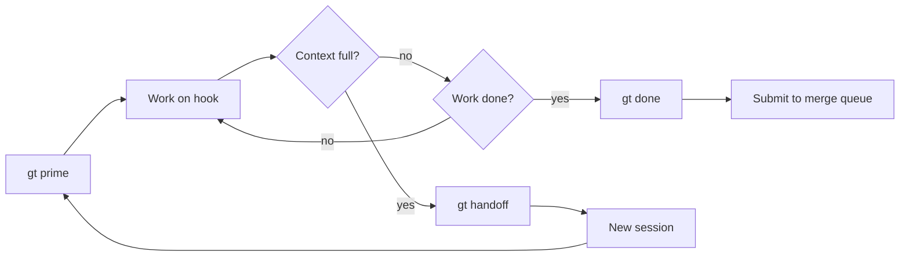
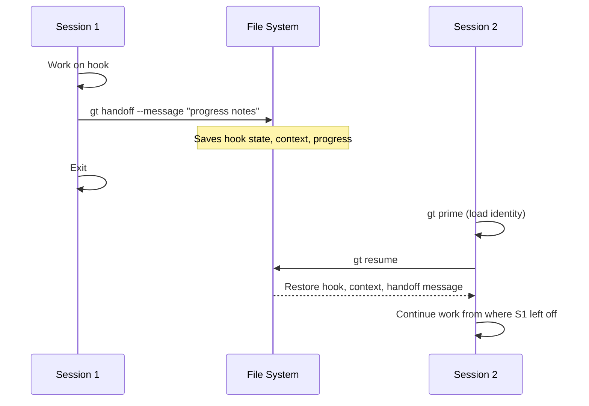
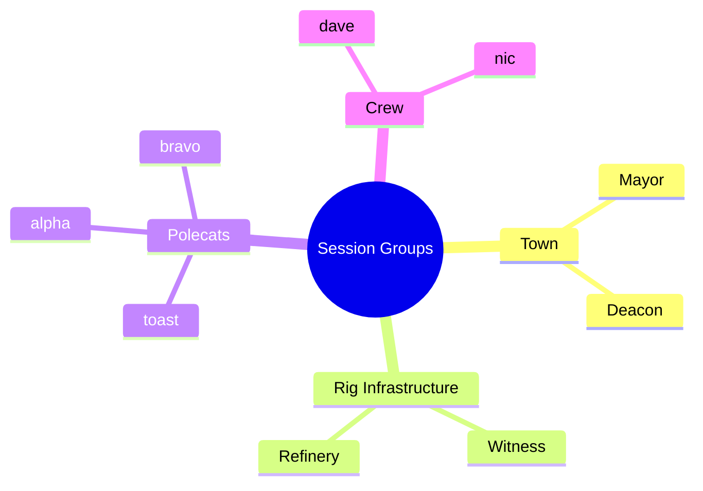
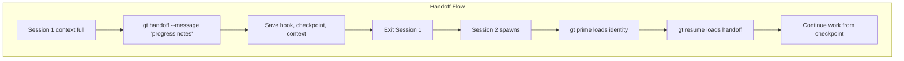
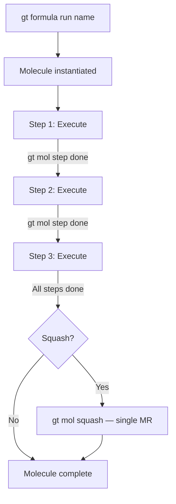

# Session & Handoff

Commands for managing agent sessions, handoffs between sessions, molecules (multi-step workflows), and formulas (reusable workflow templates).



---

## Session Management

### `gt handoff`

Hand off work to a new session.

```bash
gt handoff [options]
```

**Description:** Performs a graceful session transition. The current session saves its state (hook, context, progress) into a handoff file, then exits. The next session picks up from where the previous one left off. This is the standard way to deal with context limits.

**Options:**

| Flag | Description |
|------|-------------|
| `--message <text>` | Handoff notes for the next session |
| `--checkpoint` | Save a full checkpoint before handing off |
| `--to <agent>` | Hand off to a specific agent role |

**Example:**

```bash
# Standard handoff
gt handoff --message "Completed 3/5 test fixes, remaining: auth_test.go and api_test.go"

# Handoff with checkpoint
gt handoff --checkpoint --message "At step 3 of molecule, next: run integration tests"
```

:::tip[Handoff Best Practice]

Always include a clear message describing what was accomplished and what remains. The next session relies on this context to continue work effectively.

:::

---

### `gt resume`

Resume from a previous session or handoff.

```bash
gt resume [options]
```

**Description:** Loads the most recent handoff state and resumes work. Reads the handoff file, restores hook state, and continues from where the previous session ended.

**Options:**

| Flag | Description |
|------|-------------|
| `--session <id>` | Resume a specific session by ID |
| `--latest` | Resume the most recent session (default) |
| `--list` | List available sessions to resume |

**Example:**

```bash
# Resume latest
gt resume

# List available sessions
gt resume --list

# Resume a specific session
gt resume --session sess-abc123
```

---

### `gt park`

Park the current session (pause without handoff).

```bash
gt park [options]
```

**Description:** Saves the current session state and exits without triggering a new session. The work stays on the hook and can be resumed later. Unlike handoff, parking does not expect an immediate successor.

**Options:**

| Flag | Description |
|------|-------------|
| `--message <text>` | Parking notes |
| `--duration <time>` | Expected park duration (informational) |

**Example:**

```bash
gt park --message "Waiting for API review feedback" --duration 4h
```

---

### `gt prime`

Initialize agent context for a new or resumed session.

```bash
gt prime [options]
```

**Description:** Loads the full agent context including role, identity, configuration, hook state, and CLAUDE.md instructions. This is the first command an agent runs in a new session.

**Options:**

| Flag | Description |
|------|-------------|
| `--role <role>` | Override the agent role |
| `--verbose` | Show detailed priming information |

**Example:**

```bash
# Standard prime (reads GT_ROLE from environment)
gt prime

# Prime with explicit role
gt prime --role witness
```

:::note

`gt prime` should be run after compaction, clear, or new session. It is the canonical way to restore agent identity and context. For details on how priming integrates with session cycling, see [Session Cycling](/blog/session-cycling).

:::

---

### `gt seance`

Inspect a completed or crashed session.

```bash
gt seance <session-id> [options]
```

**Description:** Examines the state and artifacts from a previous session, including its hook state, messages sent, activity log, and exit condition. Named after "communicating with the dead" -- useful for debugging crashed or failed sessions.

**Options:**

| Flag | Description |
|------|-------------|
| `--json` | Output in JSON format |
| `--verbose` | Show full session transcript excerpts |
| `--artifacts` | List all session artifacts |

**Example:**

```bash
gt seance sess-abc123
gt seance sess-abc123 --verbose
```

**Sample output:**

```text
Session: sess-abc123
Agent: polecat/toast
Rig: myproject
Duration: 45m
Exit: COMPLETED
Hook: gt-abc12 (completed)
Messages sent: 3
Commits: 4
Branch: fix/login-bug
```

---

### `gt checkpoint`

Manage session checkpoints for crash recovery.

```bash
gt checkpoint <subcommand>
```

**Description:** Checkpoints capture current work state so that if a session crashes, the next session can resume. Checkpoint data includes current molecule and step, hooked bead, modified files, git branch, last commit, and timestamp. Stored in `.polecat-checkpoint.json` in the polecat directory.

**Subcommands:**

| Subcommand | Description |
|------------|-------------|
| `gt checkpoint write` | Write a checkpoint of current session state |
| `gt checkpoint read` | Read and display the current checkpoint |
| `gt checkpoint clear` | Clear the checkpoint file |

**Example:**

```bash
# Save current state
gt checkpoint write

# View saved checkpoint
gt checkpoint read

# Clear checkpoint
gt checkpoint clear
```

---

### `gt cycle`

Cycle between related tmux sessions.

```bash
gt cycle <subcommand>
```

**Description:** Switches between related tmux sessions based on the current session type. Session groups are detected automatically.

**Session groups:**

| Group | Sessions |
|-------|----------|
| Town | Mayor ↔ Deacon |
| Crew | All crew members in the same rig |
| Rig infra | Witness ↔ Refinery (per rig) |
| Polecats | All polecats in the same rig |

**Subcommands:**

| Subcommand | Description |
|------------|-------------|
| `gt cycle next` | Switch to next session in group |
| `gt cycle prev` | Switch to previous session in group |

**Example:**

```bash
gt cycle next
gt cycle prev
```

---



The following diagram shows how session groups are organized for the `gt cycle` navigation command.



:::warning

Checkpoints are stored in `.polecat-checkpoint.json` within the polecat directory and are not synced across machines. If you are running Gas Town on multiple hosts, checkpoint data is local to the host where the session ran. Rely on bead state and handoff files for cross-host recovery instead.

:::

:::info

The `gt cycle` command only cycles within sessions of the same group type. It will not jump between town-level and rig-level sessions. Use `gt town next` for Mayor/Deacon cycling and `gt cycle next` for within-group navigation.

:::



## Molecules



Molecules are multi-step workflow execution units. They break complex work into a directed acyclic graph (DAG) of steps that can be executed sequentially, in parallel, or with dependencies.

### `gt mol status`

Show molecule execution status.

```bash
gt mol status [options]
```

**Description:** Displays the status of the currently active molecule, including completed steps, current step, and remaining steps.

**Options:**

| Flag | Description |
|------|-------------|
| `--json` | Output in JSON format |

**Example:**

```bash
gt mol status
```

**Sample output:**

```text
Molecule: auth-refactor
Status: in_progress
Progress: 3/7 steps

STEP   STATUS       DESCRIPTION              AGENT
1      completed    Create migration script   polecat/toast
2      completed    Update data models        polecat/alpha
3      completed    Migrate endpoints         polecat/bravo
4      in_progress  Update tests              polecat/charlie
5      pending      Run integration suite     -
6      pending      Update documentation      -
7      pending      Deploy to staging         -
```

---

### `gt mol current`

Show the currently executing step.

```bash
gt mol current [options]
```

**Options:**

| Flag | Description |
|------|-------------|
| `--json` | Output in JSON format |

**Example:**

```bash
gt mol current
```

---

### `gt mol progress`

Show a progress summary for the active molecule.

```bash
gt mol progress [options]
```

**Options:**

| Flag | Description |
|------|-------------|
| `--json` | Output in JSON format |

**Example:**

```bash
gt mol progress
```

---

### `gt mol step done`

Mark the current molecule step as completed.

```bash
gt mol step done [options]
```

**Description:** Marks the current step as complete and advances the molecule to the next step (or triggers parallel steps if the DAG allows).

**Options:**

| Flag | Description |
|------|-------------|
| `--message <text>` | Completion notes |
| `--output <data>` | Step output data for downstream steps |
| `--skip-next` | Skip the next step |

**Example:**

```bash
gt mol step done --message "All endpoints migrated, 47 files changed"
```

---

### `gt mol attach`

Attach to a running molecule.

```bash
gt mol attach <molecule-id> [options]
```

**Description:** Attaches the current agent to an active molecule, joining the workflow execution.

**Example:**

```bash
gt mol attach mol-auth-001
```

---

### `gt mol detach`

Detach from a molecule without stopping it.

```bash
gt mol detach [options]
```

**Description:** Removes the current agent from the molecule while allowing other agents to continue. The molecule continues execution with remaining participants.

**Example:**

```bash
gt mol detach
```

---

:::caution

Molecules that involve parallel steps across multiple polecats should not be burned while those polecats are actively working. Always check `gt polecat list` and verify no agents are executing molecule steps before burning, or you may leave polecats in an inconsistent state with half-completed work.

:::

### `gt mol burn`

Abort and discard a molecule.

```bash
gt mol burn <molecule-id> [options]
```

**Description:** Terminates molecule execution and discards all in-progress work. Completed steps are preserved but remaining steps are cancelled.

**Options:**

| Flag | Description |
|------|-------------|
| `--force` | Skip confirmation |

**Example:**

```bash
gt mol burn mol-auth-001
gt mol burn mol-auth-001 --force
```

:::danger

Burning a molecule cancels all pending and in-progress steps. This cannot be undone.

:::

---

### `gt mol squash`

Squash molecule steps into a single work item.

```bash
gt mol squash <molecule-id> [options]
```

**Description:** Combines the outputs of all completed molecule steps into a single consolidated result. Useful when a multi-step workflow should produce a single merge request.

**Options:**

| Flag | Description |
|------|-------------|
| `--message <text>` | Squash commit message |

**Example:**

```bash
gt mol squash mol-auth-001 --message "Complete auth refactor"
```

---

### `gt mol dag`

Display the molecule's step dependency graph.

```bash
gt mol dag [molecule-id] [options]
```

**Description:** Shows the directed acyclic graph of steps, their dependencies, and current execution state. Helps visualize the workflow structure.

**Options:**

| Flag | Description |
|------|-------------|
| `--format <fmt>` | Output format: `text`, `mermaid`, `json` |

**Example:**

```bash
gt mol dag

# Generate Mermaid diagram
gt mol dag --format mermaid
```

**Sample output (text):**

```text
1: Create migration script [completed]
├── 2: Update data models [completed]
│   ├── 3: Migrate endpoints [completed]
│   │   └── 4: Update tests [in_progress]
│   │       └── 5: Run integration suite [pending]
│   └── 6: Update documentation [pending]
└── 7: Deploy to staging [pending] (depends: 5, 6)
```

---

## Formulas

Formulas are reusable workflow templates that define molecule structures. They encode repeatable multi-step processes.

### `gt formula list`

List available formulas.

```bash
gt formula list [options]
```

**Options:**

| Flag | Description |
|------|-------------|
| `--json` | Output in JSON format |

**Example:**

```bash
gt formula list
```

**Sample output:**

```text
NAME                 STEPS   DESCRIPTION
feature-standard     5       Standard feature development workflow
bug-fix              3       Bug fix with test and validation
refactor             7       Multi-phase refactoring pipeline
release              4       Release preparation and deployment
```

---

### `gt formula show`

Show details of a formula.

```bash
gt formula show <name> [options]
```

**Options:**

| Flag | Description |
|------|-------------|
| `--json` | Output in JSON format |

**Example:**

```bash
gt formula show feature-standard
```

---

### `gt formula run`

Execute a formula as a new molecule.

```bash
gt formula run <name> [options]
```

**Description:** Instantiates a formula into a running molecule, assigning it to the current context.

**Options:**

| Flag | Description |
|------|-------------|
| `--rig <name>` | Target rig |
| `--bead <id>` | Associated bead |
| `--param <key=value>` | Set formula parameters (repeatable) |
| `--dry-run` | Show what would happen without executing |

**Example:**

```bash
gt formula run feature-standard --rig myproject --bead gt-abc12

gt formula run refactor --param "target=auth-module" --param "scope=endpoints"

gt formula run release --dry-run
```

---

### `gt formula create`

Create a new formula.

```bash
gt formula create <name> [options]
```

**Description:** Creates a new formula template from a definition or interactively.

**Options:**

| Flag | Description |
|------|-------------|
| `--from <file>` | Load formula definition from a YAML/JSON file |
| `--from-molecule <id>` | Create a formula from an existing molecule's structure |
| `--description <text>` | Formula description |

**Example:**

```bash
# Create from a file
gt formula create my-workflow --from workflow.yaml

# Create from an existing molecule
gt formula create api-migration --from-molecule mol-auth-001 --description "API version migration workflow"
```

## Related

- [Session Cycling](../concepts/session-cycling.md) -- How Gas Town manages context window refreshes
- [gt seance](./seance.md) -- Talk to predecessor sessions to recover context
- [Molecules](../concepts/molecules.md) -- Multi-step workflow definitions

### Blog Posts

- [Session Cycling: How Gas Town Agents Handle Context Limits](/blog/session-cycling) -- How Gas Town agents automatically hand off work when their context window fills up
- [Hook-Driven Architecture: How Gas Town Agents Never Lose Work](/blog/hook-driven-architecture) -- A deep dive into the hook system that makes crash-safe, self-propelling agent workflows possible
- [Molecules and Formulas: Multi-Step Workflows](/blog/molecules-and-formulas) -- How molecules and formulas orchestrate multi-step workflows across session boundaries
- [Formula Design Patterns](/blog/formula-design-patterns) -- Reusable patterns for designing formulas that handle handoffs, gates, and multi-agent coordination
