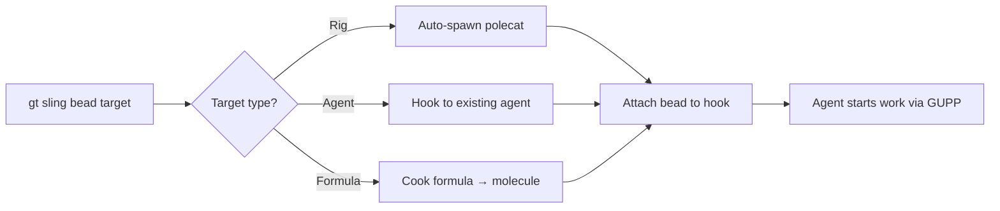
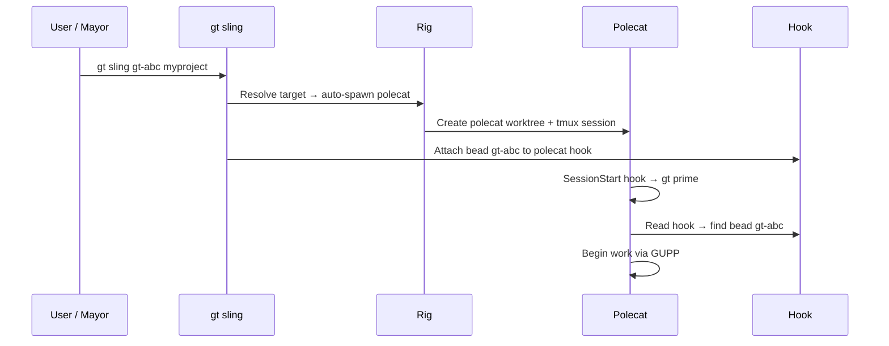
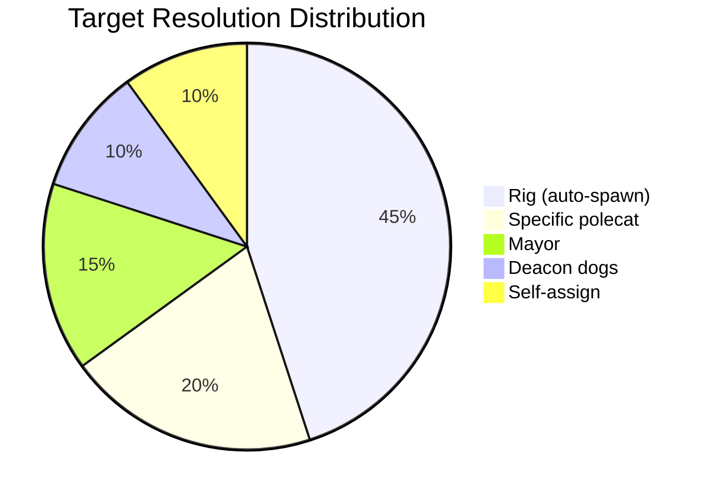
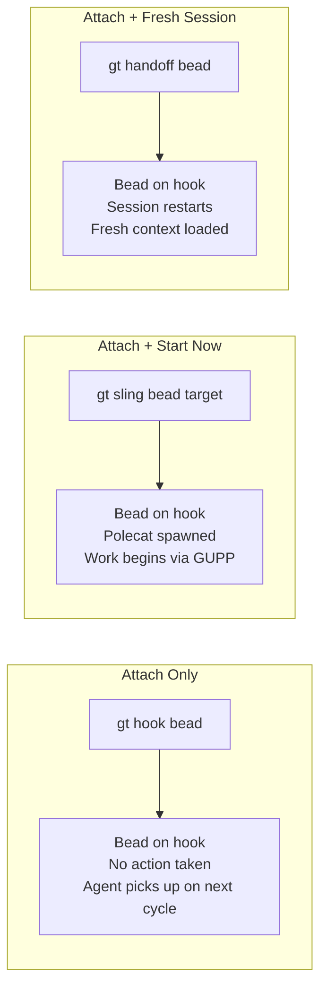

# gt sling

Sling work onto an agent's hook and start working immediately. This is the primary command for assigning work in Gas Town.

```bash
gt sling <bead-or-formula> [target] [flags]
```

## Description



`gt sling` handles the full lifecycle of work assignment:

- **Existing agents** -- sling to mayor, crew, witness, or refinery
- **Auto-spawning polecats** -- when the target is a rig, a new polecat is created
- **Dog dispatch** -- route work to Deacon's helper workers
- **Formula instantiation** -- cook formulas into molecules and attach them
- **Auto-convoy creation** -- ensures all slung work appears in `gt convoy list`

## Target Resolution

The target argument is flexible and resolves based on context:

| Target | Resolves to |
|--------|------------|
| *(none)* | Self (current agent) |
| `crew` | Crew worker in current rig |
| `<rig>` | Auto-spawn polecat in rig |
| `<rig>/<polecat>` | Specific polecat |
| `mayor` | Mayor agent |
| `deacon/dogs` | Auto-dispatch to idle dog |
| `deacon/dogs/<name>` | Specific dog |

:::info
When no target is specified, `gt sling` hooks the work to yourself (the current agent). This is useful for self-assigning work or attaching formulas to your current session. For comprehensive assignment strategies, see [Mastering gt sling](/blog/mastering-gt-sling).
:::

## Flags

| Flag | Short | Description |
|------|-------|-------------|
| `--account <handle>` | | Claude Code account handle to use |
| `--agent <runtime>` | | Override agent/runtime (e.g., `claude`, `gemini`, `codex`, or custom alias) |
| `--args <text>` | `-a` | Natural language instructions for the executor |
| `--create` | | Create polecat if it doesn't exist |
| `--dry-run` | `-n` | Show what would be done without executing |
| `--force` | | Force spawn even if polecat has unread mail |
| `--hook-raw-bead` | | Hook raw bead without default formula (expert mode) |
| `--message <text>` | `-m` | Context message for the work |
| `--no-convoy` | | Skip auto-convoy creation for single-issue sling |
| `--no-merge` | | Skip merge queue on completion (keep work on feature branch for review) |
| `--on <bead>` | | Apply formula to existing bead (implies wisp scaffolding) |
| `--subject <text>` | `-s` | Context subject for the work |
| `--var <key=value>` | | Formula variable (can be repeated) |

## Examples

### Basic work assignment

```bash
# Sling a bead to a rig (auto-spawns a polecat)
gt sling gt-abc myproject

# Sling to a specific polecat
gt sling gt-abc myproject/toast

# Sling to the mayor
gt sling gt-abc mayor
```

### Batch slinging

```bash
# Sling multiple beads to a rig -- each gets its own polecat
gt sling gt-abc gt-def gt-ghi myproject
```

### Natural language instructions

```bash
# Pass context to the executing agent
gt sling gt-abc myproject --args "patch release"
gt sling gt-abc myproject --args "focus on security"
```

### Formula slinging

```bash
# Cook a formula into a molecule and sling it
gt sling mol-release mayor/

# Formula with variables
gt sling towers-of-hanoi --var disks=3

# Apply a formula to an existing bead
gt sling mol-review --on gt-abc

# Apply formula, then sling to a target
gt sling shiny --on gt-abc crew
```

### Spawning options

```bash
# Create polecat if it doesn't exist
gt sling gt-abc myproject --create

# Force spawn even with unread mail
gt sling gt-abc myproject --force

# Use a specific Claude account
gt sling gt-abc myproject --account work
```

### Dry run

```bash
# Preview what would happen
gt sling gt-abc myproject --dry-run
```





The following diagram shows how `gt sling` compares to related work assignment commands.



:::danger

Batch slinging with `--force` bypasses the unread mail check on every target polecat. If a polecat has pending mail containing important handoff context or instructions, forcing a new sling will overwrite its hook and the mail may never be processed. Only use `--force` when you are certain no critical mail is pending.

:::

:::info

When slinging formulas with `--var` to set variables, the variable values are stored in the molecule and accessible to all steps. Use consistent naming conventions for formula variables (e.g., `target`, `scope`, `version`) to make formulas composable and easier to reason about across different instantiations.

:::

## Auto-Convoy

When slinging a single issue (not a formula), `gt sling` automatically creates a convoy to track the work. This ensures all slung work appears in `gt convoy list`, even single assignments. Use `--no-convoy` to skip this.

```bash
gt sling gt-abc myproject              # Creates "Work: <issue-title>" convoy
gt sling gt-abc myproject --no-convoy  # Skip auto-convoy creation
```

:::warning
Avoid slinging more than 5-7 beads simultaneously to a single rig. Too many parallel polecats create resource contention and slower completion times.
:::

:::note

When batch-slinging multiple beads to a rig, each bead gets its own polecat with an independent worktree and session. The polecats work in parallel but share the same merge queue, so completion order depends on both task complexity and Refinery processing speed.

:::

## Comparison with Related Commands

| Command | Behavior |
|---------|----------|
| `gt hook <bead>` | Just attach (no action taken) |
| `gt sling <bead>` | Attach + start now (keep context) |
| `gt handoff <bead>` | Attach + restart (fresh context) |

:::tip

The `--args` string is stored in the bead and shown via `gt prime`. Since the executor is an LLM, it interprets these instructions naturally -- write them as you would explain the task to a person.

:::

## Related

- [Work Distribution](../architecture/work-distribution.md) -- How work flows from beads to agents
- [GUPP (Propulsion Principle)](../concepts/gupp.md) -- The hook-driven execution model that sling triggers
- [Convoy & Tracking](./convoys.md) -- Managing batches of slung work
- [Polecats](../agents/polecats.md) -- Ephemeral workers auto-spawned by sling

### Blog Posts

- [Hook-Driven Architecture: How Gas Town Agents Never Lose Work](/blog/hook-driven-architecture) -- Deep dive into the persistence primitive that sling triggers
- [The Mayor Workflow: Gas Town's Fully Automated Pipeline](/blog/mayor-workflow) -- How the MEOW workflow automates the journey from request to merged code
- [Mastering gt sling](/blog/mastering-gt-sling) -- Practical guide to assignment patterns, cross-rig slinging, and troubleshooting
- [Work Distribution Patterns in Gas Town](/blog/work-distribution-patterns) -- End-to-end patterns for distributing work across rigs and agents using sling
