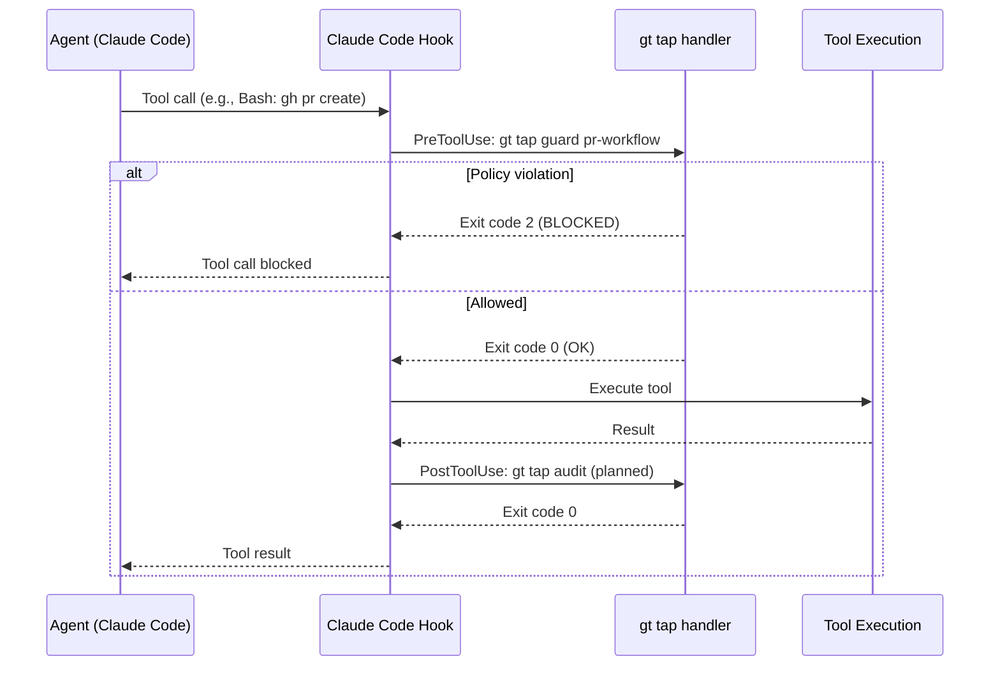
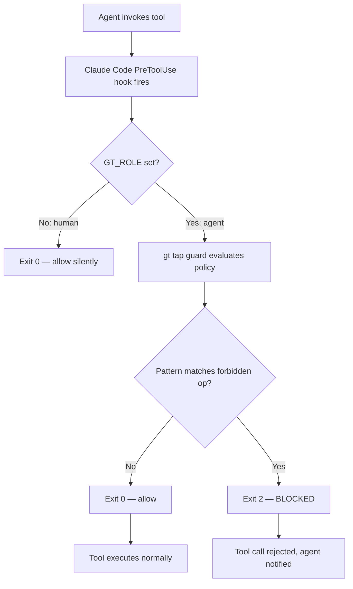
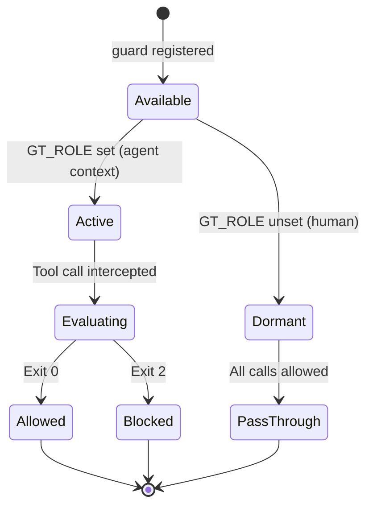

# gt tap

Hook handlers for Claude Code PreToolUse and PostToolUse events.

```bash
gt tap [command]
```

## Description

Tap commands are called by Claude Code hooks to implement policies, auditing, and input transformation. They tap into the tool execution flow to guard, audit, inject, or check.

The tap system uses Claude Code's hook mechanism to intercept tool calls at two points:

- **PreToolUse** — Before a tool executes (can block or modify input)
- **PostToolUse** — After a tool executes (can log or validate output)

| Handler | Hook Type | Purpose | Status |
|---------|-----------|---------|--------|
| `guard` | PreToolUse | Block forbidden operations (exit 2) | Available |
| `audit` | PostToolUse | Log/record tool executions | Planned |
| `inject` | PreToolUse | Modify tool inputs (updatedInput) | Planned |
| `check` | PostToolUse | Validate after execution | Planned |

## How It Works



The tap system sits between Claude Code and tool execution. Each handler is a standalone binary invoked by the hook system, receiving the tool call context via stdin (JSON) and signaling decisions via exit codes.

### Context Detection

Tap handlers check `GT_ROLE` and `GT_SESSION` environment variables to determine if they're running inside a Gas Town agent context. When these variables are absent (e.g., a human running Claude Code directly), all guards pass silently — the tap system never interferes with normal human usage.

:::info
The tap system is invisible to humans. When `GT_ROLE` is unset (normal human usage), all guards pass silently. You'll never be blocked by tap guards outside of Gas Town. For more on how guards integrate with the overall security model, see [Security Model](/blog/security-model).
:::

## Subcommands

| Command | Description |
|---------|-------------|
| [`guard`](#gt-tap-guard) | Block forbidden operations (PreToolUse hook) |

---

## gt tap guard

Block forbidden operations via Claude Code PreToolUse hooks.

```bash
gt tap guard [command]
```

Guard commands exit with code 2 to BLOCK tool execution when a policy is violated. They're called before the tool runs, preventing the forbidden operation entirely.

### Exit Codes

| Code | Meaning |
|------|---------|
| `0` | Operation allowed (not in Gas Town agent context) |
| `2` | Operation **BLOCKED** (policy violation in agent context) |

Guards only activate when running as a Gas Town agent (crew, polecat, witness, etc.). Humans running outside Gas Town are unaffected.

:::warning
Guards that return exit code 2 will **completely block** the tool call. Use guards judiciously — an overly aggressive guard can prevent agents from completing their work.
:::

### Available Guards

| Guard | Description |
|-------|-------------|
| [`pr-workflow`](#gt-tap-guard-pr-workflow) | Block PR creation and feature branches |

---

### gt tap guard pr-workflow

Block PR workflow operations in Gas Town.

```bash
gt tap guard pr-workflow
```

Gas Town workers push directly to main. PRs add friction that breaks the autonomous execution model ([GUPP principle](../concepts/gupp.md)). This guard enforces that pattern by blocking:

- `gh pr create` — PR creation
- `git checkout -b` — Feature branch creation
- `git switch -c` — Feature branch creation

:::note

The `pr-workflow` guard is specific to Gas Town's direct-to-main model. If your rig uses a PR-based workflow (for example, an open-source project with external contributors), you will need to disable or customize this guard in your rig's `.claude/settings.local.json` to avoid blocking legitimate PR creation.

:::

### Hook Configuration

Configure in `.claude/settings.local.json`:

```json
{
  "PreToolUse": [{
    "matcher": "Bash(gh pr create*)",
    "hooks": [{"command": "gt tap guard pr-workflow"}]
  }]
}
```

### Examples

```bash
# Test the guard directly (returns exit code 2 if in agent context)
gt tap guard pr-workflow

# Example: agent tries to create a PR
# Hook intercepts: gt tap guard pr-workflow → exits 2 → tool call BLOCKED
```



:::caution

When writing custom guards, always test them outside Gas Town first by running them manually with sample JSON input on stdin. A guard that exits with a non-zero code other than 2 (such as a syntax error producing exit code 1) will not block the tool call but may produce confusing error messages in the agent's output.

:::



The following diagram shows the planned tap handler pipeline and which hook types each handler uses.

```mermaid
gantt
    title Tap Handler Pipeline
    dateFormat X
    axisFormat %s

    section PreToolUse
    guard — block forbidden ops  :active, 0, 3
    inject — modify tool inputs  :crit, 3, 6

    section Tool Execution
    Tool runs                    :done, 6, 12

    section PostToolUse
    audit — log execution        :active, 12, 15
    check — validate output      :crit, 15, 18
```



:::danger

When testing custom guards, always verify the exit code behavior with `echo $?` immediately after running the guard script. An exit code of 1 (syntax error or uncaught exception) is treated differently from exit code 2 (policy block), and accidentally returning 1 will allow the tool call to proceed while generating confusing error messages.

:::

### Writing Custom Guards

Custom guards follow the same exit code convention. Place them in your PATH and reference them in `.claude/settings.local.json`:

```bash
#!/bin/bash
# my-custom-guard.sh - Block destructive git operations

# Only activate in Gas Town context
[ -z "$GT_ROLE" ] && exit 0

# Read tool input from stdin
INPUT=$(cat)

# Check for destructive patterns
if echo "$INPUT" | grep -qE "git (reset --hard|clean -fd|push --force)"; then
  echo "BLOCKED: Destructive git operation not allowed" >&2
  exit 2
fi

exit 0
```

```json
{
  "PreToolUse": [{
    "matcher": "Bash(git *)",
    "hooks": [{"command": "/path/to/my-custom-guard.sh"}]
  }]
}
```

:::tip

See the [Operations Guide](../operations/troubleshooting.md) and [Lifecycle Management](../operations/lifecycle.md) for more on how hooks integrate with the Gas Town agent lifecycle.

:::

## Related

- [Git Workflow Guide](../guides/git-workflow.md) -- Why Gas Town uses direct-to-main instead of PRs
- [GUPP (Propulsion Principle)](../concepts/gupp.md) -- The autonomous execution model that tap guards enforce

### Blog Posts

- [Monitoring Your Gas Town Fleet](/blog/monitoring-fleet) -- Practical guide to monitoring agent health, tracking work progress, and catching problems early
- [Cost Tracking and Optimization in Gas Town](/blog/cost-optimization) -- Using tap and feed data to monitor costs and optimize agent spending
- [Hook-Driven Architecture: How Gas Town Agents Never Lose Work](/blog/hook-driven-architecture) -- How the hook system integrates with tap guards to enforce policy at the tool execution layer
- [Gas Town's Security Model](/blog/security-model) -- How tap guards fit into the broader security architecture of trust boundaries and permission scoping
