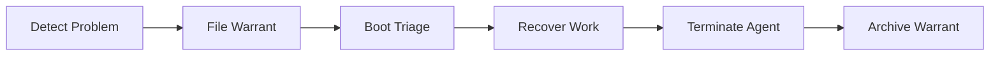

# gt warrant

Manage death warrants for agents that need termination.

Death warrants provide a controlled way to terminate agents that are stuck, unresponsive, or otherwise need forced termination. The warrant system ensures proper cleanup and work recovery before killing an agent.

## Warrant Lifecycle



1. **Deacon/Witness files a warrant** with a reason (e.g., "agent stuck in loop for 30 minutes")
2. **Boot picks up the warrant** during its triage cycle
3. **Boot recovers in-progress work** — commits, pushes, or releases hooked beads
4. **Boot terminates the session** — kills the tmux session and cleans up worktree
5. **Warrant is marked as executed** and archived

Warrants are stored as JSON files in `~/gt/warrants/`.

## Commands

### `gt warrant file`

File a death warrant for an agent.

```bash
gt warrant file --agent gastowndocs/polecats/alpha --reason "Stuck in infinite loop"
gt warrant file --agent gastowndocs/polecats/bravo --reason "Zombie: session gone but state shows running"
```

**Options:**

| Flag | Description |
|------|-------------|
| `--agent <path>` | Full agent path (e.g., `gastowndocs/polecats/alpha`) |
| `--reason <text>` | Human-readable reason for the warrant |
| `--priority <level>` | Urgency: `normal` (default), `urgent` |

### `gt warrant list`

List pending warrants that haven't been executed yet.

```bash
gt warrant list
gt warrant list --all         # Include executed warrants
```

**Example output:**

```
WARRANT ID   AGENT                           REASON                    FILED
w-abc123     gastowndocs/polecats/alpha      Stuck in infinite loop    14:30
w-def456     gastowndocs/polecats/bravo      Zombie: session gone      14:35
```

### `gt warrant execute`

Execute a warrant — recover work, terminate the agent, clean up.

```bash
gt warrant execute <warrant-id>
gt warrant execute w-abc123
```

This is normally done by Boot automatically, but can be run manually for immediate intervention.

### `gt warrant cancel`

Cancel a pending warrant before it is executed.

```bash
gt warrant cancel <warrant-id>
```

Use this if the agent recovered on its own before Boot processed the warrant.

## When Warrants Are Filed

Warrants are typically filed automatically by [patrol agents](../concepts/patrol-cycles.md) when they detect:

| Condition | Filed By | Typical Threshold |
|-----------|----------|-------------------|
| **Zombie processes** | Deacon | Session gone, state still "running" |
| **Infinite loops** | Witness | Same state for 30+ minutes after nudge |
| **Resource exhaustion** | Witness | Excessive tokens without progress |
| **Stale sessions** | Deacon | Exceeds maximum age without cycling |
| **Unresponsive after nudge** | Witness | No response within 2 patrol cycles |

### Manual Warrants

You can also file warrants manually for agents that the automated system hasn't caught:

```bash
# Polecat that's clearly stuck
gt warrant file --agent gastowndocs/polecats/alpha --reason "Stuck retrying failed API call"

# Check pending warrants
gt warrant list

# If you need immediate action, execute directly
gt warrant execute w-abc123
```

## Work Recovery

Before terminating an agent, Boot attempts to recover any in-progress work:

1. **Check for uncommitted changes** — commit and push if possible
2. **Release hooked beads** — `bd release` returns beads to the ready queue
3. **Update molecule state** — mark current step as `failed` so the next agent knows
4. **Clean up worktree** — remove the polecat's sandbox directory
5. **Send notification** — mail the Witness that the warrant was executed

If work recovery fails (e.g., merge conflicts), Boot files a follow-up bead for manual intervention.

## See Also

- **[Lifecycle](../operations/lifecycle.md)** -- Agent lifecycle management including death warrants
- **[Boot](../agents/boot.md)** -- The triage agent that processes warrants
- **[Deacon](../agents/deacon.md)** -- Files warrants when agents need termination
- **[Patrol Cycles](../concepts/patrol-cycles.md)** -- The monitoring pattern that detects warrant-worthy conditions
- **[Polecat Commands](polecat-commands.md)** -- Manual polecat management as an alternative to warrants
