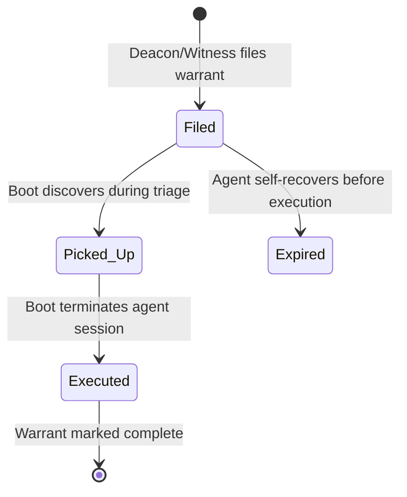
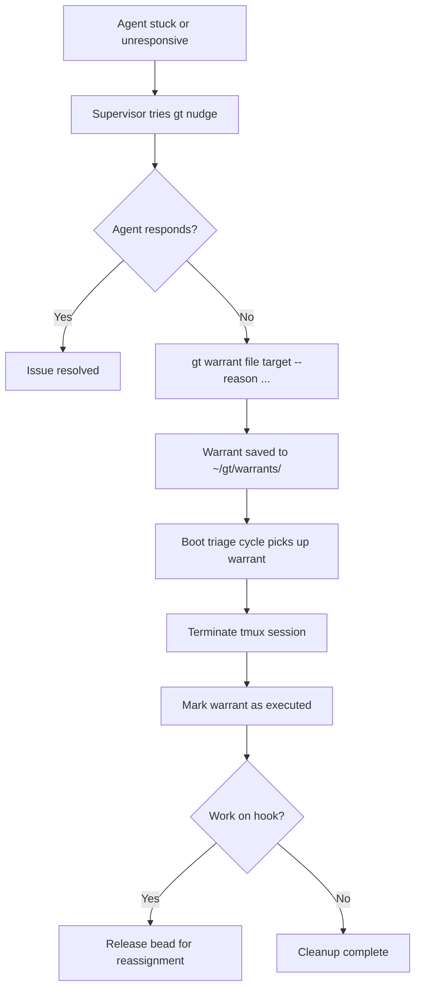
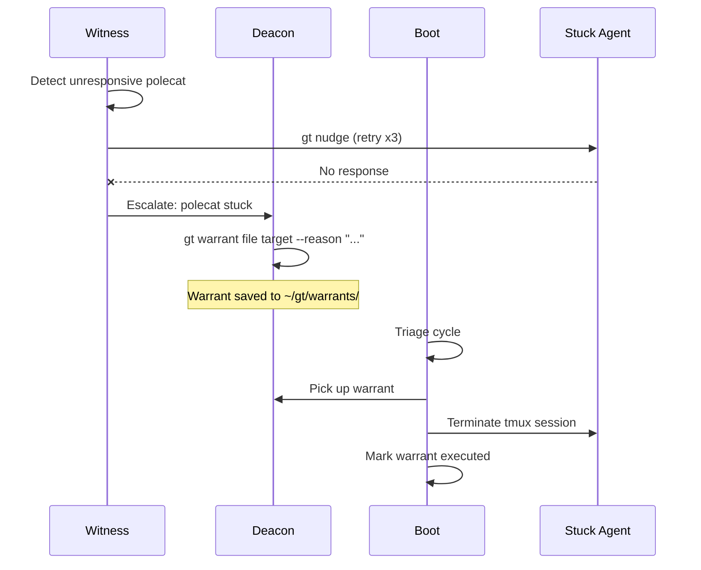
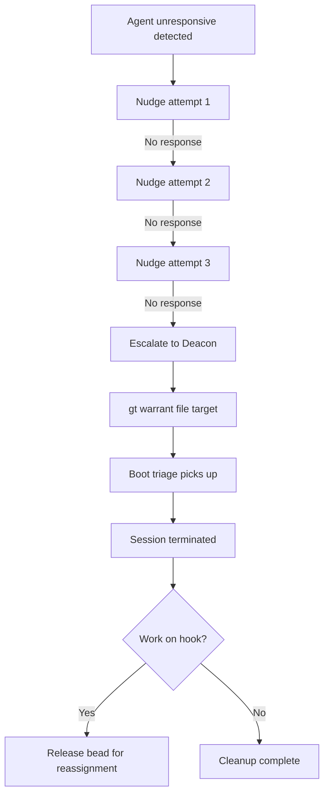
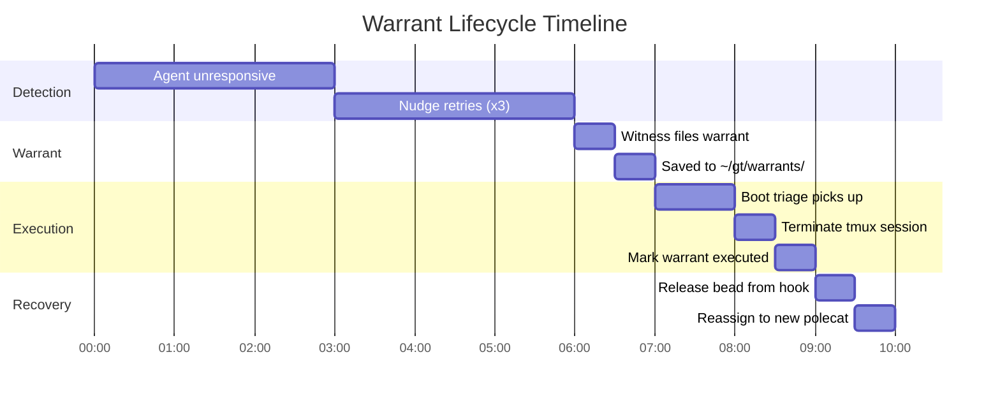

# gt warrant

Manage death warrants for agents that need termination.

```bash
gt warrant [command]
```

## Description

Death warrants are filed when an agent is stuck, unresponsive, or needs forced termination. Boot handles warrant execution during triage cycles.

The warrant lifecycle:

1. **Deacon/Witness files a warrant** with a reason
2. **Boot picks up the warrant** during triage
3. **Boot executes the warrant** (terminates session, updates state)
4. **Warrant is marked as executed**

Warrants are stored in `~/gt/warrants/` as JSON files.

### Warrant Lifecycle



### When Warrants Are Filed

Warrants are filed automatically by the supervision chain:

| Filed By | Reason | Example |
|----------|--------|---------|
| **Witness** | Polecat unresponsive after repeated nudges | Polecat has no output for 15+ minutes |
| **Deacon** | Patrol agent (Witness/Refinery) stuck | Witness hasn't patrolled in 3+ cycles |
| **Human** | Manual intervention needed | Agent in bad state after infrastructure failure |

:::note
Warrants are a last resort. The supervision chain always tries nudging and escalation before filing a warrant. Most agent issues resolve without termination. For a complete overview of the escalation system, see [Escalation System](/blog/escalation-system).
:::

### Warrant Storage Format

Each warrant is a JSON file in `~/gt/warrants/`:

```json
{
  "target": "gastowndocs/polecats/alpha",
  "reason": "Zombie: no session, idle >10m",
  "filed_by": "gastowndocs/witness",
  "filed_at": "2026-02-13T14:30:00Z",
  "executed": false,
  "executed_at": null
}
```

## Subcommands

| Command | Description |
|---------|-------------|
| [`file`](#gt-warrant-file) | File a death warrant for an agent |
| [`list`](#gt-warrant-list) | List pending warrants |
| [`execute`](#gt-warrant-execute) | Execute a warrant (terminate agent) |

---

## gt warrant file

File a death warrant for an agent that needs termination.

```bash
gt warrant file <target> [flags]
```

The target should be an agent path like `gastown/polecats/alpha` or `deacon/dogs/bravo`.

**Flags:**

| Flag | Short | Description |
|------|-------|-------------|
| `--reason <text>` | `-r` | Reason for the warrant (required unless `--stdin`) |
| `--stdin` | | Read reason from stdin (avoids shell quoting issues) |

**Examples:**

```bash
gt warrant file gastown/polecats/alpha --reason "Zombie: no session, idle >10m"
gt warrant file deacon/dogs/bravo --reason "Stuck: working on task for >2h"
```

---

## gt warrant list

List all pending (unexecuted) warrants.

```bash
gt warrant list [flags]
```

**Flags:**

| Flag | Short | Description |
|------|-------|-------------|
| `--all` | `-a` | Include executed warrants |

**Examples:**

```bash
gt warrant list
gt warrant list --all
```

---

## gt warrant execute

Execute a pending warrant for the specified target.

```bash
gt warrant execute <target> [flags]
```

This will:

1. Find the warrant for the target
2. Terminate the agent's tmux session (if exists)
3. Mark the warrant as executed

**Flags:**

| Flag | Short | Description |
|------|-------|-------------|
| `--force` | `-f` | Execute even without a warrant |

**Examples:**

```bash
gt warrant execute gastown/polecats/alpha
gt warrant execute deacon/dogs/bravo --force
```

:::warning

Using `--force` bypasses the warrant system entirely. Only use this for emergency termination when you can't wait for the normal warrant flow.

:::

## Troubleshooting

:::tip
Before filing a manual warrant, try `gt nudge <agent> "status?"` first. Many "stuck" agents are simply waiting for a slow operation to complete.
:::

### Warrant Not Being Executed

If a warrant sits in `pending` state:

1. **Is Boot running?** Boot executes warrants during triage cycles. Check: `gt daemon status`
2. **Is the Deacon alive?** Boot is triggered by Deacon triage. Check: `gt deacon status`
3. **Manual execution**: If Boot is unavailable, execute directly: `gt warrant execute <target>`



:::danger

Never manually delete warrant JSON files from `~/gt/warrants/` to "clean up" executed warrants. The Deacon uses executed warrant records to track termination history and detect agents that repeatedly fail. Deleting these records can cause the Deacon to lose context about recurring problems.

:::



:::info

Warrants are idempotent: filing a second warrant for a target that already has a pending warrant will not create a duplicate. The existing warrant is returned instead. This prevents accidental double-termination when multiple supervisors detect the same stuck agent.

:::

The following diagram shows how the supervision chain escalates before resorting to a death warrant.



:::note

Executed warrants are not automatically cleaned up from `~/gt/warrants/`. The Deacon maintains a history of executed warrants for forensic analysis and pattern detection. If the warrants directory grows large (>1000 files), use the Deacon's built-in pruning during patrol cycles or manually archive old executed warrants to a separate directory.

:::



### Agent Keeps Respawning After Warrant

If an agent is terminated but respawns immediately:

- The Witness may be respawning the polecat because it sees work on the hook
- Clear the hook first: `gt hook clear --target <agent>`, then re-file the warrant
- Consider parking the rig temporarily: `gt rig park <rig>`

## Related

- [Boot](../agents/boot.md) -- Infrastructure helper that executes warrants during triage
- [Deacon](../agents/deacon.md) -- Health-check orchestrator that files warrants
- [Witness](../agents/witness.md) -- Polecat monitor that escalates stuck agents
- [Lifecycle Management](../operations/lifecycle.md) -- Agent lifecycle and termination flows

### Blog Posts

- [Death Warrants: How Gas Town Terminates Stuck Agents](/blog/death-warrants) -- How the warrant system provides structured termination with work recovery
- [Gas Town's Security Model: Trust Boundaries for AI Agents](/blog/security-model) -- How Gas Town implements security through workspace isolation, permission scoping, and trust boundaries
- [Incident Response in Gas Town](/blog/incident-response) -- How to respond when agents get stuck, including warrant filing, escalation, and recovery procedures
- [The Witness Explained](/blog/witness-explained) -- How the Witness detects stuck agents and files warrants as part of its patrol cycle
