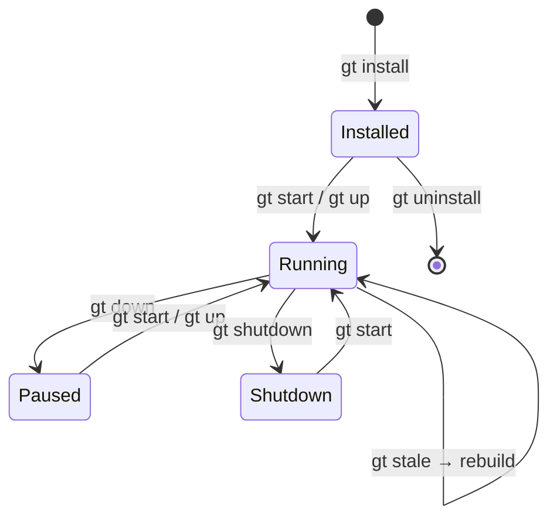
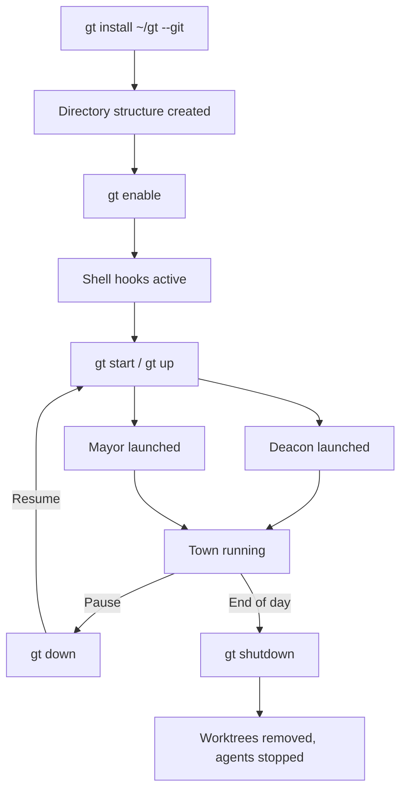
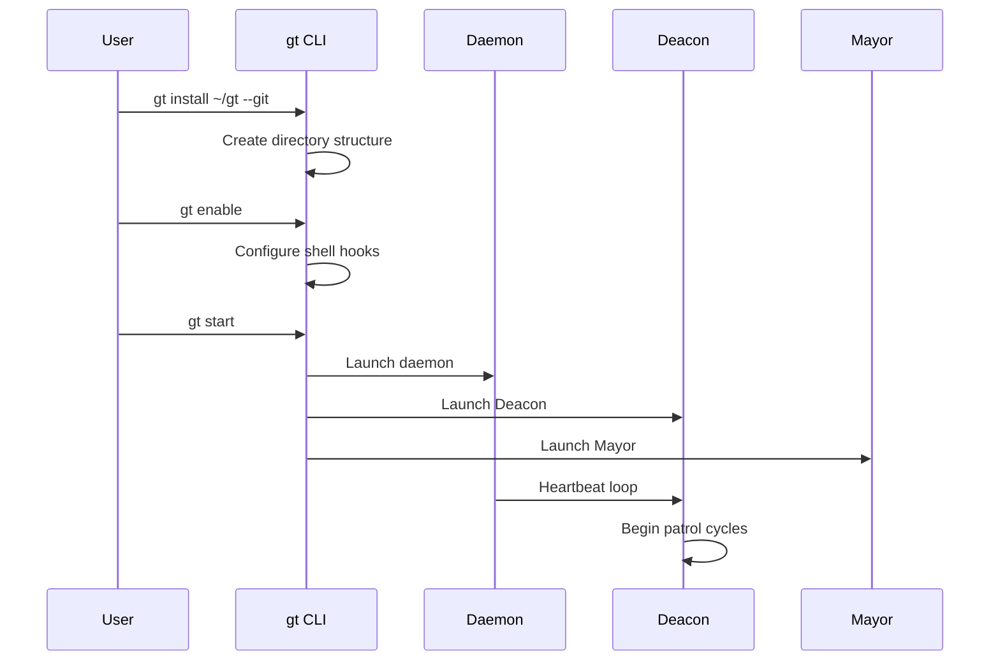

# Workspace Management

Commands for installing, initializing, and managing your Gas Town workspace (the "Town"). These commands handle the foundational setup that all other operations depend on.



---

## `gt install`

Create a new Gas Town workspace.

```bash
gt install <directory> [options]
```

**Description:** Initializes a new town directory with all required structure including `.beads/`, `mayor/`, `deacon/`, `settings/`, and configuration files. This is typically the first command you run.

**Options:**

| Flag | Description |
|------|-------------|
| `--git` | Initialize a git repository in the workspace |
| `--force` | Overwrite an existing workspace |
| `--agent <runtime>` | Set default agent runtime (default: `claude`) |
| `--no-daemon` | Skip daemon setup |

**Example:**

```bash
# Standard installation with git
gt install ~/gt --git

# Install with Gemini as default agent
gt install ~/gt --git --agent gemini
```

**Created structure:**

```text
~/gt/
├── .beads/          # Town-level issue tracking
├── .claude/         # Claude Code integration
├── mayor/           # Mayor agent context
├── deacon/          # Deacon agent context
├── settings/        # Configuration files
├── scripts/         # Utility scripts
├── plugins/         # Town-level plugins
├── CLAUDE.md        # Project context file
└── .events.jsonl    # Activity log
```

:::warning

Running `gt install` on an existing workspace without `--force` will abort to prevent accidental data loss.

:::

---

## `gt init`

Initialize Gas Town in an existing directory.

```bash
gt init [options]
```

**Description:** Sets up Gas Town structure in the current directory without creating a new directory. Useful for adding Gas Town to an existing project layout.

**Options:**

| Flag | Description |
|------|-------------|
| `--git` | Initialize a git repository |
| `--force` | Overwrite existing Gas Town configuration |
| `--minimal` | Create only essential directories |

**Example:**

```bash
cd ~/my-workspace
gt init --git
```

---

## `gt uninstall`

Remove Gas Town from a workspace.

```bash
gt uninstall [directory] [options]
```

**Description:** Removes Gas Town configuration and infrastructure from a workspace. Does not remove your project source code or git repositories by default.

**Options:**

| Flag | Description |
|------|-------------|
| `--all` | Remove everything including rig source directories |
| `--keep-beads` | Preserve the beads database |
| `--force` | Skip confirmation prompts |
| `--dry-run` | Show what would be removed without removing it |

**Example:**

```bash
# Remove Gas Town but keep project files
gt uninstall ~/gt

# Full removal
gt uninstall ~/gt --all --force
```

:::danger

Using `--all` permanently deletes all rig data, worktrees, and agent state. This cannot be undone.

:::

---

## `gt git-init`

Initialize or repair git configuration for a Gas Town workspace.

```bash
gt git-init [options]
```

**Description:** Sets up git tracking for the town workspace, including `.gitignore` rules, `.gitattributes`, and initial commit structure. Also useful for repairing corrupted git state.

**Options:**

| Flag | Description |
|------|-------------|
| `--repair` | Repair existing git configuration |
| `--force` | Overwrite existing git setup |

**Example:**

```bash
# Initialize git in an existing town
gt git-init

# Repair corrupted git state
gt git-init --repair
```

---





## `gt enable`

Enable Gas Town for all agentic coding tools.

```bash
gt enable
```

**Description:** Activates Gas Town system-wide. When enabled, shell hooks set `GT_TOWN_ROOT` and `GT_RIG` environment variables, Claude Code `SessionStart` hooks run `gt prime` for context, and git repos are auto-registered as rigs.

Use environment variables for per-session overrides: `GASTOWN_DISABLED=1` to disable, `GASTOWN_ENABLED=1` to enable.

**Example:**

```bash
gt enable
```

---

## `gt disable`

Disable Gas Town for all agentic coding tools.

```bash
gt disable [options]
```

**Description:** Disables Gas Town system-wide. When disabled, shell hooks become no-ops, Claude Code `SessionStart` hooks skip `gt prime`, and tools work vanilla without Gas Town behavior. The workspace (`~/gt`) is preserved.

**Options:**

| Flag | Description |
|------|-------------|
| `--clean` | Also remove shell integration from `~/.zshrc`/`~/.bashrc` |

**Example:**

```bash
# Disable Gas Town
gt disable

# Disable and remove shell integration
gt disable --clean
```

---

## `gt stale`

Check if the `gt` binary needs rebuilding.

```bash
gt stale [options]
```

**Description:** Compares the commit hash embedded in the binary at build time with the current HEAD of the gastown repository. Reports whether the binary is out of date.

**Options:**

| Flag | Description |
|------|-------------|
| `--json` | Output as JSON |
| `--quiet`, `-q` | Exit code only (0=stale, 1=fresh) |

**Exit codes:**

| Code | Meaning |
|------|---------|
| `0` | Binary is stale (needs rebuild) |
| `1` | Binary is fresh (up to date) |
| `2` | Error (could not determine staleness) |

**Example:**

```bash
# Check if binary is stale
gt stale

# Machine-readable output
gt stale --json

# Script-friendly check
gt stale --quiet && echo "Rebuild needed"
```

---

## `gt info`

Display Gas Town version and release notes.

```bash
gt info [options]
```

**Description:** Shows the current Gas Town version and optionally displays agent-relevant changes from recent versions.

**Options:**

| Flag | Description |
|------|-------------|
| `--json` | Output in JSON format |
| `--whats-new` | Show agent-relevant changes from recent versions |

**Example:**

```bash
# Show version info
gt info

# Show what's new
gt info --whats-new

# Machine-readable output
gt info --whats-new --json
```

---

## `gt help`

Display help information for any command.

```bash
gt help [command] [subcommand]
```

**Description:** Shows usage, options, and examples for any `gt` command. When called without arguments, displays the top-level help with all available commands.

**Example:**

```bash
# Top-level help
gt help

# Help for a specific command
gt help sling

# Help for a subcommand
gt help convoy create

# Alternative syntax
gt convoy create --help
```

---

## `gt completion`

Generate shell completion scripts.

```bash
gt completion <shell>
```

**Description:** Generates tab-completion scripts for bash, zsh, fish, or PowerShell. These scripts enable tab completion for all `gt` commands, subcommands, and flags.

**Supported shells:** `bash`, `zsh`, `fish`, `powershell`

**Example:**

```bash
# Bash
gt completion bash > /etc/bash_completion.d/gt

# Zsh
gt completion zsh > "${fpath[1]}/_gt"

# Fish
gt completion fish > ~/.config/fish/completions/gt.fish

# PowerShell
gt completion powershell > gt.ps1
```

:::tip

After installing completions, restart your shell or source the completion file for immediate effect.

:::

---

## `gt shell`

Launch an interactive Gas Town shell.

```bash
gt shell [options]
```

**Description:** Opens an interactive shell session with Gas Town context pre-loaded. Provides enhanced tab completion, prompt integration showing current rig and agent status, and shorthand command aliases.

**Options:**

| Flag | Description |
|------|-------------|
| `--rig <name>` | Start in the context of a specific rig |
| `--role <agent>` | Set the shell role identity |

**Example:**

```bash
# Launch Gas Town shell
gt shell

# Launch in context of a specific rig
gt shell --rig myproject
```

:::note

The Gas Town shell sets the `GT_ROLE` environment variable and configures the prompt to show your current context.

:::

## Related

- [Installation](../getting-started/installation.md) -- Step-by-step setup guide for new users
- [Quick Start](../getting-started/quickstart.md) -- From zero to running Gas Town
- [Rigs](../concepts/rigs.md) -- Project containers managed within the workspace
- [Architecture Overview](../architecture/overview.md) -- How the workspace fits into the larger system

### Blog Posts

- [Why Git Worktrees? Gas Town's Isolation Strategy](/blog/git-worktrees) -- How Gas Town uses git worktrees to isolate parallel agent workspaces
- [The Crew Workflow: Human Developers in Gas Town](/blog/crew-workflow) -- How human developers work alongside AI agents using persistent crew workspaces
- [Welcome to Gas Town](/blog/welcome) -- Getting started with your Gas Town workspace, from installation to your first running town
- [Gas Town vs CI/CD](/blog/gas-town-vs-cicd) -- How Gas Town's workspace model differs from traditional CI/CD pipelines and when to use each

---

## `gt version`

Print Gas Town version information.

```bash
gt version
```

**Example:**

```bash
gt version
```

---

## `gt status`

Display overall town status.

```bash
gt status [options]
```

**Description:** Shows town name, registered rigs, active polecats, and agent status at a glance.

**Options:**

| Flag | Description |
|------|-------------|
| `--fast` | Skip mail lookups for faster execution |
| `--json` | Output as JSON |
| `--verbose`, `-v` | Show detailed multi-line output per agent |
| `--watch`, `-w` | Watch mode: refresh status continuously |
| `--interval`, `-n` | Refresh interval in seconds (default: `2`) |

**Example:**

```bash
# Quick status
gt status

# Watch mode
gt status --watch

# Fast mode (skip mail)
gt status --fast
```

---

## `gt whoami`

Show the identity used for mail commands.

```bash
gt whoami
```

**Description:** Displays the current identity determined by the `GT_ROLE` environment variable. If `GT_ROLE` is set, you are an agent. If not, you are the overseer (human).

**Example:**

```bash
gt whoami
```

---

## Services

Commands for managing Gas Town background services and infrastructure.

## `gt start`

Start Gas Town by launching the Deacon and Mayor.

```bash
gt start [path] [options]
```

**Description:** Launches the Deacon (health-check orchestrator) and Mayor (global coordinator). Other agents (Witnesses, Refineries) are started lazily as needed. If a path like `rig/crew/name` is provided, starts that crew workspace instead.

**Options:**

| Flag | Description |
|------|-------------|
| `--agent <runtime>` | Agent alias to run Mayor/Deacon with |
| `--all`, `-a` | Also start Witnesses and Refineries for all rigs |

**Example:**

```bash
# Start Gas Town
gt start

# Start with all rig agents
gt start --all

# Start a crew workspace
gt start myproject/crew/dave
```

---

## `gt up`

Bring up all Gas Town long-lived services.

```bash
gt up [options]
```

**Description:** Idempotent boot command that ensures all infrastructure agents are running: Daemon, Deacon, Mayor, Witnesses, and Refineries. Polecats are NOT started (they are transient workers spawned on demand). Running `gt up` multiple times is safe.

**Options:**

| Flag | Description |
|------|-------------|
| `--quiet`, `-q` | Only show errors |
| `--restore` | Also restore crew (from settings) and polecats (from hooks) |

**Example:**

```bash
gt up
gt up --restore
```

---

## `gt down`

Stop Gas Town services (reversible pause).

```bash
gt down [options]
```

**Description:** Stops infrastructure agents (Refineries, Witnesses, Mayor, Boot, Deacon, Daemon). This is a "pause" operation -- use `gt start` to bring everything back up. For permanent cleanup, use `gt shutdown` instead.

**Options:**

| Flag | Description |
|------|-------------|
| `--polecats`, `-p` | Also stop all polecat sessions |
| `--all`, `-a` | Also stop bd daemons/activity and verify shutdown |
| `--nuke` | Kill entire tmux server (DESTRUCTIVE -- kills non-GT sessions) |
| `--force`, `-f` | Force kill without graceful shutdown |
| `--quiet`, `-q` | Only show errors |
| `--dry-run` | Preview what would be stopped |

**Example:**

```bash
# Pause infrastructure
gt down

# Stop everything including polecats
gt down --polecats

# Preview what would stop
gt down --dry-run
```

:::warning

`gt down --nuke` kills the entire tmux server, including non-Gas Town sessions. Use with care.

:::

---

## `gt shutdown`

Shut down Gas Town with full cleanup.

```bash
gt shutdown [options]
```

**Description:** The "done for the day" command. Stops all agents, cleans up polecat worktrees and branches, and puts the town in a fully stopped state. Polecats with uncommitted work are protected (skipped) unless `--nuclear` is used.

**Options:**

| Flag | Description |
|------|-------------|
| `--all`, `-a` | Also stop crew sessions |
| `--polecats-only` | Only stop polecats (minimal shutdown) |
| `--force`, `-f` | Skip confirmation prompt |
| `--yes`, `-y` | Skip confirmation prompt |
| `--graceful`, `-g` | Allow agents time to save state before killing |
| `--wait`, `-w` | Seconds to wait for graceful shutdown (default: `30`) |
| `--nuclear` | Force cleanup even if polecats have uncommitted work (DANGER) |
| `--cleanup-orphans` | Clean up orphaned Claude processes |
| `--cleanup-orphans-grace-secs` | Grace period between SIGTERM and SIGKILL (default: `60`) |

**Comparison with `gt down`:**

| | `gt down` | `gt shutdown` |
|---|-----------|--------------|
| Stops agents | Yes | Yes |
| Removes worktrees | No | Yes |
| Reversible | Yes (`gt start`) | Permanent cleanup |

**Example:**

```bash
# Standard shutdown
gt shutdown

# Graceful shutdown with drain
gt shutdown --graceful

# Shutdown including crew
gt shutdown --all --force
```

:::danger

`gt shutdown --nuclear` forces cleanup even when polecats have uncommitted work. This may result in lost work.

:::

---

## `gt daemon`

Manage the Gas Town background daemon.

```bash
gt daemon <subcommand>
```

**Description:** The daemon is a Go background process that pokes agents periodically (heartbeat), processes lifecycle requests, and restarts sessions when agents request cycling. It is a "dumb scheduler" -- all intelligence is in the agents.

**Subcommands:**

| Subcommand | Description |
|------------|-------------|
| `gt daemon start` | Start the daemon |
| `gt daemon stop` | Stop the daemon |
| `gt daemon status` | Show daemon status |
| `gt daemon logs` | View daemon logs |

**Example:**

```bash
gt daemon status
gt daemon logs
```

---

## `gt dolt`

Manage the Dolt SQL server for beads.

```bash
gt dolt <subcommand>
```

**Description:** The Dolt server provides multi-client access to all rig databases, avoiding the single-writer limitation of embedded Dolt mode. Runs on port 3307 (to avoid conflicts with MySQL on 3306).

**Subcommands:**

| Subcommand | Description |
|------------|-------------|
| `gt dolt start` | Start the Dolt server |
| `gt dolt stop` | Stop the Dolt server |
| `gt dolt status` | Show Dolt server status |
| `gt dolt logs` | View Dolt server logs |
| `gt dolt sql` | Open Dolt SQL shell |
| `gt dolt list` | List available rig databases |
| `gt dolt init-rig` | Initialize a new rig database |
| `gt dolt migrate` | Migrate existing databases to centralized data directory |

**Example:**

```bash
gt dolt status
gt dolt sql
gt dolt list
```

---

## `gt namepool`

Manage themed name pools for polecats.

```bash
gt namepool [subcommand] [options]
```

**Description:** Polecats get themed names from a pool (default: Mad Max universe, e.g., furiosa, nux, slit). You can change the theme or add custom names.

**Subcommands:**

| Subcommand | Description |
|------------|-------------|
| `gt namepool themes` | List available themes and their names |
| `gt namepool set <theme>` | Set the namepool theme for this rig |
| `gt namepool add <name>` | Add a custom name to the pool |
| `gt namepool reset` | Reset the pool state (release all names) |

**Options:**

| Flag | Description |
|------|-------------|
| `--list`, `-l` | List available themes |

**Example:**

```bash
# Show current pool status
gt namepool

# List available themes
gt namepool themes

# Set theme to minerals
gt namepool set minerals

# Add a custom name
gt namepool add ember

# Reset pool state
gt namepool reset
```

---

## `gt worktree`

Create a git worktree in another rig for cross-rig work.

```bash
gt worktree <rig> [options]
```

**Description:** For crew workers who need to work on another rig's codebase while maintaining their identity. Creates a worktree in the target rig's `crew/` directory named after your source rig and identity.

**Subcommands:**

| Subcommand | Description |
|------------|-------------|
| `gt worktree list` | List all cross-rig worktrees owned by current crew member |
| `gt worktree remove` | Remove a cross-rig worktree |

**Options:**

| Flag | Description |
|------|-------------|
| `--no-cd` | Just print the path (do not print cd command) |

**Example:**

```bash
# Create worktree in beads rig
gt worktree beads

# List your cross-rig worktrees
gt worktree list

# Remove a worktree
gt worktree remove beads
```