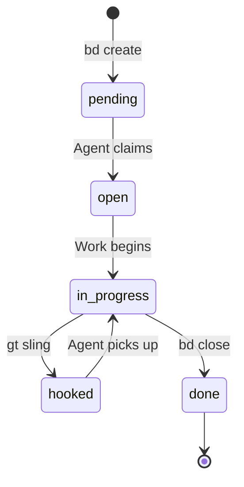

# Beads (Issue Tracking)

Beads is Gas Town's **AI-native, git-backed issue tracking system**. Instead of a web-based project board, issues live directly in your repository as structured data, managed entirely through the `bd` CLI. This design makes Beads seamlessly usable by AI coding agents that work through the terminal.

---

## Why Beads?

Traditional issue trackers are designed for humans clicking through web UIs. Beads is designed for AI agents executing terminal commands:

| Traditional Trackers | Beads |
|---------------------|-------|
| Web UI required | CLI-first (`bd` command) |
| External service dependency | Lives in your git repo |
| Context switching to browser | Stays in the terminal |
| Manual sync with code | Automatic git sync |
| Human-oriented workflows | AI-agent-native workflows |

:::info[Repository]

Beads is an open-source project. Learn more at [github.com/steveyegge/beads](https://github.com/steveyegge/beads).

:::

## Architecture

### Storage Backend

Beads stores issues in a **SQLite database** located in the `.beads/` directory at the root of each repository (or town):

```
.beads/
├── beads.db           # SQLite database (primary store)
├── formulas/          # TOML workflow templates
├── README.md          # Onboarding documentation
└── daemon.log         # Daemon activity log
```

The SQLite backend enables fast queries, filtering, and complex joins while remaining portable and easy to back up through git.

### Git Integration

Beads synchronizes with git automatically:

- **`bd sync`** pushes and pulls bead state to/from the remote
- Bead operations are local-first -- they work offline and sync when connected
- The `.beads/` directory is committed alongside your code
- Merge conflicts in bead data are resolved intelligently

## Bead Types

Every bead has a **type** that determines its semantics:

| Type | Purpose | Example |
|------|---------|---------|
| `task` | General work item | "Refactor auth module" |
| `bug` | Defect report | "Login fails with special characters" |
| `feature` | New functionality | "Add email notifications" |
| `message` | Communication record | Internal agent message |
| `escalation` | Priority alert | "CI broken for 2 hours" |
| `merge-request` | Merge queue entry | Polecat branch ready for merge |
| `agent` | Agent state bead | Polecat runtime status |
| `convoy` | Batch tracking | Group of related issues (see [Convoys](convoys.md)) |
| `wisp` | Ephemeral tracking | Temporary [molecule](molecules.md) step |

## Bead Status

Beads progress through a defined lifecycle:



| Status | Meaning | Typical Transition |
|--------|---------|-------------------|
| `pending` | Created, not yet assigned | Initial state after `bd create` |
| `open` | Acknowledged, ready for work | Agent or human claims it |
| `in_progress` | Actively being worked on | Agent starts implementation |
| `hooked` | Attached to an agent's [hook](hooks.md) | After `gt sling` assigns it |
| `done` | Completed and closed | After `bd close` or merge |

## Labels, Priorities, and Dependencies

### Labels

Labels are free-form tags that categorize beads:

```bash
bd create --title "Fix auth bug" --labels "auth,security,p1"
bd list --labels "security"
```

### Priorities

Priority levels control escalation routing and work ordering:

| Priority | Code | Escalation Route |
|----------|------|-----------------|
| Critical | P0 | Bead, Mail:Mayor, Email:Human, SMS:Human |
| High | P1 | Bead, Mail:Mayor, Email:Human |
| Medium | P2 | Bead, Mail:Mayor |
| Low | P3 | Bead only |

```bash
bd create --title "Security vulnerability" --priority 0
bd create --title "Minor UI glitch" --priority 3
```

### Dependencies

Beads can declare dependencies on other beads, enabling automatic unblocking when prerequisites complete:

```bash
# Create a dependent bead
bd create --title "Deploy to prod" --depends-on gt-a1b2c

# Check blocked issues
bd blocked
```

## Cross-Project Tracking

Beads supports **cross-prefix tracking**, allowing issues in different rigs to reference each other. Each rig has its own bead prefix (configured in `config.json`):

```
Town (.beads/)  prefix: hq-
Rig A (.beads/) prefix: gt-
Rig B (.beads/) prefix: bd-
```

A [convoy](convoys.md) with ID `hq-cv-001` can track issues `gt-a1b2c` and `bd-d3e4f` across both [rigs](rigs.md). Dependencies also work cross-prefix.

## Essential Commands

### Creating Beads

```bash
# Simple creation
bd create "Add user authentication"

# Full creation with metadata
bd create --title "Fix login bug" \
  --type bug \
  --priority 1 \
  --labels "auth,critical" \
  --description "Login fails when password contains special characters"
```

### Listing and Filtering

```bash
# List all open beads
bd list

# Filter by status
bd list --status in_progress

# Filter by type and labels
bd list --type bug --labels "auth"

# JSON output for programmatic use
bd list --json

# Find ready work
bd ready
```

### Viewing Bead Details

```bash
# Show full bead details
bd show gt-a1b2c

# Show bead as JSON
bd show gt-a1b2c --json
```

### Updating Beads

```bash
# Update status
bd update gt-a1b2c --status in_progress

# Add notes
bd update gt-a1b2c --notes "Fixed the parser, testing now"

# Add labels
bd update gt-a1b2c --labels "reviewed"
```

### Closing Beads

```bash
# Close a completed bead
bd close gt-a1b2c

# Close with a reason
bd close gt-a1b2c --reason "Merged to main at abc1234"
```

### Syncing with Git

```bash
# Sync bead state with remote
bd sync

# Onboard to a repo (first time setup)
bd onboard
```

## Command Reference

| Command | Description |
|---------|-------------|
| `bd create` | Create a new bead |
| `bd list` | List beads with optional filters |
| `bd show <id>` | Show full details of a bead |
| `bd update <id>` | Update bead metadata |
| `bd close <id>` | Close a completed bead |
| `bd sync` | Sync bead state with git remote |
| `bd ready` | Find available work (pending/open beads) |
| `bd onboard` | First-time setup for a repository |
| `bd prime` | Load beads context into agent session |
| `bd blocked` | Show blocked beads waiting on dependencies |
| `bd quickstart` | Interactive getting-started guide |

## For AI Agents

Beads is specifically designed for AI agent workflows:

:::note[Agent Quick Start]

```bash
bd ready              # Find available work
bd show <id>          # Read the full issue
bd update <id> --status in_progress  # Claim it
# ... do the work ...
bd close <id>         # Mark complete
bd sync               # Push state to remote
```

:::

Agents use `bd ready` at the start of each session to find their next task. Combined with [Hooks](hooks.md), this creates a self-propelling work loop where agents always know what to do.

:::warning[Landing Protocol]

Work is **not complete** until `git push` succeeds. Agents must always push their changes and sync beads before ending a session. See the [AGENTS.md](https://github.com/steveyegge/gastown) landing protocol for the full checklist.

:::

## See Also

- **[Hooks](hooks.md)** -- Hooks attach beads to agents, creating the `hooked` status and enabling crash-safe work assignment
- **[Molecules & Formulas](molecules.md)** -- Molecules track multi-step workflows as a sequence of wisp beads (ephemeral sub-beads)
- **[Convoys](convoys.md)** -- Convoys bundle multiple beads into batches for coordinated tracking
- **[Rigs](rigs.md)** -- Each rig has its own `.beads/` directory with a unique prefix for cross-project identification
- **[Gates](gates.md)** -- Gates can block bead progress, pausing workflow until an external condition is met
- **[GUPP & NDI](gupp.md)** -- Bead statuses follow GUPP's forward-only principle: they progress from `open` to `done` and never go backward