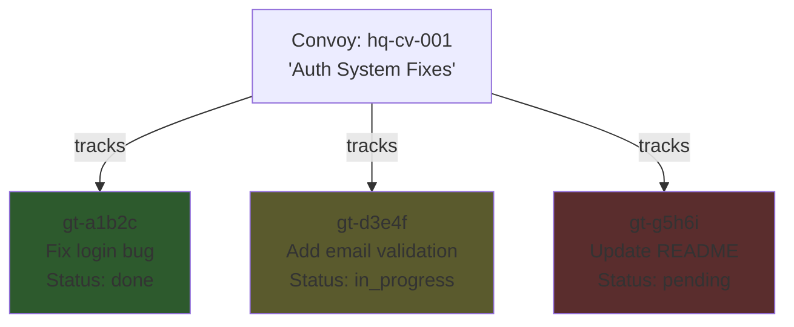
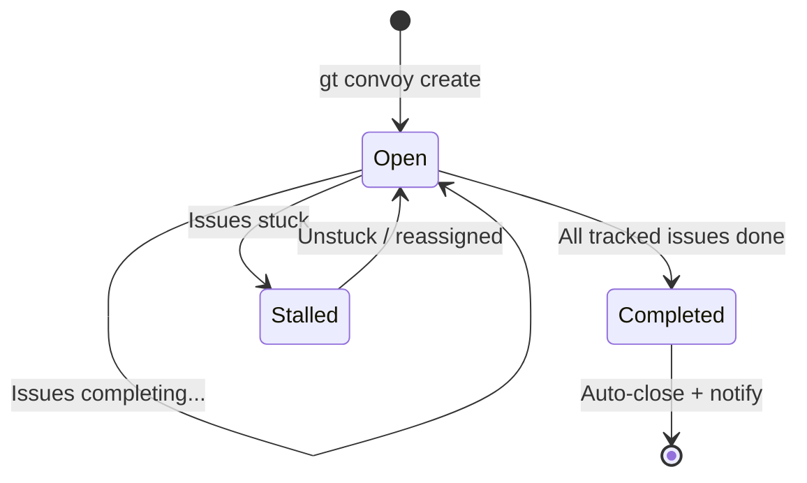
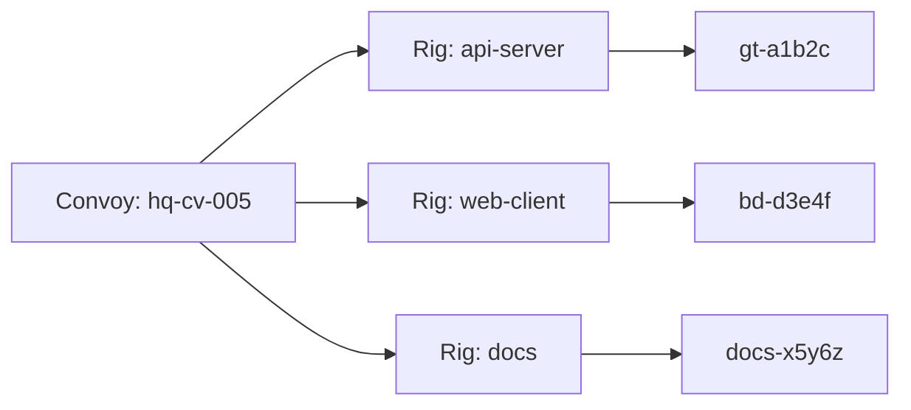
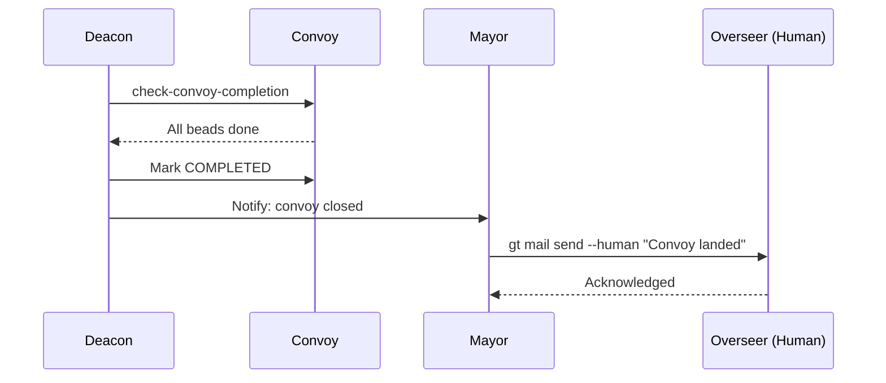

# Convoys (Batch Tracking)

A **Convoy** is Gas Town's unit for tracking batches of related work. Convoys bundle multiple beads together, provide a single point of progress monitoring, auto-close when all tracked items complete, and notify subscribers on landing. They are the primary coordination mechanism for multi-issue projects.

---

## Why Convoys?

When the Mayor receives a complex request -- "Fix the auth module, add email validation, and update the docs" -- that becomes three separate [beads](beads.md). Without convoys, tracking which of those three are done, which are in progress, and when the entire batch has landed would require manual checking.

Convoys solve this:



## Convoy Lifecycle



| State | Meaning |
|-------|---------|
| **Open** | At least one tracked issue is not yet done |
| **Completed** | All tracked issues have closed |
| **Stalled** | Issues exist but none are making progress |

## Convoy IDs

Convoys use the `hq-cv-` prefix by default (since they are town-level coordination beads):

```text
hq-cv-001   # First convoy
hq-cv-abc   # Auto-generated short ID
```

The `hq-` prefix indicates the bead belongs to the town-level `.beads/` database, not a rig-level one.

## Auto-Close Behavior

This is the key feature of convoys. The system automatically checks whether all tracked issues have completed:

1. During each Deacon patrol cycle, the `check-convoy-completion` step runs
2. For each open convoy, the Deacon queries all tracked issue statuses
3. If every tracked issue is in a terminal state (`done`, `wontfix`, etc.), the convoy auto-closes
4. On close, subscribers (typically the Mayor and Overseer) receive a notification

```bash
# The Deacon runs this check automatically:
bd list --type=convoy --status=open
# For each: check tracked issues, close if all done
```

:::info[No Manual Closing Needed]

You almost never need to close a convoy manually. The auto-close mechanism handles it. If you need to force-close a convoy (for example, abandoning remaining work), use `gt convoy close`.

:::

:::caution[Convoy Size Limits]

Keep convoys to a manageable size -- typically 10 or fewer beads. Very large convoys become difficult to monitor and debug when individual beads stall. If your project requires more than 10 tasks, consider splitting it into multiple convoys with clear boundaries.

:::

## Cross-Project Tracking



Convoys can track issues **across multiple rigs**. A single convoy can reference beads from different projects:

```bash
gt convoy create "Cross-rig refactor" gt-a1b2c bd-d3e4f myrig-x5y6z
```

This works because convoys support **cross-prefix tracking** -- the convoy bead stores full IDs including their prefix, allowing it to query status from any [rig's](rigs.md) `.beads/` database.

## Dashboard Visibility

Convoys provide a high-level dashboard view of work progress:

```bash
$ gt convoy list

ID          Title                  Status      Progress
hq-cv-001   Auth System Fixes     OPEN        2/3 done
hq-cv-002   API Redesign          OPEN        0/5 done
hq-cv-003   Bug Bash Sprint       COMPLETED   8/8 done
```

The Mayor uses this dashboard to report progress to the Overseer (human operator) and make strategic decisions about resource allocation.

## Commands

### Creating a Convoy

```bash
# Create from existing beads
gt convoy create "Auth System Fixes" gt-a1b2c gt-d3e4f gt-g5h6i
# Created: hq-cv-001

# Create with just a name (add issues later)
gt convoy create "Sprint 42"
# Created: hq-cv-002
```

### Adding Issues to a Convoy

```bash
# Add a single issue
gt convoy add hq-cv-001 gt-h7i8j

# Add multiple issues
gt convoy add hq-cv-001 gt-h7i8j gt-k9l0m
```

### Listing Convoys

```bash
# List all convoys
gt convoy list

# List only open convoys
gt convoy list --status open
```

### Checking Convoy Status

```bash
# Show convoy details with tracked issue status
gt convoy show hq-cv-001

# Get status summary
gt convoy status hq-cv-001
```

Example output:

```text
Convoy: hq-cv-001 "Auth System Fixes"
Status: OPEN
Progress: 2/3 issues completed

Tracked Issues:
  [DONE]        gt-a1b2c  Fix login bug
  [IN_PROGRESS] gt-d3e4f  Add email validation
  [PENDING]     gt-g5h6i  Update README

Created: 2026-01-15T10:30:00Z
```

### Closing a Convoy

```bash
# Manual close (usually not needed -- auto-close handles this)
gt convoy close hq-cv-001

# Close with reason
gt convoy close hq-cv-001 --reason "Remaining work deprioritized"
```

### Checking Completion

```bash
# Manually trigger completion check
gt convoy check hq-cv-001
```

### Finding Stranded Convoys

A stranded convoy has ready work that is not assigned to any agent:

```bash
# Find convoys with unassigned work
gt convoy stranded
```

This is useful for the Mayor to identify work that needs to be [slung](hooks.md) to polecats.

## Command Reference

| Command | Description |
|---------|-------------|
| `gt convoy create <title> [bead-ids...]` | Create a new convoy |
| `gt convoy add <convoy-id> <bead-ids...>` | Add issues to a convoy |
| `gt convoy list` | List all convoys |
| `gt convoy status <convoy-id>` | Show convoy progress summary |
| `gt convoy show <convoy-id>` | Show full convoy details |
| `gt convoy close <convoy-id>` | Manually close a convoy |
| `gt convoy check <convoy-id>` | Check if convoy can auto-close |
| `gt convoy stranded` | Find convoys with unassigned work |

## When to Use Convoys

Convoys are the right tool when you have **related work items that should be tracked as a group**:

- **Multi-part feature work** -- "Build the auth system" becomes 5 beads. A convoy tracks them as one effort, auto-closing when all parts land.
- **Sprint planning** -- Group a sprint's worth of beads into a convoy. Use `gt convoy list` as your sprint dashboard.
- **Cross-rig coordination** -- Work that spans multiple projects (e.g., API change + client update + docs update) needs a convoy to track completion across rig boundaries.
- **Batch delegation** -- When the Mayor dispatches work to multiple polecats, a convoy provides single-point progress monitoring.
- **Dependency-free grouping** -- Unlike bead dependencies (which block execution), convoys are purely observational. Beads in a convoy execute independently; the convoy just watches.

:::note[When NOT to Use Convoys]

Don't wrap a single bead in a convoy. If there is only one work item, the bead itself is sufficient. Convoys add value at 2+ beads where batch-level tracking matters.

:::

:::warning[Stalled Convoy Detection]

If no beads in a convoy make progress for an extended period, the Deacon marks the convoy as stalled. Stalled convoys appear in the Mayor's dashboard with a warning indicator, prompting either a nudge to stuck polecats or reassignment of blocked work to available agents.

:::

## Convoy Notification Flow

When a convoy completes, the notification chain ensures all stakeholders are informed.



## Convoy + Mayor Workflow

In the recommended [Mayor Workflow](../workflows/mayor-workflow.md), convoys are created automatically:

1. You describe work to the Mayor
2. Mayor creates beads for each task
3. Mayor bundles beads into a convoy
4. Mayor slings work to rigs (spawning polecats)
5. Mayor monitors convoy progress
6. Convoy auto-closes when everything lands
7. Mayor notifies you of completion

You can also create convoys manually for finer control -- see the [Manual Convoy Workflow](../workflows/manual-convoy.md).

:::tip[Monitoring Progress]

Run `gt convoy list` frequently to see the big picture. For live progress, use `gt feed` to watch the activity stream as polecats complete work and convoys close.

:::

## Related Concepts

- **[Beads](beads.md)** -- Convoys track collections of beads; each tracked item is a bead with its own status and lifecycle
- **[Hooks](hooks.md)** -- When work is slung to a polecat, the bead is hooked to that agent for execution
- **[Molecules & Formulas](molecules.md)** -- Each bead in a convoy is executed through a molecule that defines the work steps
- **[Rigs](rigs.md)** -- Convoys can span multiple rigs for cross-project coordination
- **[The MEOW Stack](meow-stack.md)** -- Convoys represent Layer 2 (Epics) in the MEOW abstraction model
- **[Gates](gates.md)** -- Individual beads within a convoy may be gated on external conditions

### Blog Posts

- [Your First Convoy](/blog/first-convoy) -- Step-by-step tutorial for creating and tracking your first convoy
- [Advanced Convoy Patterns](/blog/advanced-convoy-patterns) -- Parallel dispatch, wave-based execution, and cross-rig convoys
- [The Mayor Workflow](/blog/mayor-workflow) -- How the Mayor uses convoys to coordinate large work batches
- [Work Distribution Patterns in Gas Town](/blog/work-distribution-patterns) -- How convoys feed into the work distribution pipeline for parallel dispatch across rigs