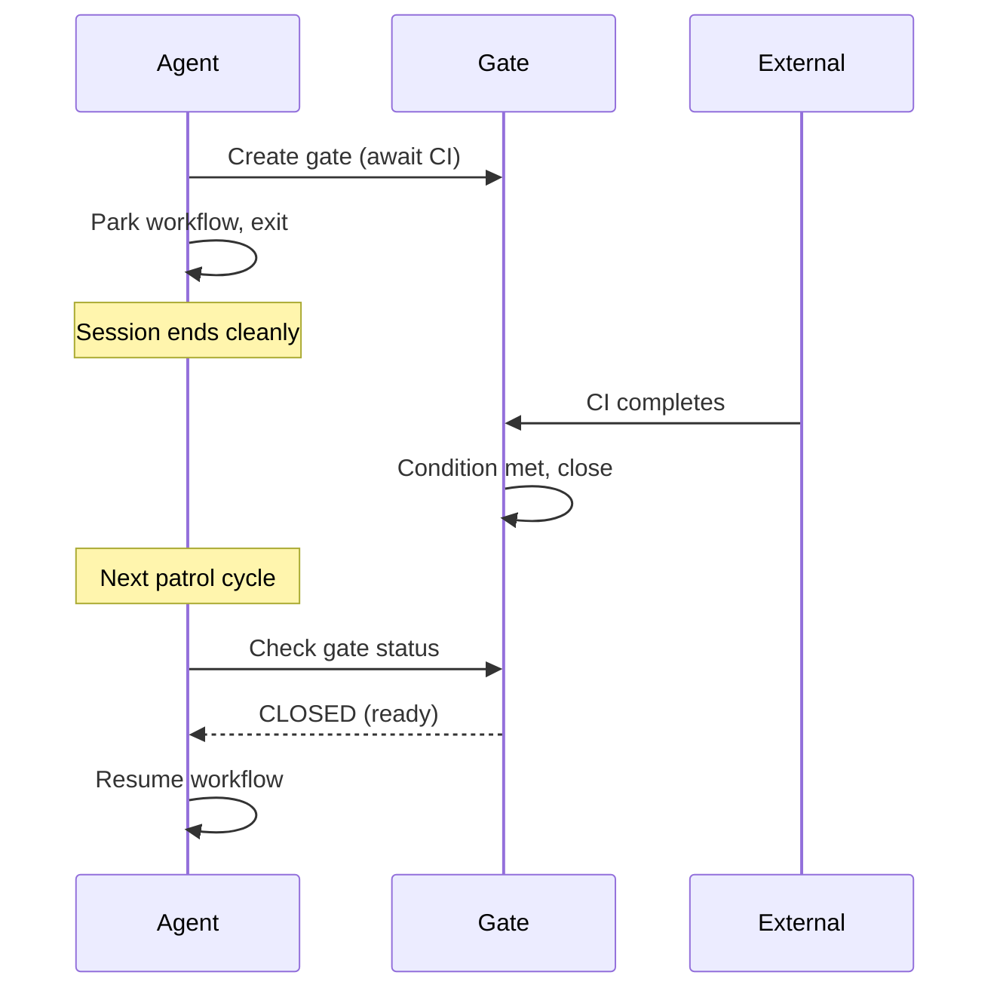
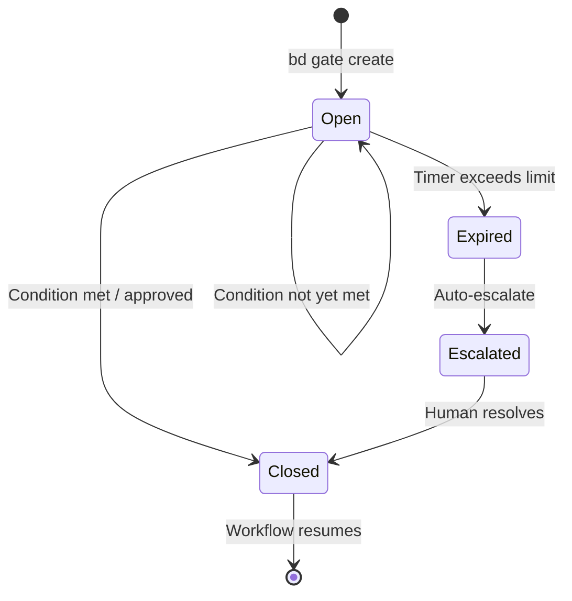
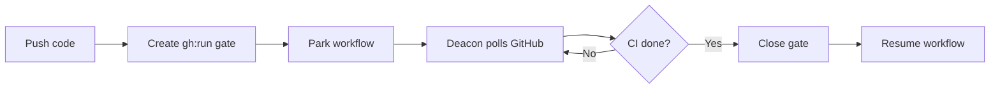
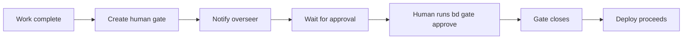
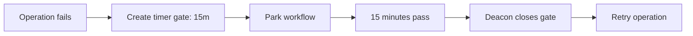

# Gates (Async Coordination)

**Gates** are synchronization points in Gas Town workflows. When a molecule step needs to wait for an external condition -- a CI pipeline finishing, a human approving a change, or a timer elapsing -- it parks on a gate. The gate holds the workflow until the condition is met, then releases it to continue.

---

## Why Gates?

AI agents work fast. But some things cannot be sped up:

- CI pipelines take minutes to run
- Humans need time to review and approve
- External services have their own timelines
- Timers enforce cooldown periods

Without gates, an agent would need to busy-wait (burning context and cost) or exit and lose its place. Gates solve this by **parking** the workflow and **resuming** it when the condition clears. This aligns with [GUPP](gupp.md) -- the workflow's progress is preserved, and it resumes forward when the gate opens.



## Gate Types

Gas Town supports several gate types, each waiting on a different kind of external condition:

| Type | Await Key | Condition | Who Closes It |
|------|-----------|-----------|--------------|
| **Timer** | `timer` | Elapsed time since creation exceeds timeout | Deacon patrol (automatic) |
| **GitHub Actions** | `gh:run` | GitHub Actions workflow run completes | Deacon patrol (polls GitHub) |
| **GitHub PR** | `gh:pr` | Pull request reaches target state | Deacon patrol (polls GitHub) |
| **Human Approval** | `human` | A human explicitly approves | Human via `bd gate approve` |
| **Mail** | `mail` | A specific mail message arrives | Mail system (automatic) |

### Timer Gates

Timer gates are the simplest type. They close automatically after a specified duration:

```bash
# Create a gate that opens after 30 minutes
bd gate create --type timer --timeout 30m --title "Cooldown before retry"
```

The Deacon's patrol cycle checks all timer gates and closes any that have elapsed:

```bash
# Deacon runs this automatically:
bd gate check --type=timer --escalate
```

:::note[Escalation on Expiry]

Timer gates do not just silently close. When they expire, they escalate to the overseer for awareness. This ensures human oversight of timeout conditions.

:::

### GitHub Actions Gates

These gates wait for a GitHub Actions workflow run to complete:

```bash
# Wait for CI to pass on a specific commit
bd gate create --type gh:run --run-id 12345 --title "Wait for CI"
```

The Deacon polls GitHub during patrol cycles to check run status.

### Human Approval Gates

Human gates require explicit human action to proceed. They are used for critical decisions that should not be automated:

```bash
# Create a gate requiring human approval
bd gate create --type human --title "Approve production deploy"
```

The gate stays open until a human explicitly approves it:

```bash
# Human approves the gate
bd gate approve gt-gate-123
```

:::warning

Human approval gates are the only gate type that requires explicit human action. If no one runs `bd gate approve`, the gate stays open indefinitely, blocking the entire workflow. Make sure the responsible person is notified when a human gate is created.

:::

### Mail Gates

Mail gates close when a specific message arrives in an agent's mailbox:

```bash
# Wait for a MERGED notification
bd gate create --type mail --subject "MERGED polecat/toast" --title "Wait for merge"
```

## Gate Lifecycle



| State | Meaning |
|-------|---------|
| **Open** | Waiting for condition to be met |
| **Closed** | Condition met, workflow can resume |
| **Expired** | Timer elapsed, escalated for attention |

## Gates in Molecules

Gates are typically embedded in [molecule](molecules.md) steps. When a step encounters a gate, the workflow pauses at that step until the gate closes.

### Example: CI Gate in a Deploy Workflow

```toml
[[steps]]
id = "run-ci"
title = "Trigger CI and wait for results"
description = """
Trigger the CI pipeline and create a gate to wait for completion.

```bash
# Trigger CI
gh workflow run ci.yml --ref $(git branch --show-current)

# Create gate to wait for CI
bd gate create --type gh:run --run-id <run-id> --title "Wait for CI"

# Park on the gate
gt mol step park --gate <gate-id>
```text

The Deacon will close this gate when CI completes. Your next patrol
cycle (or a fresh session) will pick up from here.
"""
```

### Example: Human Gate Before Production Deploy

```toml
[[steps]]
id = "human-approval"
title = "Get human approval for production deploy"
description = """
Create a human gate and wait for approval.

```bash
bd gate create --type human --title "Approve deploy v2.3.1 to production"

# Notify the overseer
gt mail send mayor/ -s "APPROVAL NEEDED: Deploy v2.3.1" \
  -m "Please review and approve: bd gate approve <gate-id>"
```text

This step cannot proceed until a human runs `bd gate approve`.
"""
```

:::caution[Gate Timeouts]

Gates do not have a default timeout. If you create a `gh:run` or `mail` gate without an explicit timeout, it will remain open indefinitely if the expected condition never occurs. Always pair non-timer gates with a fallback timer gate to avoid workflows that block forever.

:::

:::info[Gate Visibility]

All open gates are visible via `bd gate list`. If you suspect a workflow is stuck, check whether it is parked on an unresolved gate. This is the most common cause of stalled molecules in production environments.

:::

## Gate Evaluation by the Deacon

The Deacon is responsible for evaluating gates during its patrol cycle. The `gate-evaluation` step in the `mol-deacon-patrol` formula handles this:

1. **List all open gates**: `bd gate list --json`
2. **For each timer gate**: Check if `created_at + timeout < now`
3. **For each GitHub gate**: Poll the GitHub API for run/PR status
4. **Close ready gates**: `bd gate close <id> --reason "Condition met"`
5. **Notify waiters**: Send mail to agents blocked on the gate

After gate evaluation, the `dispatch-gated-molecules` step finds molecules that were blocked on now-closed gates and dispatches them:

```bash
# Find molecules ready to resume
bd mol ready --gated --json

# Dispatch each to the appropriate rig
gt sling <mol-id> <rig>/polecats
```

## Commands

### Creating Gates

```bash
# Timer gate
bd gate create --type timer --timeout 30m --title "Cooldown period"

# Human approval gate
bd gate create --type human --title "Approve deploy"

# GitHub Actions gate
bd gate create --type gh:run --run-id 12345 --title "Wait for CI"

# Mail gate
bd gate create --type mail --subject "MERGED" --title "Wait for merge"
```

### Viewing Gates

```bash
# Show gate details
bd gate show <gate-id>

# List all open gates
bd gate list

# List gates as JSON
bd gate list --json
```

### Closing Gates

```bash
# Close a gate (condition met)
bd gate close <gate-id> --reason "CI passed"

# Approve a human gate
bd gate approve <gate-id>

# Wake agents waiting on a gate
gt gate wake <gate-id>
```

## Command Reference

| Command | Description |
|---------|-------------|
| `bd gate create` | Create a new gate |
| `bd gate show <id>` | Show gate details |
| `bd gate list` | List all open gates |
| `bd gate close <id>` | Close a gate (condition met) |
| `bd gate approve <id>` | Approve a human gate |
| `gt gate wake <id>` | Wake agents waiting on a gate |

:::danger[Manual Gate Deletion]

Never manually delete gate beads from the database. If a gate is blocking progress incorrectly, use `bd gate close <id>` to close it gracefully. Manual deletion orphans the waiting molecules and can cause agents to park indefinitely waiting for a gate that no longer exists.

:::

:::tip[Testing Gate Logic Before Production]

Before deploying a gate-dependent workflow to production, test the gate creation and closure logic in a development rig first. Gate bugs can silently stall entire convoys, and the only symptom may be work that never progresses past a specific step.

:::

## Use Cases

Gates enable async coordination at critical points in your workflow. For comprehensive examples of gate-driven workflows including CI gates, approval gates, and timer-based retry patterns, see [Hook-Driven Architecture](/blog/hook-driven-architecture).

### Waiting for CI



### Human Approval Workflow



### Timer-Based Retry



:::tip[When to Use Gates]

Use gates whenever your workflow needs to wait for something external. Prefer gates over busy-waiting (polling in a loop), which wastes context and compute. Gates let the agent exit cleanly and resume only when the condition is met.

:::

## Related Concepts

- **[Molecules & Formulas](molecules.md)** -- Gates are embedded within molecule steps, pausing the workflow at the gated step
- **[Hooks](hooks.md)** -- When an agent parks on a gate and exits, the hook preserves the molecule state so a fresh session can check the gate and resume
- **[Beads](beads.md)** -- Gates are themselves beads with their own status lifecycle (open, closed, expired)
- **[GUPP & NDI](gupp.md)** -- Gates respect GUPP: they pause forward progress but never move the system backward; when the gate opens, the workflow resumes from where it left off
- **[Rigs](rigs.md)** -- The Deacon evaluates gates across all active rigs during its patrol cycle

### Blog Posts

- [The Deacon: Gas Town's Background Coordinator](/blog/deacon-patrol) -- How the Deacon evaluates gates during patrol cycles
- [Gas Town's Security Model](/blog/security-model) -- Human approval gates as security checkpoints
- [Lifecycle Management in Gas Town](/blog/lifecycle-management) -- How gates integrate with the broader agent lifecycle, from gate creation through workflow resumption
- [Hook-Driven Architecture](/blog/hook-driven-architecture) -- How hooks preserve gated workflow state so agents can park on gates and resume in fresh sessions
- [Death Warrants: How Gas Town Terminates Stuck Agents](/blog/death-warrants) -- How gates work with death warrants to enforce termination boundaries