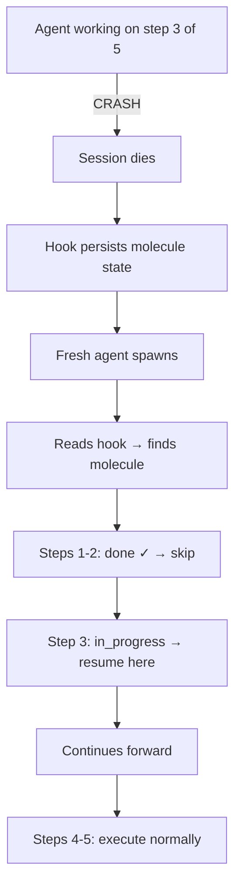
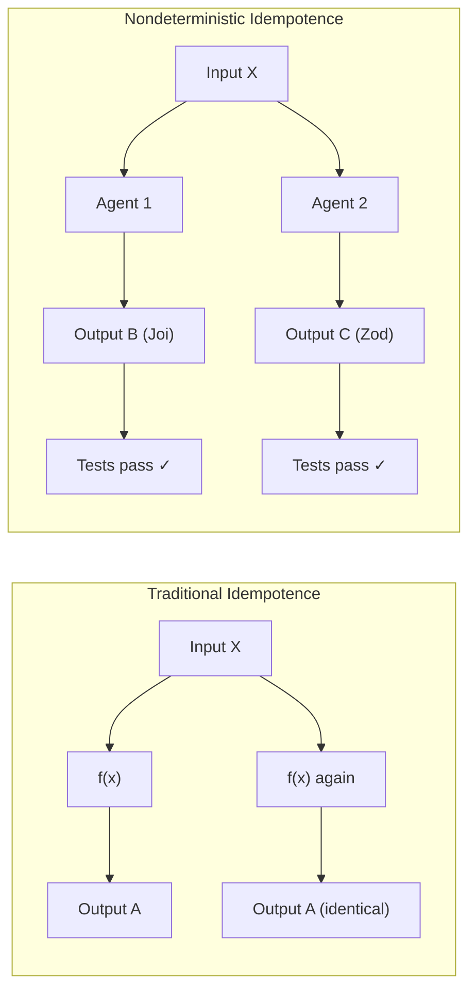
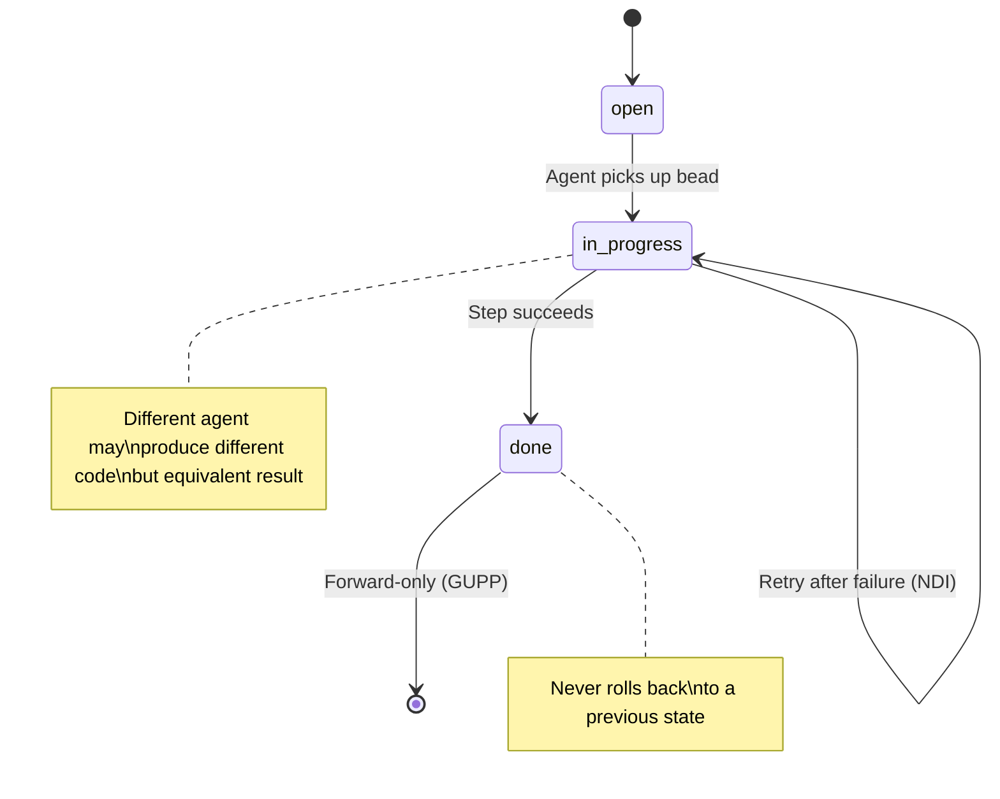
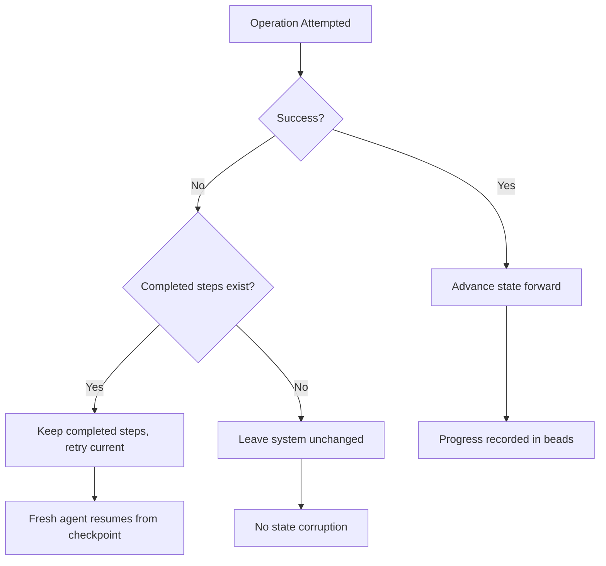
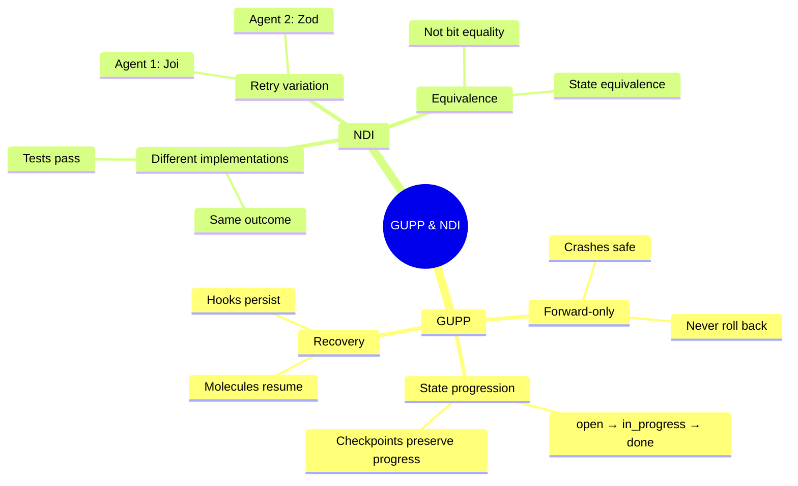
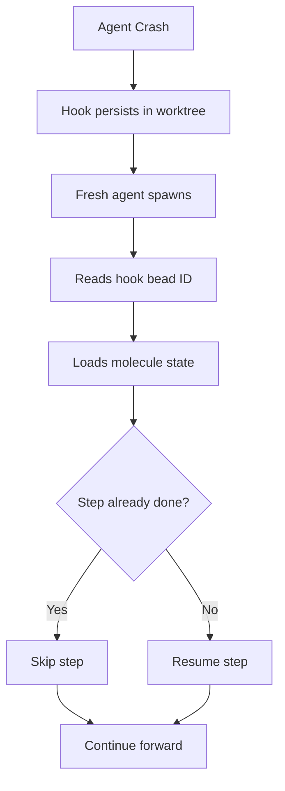

# GUPP & NDI

Two foundational principles govern how Gas Town handles the inherent chaos of multi-agent AI coordination: the **Gas Town Universal Propulsion Principle (GUPP)** and **Nondeterministic Idempotence (NDI)**.

---

## The Gas Town Universal Propulsion Principle (GUPP)

> **Every operation in Gas Town must move the system forward or leave it unchanged. No operation should move the system backward.**

GUPP is the single most important design principle in Gas Town. It means:

- **Crashes cannot lose work.** If an agent crashes mid-task, all completed steps are persisted in the [molecule](molecules.md). A fresh agent resumes from the last checkpoint via the [hook](hooks.md).
- **Retries are safe.** Running an operation twice produces the same result as running it once (or advances further).
- **Partial completion is valid.** A half-finished [convoy](convoys.md) is better than no progress at all.
- **State always moves forward.** [Bead](beads.md) statuses go `open → in_progress → done`. They never go backward.

### GUPP in Practice

```text
Before crash:     load-context [done] → branch-setup [done] → implement [in_progress]
After restart:    load-context [done] → branch-setup [done] → implement [in_progress]
                                                                ↑ resumes here
```

The [molecule](molecules.md) tracks step completion in the [beads](beads.md) database. When a fresh polecat picks up the work via its [hook](hooks.md), it reads the molecule state and continues from exactly where the crashed agent left off.

:::tip
GUPP is the reason you can safely kill any Gas Town agent at any time. The system will always recover forward, never backward.
:::

### GUPP Recovery Flow



### Why GUPP Matters

:::danger[Never Roll Back Bead Status]

Manually reverting a bead from `done` back to `in_progress` violates GUPP and can corrupt molecule state. If completed work needs correction, create a new bead for the fix instead of reopening the old one.

:::

Without GUPP, multi-agent systems are fragile. A crash at the wrong moment could:
- Leave the git worktree in an inconsistent state
- Lose track of what was already done
- Cause the next agent to redo expensive work
- Create merge conflicts from duplicate effort

GUPP eliminates these failure modes by design.

---

## Nondeterministic Idempotence (NDI)

> **Operations may produce different outputs each time, but the system state after execution is equivalent.**

NDI is the practical companion to GUPP. AI agents are inherently nondeterministic — ask Claude to implement the same feature twice and you will get different code. NDI acknowledges this reality and works with it rather than against it.

### What NDI Means

- **Same intent, different implementation.** Two agents implementing "add input validation" will write different code. Both are valid if they pass tests.
- **Retry safety with variation.** If a test step fails and the agent retries, it may fix the problem differently. The molecule only cares that the step reaches `done`.
- **State equivalence, not bit equality.** After running `implement`, the worktree contains a valid implementation. It does not matter that a retry produced different variable names.

### NDI vs. Traditional Idempotence

| Traditional Idempotence | Nondeterministic Idempotence |
|------------------------|------------------------------|
| `f(x) = f(f(x))` always | `f(x)` and `g(x)` both reach valid end state |
| Same output every time | Different output, equivalent result |
| Deterministic operations | Acknowledges AI nondeterminism |
| Exact replay | Forward-only progress |



### NDI in Practice

Consider a polecat working on bead `gt-a1b2c` (add input validation):

```text
Run 1:  Implements validation with Joi library
        Tests pass → step marked done

Run 2:  (after crash and restart)
        Step already marked done → skipped
        Agent continues to next step
```

If the agent had crashed *during* implementation (before marking done):

```text
Run 1:  Starts implementing with Joi, crashes at 60%
        Step still marked in_progress

Run 2:  Fresh agent reads step, sees in_progress
        Implements with Zod instead (different but valid)
        Tests pass → step marked done
```

The second run produced different code, but the system state (valid implementation, passing tests) is equivalent. This is NDI.

---

## The Nudge Workaround

Sometimes an agent gets stuck — looping on a failed test, unable to resolve a merge conflict, or confused by ambiguous requirements. Gas Town uses **nudges** as the escape hatch.

### What is a Nudge?

A nudge is a synchronous message from a human or higher-level agent that interrupts the current agent's execution with new context or instructions.

```bash
# Human nudges a stuck polecat
gt nudge polecat-3 "The test failure is a known flaky test. Skip it with --skip-flaky flag."

# Mayor nudges a witness that's reporting false positives
gt nudge witness-myapp "The API is intentionally returning 503 during migration. Ignore health check failures for 30 minutes."
```

### When to Use Nudges

Nudges are appropriate when:

- An agent is stuck in a retry loop
- New information changes the requirements
- A human wants to steer an agent's approach
- An upstream dependency was resolved and the agent should retry

### Nudges and GUPP

:::warning
A nudge should never instruct an agent to undo completed work. If a completed step needs to be redone, file a new bead for the correction rather than rolling back progress.
:::

Nudges respect GUPP — they provide new information that enables forward progress, but never instruct an agent to undo completed work. A nudge says "try this approach instead," not "go back and redo what you did."

### Nudges and NDI

Nudges are a natural fit for NDI. After a nudge, the agent may take a completely different approach to the current step. The output will differ from what it would have produced without the nudge, but the end state (step completed, tests passing) is equivalent.

---

## GUPP + NDI Together

The two principles work in concert:

| Scenario | GUPP | NDI |
|----------|------|-----|
| Agent crashes mid-step | Completed steps preserved, resume from checkpoint | Fresh agent may implement differently |
| Test failure | Step stays `in_progress`, agent retries | Retry may use different fix strategy |
| Merge conflict | Conflict resolution step activates | Agent resolves differently than predecessor would have |
| Human nudge | System moves forward with new context | New approach produces different but equivalent output |
| Full restart | All molecule state preserved in beads | New session continues with its own implementation style |

Together, GUPP and NDI make Gas Town **resilient to the fundamental unpredictability of AI agents** while ensuring that work always progresses toward completion.

## When to Apply GUPP & NDI



These principles are not just theoretical -- they guide practical design decisions:

### Apply GUPP When

- **Designing molecule steps** -- Each step should be a checkpoint. Mark steps done only when their output is durable (committed, pushed, recorded in beads).
- **Handling failures** -- Never roll back completed work. If a step fails, retry it forward or create a new bead for corrective action.
- **Building plugins** -- Quality gate plugins should be idempotent. Running a lint check twice should produce the same result. If a plugin has side effects, make them additive, not destructive.

### Apply NDI When

- **Writing agent instructions** -- Describe the desired outcome, not the exact implementation. "Add input validation" is better than "Use Joi library version 17.3".
- **Evaluating agent work** -- Judge by whether the tests pass and the feature works, not by whether the agent used your preferred coding style.
- **Designing retries** -- Accept that a retried step may produce different code. The molecule only cares that the step reaches `done`.

:::tip[GUPP Violation Test]

If an operation could leave the system in a worse state than before it ran, it violates GUPP. Redesign it to be forward-only: either it succeeds and advances, or it fails and the system stays where it was.

:::

:::note[NDI and Code Reviews]

When reviewing agent-produced code, keep NDI in mind: two agents solving the same problem will write different code. Focus your review on correctness and test coverage rather than stylistic preferences. As long as the implementation passes tests and meets requirements, different approaches are equally valid under NDI.

:::

:::info[GUPP and Database Transactions]

GUPP's forward-only guarantee is enforced at the database level. Bead status updates are transactional: either the full state transition commits, or the entire operation rolls back leaving the bead unchanged. This prevents partial updates that could violate forward-only progression.

:::

:::info[GUPP Violations Are Always Bugs]

If you find yourself tempted to manually roll back a bead status, force-push to undo a commit, or delete completed work, that is a GUPP violation and indicates a process bug. Fix the process, do not violate GUPP. The correct approach is always to create a new forward-moving bead to address the problem.

:::

:::caution[Testing GUPP Compliance]

To verify that a new workflow respects GUPP, simulate a crash mid-execution by killing the agent process with `kill -9`. On restart, the workflow should resume from its last checkpoint without redoing completed steps or corrupting state. If it does not, the workflow violates GUPP and needs redesign.

:::

## GUPP Decision Tree

When an operation encounters a failure, GUPP dictates the forward-only response. For practical examples of how GUPP enables crash recovery in real workflows, see [Session Cycling Explained](/blog/session-cycling).



## How GUPP & NDI Are Implemented

These principles are not just abstract ideals -- they are enforced by specific Gas Town primitives:

| Primitive | GUPP Role | NDI Role |
|-----------|-----------|----------|
| [Hooks](hooks.md) | Persist work assignment across crashes | Fresh agent picks up where predecessor left off |
| [Molecules](molecules.md) | Track step completion as permanent state | Steps marked `done` are never re-executed, regardless of implementation differences |
| [Beads](beads.md) | Forward-only status progression | Different agents may close the same bead via different approaches |
| [Gates](gates.md) | Pause without losing progress | Gate resolution may trigger different downstream execution |
| [Rigs](rigs.md) | Git worktrees provide durable filesystem state | Each polecat worktree is independent |



### GUPP Crash Recovery Sequence

When an agent crashes, GUPP ensures forward-only recovery through the hook and molecule system.



## Related Concepts

- **[Hooks](hooks.md)** -- The primary mechanism that makes GUPP possible: hooks persist across all session boundaries
- **[Molecules & Formulas](molecules.md)** -- Molecules implement GUPP through step-level checkpointing in the beads database
- **[Beads](beads.md)** -- Bead status progression is a direct expression of GUPP's forward-only rule
- **[Gates](gates.md)** -- Gates enable GUPP-compliant async waits: the system pauses without losing state
- **[The MEOW Stack](meow-stack.md)** -- GUPP and NDI apply at every layer of the MEOW abstraction model

### Blog Posts

- [Understanding GUPP](/blog/understanding-gupp) -- Practical examples of GUPP and NDI in real Gas Town workflows
- [Common Pitfalls](/blog/common-pitfalls) -- Anti-patterns that violate GUPP and how to avoid them
- [Agent-to-Agent Communication Patterns](/blog/agent-communication-patterns) -- How mail, nudges, and hooks implement GUPP-driven coordination
- [Hook Persistence: Why Agent State Survives Restarts](/blog/hook-persistence) -- The primary mechanism that makes GUPP possible by persisting work state across every session boundary
- [Hook-Driven Architecture: How Gas Town Agents Never Lose Work](/blog/hook-driven-architecture) -- How GUPP relies on hook-driven architecture for crash safety
