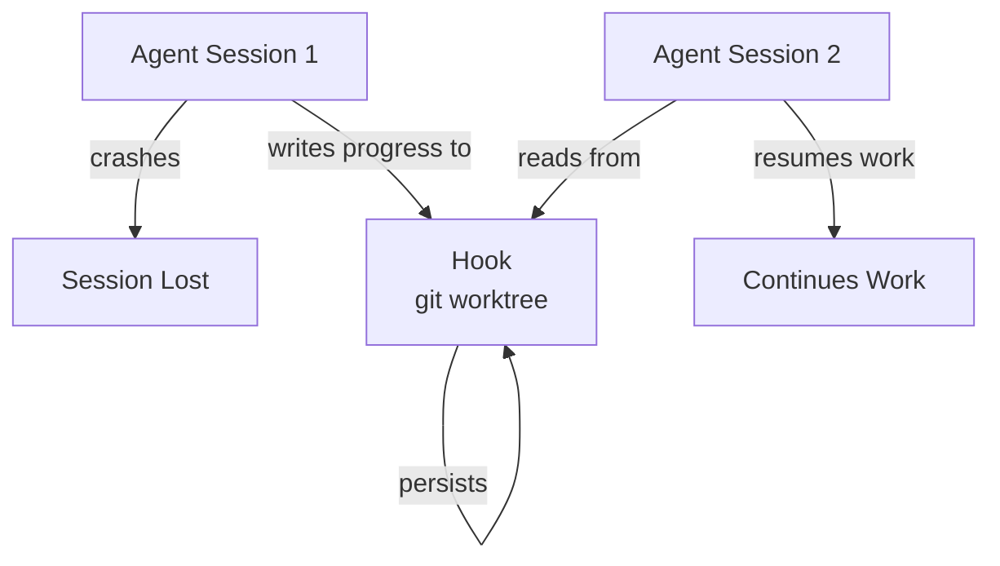
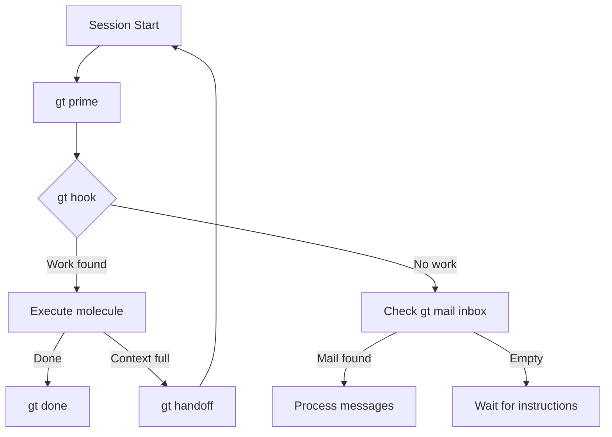
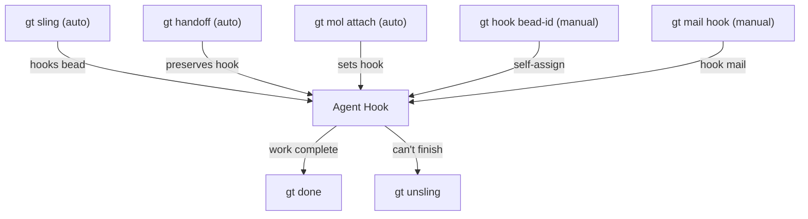
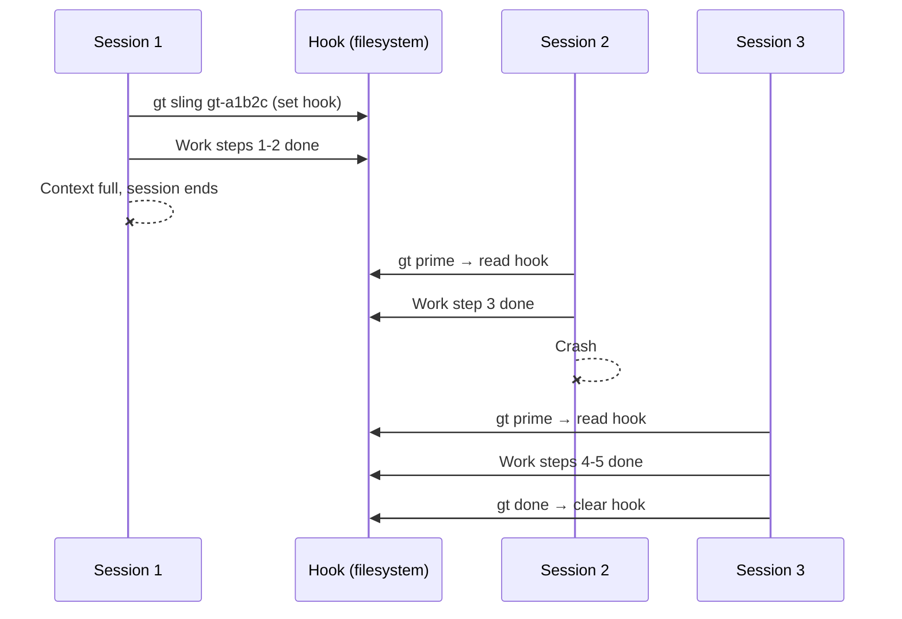
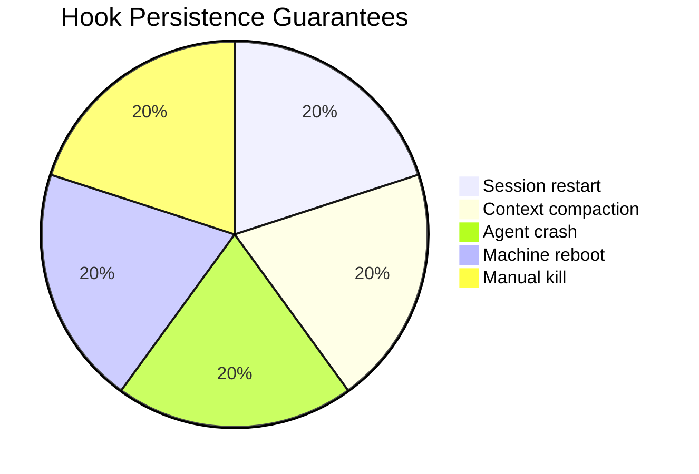
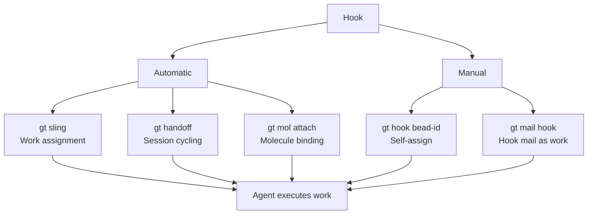

# Hooks (Persistence)

Hooks are Gas Town's **durability primitive**. A hook is a persistent attachment point where work state is stored in a way that survives crashes, restarts, handoffs, context compaction, and even machine failures. Hooks are what make Gas Town agents self-propelling -- an agent always knows what to do by checking its hook.

---

## The Problem Hooks Solve

AI coding agents are inherently ephemeral. Sessions can end for many reasons:

- Context window fills up
- Session crashes or times out
- Operator requests a handoff
- Machine restarts

Without hooks, all in-flight work state would be lost on every session boundary. The agent would restart with no memory of what it was doing.

:::danger[Without Hooks]

Agent starts -> Does half the work -> Context fills up -> Session ends -> **All progress context lost** -> New session has no idea what to do

:::

:::tip[With Hooks]

Agent starts -> Does half the work -> Context fills up -> Session ends -> New session checks hook -> **Finds work + molecule progress** -> Resumes seamlessly

:::

## How Hooks Work

Hooks are implemented as **git worktrees** with attached metadata. When work is "hooked" to an agent, the bead ID and molecule state are recorded in a persistent location tied to that agent's working directory.



The hook stores:

- **Hook bead** -- The bead ID of the assigned work
- **Molecule state** -- Which step of the workflow the agent was on
- **Branch state** -- The git branch and any uncommitted progress

Because this is all stored in the git worktree (filesystem), it survives any session boundary.

## The Propulsion Principle

> **"If it's on your hook, YOU RUN IT."**

This is Gas Town's core scheduling rule. It replaces centralized job schedulers with a simple, crash-safe protocol:

1. Agent starts a new session
2. Agent runs `gt prime` to load context
3. Agent checks `gt hook` for attached work
4. **If work found** -- Execute it immediately
5. **If no work** -- Check inbox, then wait for instructions

This creates **automatic momentum**. Agents are self-propelled by their hooks. No coordinator needs to tell them what to do -- they discover it themselves every time they start.



## Commands

### Checking Your Hook

```bash
# Show what is currently on your hook
gt hook
```

Output shows the hooked bead ID and any attached molecule:

```text
Hook: gt-a1b2c  "Fix login bug"
  Molecule: mol-polecat-work (step: implement)
  Branch: polecat/toast
  Status: in_progress
```

### Manually Hooking Work

```bash
# Attach a bead to your hook
gt hook gt-a1b2c
```

This is rarely done manually. Most hooking happens through `gt sling`.

### Slinging Work

The `gt sling` command is the primary way to assign work to agents. It hooks a bead to the target and spawns a worker:

```bash
# Assign to a rig (auto-spawns a polecat)
gt sling gt-a1b2c myproject

# Assign to a specific agent
gt sling gt-a1b2c myproject --agent cursor

# Assign multiple items
gt sling gt-a1b2c gt-d3e4f myproject
```

What `gt sling` does internally:

1. Changes bead status to `hooked`
2. Attaches work to the target agent's hook
3. Spawns a polecat (ephemeral worker) in the rig
4. The polecat's startup sequence finds the hook
5. The polecat begins executing the assigned molecule

### Removing Work from a Hook

```bash
# Remove a bead from the hook without completing it
gt unsling gt-a1b2c
```

This releases the work back to the available pool without marking it done. Another agent can pick it up later.

## When to Use Hooks



### Automatic Hooking (Most Common)

In normal Gas Town operation, you rarely hook work manually. Hooks are set automatically by:

- **`gt sling`** -- Slinging a bead to a rig hooks it to the spawned polecat
- **`gt handoff`** -- Your current hook persists for the successor session
- **`gt mol attach`** -- Attaching a molecule also hooks it

### Manual Hooking

Manually hook work when:

- **Self-assigning from the ready queue** -- You found a bead via `bd ready` and want to claim it: `gt hook <bead-id>`
- **Hooking mail as instructions** -- The overseer sent you mail with ad-hoc instructions: `gt mail hook <mail-id>`
- **Resuming interrupted work** -- A bead fell off your hook (e.g., after `gt unsling`) and you want to re-attach it

### Unhooking

Use `gt unsling` when:

- **Work should be reassigned** -- You can't complete the bead and another agent should take it
- **Bead was assigned in error** -- The wrong bead was slung to you
- **Deprioritization** -- Higher-priority work arrived and this bead should return to the pool

:::warning[Never Abandon Hooked Work]

If work is on your hook, either complete it, hand it off properly, or unsling it. Never leave a session with hooked work in an ambiguous state. The hook is a commitment.

:::

## Hook Persistence Guarantees

Hooks are the core mechanism behind [GUPP](gupp.md) (the Gas Town Universal Propulsion Principle). They ensure that no session boundary can lose work state. Hooks survive every type of disruption:

| Disruption | Hook Status |
|-----------|-------------|
| Session restart | Preserved -- new session reads hook on startup |
| Context compaction | Preserved -- hook is in filesystem, not context |
| Agent crash | Preserved -- git worktree is durable |
| Handoff (`gt handoff`) | Preserved -- successor session inherits hook |
| Machine reboot | Preserved -- git worktree is on disk |
| Manual session kill | Preserved -- hook outlives the process |

## How Hooks Drive Agent Behavior

Different agent roles respond to hooks differently:

### Polecats (Ephemeral Workers)

When a polecat spawns:

1. `gt prime` runs automatically (SessionStart hook)
2. Prime reads the hook and injects the assigned bead
3. Polecat executes the `mol-polecat-work` molecule
4. On completion, `gt done` submits work and nukes the sandbox
5. **Done means gone** -- the polecat ceases to exist

### Persistent Agents (Witness, Refinery, Deacon)

Persistent agents use hooks to track their patrol molecules:

1. On startup, check hook for active patrol molecule
2. If found, resume the patrol from the last completed step
3. If not found, create a new patrol molecule and hook it
4. Run patrol cycles until context fills up
5. Handoff to fresh session, which picks up from the hook

### The Mayor

The Mayor's hook typically holds a coordination molecule or convoy management task. The Mayor checks its hook on each session start to resume strategic planning.

:::info[Multiple Hooks]

An agent can only have one active hook at a time. If new work arrives while a hook is already set, it must be queued in the agent's mailbox or slung to a different agent. This single-hook constraint ensures each agent has a clear, unambiguous priority and prevents work from being silently dropped during crashes.

:::

:::caution[Hook Debugging]

If an agent seems to have lost its work assignment, run `gt hook` to inspect the hook state directly. A missing or corrupt hook file in the worktree is the most common cause of agents idling when they should be working. Use `gt doctor` to detect and repair hook issues automatically.

:::

:::note[Hook Recovery After Corruption]

If a hook file becomes corrupted or deleted, use `gt doctor --fix` to rebuild it from the beads database. Hooks are the most critical persistence primitive in Gas Town, and hook corruption can cause agents to lose track of their work assignments entirely.

:::

## Hook Lifecycle Across Sessions

The following shows how a hook persists as agents cycle through multiple sessions. For a deep dive into work assignment and the sling command that creates these hooks, see [Mastering gt sling](/blog/mastering-gt-sling).



:::note[Hook Inspection for Debugging]

When an agent seems to have lost its work, inspect the hook directly with `cat .git/GT_HOOK` from the worktree directory. The hook file contains the bead ID and molecule state in plain text, making it easy to verify hook persistence without relying on higher-level commands.

:::

## Hook and Molecule Integration

Hooks and [Molecules](molecules.md) work together to provide crash-safe workflows:

```text
Hook
├── hook_bead: gt-a1b2c        # The assigned issue
└── molecule: mol-polecat-work  # The workflow template
    ├── step: load-context      [done]
    ├── step: branch-setup      [done]
    ├── step: implement         [in_progress]  <-- resume here
    ├── step: self-review       [pending]
    └── step: submit-and-exit   [pending]
```

When a session restarts, the agent:

1. Reads the hook to find `gt-a1b2c`
2. Reads the molecule to find it is on the `implement` step
3. Resumes implementation without repeating earlier steps

This is why Gas Town agents can work on complex tasks across many sessions without losing progress.



:::tip[Best Practice]

Always check `gt hook` at the start of a session before doing anything else. If work is on your hook, that is your top priority. The Propulsion Principle ensures agents stay focused and productive.

:::

### Hook Types and Triggers

Hooks can be set through several mechanisms, each serving a different workflow need.



## Related Concepts

- **[Beads](beads.md)** -- The hook stores the bead ID of the assigned work; the bead's status transitions to `hooked` when slung
- **[Molecules & Formulas](molecules.md)** -- The molecule attached to a hook tracks step-level progress, enabling crash-safe resume
- **[GUPP & NDI](gupp.md)** -- Hooks are the primary mechanism that makes GUPP possible: work state persists across every kind of disruption
- **[Rigs](rigs.md)** -- Hooks are implemented as git worktrees within a rig's directory structure
- **[Gates](gates.md)** -- When a molecule step is gated, the hook preserves the parked state until the gate closes
- **[Session Cycling](session-cycling.md)** -- Hooks persist across session boundaries, enabling context refresh without losing work

### Blog Posts

- [Hooks: The Persistence Primitive That Makes Gas Town Crash-Safe](/blog/hook-persistence) -- How hooks store work state in git worktrees so agents survive crashes and restarts
- [Understanding GUPP](/blog/understanding-gupp) -- How hooks implement the propulsion principle
- [Session Cycling Explained](/blog/session-cycling) -- Hooks and handoff mail working together across sessions
- [Mastering gt sling](/blog/mastering-gt-sling) -- Complete guide to the sling command, the primary way work gets hooked to agents
- [Hook-Driven Architecture: How Gas Town Agents Never Lose Work](/blog/hook-driven-architecture) -- The architectural principles behind hook-based persistence