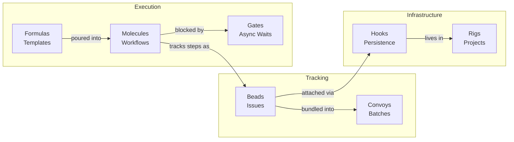

# Core Concepts

Gas Town is built on a small set of powerful primitives. Understanding these concepts is the key to effective use of the system, whether you are a human operator or an AI agent.

---

## Overview

| Concept | Purpose | Primary CLI |
|---------|---------|-------------|
| [Beads](beads.md) | AI-native, git-backed issue tracking | `bd` |
| [Hooks](hooks.md) | Persistent work state that survives crashes | `gt hook`, `gt sling` |
| [Convoys](convoys.md) | Batch tracking of related work items | `gt convoy` |
| [Molecules & Formulas](molecules.md) | Multi-step workflow orchestration | `gt mol`, `gt formula` |
| [Gates](gates.md) | Async coordination and synchronization | `bd gate` |
| [Rigs](rigs.md) | Project containers wrapping git repositories | `gt rig` |
| [The MEOW Stack](meow-stack.md) | Layered abstraction model for work organization | -- |
| [GUPP & NDI](gupp.md) | Core design principles for reliability at scale | -- |
| [Wisps](wisps.md) | Ephemeral sub-beads tracking molecule steps | `gt mol status` |
| [Session Cycling](session-cycling.md) | Context refresh without losing work | `gt handoff` |

## How They Fit Together

## The Lifecycle at a Glance

A typical unit of work moves through these primitives in order:

1. **Bead** is created to track an issue or task
2. Beads are bundled into a **Convoy** for batch tracking
3. A bead is **slung** to an agent, attaching it to the agent's **Hook**
4. The agent executes a **Molecule** (instantiated from a **Formula**) that defines the work steps
5. If a step requires an async wait, a **Gate** pauses execution until a condition is met
6. All of this runs inside a **Rig** -- the project container that hosts the git repository and agent infrastructure

:::tip[Mental Model]

Think of Gas Town as a shipping operation. **Beads** are packages, **Convoys** are trucks, **Hooks** are loading docks, **Molecules** are delivery instructions, **Gates** are traffic lights, and **Rigs** are warehouses.

:::

## Suggested Reading Order

Start with the three foundational concepts, then explore based on your role:

1. **[Beads](beads.md)** — Everything starts with an issue. Understand beads first.
2. **[Hooks](hooks.md)** — How work survives crashes. Essential for understanding agent reliability.
3. **[GUPP & NDI](gupp.md)** — The design philosophy that ties everything together.

Then expand based on need:

- **Orchestrating parallel work?** → [Convoys](convoys.md) → [Molecules](molecules.md) → [Gates](gates.md)
- **Setting up projects?** → [Rigs](rigs.md) → [MEOW Stack](meow-stack.md)
- **Understanding agent sessions?** → [Session Cycling](session-cycling.md) → [Wisps](wisps.md)

## Design Principles

These concepts share several common design principles, rooted in [GUPP & NDI](gupp.md):

- **Git as ground truth** -- All persistent state lives in git or git-adjacent storage (SQLite, worktrees, JSONL)
- **CLI-first** -- Every operation is available through the command line, making it natural for both humans and AI agents
- **Crash-safe** -- State is designed to survive crashes, restarts, compaction, and handoffs between sessions (see [Hooks](hooks.md) and [GUPP](gupp.md))
- **Forward-only progress** -- Operations move the system forward or leave it unchanged, never backward ([GUPP](gupp.md))
- **Discovery over tracking** -- Agents observe reality each patrol cycle rather than maintaining fragile in-memory state
- **Composable** -- Primitives combine to form complex workflows without a monolithic orchestration layer

## From the Blog

- [Why Beads? AI-Native Issue Tracking](/blog/why-beads) -- The design philosophy behind git-backed issues
- [Understanding GUPP](/blog/understanding-gupp) -- Why crashes don't lose work in Gas Town
- [Hook-Driven Architecture](/blog/hook-driven-architecture) -- How persistent hooks enable crash-safe agent execution
- [Session Cycling Explained](/blog/session-cycling) -- Context refresh without losing work state

## Related

- **[Architecture](../architecture/index.md)** — How concepts map to system components
- **[Agents](../agents/index.md)** — The roles that use these primitives
- **[Workflows](../workflows/index.md)** — How concepts combine into end-to-end workflows
- **[Glossary](../guides/glossary.md)** — Definitions for all Gas Town terminology
