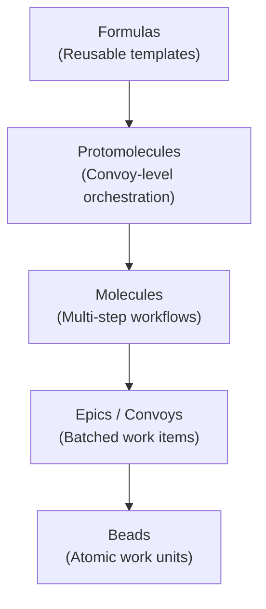
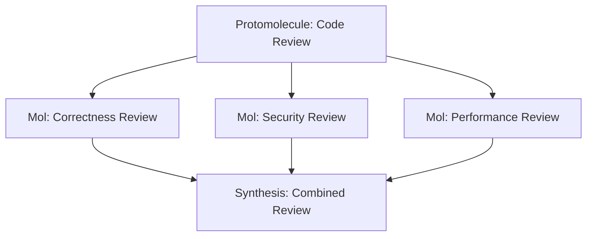
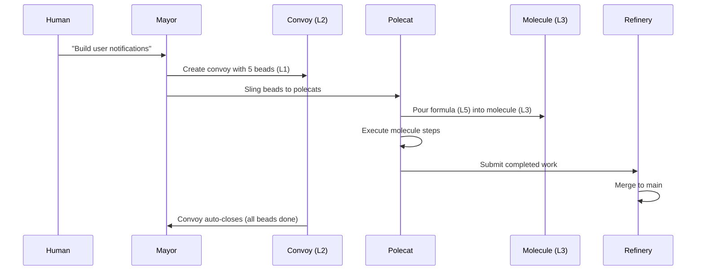
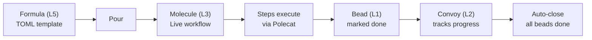

# The MEOW Stack

The **MEOW Stack** (Molecules, Epics, Orchestration, Workflows) is Gas Town's layered abstraction model for organizing and executing work. Each layer builds on the one below it, creating a composable system that scales from a single task to an entire project buildout.

---

## The Layers



### Layer 1: Beads (Atomic Work Units)

**Beads** are the foundation — individual, trackable units of work. Each bead represents a single issue, task, bug fix, or feature request. They are stored in git (via the `bd` CLI) and persist across crashes, restarts, and agent handoffs.

```bash
bd create --title "Add input validation to /api/users" --type task
```

Beads are the atoms of Gas Town. Everything else is built from them.

| Property | Description |
|----------|-------------|
| **ID** | Unique identifier (e.g., `gt-a1b2c`) |
| **Status** | `open`, `in_progress`, `done`, `deferred` |
| **Hook** | Which agent is currently working on it |
| **Convoy** | Which batch it belongs to |

See [Beads](beads.md) for the full reference.

### Layer 2: Epics / Convoys (Batched Work)

**Convoys** group related beads into batches that travel together. When you tell the Mayor "build the auth system," it creates a convoy containing all the individual beads needed:

```text
Convoy: auth-system-v2
├── gt-a1b2c  Add login endpoint
├── gt-d3e4f  Add JWT middleware
├── gt-g5h6i  Add password reset flow
├── gt-j7k8l  Write auth integration tests
└── gt-m9n0o  Update API documentation
```

Convoys provide batch-level tracking: how many beads are done, how many are in progress, whether the overall effort is on track.

See [Convoys](convoys.md) for details.

### Layer 3: Molecules (Multi-Step Workflows)

**Molecules** are execution plans for individual beads. When a polecat picks up a bead, it follows a molecule — a sequence of ordered steps with dependencies, gates, and checkpoints.

```text
Molecule: mol-polecat-work
├── load-context      [done]
├── branch-setup      [done]
├── preflight-tests   [done]
├── implement         [in_progress]  ← agent is here
├── self-review       [pending]
├── run-tests         [pending]
└── submit-and-exit   [pending]
```

The molecule tracks exactly where an agent is in its workflow. If the agent crashes, a fresh agent reads the molecule and resumes from the last completed step.

See [Molecules & Formulas](molecules.md) for the full reference.

### Layer 4: Protomolecules (Convoy-Level Orchestration)

:::note
Protomolecules are the most advanced MEOW concept. Most Gas Town users work at Layers 1-3 daily and only encounter protomolecules when orchestrating large, multi-agent efforts.
:::

**Protomolecules** are higher-order orchestration patterns that coordinate multiple molecules working in parallel. They represent convoy-level workflows where multiple agents work simultaneously on related tasks with coordination points.

Examples:
- **Parallel code review**: Multiple agents review different dimensions (correctness, security, performance), then a synthesis step combines findings
- **Multi-rig deployment**: Changes are pushed to staging across multiple rigs, then promoted to production
- **Design exploration**: Multiple agents explore different design approaches, then the Mayor evaluates results



### Layer 5: Formulas (Reusable Templates)

**Formulas** are the TOML-defined templates from which molecules and protomolecules are created. They are the blueprints — reusable, parameterized, and version-controlled. For detailed guidance on creating custom workflow templates, see [Custom Formulas](/blog/custom-formulas).

```toml
formula = "shiny"
type = "workflow"
version = 1

[[steps]]
id = "design"
title = "Design {{feature}}"

[[steps]]
id = "implement"
needs = ["design"]
title = "Implement {{feature}}"
```

A formula is **poured** into a molecule — creating a live instance with real bead IDs and runtime state. You can pour the same formula many times, creating independent workflow instances.

:::info

Gas Town ships with 30+ built-in formulas covering work lifecycles, patrol cycles, convoy orchestration, and operational tasks. Browse the full catalog with `gt formula list`, or inspect any formula's steps with `gt formula show <name>`.

:::

Gas Town ships with 30+ built-in formulas. See [Molecules & Formulas](molecules.md) for the full catalog.

---

## Why "MEOW"?

:::tip
You don't need to understand all five layers to use Gas Town. Start with Beads (create issues) and Convoys (batch them). Molecules and Formulas become relevant when you want structured agent workflows.
:::

The name is a backronym: **M**olecules, **E**pics, **O**rchestration, **W**orkflows. But more importantly, it reflects Gas Town's philosophy that work organization should be:

- **Composable**: Each layer builds naturally on the one below
- **Observable**: You can inspect state at any layer
- **Recoverable**: Crashes at any layer are handled gracefully (see [GUPP & NDI](gupp.md))
- **Scalable**: Works for 1 agent or 30

---

## MEOW in Practice



Here's how a typical Gas Town work session flows through the stack:

1. **Human** tells Mayor: "Build user notifications"
2. **Mayor** creates a **Convoy** (Layer 2) with 5 **Beads** (Layer 1)
3. Mayor **slings** each bead to a polecat
4. Each polecat **pours** the `mol-polecat-work` **Formula** (Layer 5) into a **Molecule** (Layer 3)
5. Polecats execute their molecules in parallel, coordinated by the **Protomolecule** (Layer 4) convoy pattern
6. The **Refinery** merges completed work to main
7. The **Convoy** tracks overall progress until all beads are done

```bash
# See the full stack in action
gt convoy list          # Layer 2: batch tracking
gt mol status           # Layer 3: workflow progress
gt formula list         # Layer 5: available templates
bd list --convoy cv-01  # Layer 1: individual beads
```

:::caution[Layer Violations]

Avoid reaching across MEOW layers in your workflows. For example, a convoy (Layer 2) should not directly manipulate molecule steps (Layer 3) -- instead, it should track bead-level completion and let the molecule manage its own internal progress. Respecting layer boundaries keeps the system composable and prevents tight coupling between abstraction levels.

:::

:::warning[Protomolecule Complexity]

Protomolecules (Layer 4) coordinate multiple agents working in parallel and are significantly harder to debug than single-agent molecules. Start with simple workflow formulas and only introduce protomolecules when you have a proven need for multi-agent orchestration within a single convoy.

:::

:::danger[Skipping MEOW Layers]

Do not bypass the MEOW abstraction by directly manipulating lower layers. For example, manually editing molecule step beads in the database instead of using `gt mol step done` can corrupt dependency tracking and break workflow resume. Always use the layer-appropriate commands.

:::

## Formula-to-Completion Flow

A formula flows through the MEOW layers from template to completed work.



## Cross-Cutting Concerns

Two concepts cut across all MEOW layers rather than living in a single layer:

- **[Hooks](hooks.md)** -- Hooks persist work state at every layer. A hooked molecule preserves convoy membership, step progress, and bead assignments across crashes.
- **[Gates](gates.md)** -- Gates can pause execution at any layer. A molecule step can be gated, a convoy can be blocked on gated beads, and formulas can define gate conditions in their step definitions.
- **[GUPP & NDI](gupp.md)** -- The forward-only progress guarantee applies at every layer: beads move forward, molecules checkpoint steps, convoys auto-close when complete, and formulas produce idempotent molecules.

## Related Concepts

- **[Beads](beads.md)** -- Layer 1: the atomic work units that form the foundation
- **[Convoys](convoys.md)** -- Layer 2: batch tracking of related beads
- **[Molecules & Formulas](molecules.md)** -- Layers 3 and 5: workflow execution and reusable templates
- **[Hooks](hooks.md)** -- Cross-cutting: persistence mechanism for all layers
- **[Gates](gates.md)** -- Cross-cutting: async coordination within molecules
- **[GUPP & NDI](gupp.md)** -- Cross-cutting: design principles ensuring recoverability at every layer
- **[Rigs](rigs.md)** -- The physical infrastructure in which the entire MEOW stack operates

### Blog Posts

- [Understanding GUPP](/blog/understanding-gupp) -- How GUPP applies at every MEOW layer
- [Custom Formulas](/blog/custom-formulas) -- Creating Layer 5 templates for your workflows
- [Hook-Driven Architecture](/blog/hook-driven-architecture) -- The cross-cutting persistence mechanism
- [Molecules and Formulas Deep Dive](/blog/molecules-and-formulas) -- Detailed look at MEOW Layers 3 and 5, from formula templates to live molecule execution
