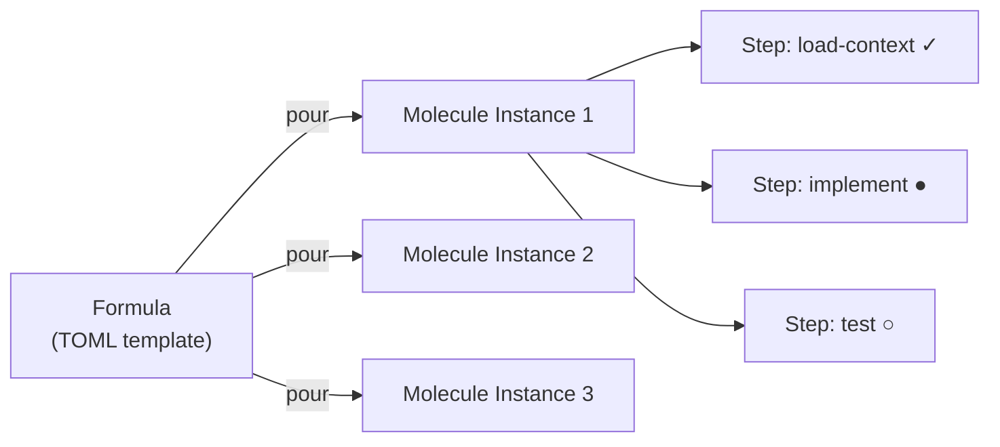
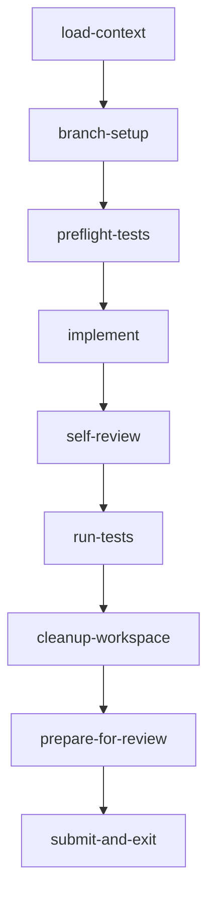

# Molecules & Formulas

**Molecules** are Gas Town's multi-step workflow execution units. A molecule guides an agent through a sequence of steps, tracking progress so that work can resume after crashes, handoffs, or context compaction. **Formulas** are the TOML-defined templates from which molecules are created.

---

## The Relationship

Think of it as a class-instance relationship:

| Concept | Analogy | Storage |
|---------|---------|---------|
| **Formula** | Blueprint / Template | `.beads/formulas/*.formula.toml` |
| **Molecule** | Running instance | Bead in `.beads/beads.db` |

A formula is **poured** into a molecule -- this creates a live workflow instance with step beads that track progress. Multiple molecules can be poured from the same formula simultaneously.



## Molecules

### What a Molecule Tracks

A molecule is a bead that contains:

- **Steps** -- Ordered list of work items, each tracked as a sub-bead (wisp)
- **Dependencies** -- Which steps must complete before others can start
- **Progress** -- Which steps are done, in progress, or pending
- **Variables** -- Runtime values injected from the formula (e.g., issue ID)
- **[Gates](gates.md)** -- Async wait conditions that pause execution

### Step States

Each step in a molecule has a status:

| Symbol | State | Meaning |
|--------|-------|---------|
| `○` | pending | Not yet started, waiting for dependencies |
| `●` | in_progress | Currently being worked on |
| `✓` | done | Completed successfully |
| `✗` | failed | Failed (may need retry) |
| `⏸` | gated | Waiting on an async [gate](gates.md) |

### Step Dependencies

Steps declare dependencies using the `needs` field. A step cannot start until all its dependencies are complete:



### Molecule Types

Gas Town uses molecules for two distinct purposes:

**Work molecules** -- Guide a polecat through a single task:

- `mol-polecat-work` -- Full polecat work lifecycle
- `mol-polecat-code-review` -- Code review assignment
- `mol-polecat-conflict-resolve` -- Merge conflict resolution

**Patrol molecules** -- Guide persistent agents through monitoring cycles:

- `mol-witness-patrol` -- Witness health monitoring loop
- `mol-refinery-patrol` -- Merge queue processing loop
- `mol-deacon-patrol` -- Deacon background coordination loop

### Molecule Commands

```bash
# Show current molecule status
gt mol status

# Show the molecule attached to current session
gt mol current

# Show progress of a specific molecule
gt mol progress <mol-id>

# Mark the current step as done
gt mol step done

# Attach to an existing molecule
gt mol attach <mol-id>

# Detach from current molecule
gt mol detach

# Burn a completed molecule (archive)
gt mol burn <mol-id>

# Squash a molecule into a digest bead
gt mol squash <mol-id> --summary "Patrol cycle: 3 merges, 0 failures"

# Show the dependency graph
gt mol dag <mol-id>
```

### The Squash Pattern

Patrol molecules use a **squash-and-respawn** pattern to avoid accumulating stale step beads:

1. Complete a patrol cycle
2. Squash the molecule into a single digest bead: `gt mol squash`
3. Create a fresh patrol molecule for the next cycle
4. The digest preserves audit trail without per-step pollution

This keeps the beads database clean while maintaining full observability.

## Formulas

### Formula Structure

Formulas are TOML files stored in `.beads/formulas/`. Here is the anatomy of a formula:

```toml
# Top-level metadata
description = "What this formula does"
formula = "formula-name"
version = 1

# Steps define the workflow
[[steps]]
id = "step-one"
title = "First Step"
description = "Detailed instructions for this step"

[[steps]]
id = "step-two"
title = "Second Step"
needs = ["step-one"]   # Depends on step-one completing first
description = "Instructions for step two"

# Variables injected at pour time
[vars]
[vars.feature]
description = "The feature being implemented"
required = true

[vars.assignee]
description = "Who is assigned"
```

### Formula Types

Formulas come in two flavors:

**Workflow formulas** (`type = "workflow"`) -- Linear or DAG-shaped step sequences executed by a single agent:

```toml
formula = "shiny"
type = "workflow"

[[steps]]
id = "design"
title = "Design {{feature}}"

[[steps]]
id = "implement"
needs = ["design"]
title = "Implement {{feature}}"
```

**Convoy formulas** (`type = "convoy"`) -- Parallel execution with multiple agents (legs), followed by a synthesis step:

```toml
formula = "code-review"
type = "convoy"

[[legs]]
id = "correctness"
title = "Correctness Review"

[[legs]]
id = "security"
title = "Security Review"

[synthesis]
title = "Review Synthesis"
depends_on = ["correctness", "security"]
```

### Built-in Formulas

Gas Town ships with 30+ built-in formulas:

#### Work Formulas

| Formula | Type | Description |
|---------|------|-------------|
| `mol-polecat-work` | workflow | Full polecat work lifecycle (9 steps) |
| `mol-polecat-code-review` | workflow | Polecat code review assignment |
| `mol-polecat-conflict-resolve` | workflow | Merge conflict resolution |
| `mol-polecat-review-pr` | workflow | Pull request review |
| `mol-polecat-lease` | workflow | Polecat lease management |
| `shiny` | workflow | Design-implement-review-test-submit |
| `shiny-secure` | workflow | Shiny with security audit step |
| `shiny-enterprise` | workflow | Shiny with full enterprise gates |

#### Patrol Formulas

| Formula | Type | Description |
|---------|------|-------------|
| `mol-witness-patrol` | workflow | Witness per-rig health monitoring |
| `mol-refinery-patrol` | workflow | Refinery merge queue processing |
| `mol-deacon-patrol` | workflow | Deacon background coordination |
| `mol-boot-triage` | workflow | Boot dog triage assessment |

#### Convoy Formulas

| Formula | Type | Description |
|---------|------|-------------|
| `code-review` | convoy | Parallel multi-dimension code review |
| `design` | convoy | Parallel design exploration |
| `security-audit` | convoy | Security-focused analysis |
| `rule-of-five` | convoy | Five-perspective analysis |

#### Operational Formulas

| Formula | Type | Description |
|---------|------|-------------|
| `mol-convoy-cleanup` | workflow | Clean up completed convoys |
| `mol-convoy-feed` | workflow | Generate convoy activity feed |
| `mol-dep-propagate` | workflow | Propagate dependency resolution |
| `mol-digest-generate` | workflow | Generate patrol digest |
| `mol-gastown-boot` | workflow | Town cold-start bootstrap |
| `mol-orphan-scan` | workflow | Scan for orphaned work |
| `mol-session-gc` | workflow | Session garbage collection |
| `mol-shutdown-dance` | workflow | Graceful rig shutdown |
| `mol-sync-workspace` | workflow | Workspace synchronization |
| `mol-town-shutdown` | workflow | Town-wide shutdown |
| `gastown-release` | workflow | Gas Town release process |
| `beads-release` | workflow | Beads release process |

### Formula Commands

```bash
# List all available formulas
gt formula list

# Show formula details
gt formula show mol-polecat-work

# Run a formula (pour into a molecule)
gt formula run shiny --var feature="Add notifications"

# Run a convoy formula
gt formula run code-review --pr=123

# Create a custom formula
gt formula create my-workflow
```

### Creating Custom Formulas

You can create your own formulas by adding TOML files to `.beads/formulas/`:

```toml
# .beads/formulas/my-deploy.formula.toml
description = "Production deployment workflow"
formula = "my-deploy"
type = "workflow"
version = 1

[[steps]]
id = "pre-checks"
title = "Run pre-deployment checks"
description = "Verify build passes, tests green, no blockers"

[[steps]]
id = "deploy-staging"
title = "Deploy to staging"
needs = ["pre-checks"]
description = "Push to staging environment and verify"

[[steps]]
id = "smoke-test"
title = "Run smoke tests"
needs = ["deploy-staging"]
description = "Execute smoke test suite against staging"

[[steps]]
id = "deploy-prod"
title = "Deploy to production"
needs = ["smoke-test"]
description = "Push to production with canary rollout"

[vars]
[vars.version]
description = "Version being deployed"
required = true
```

Then run it:

```bash
gt formula run my-deploy --var version="2.3.1"
```

## Molecule + Hook Integration

Molecules are stored on an agent's [Hook](hooks.md), creating the crash-safe execution model:

```text
Hook
├── hook_bead: gt-a1b2c            # The assigned issue
└── molecule: mol-polecat-work     # Active workflow
    ├── load-context      [done]
    ├── branch-setup      [done]
    ├── implement         [in_progress]  <-- resume here
    ├── self-review       [pending]
    └── submit-and-exit   [pending]
```

On session restart, the agent reads the hook, finds the molecule, and resumes from the last completed step. No work is repeated.

:::tip[When to Use Formulas]

Use the built-in `mol-polecat-work` for standard feature work. Use `shiny` for design-first workflows. Use `code-review` for thorough parallel code reviews. Create custom formulas when you have a repeatable multi-step process that agents should follow consistently.

:::

## Related Concepts

- **[Hooks](hooks.md)** -- Molecules are stored on an agent's hook, enabling crash-safe workflow resume across sessions
- **[Beads](beads.md)** -- Each molecule step is tracked as a wisp bead; the molecule itself is also a bead
- **[Wisps](wisps.md)** -- Ephemeral sub-beads that track individual molecule steps
- **[Gates](gates.md)** -- Steps can be gated on external conditions (CI, human approval, timers), pausing the molecule until the gate closes
- **[Convoys](convoys.md)** -- Convoy formulas orchestrate multiple molecules in parallel with a synthesis step
- **[Rigs](rigs.md)** -- Formulas are stored in the rig's `.beads/formulas/` directory; molecules execute within a rig's context
- **[GUPP & NDI](gupp.md)** -- Molecules implement GUPP through step-level checkpointing: completed steps are never re-executed, and NDI allows different agents to produce different but equivalent implementations
- **[The MEOW Stack](meow-stack.md)** -- Molecules are Layer 3, Formulas are Layer 5 in the MEOW abstraction model