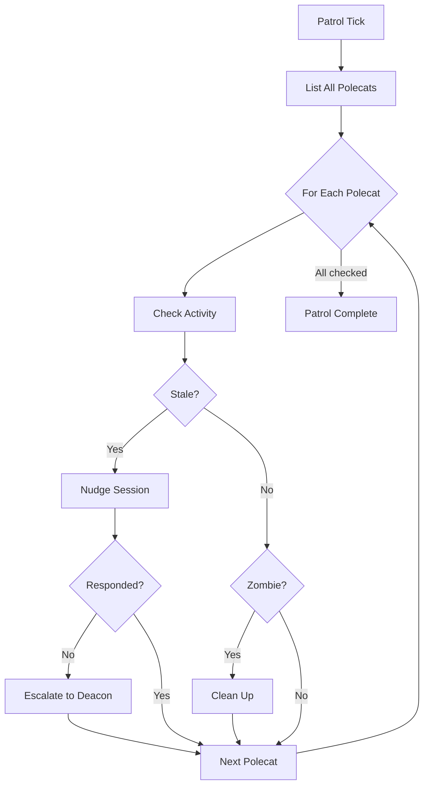
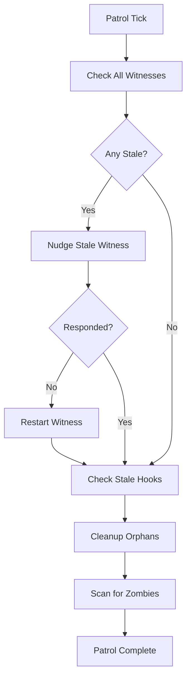

# Patrol Cycles

**Patrol cycles** are the heartbeat of Gas Town's monitoring infrastructure. Every 5 minutes, persistent agents — the [Deacon](../agents/deacon.md), [Witness](../agents/witness.md), and [Refinery](../agents/refinery.md) — wake up, observe the current state of the system, and take corrective action.

---

## Why Patrol Cycles Exist

AI agent systems are inherently chaotic. Sessions crash, context windows fill up, processes become zombies, and work gets stuck. Gas Town addresses this with a simple pattern borrowed from operations engineering: **periodic inspection and remediation**.

Rather than relying on event-driven notifications (which can be lost, duplicated, or arrive out of order), patrol cycles ensure that the system self-heals on a fixed cadence. If something goes wrong between cycles, it will be caught at the next tick.

| Problem | Patrol Response |
|---------|----------------|
| Polecat stalled for 15 min | Witness nudges it |
| Polecat still stalled after nudge | Witness escalates to Deacon |
| Witness itself is unresponsive | Deacon restarts Witness |
| Merge request pending in queue | Refinery processes it |
| Orphaned worktree consuming disk | Deacon cleans it up |
| Zombie process lingering | Deacon terminates it |

---

## The Three Patrol Agents

Each patrol agent has a distinct focus area:

### Witness (Per-Rig)

Each [rig](rigs.md) has one Witness that supervises all polecats in that rig.

**Patrol focus:** Polecat health, stall detection, zombie cleanup, Refinery health.



### Deacon (Town-Wide)

The [Deacon](../agents/deacon.md) is the town-level health coordinator.

**Patrol focus:** Witness health, lifecycle requests, stale hooks, orphaned resources, zombie processes.



### Refinery (Per-Rig)

The [Refinery](../agents/refinery.md) processes the merge queue for its rig.

**Patrol focus:** Merge requests, rebase validation, merge to main.

```
Patrol Tick → Check Queue → Process Next MR → Rebase → Run Tests → Merge → Repeat
```

---

## Timing and Intervals

| Agent | Interval | Trigger |
|-------|----------|---------|
| **Deacon** | 5 min | Daemon heartbeat (every 3 min) |
| **Witness** | 5 min | Patrol molecule step |
| **Refinery** | 5 min | Patrol molecule step |
| **Daemon** | 3 min | Go process timer |

The Daemon (a Go process) sends heartbeats to the Deacon on a 3-minute interval. These heartbeats trigger the Deacon's patrol cycle and carry system state information such as rig list and session inventory.

:::tip[Not Perfectly Synchronized]

The 5-minute intervals are approximate. Each agent runs its own patrol molecule independently. There is no global clock — this is by design. Agents that depend on synchronized timing are fragile; agents that discover state on their own schedule are resilient.

:::

---

## Discovery Over Tracking

Patrol cycles embody Gas Town's core design principle: **discovery over tracking**.

Traditional systems maintain state tables — "polecat-3 started at 14:02, should finish by 14:30." When something goes wrong (process crash, state corruption, race condition), the tracking data becomes stale and misleading.

Gas Town's patrol agents take the opposite approach:

> **Observe reality each cycle. Don't trust yesterday's notes.**

Each patrol cycle, agents:
1. **Scan** the actual system state (processes, sessions, worktrees, hooks)
2. **Compare** against expected health criteria
3. **Act** on any discrepancies found

This means:
- **State corruption is self-healing.** Even if tracking data is lost, the next patrol cycle rediscovers the truth.
- **No single point of failure.** Patrol doesn't depend on event delivery or message queues.
- **Late detection is bounded.** The worst case is one interval (5 minutes) of latency before a problem is noticed.

### Example: Discovery vs Tracking

**Tracking approach (fragile):**
```
Polecat spawned → Tracker records "polecat-3: active"
Polecat crashes → Crash handler fails to fire
Tracker still shows "polecat-3: active"
Work sits stuck indefinitely
```

**Discovery approach (resilient):**
```
Patrol tick → Witness lists all polecats
Witness checks polecat-3's session → not responding
Witness nudges polecat-3 → no response
Witness escalates to Deacon → Deacon cleans up
Work recovers within one patrol cycle
```

---

## Patrol Molecules

Patrol cycles are implemented as [molecules](molecules.md) — the same workflow mechanism used for regular work. The key difference is the **squash-and-respawn** pattern:

1. **Execute** a patrol cycle (check health, take actions)
2. **Squash** the completed molecule into a single digest bead: `gt mol squash`
3. **Respawn** a fresh patrol molecule for the next cycle

This prevents step [wisps](wisps.md) from accumulating over time. Without squashing, a Witness running 288 patrol cycles per day would generate thousands of ephemeral beads.

```bash
# Squash after a patrol cycle
gt mol squash <mol-id> --summary "Patrol cycle: 3 polecats healthy, 1 nudged, 0 escalations"

# Aggregate daily patrol digests
gt patrol digest
gt patrol digest --yesterday
```

### Standard Patrol Formulas

| Formula | Agent | Purpose |
|---------|-------|---------|
| `mol-witness-patrol` | Witness | Health monitoring loop |
| `mol-refinery-patrol` | Refinery | Merge queue processing loop |
| `mol-deacon-patrol` | Deacon | Background coordination loop |

---

## Observing Patrol Activity

### Patrol Digests

Use `gt patrol digest` to see aggregated patrol findings:

```bash
gt patrol digest                          # Today's digest
gt patrol digest --agent witness --rig myapp  # Specific agent/rig
gt patrol digest --yesterday              # Yesterday's digest
```

### Logs

Use `gt log` to see real-time patrol activity:

```bash
gt log --agent witness    # Watch witness patrol in real time
gt log --agent deacon     # Watch deacon patrol
```

### Status

Use `gt status` for a snapshot of current patrol state:

```bash
gt status           # Overview of all agents and rigs
gt witness status   # Witness health and last patrol time
gt deacon status    # Deacon health and last patrol time
```

---

## Agents Without Patrol Cycles

Not all agents run patrol cycles:

| Agent | Patrol? | Why |
|-------|:-------:|-----|
| **Mayor** | On-demand | Responds to requests, doesn't monitor |
| **Polecats** | No | Single-task workers, monitored by Witness |
| **Crew** | No | Human-managed, no automated monitoring |
| **Dogs** | No | Task workers managed by Deacon |
| **Boot** | No | Short-lived triage, spawned by Deacon |

---

## Tuning Patrol Behavior

Patrol intervals and thresholds can be adjusted for cost management:

| Setting | Default | Low-Cost Mode |
|---------|---------|---------------|
| Patrol interval | 5 min | 15 min |
| Stall threshold | 15 min | 30 min |
| Zombie scan | Every cycle | Every 3rd cycle |

See [Cost Management](../guides/cost-management.md) for details on reducing patrol overhead.

:::warning

Longer patrol intervals mean slower detection of problems. A 15-minute interval means a crashed polecat could sit idle for up to 15 minutes before being noticed. Balance cost savings against acceptable detection latency.

:::

---

## Related Concepts

- **[GUPP & NDI](gupp.md)** -- Patrol cycles embody GUPP: each cycle moves the system forward or leaves it unchanged
- **[Molecules & Formulas](molecules.md)** -- Patrol cycles are implemented as patrol molecules with squash-and-respawn
- **[Wisps](wisps.md)** -- Patrol steps create wisps that are squashed after each cycle
- **[Session Cycling](session-cycling.md)** -- Persistent agents cycle their own sessions when context fills
- **[Hooks](hooks.md)** -- Patrol agents discover stale hooks during their cycles
- **[Design Principles](../architecture/design-principles.md)** -- "Discovery over Tracking" is the principle behind patrol cycles
