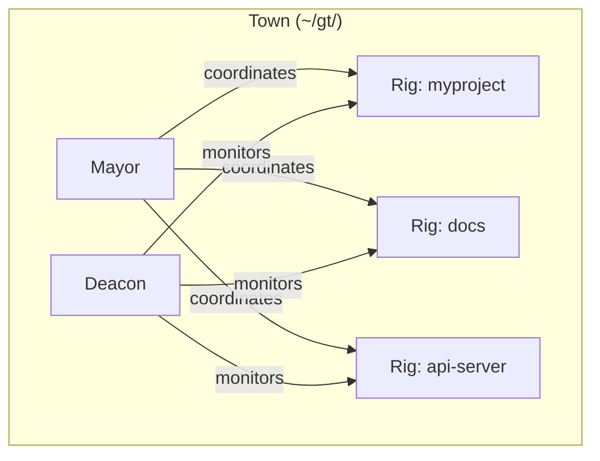
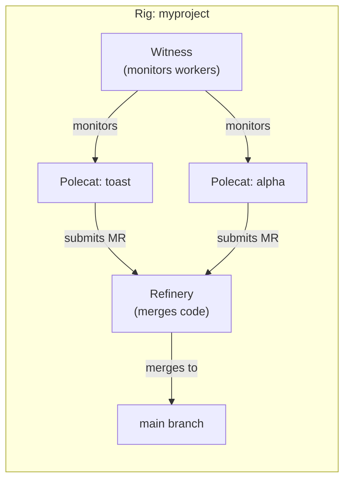
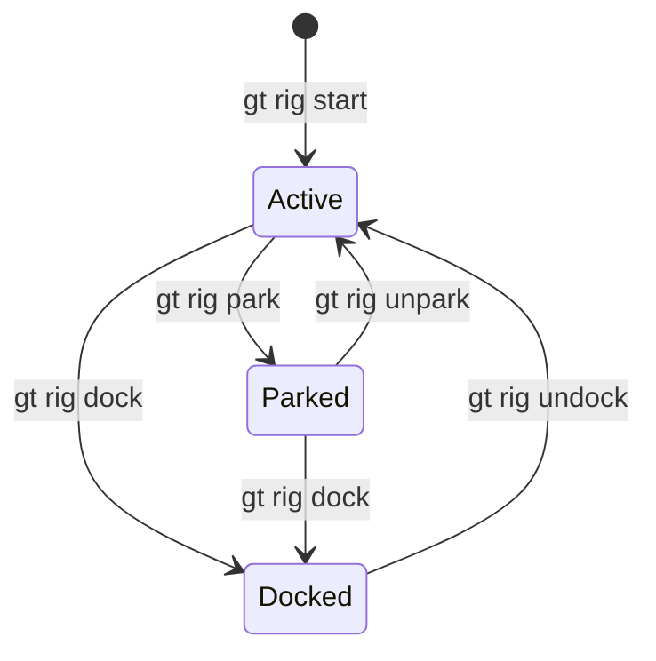

# Rigs (Project Containers)

A **Rig** is Gas Town's project container. Each rig wraps a git repository with the full agent infrastructure needed to manage, develop, and merge code. Rigs are the physical structure of a Gas Town workspace -- every project you manage with Gas Town becomes a rig.

---

## What is a Rig?

The name comes from the Mad Max universe -- an oil rig is a self-contained mobile unit. In Gas Town, a rig is a self-contained project unit with its own:

- Git repository clone(s)
- Issue tracking database
- Merge queue (Refinery)
- Health monitor (Witness)
- Worker sandboxes (Polecats)
- Human developer workspaces (Crew)
- Configuration



## Rig Directory Structure

When you add a rig with `gt rig add`, the following directory structure is created:

```
~/gt/myproject/
├── .beads/              # Rig-level issue tracking (SQLite)
│   ├── beads.db         # Issue database
│   └── formulas/        # TOML workflow templates
├── config.json          # Rig configuration
├── refinery/
│   └── rig/             # Canonical main clone (merge queue)
├── mayor/
│   └── rig/             # Mayor's working copy
├── crew/                # Human developer workspaces
│   ├── dave/            # Dave's persistent clone
│   └── emma/            # Emma's persistent clone
├── witness/             # Witness agent state
├── polecats/            # Ephemeral worker directories
│   ├── toast/           # Polecat "toast" worktree
│   └── alpha/           # Polecat "alpha" worktree
└── plugins/             # Rig-level plugins
```

### Key Directories

| Directory | Purpose | Lifecycle |
|-----------|---------|-----------|
| `.beads/` | Issue tracking database and formulas | Persistent, synced via git |
| `refinery/rig/` | Canonical clone used for merge operations | Persistent, always on main |
| `mayor/rig/` | Mayor's read-only working copy for analysis | Persistent |
| `crew/` | Human developer persistent workspaces | Persistent per-developer |
| `witness/` | Witness agent monitoring state | Persistent |
| `polecats/` | Ephemeral worker sandboxes (git worktrees) | Created and destroyed per-task |
| `plugins/` | Rig-specific plugin configurations | Persistent |

## Per-Rig Agents

Each rig has two dedicated persistent agents:

### Witness

The Witness is the **pit boss** for the rig. It monitors polecat health, detects stalled or zombie workers, and handles cleanup:

- Runs the `mol-witness-patrol` molecule in a loop
- Checks polecat status via agent beads
- Nudges stuck polecats, escalates unresponsive ones
- Nukes completed polecat sandboxes
- Reports health to the Deacon via WITNESS_PING

### Refinery

The Refinery is the **merge queue processor** for the rig. It takes completed polecat branches and merges them to main:

- Runs the `mol-refinery-patrol` molecule in a loop
- Picks up MERGE_READY notifications from Witnesses
- Rebases polecat branches on latest main
- Runs tests to validate the merge
- Fast-forward merges clean branches
- Creates conflict-resolution tasks when rebasing fails



## Rig Configuration

Each rig has a `config.json` file that defines its settings:

```json
{
  "type": "rig",
  "version": 1,
  "name": "myproject",
  "git_url": "git@github.com:you/repo.git",
  "default_branch": "main",
  "created_at": "2026-01-15T10:30:00Z",
  "beads": {
    "prefix": "gt"
  }
}
```

| Field | Description |
|-------|-------------|
| `name` | Rig identifier (directory name) |
| `git_url` | Remote repository URL |
| `default_branch` | Main branch name (`main` or `master`) |
| `beads.prefix` | Prefix for beads created in this rig |

## Rig States

Rigs have operational states that control agent behavior:

| State | Meaning | Agent Behavior |
|-------|---------|----------------|
| **Active** | Normal operation | All agents running |
| **Parked** | Temporarily paused | Agents idle, no new work |
| **Docked** | Fully shut down | No agents, no monitoring |



:::warning[Docked Rigs]

When a rig is docked, the Deacon skips all health checks for it. No agents are monitored, no polecats are spawned, and no merges are processed. Use docking for rigs that are temporarily inactive (e.g., a project that is on hold).

:::

## Commands

### Adding a Rig

```bash
# Add from a remote repository
gt rig add myproject https://github.com/you/repo.git

# Add with SSH URL
gt rig add myproject git@github.com:you/repo.git
```

### Listing Rigs

```bash
# List all rigs with status
gt rig list
```

Example output:

```
Name          Status    Branch    Polecats    MQ
myproject     Active    main      2/3         1 pending
docs          Active    master    0/0         0 pending
api-server    Docked    main      -           -
```

### Starting and Stopping

```bash
# Start a rig (launch Witness + Refinery)
gt rig start myproject

# Stop a rig (graceful shutdown of agents)
gt rig stop myproject

# Shutdown (immediate stop)
gt rig shutdown myproject
```

### Checking Status

```bash
# Detailed rig status
gt rig status myproject
```

### Lifecycle Management

```bash
# Reboot a rig (stop + start)
gt rig reboot myproject

# Boot a rig (cold start)
gt rig boot myproject

# Reset a rig (clear state and restart)
gt rig reset myproject
```

### Parking and Docking

```bash
# Park a rig (pause without shutting down)
gt rig park myproject

# Unpark (resume)
gt rig unpark myproject

# Dock a rig (fully shut down)
gt rig dock myproject

# Undock (bring back online)
gt rig undock myproject
```

## Command Reference

| Command | Description |
|---------|-------------|
| `gt rig add <name> <url>` | Add a new rig from a git repository |
| `gt rig list` | List all rigs with status |
| `gt rig start <name>` | Start rig agents (Witness + Refinery) |
| `gt rig stop <name>` | Gracefully stop rig agents |
| `gt rig shutdown <name>` | Immediately stop rig agents |
| `gt rig status <name>` | Show detailed rig status |
| `gt rig reset <name>` | Clear state and restart |
| `gt rig boot <name>` | Cold-start a rig |
| `gt rig reboot <name>` | Stop and restart a rig |
| `gt rig park <name>` | Pause rig (keep state, stop new work) |
| `gt rig unpark <name>` | Resume a parked rig |
| `gt rig dock <name>` | Fully shut down a rig |
| `gt rig undock <name>` | Bring a docked rig back online |

## Rig in the Bigger Picture

Rigs are the physical foundation on which all other concepts operate:

- **Beads** live in each rig's `.beads/` directory
- **Hooks** are implemented as git worktrees within the rig
- **Polecats** are spawned as worktrees under `polecats/`
- **The Refinery** processes merges from the rig's `refinery/rig/` clone
- **Convoys** can span multiple rigs for cross-project coordination
- **Molecules** execute within a rig's context

:::tip[Adding Your First Rig]

See the [Quick Start](../getting-started/quickstart.md) guide for a step-by-step walkthrough of adding your first project as a rig and starting work.


:::