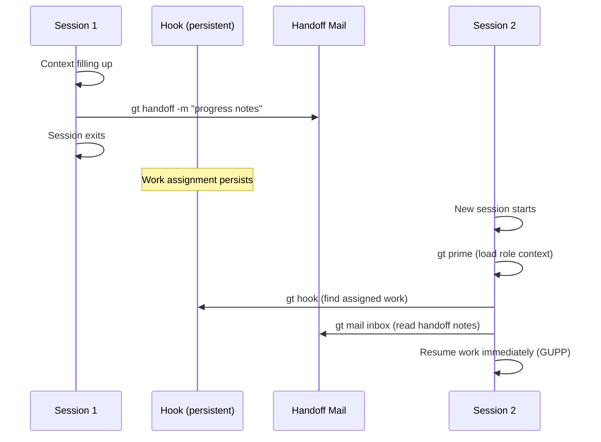
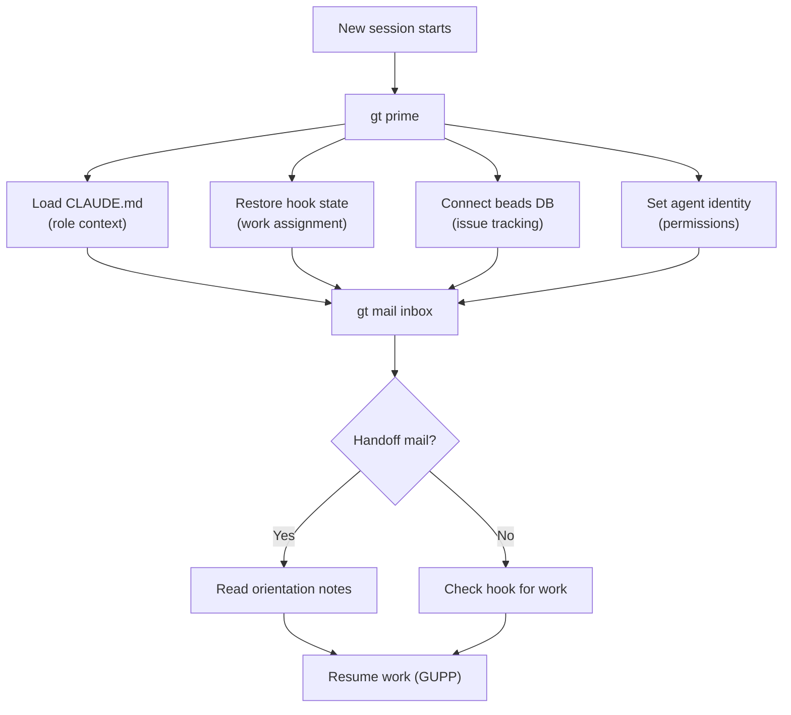
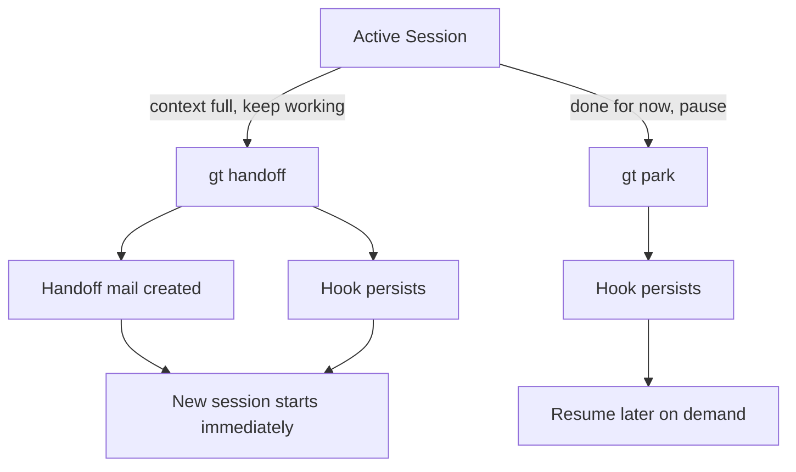
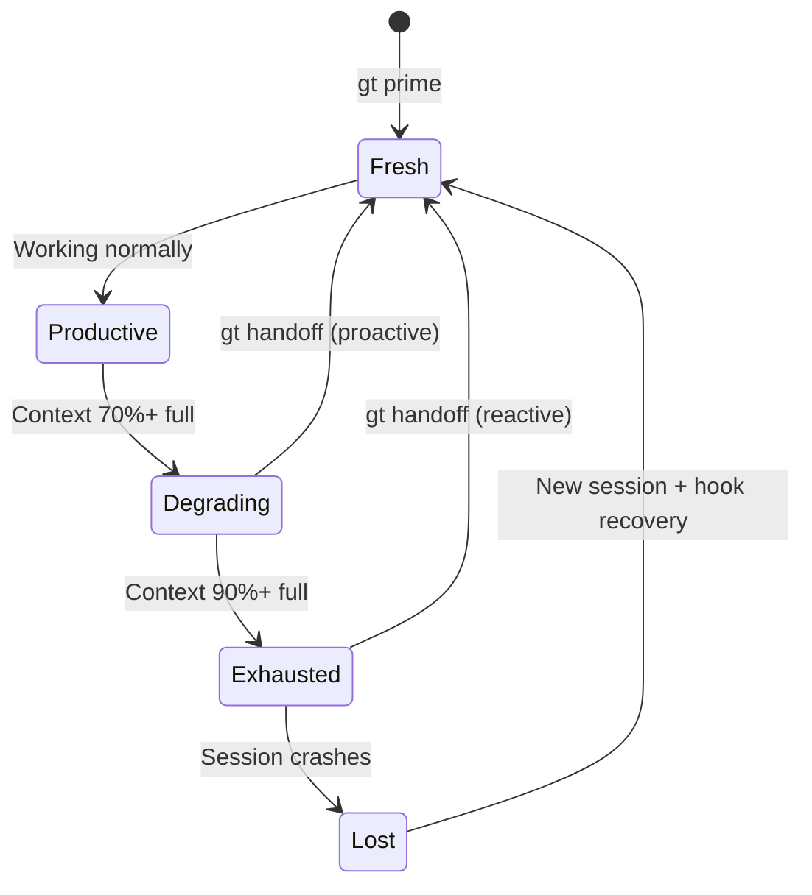

# Session Cycling

**Session cycling** is Gas Town's mechanism for refreshing an agent's context window without losing work. When a session fills its context or finishes a logical chunk, it creates a handoff and a fresh session picks up where it left off.

---

## Why Sessions Need Cycling

AI coding agents have finite context windows. As an agent works -- reading files, writing code, communicating -- its context fills up. At capacity, the agent becomes sluggish, repetitive, or loses track of its goals.

Gas Town solves this with session cycling:

| Problem | Solution |
|---------|----------|
| Context window fills up | Hand off to a fresh session |
| Agent loses track of work | Hook persists across sessions |
| Notes and progress lost | Handoff mail carries context |
| Restart means starting over | `gt prime` reloads full role context |

---

## The Two Persistence Mechanisms

:::note
These two mechanisms are deliberately independent. If either one fails, the other still preserves enough state to continue. The hook carries the assignment; the mail carries the context.
:::

Session cycling relies on two independent mechanisms:

### 1. The Hook (What You're Working On)

The [hook](hooks.md) persists the agent's current work assignment. Whether it's a [molecule](molecules.md), a bead, or hooked mail, the hook survives session restarts. When the new session starts and runs `gt prime`, it finds the work still on its hook and continues.

### 2. Handoff Mail (Context Notes)

The handoff mail is optional context that captures nuances the hook doesn't:

```bash
gt handoff -s "Working on auth bug" -m "
Found the issue is in token refresh logic.
Check line 145 in auth.go first.
The failing test is TestRefreshExpired.
"
```

This creates a mail bead addressed to yourself. Your next session reads it for orientation.

---

## How It Works



---

## When to Cycle

### Polecats

Polecats cycle when context pressure builds. The [Witness](../agents/witness.md) monitors for signs of context exhaustion (sluggishness, repetition) and may nudge a polecat to cycle.

```bash
# Polecat self-cycles
gt handoff -s "Context filling" -m "Implemented X, Y remains. Next: finish Y and run tests."
```

### Persistent Agents (Mayor, Witness, Deacon)

Persistent agents experience automatic compaction but may lose nuance. If an agent seems confused after compaction, `gt prime` reloads the full role context.

```bash
# From outside: nudge agent to recover context
gt nudge witness "Run gt prime to reset context"

# Or restart with fresh context
gt witness restart --fresh
```

### Crew Workers

Crew cycling is relaxed. You cycle when it feels right:
- Context getting full
- Finished a logical chunk of work
- Need a fresh perspective
- Human asks you to

```bash
# Crew handoff with context notes
gt handoff -s "Finished sidebar fixes" -m "
Closed beads ga-abc, ga-def.
Remaining work: ga-ghi needs review.
Build is clean, all pushed to main.
"
```

:::warning

Always commit and push your changes before cycling a session. In a multi-agent environment, unpushed work can be overwritten by other agents working on the same files. The handoff preserves context notes, but it does not preserve uncommitted code.

:::

---

:::info[Cycle Frequency]

There is no fixed rule for how often to cycle sessions. A polecat working on a complex implementation may cycle every 20-30 minutes as context fills rapidly, while a crew member doing light review work might go hours between cycles. Watch for signs of context degradation -- repeated file reads, forgotten instructions, or circular reasoning -- and cycle proactively before quality drops.

:::

## Context Recovery

When a new session starts (or after compaction), the agent rebuilds its working context through a well-defined recovery sequence.



```bash
gt prime
```

This reloads:
- Full role context from CLAUDE.md
- Hook state (current work assignment)
- Beads database access
- Agent identity and permissions

Then check for handoff notes:

```bash
gt mail inbox
```

---

:::caution[Compaction Is Not Cycling]

Automatic context compaction (where the model compresses older messages) is not the same as a session cycle. Compaction preserves the session but loses nuance. If an agent behaves oddly after compaction, trigger a full cycle with `gt handoff` to get a clean context window rather than relying on degraded compressed context.

:::

## Handoff vs Park



| Action | `gt handoff` | `gt park` |
|--------|-------------|-----------|
| **Intent** | Continue immediately in new session | Pause, resume later |
| **Successor** | Expected immediately | No immediate successor |
| **Use case** | Context full, keep working | End of day, break |
| **State** | Hook + mail persist | Hook persists |

---

## Session Context Health

A session's effectiveness degrades as context fills, making timely cycling critical.



## Best Practices

:::tip
The next session has zero memory of the current one. Write handoff notes as if briefing a stranger — because from a context perspective, that's exactly what's happening.
:::

1. **Always include handoff notes.** The next session (even if it's "you") has no memory of the previous one. Good notes save significant ramp-up time.

2. **Commit and push before cycling.** Unpushed work in a multi-agent environment is work at risk. Always land your changes before handing off.

3. **Keep notes actionable.** Focus on what to do next, not a history of what was tried:
   - Good: "Next: fix the auth test in line 145, then run `go test ./auth/...`"
   - Bad: "I spent a while looking at various things and found some issues"

4. **Cycle proactively.** Don't wait until the context window is completely full. If you notice yourself re-reading the same files or losing track, it's time.

---

## Related Concepts

- **[GUPP](gupp.md)** -- The propulsion principle ensures the new session immediately executes hooked work
- **[Hooks](hooks.md)** -- The persistence mechanism that survives session cycling
- **[Molecules](molecules.md)** -- Multi-step workflows track progress across session boundaries

### Blog Posts

- [Session Cycling Explained](/blog/session-cycling) -- Practical guide to context refresh and handoff patterns
- [Understanding GUPP: Why Crashes Don't Lose Work](/blog/understanding-gupp) -- How hooks and session cycling work together to make Gas Town crash-safe
- [Hook Persistence: Why Agent State Survives Restarts](/blog/hook-persistence) -- How hooks persist work assignments across session boundaries, enabling seamless cycling
- [Agent-to-Agent Communication Patterns](/blog/agent-communication-patterns) -- How handoff mail and inter-agent messaging coordinate context transfer during session cycles
