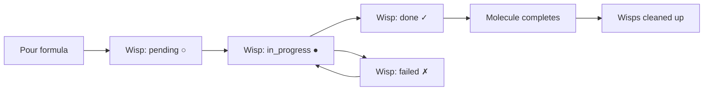

# Wisps (Ephemeral Sub-Beads)

**Wisps** are lightweight tracking units that represent individual steps within a [molecule](molecules.md). Each step in a molecule's workflow is tracked as a wisp -- an ephemeral sub-bead that records progress, state transitions, and completion without persisting to the main issue database.

---

## Wisps vs Beads

| Property | Bead | Wisp |
|----------|------|------|
| **Persistence** | Permanent (exported to JSONL) | Ephemeral by default |
| **Scope** | Standalone issue or tracking unit | Always belongs to a molecule |
| **Creation** | Manual (`bd create`) or automated | Automatic (when molecule is poured) |
| **Lifecycle** | Survives indefinitely | Cleaned up with parent molecule |
| **Type field** | `task`, `bug`, `feature`, etc. | `wisp` |

Wisps exist because molecule steps need tracking granularity without the overhead of full beads. A molecule with 9 steps creates 9 wisps -- one per step. These wisps track whether each step is pending, in progress, done, or failed.

---

## How Wisps Are Created

Wisps are created automatically when a formula is **poured** into a molecule. Each step defined in the formula's TOML becomes a wisp:

```toml
# Example formula steps (each becomes a wisp)
[[steps]]
name = "load-context"
description = "Load bead details and repository context"

[[steps]]
name = "implement"
description = "Write the code changes"
needs = ["load-context"]

[[steps]]
name = "run-tests"
description = "Execute test suite"
needs = ["implement"]
```

When this formula is poured, three wisps are created -- one for `load-context`, one for `implement`, and one for `run-tests`.

---

## Wisp States

Wisps follow the same state model as molecule steps:

| Symbol | State | Meaning |
|--------|-------|---------|
| `○` | pending | Not yet started, waiting for dependencies |
| `●` | in_progress | Currently being worked on |
| `✓` | done | Completed successfully |
| `✗` | failed | Failed (may need retry) |
| `⏸` | gated | Waiting on an async [gate](gates.md) |

---

## Wisp Lifecycle



1. **Creation**: Formula is poured, wisps are scaffolded for each step
2. **Execution**: Agent works through steps, advancing wisp states
3. **Completion**: When all wisps reach `done`, the molecule completes
4. **Cleanup**: Wisps are removed with their parent molecule

---

## Cleanup Wisps

:::info
Cleanup wisps are the exception, not the rule. A well-behaved polecat that runs `gt done` cleanly needs no cleanup wisp at all.
:::

A special use of wisps occurs in the [Witness](../agents/witness.md) workflow. When a polecat exits with a dirty state (uncommitted changes, unpushed commits), the Witness creates a **cleanup wisp** to track recovery:

- **Clean exit** (branch pushed, MR submitted, git clean): No wisp needed -- auto-nuke immediately
- **Dirty exit** (uncommitted changes, unpushed commits): Cleanup wisp created to track recovery, then nuke

This means the common case (clean `gt done`) is fast and automatic. Cleanup wisps are the exception, not the rule.

---

## Viewing Wisps

```bash
# See molecule status including all wisps
gt mol status

# Show detailed step/wisp states
gt mol current
```

---

## Ephemeral by Design

:::note
Wisps are deliberately invisible in normal bead listings. If you need to see them, use `gt mol status` which shows molecule progress including all wisp states.
:::

Wisps are deliberately ephemeral. They are **not exported** to JSONL during `bd sync` and do not appear in `bd list` output. This keeps the beads database focused on meaningful work items while allowing molecules to track arbitrarily fine-grained progress internally.

If you need persistent tracking of sub-tasks, use regular beads with dependency links instead of wisps.

---

## Related Concepts

- **[Molecules & Formulas](molecules.md)** -- Wisps are the per-step tracking units within molecules
- **[Beads](beads.md)** -- Wisps are a specialized bead type (`type: wisp`) with ephemeral lifecycle
- **[Gates](gates.md)** -- A wisp can be gated, pausing its molecule step until an external condition resolves
- **[Hooks](hooks.md)** -- The parent molecule (containing wisps) is attached to an agent's hook
