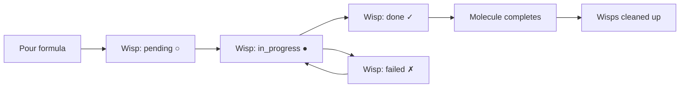
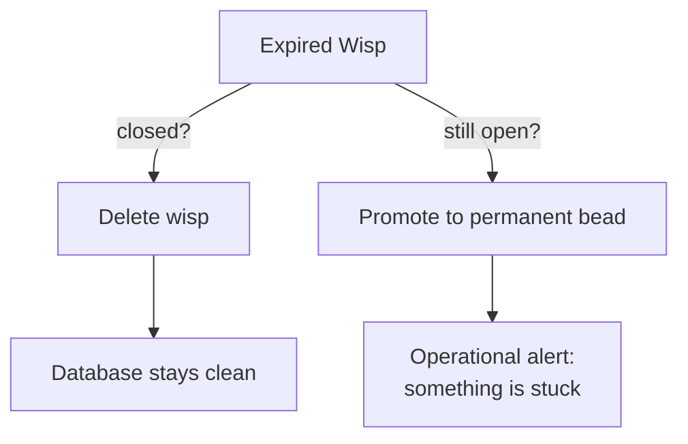
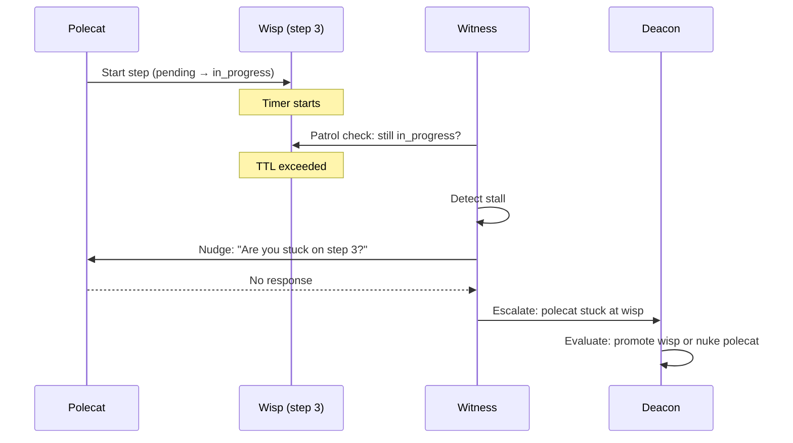

# Wisps (Ephemeral Sub-Beads)

**Wisps** are lightweight tracking units that represent individual steps within a [molecule](molecules.md). Each step in a molecule's workflow is tracked as a wisp -- an ephemeral sub-bead that records progress, state transitions, and completion without persisting to the main issue database.

---

## Wisps vs Beads

| Property | Bead | Wisp |
|----------|------|------|
| **Persistence** | Permanent (exported to JSONL) | Ephemeral by default |
| **Scope** | Standalone issue or tracking unit | Always belongs to a molecule |
| **Creation** | Manual (`bd create`) or automated | Automatic (when molecule is poured) |
| **Lifecycle** | Survives indefinitely | Cleaned up with parent molecule |
| **Type field** | `task`, `bug`, `feature`, etc. | `wisp` |

Wisps exist because molecule steps need tracking granularity without the overhead of full beads. A molecule with 9 steps creates 9 wisps -- one per step. These wisps track whether each step is pending, in progress, done, or failed.

---

## How Wisps Are Created

Wisps are created automatically when a formula is **poured** into a molecule. Each step defined in the formula's TOML becomes a wisp:

```toml
# Example formula steps (each becomes a wisp)
[[steps]]
name = "load-context"
description = "Load bead details and repository context"

[[steps]]
name = "implement"
description = "Write the code changes"
needs = ["load-context"]

[[steps]]
name = "run-tests"
description = "Execute test suite"
needs = ["implement"]
```

When this formula is poured, three wisps are created -- one for `load-context`, one for `implement`, and one for `run-tests`.

---

## Wisp States

Wisps follow the same state model as molecule steps:

| Symbol | State | Meaning |
|--------|-------|---------|
| `○` | pending | Not yet started, waiting for dependencies |
| `●` | in_progress | Currently being worked on |
| `✓` | done | Completed successfully |
| `✗` | failed | Failed (may need retry) |
| `⏸` | gated | Waiting on an async [gate](gates.md) |

---

## Wisp Lifecycle



1. **Creation**: Formula is poured, wisps are scaffolded for each step
2. **Execution**: Agent works through steps, advancing wisp states
3. **Completion**: When all wisps reach `done`, the molecule completes
4. **Cleanup**: Wisps are removed with their parent molecule

---

## Compaction: Wisp Garbage Collection



Wisps accumulate over time as molecules complete. The [compaction system](../cli-reference/compact.md) applies TTL-based cleanup:

| Wisp Type | TTL | Action After TTL |
|-----------|-----|------------------|
| `heartbeat`, `ping` | 6 hours | Delete if closed, promote if open |
| `patrol`, `gc_report` | 24 hours | Delete if closed, promote if open |
| `recovery`, `error`, `escalation` | 7 days | Delete if closed, promote if open |

**Promotion** means converting an expired open wisp into a permanent bead — if a wisp is still open past its TTL, something is likely stuck and needs attention. Promoted wisps appear in `bd list` for follow-up.

```bash
# Preview what compaction would do
gt compact --dry-run --verbose

# Run compaction
gt compact
```

## Cleanup Wisps

:::info
Cleanup wisps are the exception, not the rule. A well-behaved polecat that runs `gt done` cleanly needs no cleanup wisp at all.
:::

A special use of wisps occurs in the [Witness](../agents/witness.md) workflow. When a polecat exits with a dirty state (uncommitted changes, unpushed commits), the Witness creates a **cleanup wisp** to track recovery:

- **Clean exit** (branch pushed, MR submitted, git clean): No wisp needed -- auto-nuke immediately
- **Dirty exit** (uncommitted changes, unpushed commits): Cleanup wisp created to track recovery, then nuke

This means the common case (clean `gt done`) is fast and automatic. Cleanup wisps are the exception, not the rule.

---

## Viewing Wisps

```bash
# See molecule status including all wisps
gt mol status

# Show detailed step/wisp states
gt mol current
```

---

## Ephemeral by Design

:::note
Wisps are deliberately invisible in normal bead listings. If you need to see them, use `gt mol status` which shows molecule progress including all wisp states.
:::

Wisps are deliberately ephemeral. They are **not exported** to JSONL during `bd sync` and do not appear in `bd list` output. This keeps the beads database focused on meaningful work items while allowing molecules to track arbitrarily fine-grained progress internally.

If you need persistent tracking of sub-tasks, use regular beads with dependency links instead of wisps.

---

## When to Use Wisps

Wisps are created automatically -- you almost never create them manually. Understanding when they appear helps you interpret molecule status:

- **Standard polecat work** -- Every molecule step generates a wisp. When you run `gt mol status`, the step states you see are wisps.
- **Cleanup tracking** -- When the Witness detects a dirty polecat exit, it creates a cleanup wisp to track recovery actions before nuking the sandbox.
- **Progress monitoring** -- Wisps give you fine-grained visibility into where an agent is in its workflow.

:::note[When NOT to Use Wisps]

Never create wisps directly with `bd create --type wisp`. Wisps are internal tracking units managed by the molecule system. If you need persistent sub-task tracking, use regular beads with dependencies instead.

:::

:::warning[Wisp Promotion Signals]

When a wisp is promoted from ephemeral to permanent (because it exceeded its TTL while still open), treat it as an operational alert. Promoted wisps indicate that something in the workflow is stuck or broken -- a polecat may have crashed without cleanup, a gate may never have closed, or a dependency may be unresolvable. Investigate promoted wisps promptly to prevent cascading delays.

:::

## Wisps in the Supervision Chain

Wisps provide granular observability for the supervision hierarchy:

```text
Human → checks convoy status (beads level)
Mayor → checks molecule progress (wisp level)
Witness → checks wisp state to detect stuck polecats
Deacon → checks wisp promotions to detect systemic issues
```

When a Witness detects a polecat with a wisp stuck in `in_progress` for too long, it triggers the escalation chain. The wisp's state is the primary signal for detecting stuck work at the individual step level.



## Related Concepts

- **[Molecules & Formulas](molecules.md)** -- Wisps are the per-step tracking units within molecules
- **[Beads](beads.md)** -- Wisps are a specialized bead type (`type: wisp`) with ephemeral lifecycle
- **[Gates](gates.md)** -- A wisp can be gated, pausing its molecule step until an external condition resolves
- **[Hooks](hooks.md)** -- The parent molecule (containing wisps) is attached to an agent's hook

### Blog Posts

- [Building Your First Custom Formula](/blog/custom-formulas) -- Step-by-step guide to creating TOML formulas that define custom agent workflows for specialized tasks
- [Formula Design Patterns for Gas Town](/blog/formula-design-patterns) -- Advanced patterns for multi-step formulas where wisps track each step's progress
- [Understanding the Witness](/blog/witness-explained) -- How the Witness monitors wisp states during patrol to detect stuck polecats and trigger recovery
- [Lifecycle Management in Gas Town](/blog/lifecycle-management) -- How wisp TTLs, compaction, and promotion fit into the broader agent lifecycle management system
