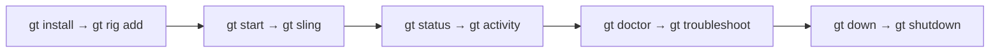
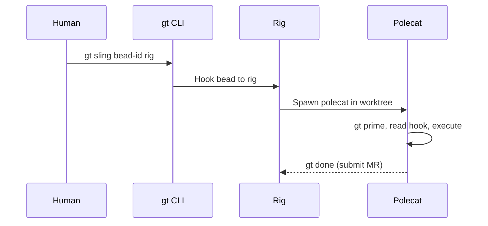
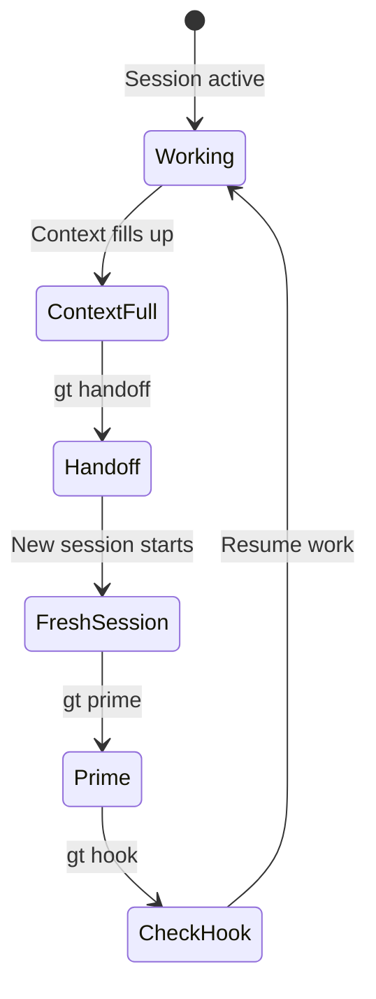
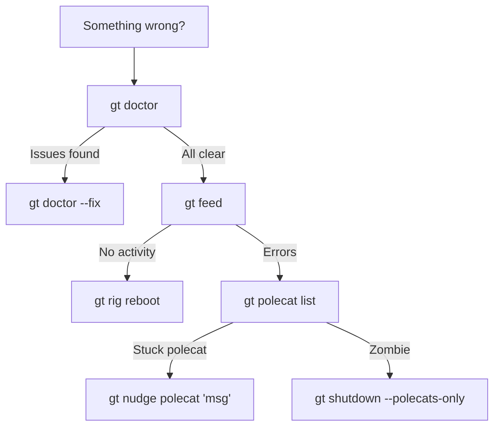
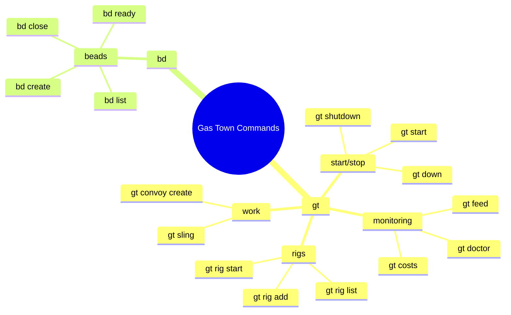

# Cheat Sheet

A quick reference for the commands you'll use most often. Print this or keep it in a tab.



:::tip
Commands prefixed with `gt` manage agents and workflows. Commands prefixed with `bd` manage issues (beads).
:::

---

## Starting & Stopping

| Command | What it does |
|---------|-------------|
| `gt start` | Start Mayor + Deacon |
| `gt start --all` | Start everything (all rigs) |
| `gt down` | Pause all agents (preserves state) |
| `gt shutdown` | Stop and clean up worktrees |
| `gt rig start <name>` | Start agents in one rig |
| `gt rig stop <name>` | Stop agents in one rig |
| `gt rig park <name>` | Pause a rig (skipped by `start --all`) |
| `gt rig unpark <name>` | Resume a parked rig |

---

## Monitoring

| Command | What it does |
|---------|-------------|
| `gt feed` | Live activity stream |
| `gt trail` | Recent activity summary |
| `gt doctor` | System health check |
| `gt rig list` | List all rigs and their status |
| `gt polecat list` | List active polecats |
| `gt costs` | Token usage and cost tracking |
| `gt status` | Quick status overview |

---

## Working with Beads (Issues)

| Command | What it does |
|---------|-------------|
| `bd create --title "..." --type task` | Create a new issue |
| `bd list` | List all open issues |
| `bd show <id>` | View issue details |
| `bd ready` | Show issues with no blockers |
| `bd update <id> --status=in_progress` | Claim an issue |
| `bd close <id>` | Mark issue complete |
| `bd dep add <child> <parent>` | Add dependency (child needs parent) |

---

## Assigning Work

| Command | What it does |
|---------|-------------|
| `gt sling <bead-id> <rig>` | Assign a bead to a rig (spawns polecat) |
| `gt convoy create "Name" <id1> <id2>...` | Bundle beads into a convoy |
| `gt convoy list` | List active convoys |
| `gt convoy status <id>` | Check convoy progress |



---

:::caution[Push Before Handoff]

Always run `git push` before executing `gt handoff` or ending a session. In a multi-agent environment, unpushed commits exist only in your local worktree and can be overwritten by other polecats merging to main.

:::

## Communication

| Command | What it does |
|---------|-------------|
| `gt mail inbox` | Check your messages |
| `gt mail send <addr> -s "Subject" -m "Body"` | Send mail to an agent |
| `gt mail send --human -s "Subject" -m "Body"` | Send mail to the overseer |
| `gt nudge <agent> "message"` | Send immediate message to an agent |
| `gt escalate "msg" -s HIGH` | Create an escalation |

---

## Agent Sessions

| Command | What it does |
|---------|-------------|
| `gt mayor attach` | Attach to Mayor session |
| `gt may at` | Short alias for Mayor attach |
| `gt crew at <name>` | Attach to a crew workspace |
| `gt witness attach --rig <name>` | Attach to a Witness |
| `gt polecat attach <name> --rig <rig>` | Attach to a polecat |

---

## Context & Handoff



| Command | What it does |
|---------|-------------|
| `gt prime` | Reload full role context |
| `gt hook` | Check what's on your hook |
| `gt handoff -m "notes"` | Cycle to fresh session |
| `gt mol status` | Check molecule progress |
| `gt seance` | List recent sessions |
| `gt seance --talk <id> -p "question"` | Query a previous session |

---

## Git (Multi-Agent)

```bash
# Standard work cycle
git pull --rebase            # Always pull first
# ... edit files ...
git add <files>
git commit -m "description"
git pull --rebase && git push  # Push immediately

# When push fails
git pull --rebase            # Rebase onto remote
# resolve conflicts if any
git push                     # Try again
```

:::warning
In Gas Town, unpushed commits are invisible to every other agent. Push after every commit.
:::

---

:::danger[Force Commands]

Avoid using `--force` flags unless absolutely necessary. Commands like `gt shutdown --force` bypass safety checks and can corrupt active worktrees or lose uncommitted work. Always try the graceful version first and only escalate to `--force` if the system is truly wedged.

:::

:::info[Keep This Page Bookmarked]

Bookmark this cheat sheet in your browser for instant reference. The search shortcut `Ctrl+K` is fast, but a pinned tab with this page is even faster when you need to look up a command mid-workflow without breaking focus.

:::

## Troubleshooting Decision Tree

When something goes wrong, follow this decision tree to find the right command.





## Emergency Commands

| Command | What it does |
|---------|-------------|
| `gt doctor` | Diagnose system health |
| `gt doctor --fix` | Auto-fix common issues |
| `gt shutdown --polecats-only` | Kill all polecats, keep everything else |
| `gt rig reboot <name>` | Stop, clean, restart a rig |
| `gt cleanup --rig <name>` | Clean orphaned resources |

:::note
When something seems wrong, `gt doctor` should be your first step. It checks agent health, session state, and common configuration issues — giving you a clear diagnosis before you start troubleshooting manually. For critical production issues, see the [Incident Response](/blog/incident-response) guide.
:::

---

:::info
If you are working with multiple rigs, most commands accept a `--rig <name>` flag to target a specific project. Without it, commands default to the current rig based on your working directory.
:::

## Keyboard Shortcuts (Docs Site)

| Shortcut | Action |
|----------|--------|
| `Ctrl+K` / `⌘+K` | Open search |
| `Esc` | Close search |
| `↑` / `↓` | Navigate search results |
| `Enter` | Go to selected result |

## Related

- [Installation](installation.md) -- Install Gas Town and its dependencies
- [Quick Start](quickstart.md) -- Set up your first workspace end-to-end
- [Glossary](../guides/glossary.md) -- Full terminology reference for all Gas Town terms
- [CLI Reference](../cli-reference/index.md) -- Complete command documentation with all flags and options

### Blog Posts

- [5 Common Pitfalls When Starting with Gas Town](/blog/common-pitfalls) -- Avoid the most frequent mistakes new users make
- [Your First Convoy in 5 Minutes](/blog/first-convoy) -- Quick walkthrough of creating beads, bundling a convoy, and watching polecats deliver
- [Mastering gt sling](/blog/mastering-gt-sling) -- Complete guide to the sling command for assigning work to rigs and polecats
- [The Crew Workflow](/blog/crew-workflow) -- How human developers use crew workspaces alongside the commands in this cheat sheet
