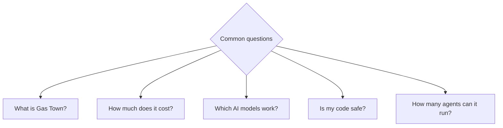
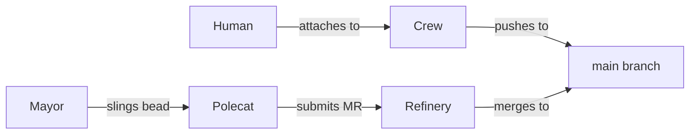

# Frequently Asked Questions



:::tip
Use your browser's search (`Ctrl+K`) to find specific topics. For full command documentation, see the [CLI Reference](../cli-reference/index.md).
:::

---

## General

### What is Gas Town?

Gas Town is a multi-agent AI orchestration system that coordinates fleets of AI coding agents to build software. It provides supervision, crash recovery, merge queue management, and work tracking for 1 to 30+ concurrent agents.

### Why is it called Gas Town?

The naming is inspired by Mad Max: Fury Road. Gas Town is the fuel-producing citadel; rigs are armored trucks; polecats are the warriors who swing on poles; the refinery processes crude into fuel (code into merged commits). See the [Glossary](../guides/glossary.md) for all Mad Max terminology.

### What AI models does Gas Town support?

Gas Town is runtime-agnostic. It supports Claude Code (default and recommended), Gemini CLI, Codex, Cursor, Augment, and Amp. You can mix runtimes within a single town. See [Multi-Runtime Support](../guides/multi-runtime.md).

:::info
Claude Code is the recommended and most-tested runtime. Other runtimes work but may have limited support for advanced features like session cycling and hook-driven propulsion.
:::

### Do I need to be a programmer to use Gas Town?

Gas Town is designed for software developers and teams. You interact with the Mayor using natural language, but understanding software development concepts (git, testing, code review) is essential for effective use.

---

## Setup & Requirements

### What are the minimum requirements?

- **Git 2.25+** (for worktree support)
- **Node.js 20+** (for the documentation site)
- **tmux** (recommended for full workflow, optional for Minimal Mode)
- **Claude Code** or another supported AI coding runtime
- A **git repository** to work with

:::warning
Gas Town requires Git 2.25+ for worktree support. Older Git versions will fail silently during rig creation. Check your version with `git --version`.
:::

### Can I use Gas Town without tmux?

Yes. [Minimal Mode](../workflows/minimal-mode.md) works without tmux. You lose some automation (no parallel agent sessions) but gain simplicity.

### How many rigs can I run simultaneously?

There is no hard limit. Typical setups run 2-5 rigs. Each rig requires a Witness and Refinery (persistent agents), so more rigs means more resource consumption. Use `gt rig park` to pause inactive rigs.

---

## Agents & Behavior

### What happens when a polecat crashes?

The [Witness](../agents/witness.md) detects the crash during its patrol cycle (every 5 minutes). It cleans up the zombie session, recovers any uncommitted work, and the bead returns to `pending` status. The work can be re-slung to a fresh polecat. See [GUPP & NDI](../concepts/gupp.md) for why crashes don't lose work.

### How many polecats can run at once?

By default, each rig supports up to 5 concurrent polecats. This is configurable in the rig's `metadata.json`. More polecats means more parallel work but also more merge conflicts and resource consumption.

### Can I talk to a running polecat?

Yes, using `gt nudge`:

```bash
gt nudge polecat:toast --rig myproject "Focus on the API tests first"
```

### What's the difference between Crew and Polecats?

| | Crew | Polecats |
|---|------|----------|
| **Lifecycle** | Long-lived, human-managed | Ephemeral, self-destructing |
| **Purpose** | Interactive development | Autonomous task execution |
| **Merge path** | Push directly to main | Submit MR via Refinery |
| **Monitoring** | Self-managed | Witness-supervised |



### What does the Mayor actually do?

The Mayor decomposes natural language instructions into discrete, implementable beads, bundles them into convoys, assigns work to rigs, and monitors progress. It does **not** monitor health (that's the Deacon's job). See [Mayor](../agents/mayor.md).

---

## Work Management

### What's the difference between a bead and a convoy?

A **bead** is a single unit of work (like a GitHub issue). A **convoy** is a batch of related beads (like a GitHub milestone). Convoys auto-close when all their beads are done.

### Can I create beads without using the Mayor?

Yes. Use the `bd` CLI directly:

```bash
bd create --title "Add input validation" --type task --priority 1
gt sling <bead-id> <rig>
```

This is the [Manual Convoy](../workflows/manual-convoy.md) workflow.

### What happens if two polecats edit the same file?

The [Refinery](../agents/refinery.md) processes merges one at a time. The first MR merges cleanly. The second MR is rebased onto the updated `main`. If there's a conflict, the Refinery spawns a conflict-resolution polecat. See [Multi-Agent Git Workflow](../guides/git-workflow.md).

### Can I undo a merged commit?

Gas Town does not have a built-in "undo merge." Create a new bead to revert the change:

```bash
bd create --title "Revert: <original change>" --type bug --priority 1
```

This follows [GUPP](../concepts/gupp.md) — always move forward, never backward.

---

## Costs & Resources

### How much does Gas Town cost to run?

Gas Town itself is free and open-source. Costs come from the AI runtime (Claude API tokens, etc.). Use `gt costs` to track token usage. See [Cost Management](../guides/cost-management.md) for optimization strategies.

### How can I reduce token costs?

- Write specific beads (reduces polecat exploration time)
- Use Minimal Mode for simple tasks
- Park inactive rigs to stop patrol agent token consumption
- Set polecat concurrency limits per rig

---

:::caution
Do not run multiple Gas Town installations against the same git repository. Each town expects exclusive ownership of its rigs' canonical clones. Sharing a repo between towns can cause data corruption and merge queue conflicts.
:::

## Troubleshooting

### Everything is stuck. What do I do?

```bash
gt doctor          # Automated diagnostics
gt doctor --fix    # Auto-fix common issues
```

If that doesn't help, see the [Troubleshooting guide](../operations/troubleshooting.md).

### How do I recover from a broken main branch?

1. Fix the issue in a crew workspace
2. Push the fix to main
3. Resume polecat work

Polecats run preflight tests before implementing. If main is broken, they'll detect it and escalate rather than building on a broken foundation. See the [Scotty Principle](../architecture/design-principles.md).

### Where can I get help?

- **Documentation**: You're reading it
- **GitHub Issues**: [steveyegge/gastown](https://github.com/steveyegge/gastown/issues)
- **`gt doctor`**: Built-in diagnostics

## Related

- [Quick Start](quickstart.md) -- Get started with Gas Town from scratch
- [Cheat Sheet](cheat-sheet.md) -- One-page command quick reference
- [Glossary](../guides/glossary.md) -- Full terminology reference
- [Troubleshooting](../operations/troubleshooting.md) -- Detailed problem resolution guide

### Blog Posts

- [Welcome to the Gas Town Blog](/blog/welcome) -- Introducing the Gas Town documentation blog and multi-agent orchestration tips
- [5 Common Pitfalls When Starting with Gas Town](/blog/common-pitfalls) -- Avoid the most frequent mistakes new Gas Town users make
- [Cost Tracking and Optimization in Gas Town](/blog/cost-optimization) -- Practical cost guidance for the "How much does it cost?" question
- [Gas Town vs CI/CD: What's the Difference?](/blog/gas-town-vs-cicd) -- Answers the common question of how Gas Town compares to traditional CI/CD pipelines
