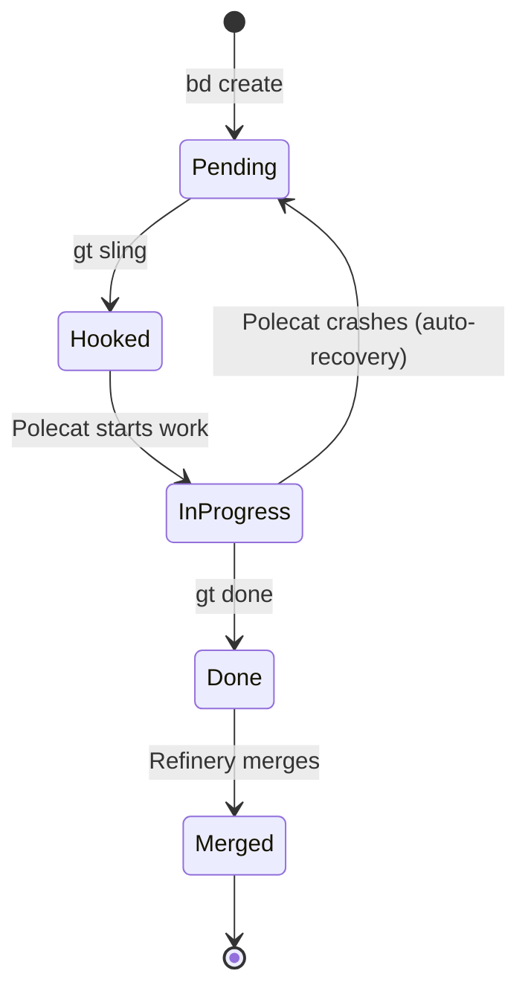
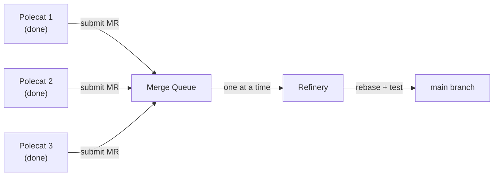
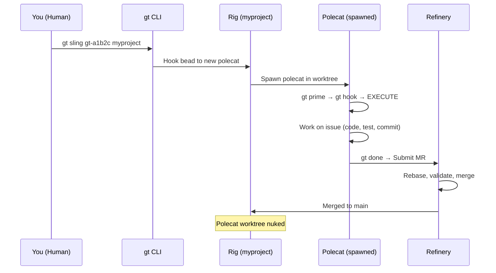
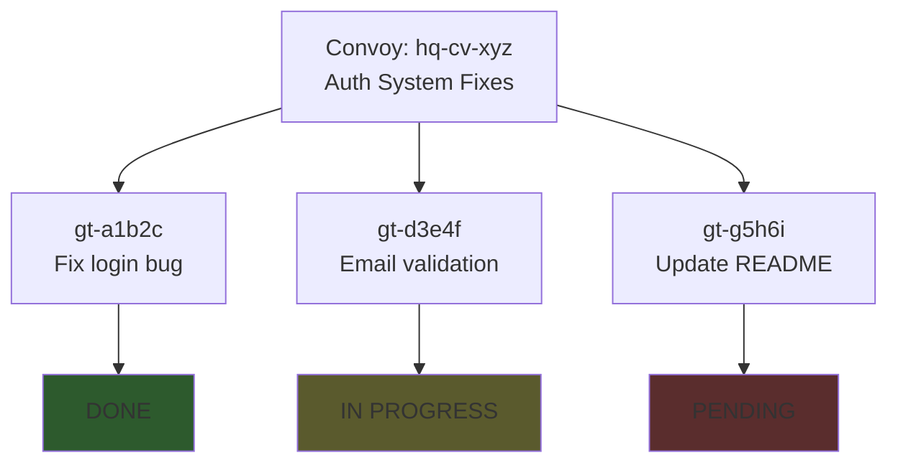
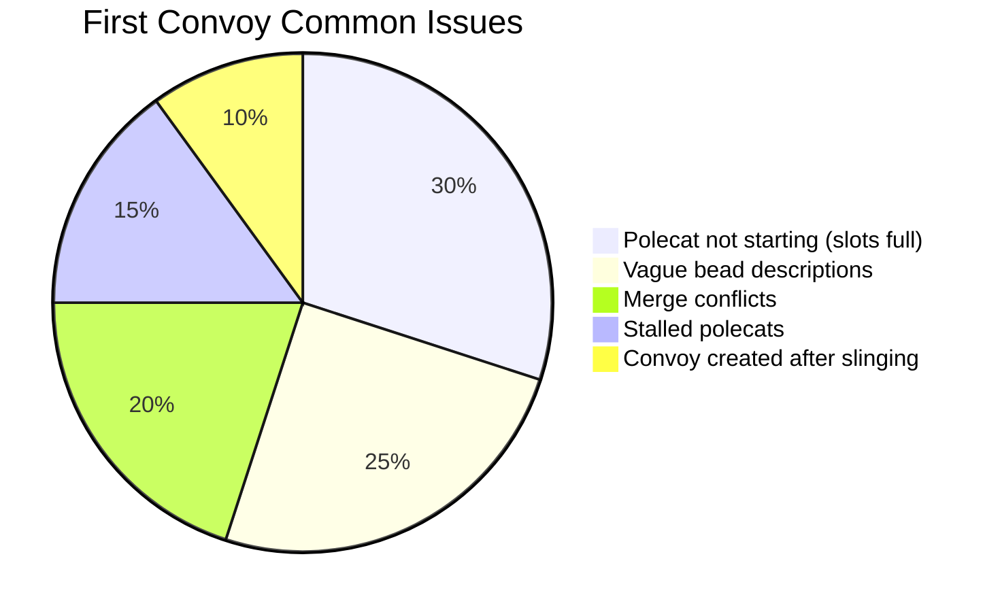
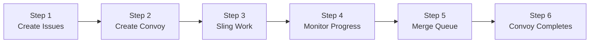

# Your First Convoy

A **Convoy** is Gas Town's primary unit for tracking batches of related work. This walkthrough takes you through creating and monitoring your first convoy.

## Step 1: Create Issues

First, create some beads (issues) to track:

```bash
bd create --title "Fix login bug" --type bug --priority high
# Created: gt-a1b2c

bd create --title "Add email validation" --type feature
# Created: gt-d3e4f

bd create --title "Update README" --type task
# Created: gt-g5h6i
```

## Step 2: Create a Convoy

Bundle the issues into a convoy:

```bash
gt convoy create "Auth System Fixes" gt-a1b2c gt-d3e4f gt-g5h6i
# Created: hq-cv-xyz
```

## Step 3: Assign Work

Use `gt sling` to assign issues to workers:

```bash
# Assign to a rig (auto-spawns a polecat)
gt sling gt-a1b2c myproject
gt sling gt-d3e4f myproject
gt sling gt-g5h6i myproject
```

Each `gt sling` command:

1. Hooks the bead to the target agent
2. Spawns a polecat worker in the rig
3. The polecat picks up the work immediately

:::tip

You can sling all three at once — each gets its own polecat working in parallel:

```bash
gt sling gt-a1b2c gt-d3e4f gt-g5h6i myproject
```

:::

## Step 4: Monitor Progress

```bash
# Check convoy status
gt convoy list
gt convoy show hq-cv-xyz

# Watch the activity feed
gt feed

# Check individual polecat status
gt polecat list
```



## Step 5: Watch the Merge Queue



As polecats complete work, they submit merge requests to the Refinery:

```bash
# View merge queue
gt mq list

# Check merge status
gt mq status
```

The Refinery:

1. Picks up the next MR
2. Rebases onto latest main
3. Runs validation (tests, builds)
4. Merges if clean
5. If conflict: spawns a fresh polecat to resolve

## Step 6: Convoy Completion

When all tracked issues are done, the convoy auto-closes:

```bash
gt convoy list
# hq-cv-xyz  Auth System Fixes  [COMPLETED]  3/3 done
```

:::info
You can check which polecats are available in a rig before slinging work with `gt polecat list`. If all polecat slots are occupied, new sling commands will queue until a slot opens up.
:::

:::danger[Do Not Sling to Docked Rigs]

Attempting to sling work to a docked or stopped rig will silently fail -- the bead will be marked as hooked but no polecat will spawn to execute it. Always verify the rig is active with `gt rig list` before slinging work.

:::

## Using the Mayor Instead

For a more automated experience, attach to the Mayor and describe the work. For complete details on the Mayor's strategic coordination capabilities, see [The Mayor Workflow](/blog/mayor-workflow).

```bash
gt mayor attach
```

Then tell the Mayor:

> "Fix the login bug, add email validation to registration, and update the README with the new auth flow."

The Mayor handles convoy creation, issue tracking, and agent assignment automatically.

## What Happens Behind the Scenes

Understanding the full flow helps when debugging issues:



Each polecat:
1. Gets its own isolated git worktree (no conflicts with other polecats)
2. Reads the bead from its hook to understand the task
3. Executes a molecule (workflow template) that guides its work
4. Submits to the Refinery when done, which merges to main serially

## Convoy Progress Overview

A convoy tracks the aggregate state of all its beads, providing a single dashboard view.



:::caution[Convoy Creation Timing]

Create the convoy before slinging work, not after. If you sling beads first and then create a convoy, the convoy cannot track work that is already in progress. The recommended order is: create beads, create convoy, then sling beads.

:::

:::tip[Your First Convoy Should Be Simple]

For your very first convoy, choose 2-3 small, independent tasks that touch different files. This reduces merge conflicts and lets you focus on learning the workflow rather than debugging interactions. Save complex multi-file refactors for your second or third convoy.

:::

## Common First-Convoy Issues

| Problem | Cause | Fix |
|---------|-------|-----|
| Polecat not starting | No free slots in rig | Check `gt polecat list` — rig may be at max capacity |
| Work not progressing | Polecat confused by bead description | Add more detail: `bd update gt-a1b2c --description "..."` |
| Merge conflict | Two polecats touched same files | Refinery handles this — it spawns a resolution polecat |
| Convoy stuck at 2/3 | One polecat stalled | Check `gt polecat list` and `gt feed` for errors |



:::warning
Write detailed bead descriptions. Vague descriptions like "fix the bug" force polecats to waste context figuring out what to do. Include the specific behavior, where it occurs, and what the expected outcome should be.
:::

## Tips

- Use `gt convoy show` frequently to track progress
- If a polecat stalls, the Witness will detect and handle it
- Use `gt escalate` for issues that need human attention
- Convoys can span multiple rigs for cross-project work

:::note

Convoys auto-close when all tracked beads complete. You do not need to manually close them unless you want to cancel remaining work.

:::

### First Convoy Step-by-Step

The six steps to creating and completing your first convoy follow a clear progression.



## Related

- [Convoys](../concepts/convoys.md) -- Full documentation of convoy tracking, dependencies, and auto-close
- [Beads](../concepts/beads.md) -- The atomic work units that convoys track through the system
- [Manual Convoy Workflow](../workflows/manual-convoy.md) -- Advanced convoy patterns with cross-rig coordination
- [Mayor Workflow](../workflows/mayor-workflow.md) -- Let the Mayor handle convoy creation and assignment automatically

### Blog Posts

- [Your First Convoy](/blog/first-convoy) -- Blog walkthrough with tips and real-world examples
- [The Mayor Workflow](/blog/mayor-workflow) -- How to let the Mayor automate convoy creation and assignment
- [Your Second Convoy](/blog/your-second-convoy) -- Dependencies, cross-rig work, and stuck polecat recovery
- [Advanced Convoy Patterns](/blog/advanced-convoy-patterns) -- Parallel dispatch, wave-based execution, and cross-rig convoys for when you're ready to level up
- [Work Distribution Patterns: Manual Convoy vs. Mayor vs. Formula](/blog/work-distribution-patterns) -- Understanding how convoys fit into the larger work distribution landscape
