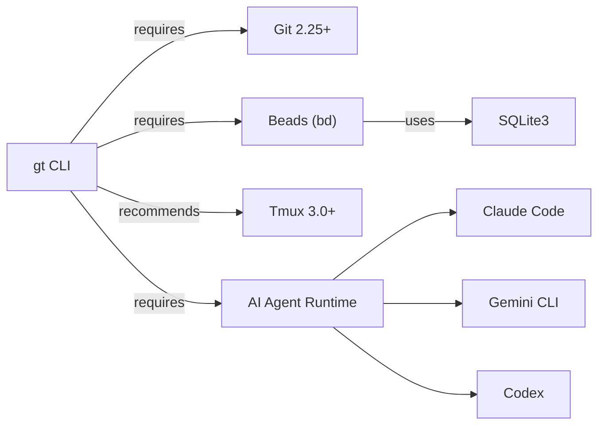
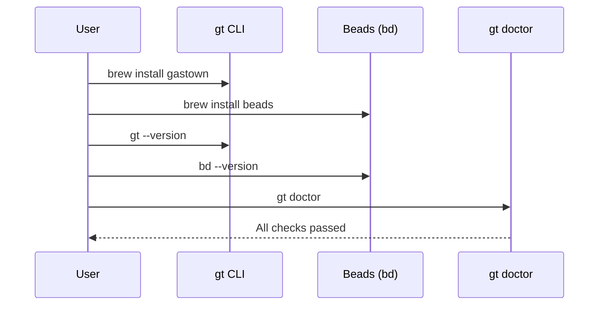
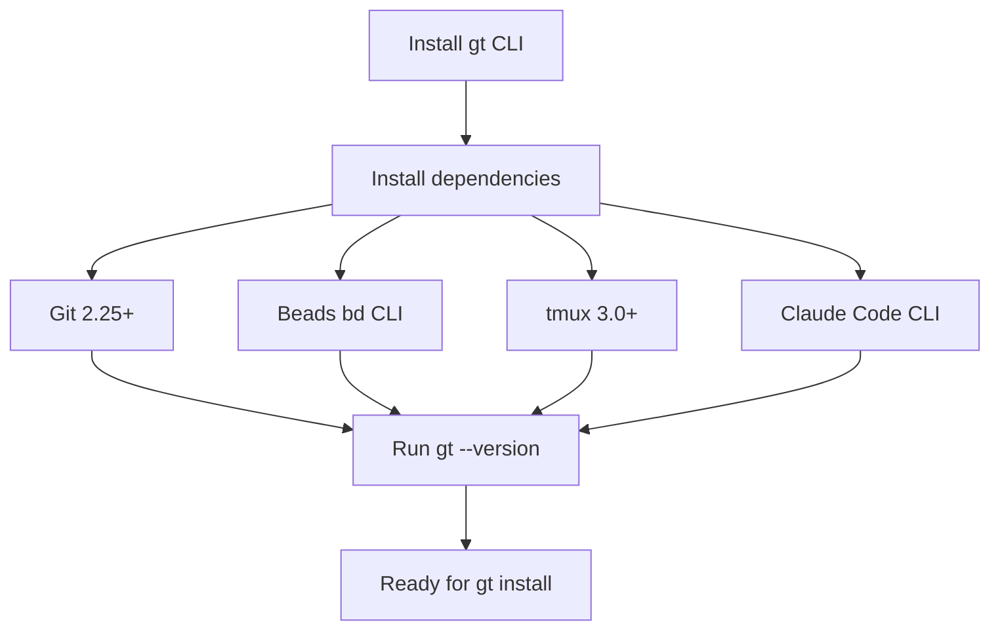

import Tabs from '@theme/Tabs';
import TabItem from '@theme/TabItem';

# Installation

## Install Gas Town

<Tabs>
<TabItem value="homebrew-recommended-" label="Homebrew (Recommended)">

```bash
brew install gastown
```

</TabItem>
<TabItem value="npm" label="npm">

```bash
npm install -g @gastown/gt
```

</TabItem>
<TabItem value="build-from-source" label="Build from Source">

```bash
git clone https://github.com/steveyegge/gastown.git
cd gastown
go build -o gt ./cmd/gt/
sudo mv gt /usr/local/bin/
```

</TabItem>
</Tabs>

:::tip
Homebrew is the recommended installation method. It handles dependencies automatically and makes updates simple with `brew upgrade gastown`.
:::

## Dependency Map



## Install Dependencies

### Git (Required)

:::warning
Gas Town requires Git 2.25+ for worktree support. Older versions will fail silently when creating polecat sandboxes.
:::

Gas Town relies on git worktrees for file-level isolation between agents.

```bash
git --version
# Should show 2.25.0 or higher
```

If your version is older, update via your package manager (`brew upgrade git`, `sudo apt install git`, etc.).

### Beads (Issue Tracking)

Beads is the git-backed issue tracking system that Gas Town uses for work management.

```bash
# Install beads
brew install beads
# Or: npm install -g @beads/bd
```

Verify installation:

```bash
bd --version
# Should show 0.44.0 or higher
```

### Tmux (Recommended)

:::warning
Gas Town requires tmux 3.0+ for multi-agent session management. Without tmux, you can still use Gas Town in [Minimal Mode](../workflows/minimal-mode.md) but won't have parallel agents.
:::

Tmux enables Gas Town to manage multiple agent sessions in split panes.

```bash
# macOS
brew install tmux

# Ubuntu/Debian
sudo apt install tmux

# Amazon Linux
sudo yum install tmux
```

### Claude Code CLI

Gas Town builds on Claude Code as its primary runtime. Install it following the [official instructions](https://docs.anthropic.com/en/docs/claude-code/getting-started).

```bash
# Verify Claude Code is available
claude --version
```

:::info
After installing all dependencies, run `gt doctor` to verify your environment is correctly configured. It checks Git version, Beads availability, tmux presence, and runtime connectivity in one command.
:::

## Shell Completions



Install tab completions for better CLI experience:

```bash
# Bash
gt completion bash > /etc/bash_completion.d/gt

# Zsh
gt completion zsh > "${fpath[1]}/_gt"

# Fish
gt completion fish > ~/.config/fish/completions/gt.fish
```

## Verify Installation

```bash
gt --version
gt help
```

You should see the Gas Town help output listing all available commands.



## Supported Runtimes

Gas Town supports multiple AI coding agent runtimes:

| Runtime | Command | Notes |
|---------|---------|-------|
| Claude Code | `claude` | Default, recommended |
| Gemini CLI | `gemini` | Google's coding agent |
| Codex | `codex` | OpenAI's coding agent |
| Cursor | `cursor` | Cursor IDE agent |
| Auggie | `auggie` | Augment agent |
| Amp | `amp` | Sourcegraph agent |

Configure the default runtime:

```bash
gt config default-agent claude
gt config agent set gemini "gemini"
```

## Related

- [Quick Start](quickstart.md) -- Set up your workspace and give the Mayor your first instructions
- [Multi-Runtime Support](../guides/multi-runtime.md) -- Configure and mix multiple AI coding agent runtimes
- [System Overview](../architecture/overview.md) -- Understand the components you are installing
- [The 8 Stages of AI Coding](../guides/eight-stages.md) -- Check if you are ready for Gas Town

### Blog Posts

- [Welcome to the Gas Town Blog](/blog/welcome) -- Introducing the Gas Town documentation blog
- [5 Common Pitfalls When Starting with Gas Town](/blog/common-pitfalls) -- Avoid frequent mistakes during installation and initial setup
- [Multi-Runtime Workflows with Gas Town](/blog/multi-runtime-workflows) -- How to configure and use the supported runtimes listed on this page
- [Gas Town Minimal Mode](/blog/minimal-mode) -- Running Gas Town without tmux for simpler setups when full multi-agent orchestration is not needed
