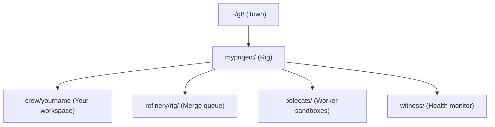

# Quick Start

## Create Your Workspace

The **Town** is your top-level workspace directory. All projects (rigs) live inside it.

```bash
gt install ~/gt --git
cd ~/gt
```

:::tip

If you already have a `~/gt` directory, use `--force` to reinitialize: `gt install ~/gt --git --force`

:::

This creates:

```text
~/gt/
├── .beads/          # Town-level issue tracking
├── .claude/         # Claude Code integration
├── mayor/           # Mayor agent context
│   └── town.json    # Town metadata
├── deacon/          # Deacon agent context
├── settings/        # Configuration files
├── scripts/         # Utility scripts
├── plugins/         # Town-level plugins
└── CLAUDE.md        # Project context
```

## Add a Project (Rig)

Each project you manage with Gas Town is called a **Rig**.

```bash
gt rig add myproject https://github.com/you/repo.git
```

This creates the rig structure:

```text
~/gt/myproject/
├── .beads/          # Rig-level issue tracking
├── config.json      # Rig configuration
├── refinery/rig/    # Canonical clone (merge queue)
├── mayor/rig/       # Mayor's working copy
├── crew/            # Human developer workspaces
├── witness/         # Health monitor
├── polecats/        # Worker directories
└── plugins/         # Rig-level plugins
```

:::caution

The `gt rig add` command clones the repository into the refinery directory. For large repositories, this may take several minutes and consume significant disk space. Ensure you have at least 2x the repository size available before adding a rig.

:::

## Create a Crew Workspace



Crew workspaces are persistent clones for human developers.

```bash
gt crew add myproject yourname
```

Enter your workspace:

```bash
cd ~/gt/myproject/crew/yourname
```

## Start Gas Town

Start the core agents:

```bash
# Start Mayor + Deacon
gt start

# Or start everything including Witnesses and Refineries
gt start --all
```

## Attach to the Mayor

The Mayor is your primary interface for coordinating work.

```bash
gt mayor attach
```

Now you can give natural language instructions. For example:

> "Fix the 5 failing tests in the auth module and add input validation to the user registration endpoint."

:::note

You are now in an interactive Claude session inside tmux. Detach with `Ctrl-B D` to return to your terminal without stopping the Mayor.

:::

The Mayor will:


1. Create beads (issues) for each task
2. Bundle them into a convoy
3. Spawn polecats to work on each task
4. Monitor progress
5. Route completed work through the refinery for merging

## Check Status

| Command | Purpose | When to Use |
|---------|---------|-------------|
| `gt rig list` | List all rigs and their status | See which projects are active |
| `gt convoy list` | Show convoy progress | Track batch work completion |
| `gt feed` | View real-time activity feed | Monitor agent actions as they happen |
| `gt ready` | Show beads ready for work | Find unblocked tasks to assign |
| `gt cost` | Check API token usage | Monitor spending before it surprises you |

```bash
# List all rigs
gt rig list

# Check convoy progress
gt convoy list

# View activity feed
gt feed

# Check what's ready for work
gt ready
```


:::warning

Gas Town agents consume API tokens. Monitor usage with `gt cost` to avoid surprise bills. See [Cost Management](../guides/cost-management.md) for details.

:::

:::info
You can detach from and reattach to the Mayor at any time without losing state. The Mayor's hook and beads persist across sessions, so your work continues even if you disconnect or the session cycles.
:::

## Next Steps

- [Your First Convoy](first-convoy.md) — Detailed walkthrough of the convoy workflow
- [CLI Reference](../cli-reference/index.md) — Full command documentation
- [Architecture](../architecture/index.md) — Understand the system design

## Related

- [Installation](installation.md) -- Detailed installation steps for Gas Town, Beads, and dependencies
- [Your First Convoy](first-convoy.md) -- Step-by-step walkthrough of creating and monitoring a convoy
- [Usage Guide](../guides/usage-guide.md) -- Practical day-to-day patterns once you are up and running
- [Mayor Workflow](../workflows/mayor-workflow.md) -- The fully automated MEOW workflow for complex coordination

### Blog Posts

- [Welcome to Gas Town](/blog/welcome) -- Introduction to Gas Town and its core philosophy
- [Your First Convoy](/blog/first-convoy) -- Hands-on guide to getting your first batch of work running
- [Your Second Convoy](/blog/your-second-convoy) -- Level up with dependencies, cross-rig work, and recovery patterns
- [5 Common Pitfalls When Starting with Gas Town](/blog/common-pitfalls) -- Avoid the most frequent mistakes new users make during initial setup and first workflows
